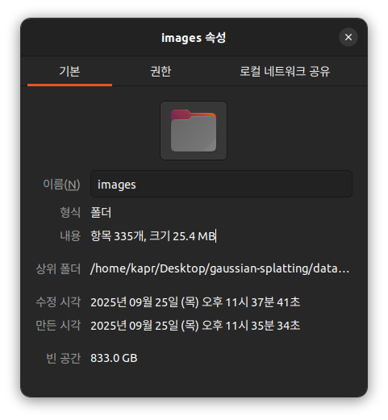

# Room2_640480 처리 과정 전체 명령어

## 처리 단계

### 1. COLMAP 처리 스크립트 생성
```bash
python3 run_colmap_room2.py
```

#### 실행 결과
```bash
=== COLMAP Pipeline for Intel RealSense D435 640x480 ===
Input directory: /home/kapr/Desktop/gaussian-splatting/data/room2_640480/input
Workspace directory: /home/kapr/Desktop/gaussian-splatting/data/room2_640480/colmap_workspace
Camera parameters: fx=382.613, fy=382.613, cx=320.183, cy=237.712

=== Step 1: Feature Extraction ===
Running: colmap feature_extractor         --database_path /home/kapr/Desktop/gaussian-splatting/data/room2_640480/colmap_workspace/database.db         --image_path /home/kapr/Desktop/gaussian-splatting/data/room2_640480/input         --ImageReader.single_camera 1         --ImageReader.camera_model PINHOLE         --ImageReader.camera_params 382.613,382.613,320.183,237.712         --SiftExtraction.max_image_size 1600         --SiftExtraction.max_num_features 16384         --SiftExtraction.estimate_affine_shape 1         --SiftExtraction.domain_size_pooling 1


=== Step 2: Feature Matching ===
Running: colmap exhaustive_matcher         --database_path /home/kapr/Desktop/gaussian-splatting/data/room2_640480/colmap_workspace/database.db         --SiftMatching.guided_matching 1         --SiftMatching.max_ratio 0.85         --SiftMatching.max_distance 0.7         --SiftMatching.cross_check 1


=== Step 3: Sparse Reconstruction (Mapper) ===
Running: colmap mapper         --database_path /home/kapr/Desktop/gaussian-splatting/data/room2_640480/colmap_workspace/database.db         --image_path /home/kapr/Desktop/gaussian-splatting/data/room2_640480/input         --output_path /home/kapr/Desktop/gaussian-splatting/data/room2_640480/colmap_workspace/sparse         --Mapper.ba_refine_focal_length 1         --Mapper.ba_refine_principal_point 0         --Mapper.ba_refine_extra_params 0         --Mapper.init_min_num_inliers 50         --Mapper.extract_colors 1
 

=== COLMAP Processing Complete ===
Sparse reconstruction saved to: /home/kapr/Desktop/gaussian-splatting/data/room2_640480/colmap_workspace/sparse

Sparse reconstruction successful!
Model directory: /home/kapr/Desktop/gaussian-splatting/data/room2_640480/colmap_workspace/sparse/0

Generated files:
  - images.bin: 7,238,164 bytes
  - project.ini: 1,836 bytes
  - cameras.bin: 64 bytes
  - frames.bin: 28,568 bytes
  - rigs.bin: 24 bytes
  - points3D.bin: 3,470,427 bytes

```

### 2. COLMAP 실행 (conda 환경 활성화 후)
```bash
source ~/miniconda3/etc/profile.d/conda.sh && conda activate gaussian_splatting && python run_colmap_room2.py
```

### 3. COLMAP 출력을 Gaussian Splatting 형식으로 변환
```bash
source ~/miniconda3/etc/profile.d/conda.sh && conda activate gaussian_splatting && python convert.py -s data/room2_640480 --skip_matching
```

### 4. 디렉토리 구조 조정 (convert.py 오류 해결)
```bash
cp -r data/room2_640480/colmap_workspace data/room2_640480/distorted
```

### 5. 다시 변환 실행
```bash
source ~/miniconda3/etc/profile.d/conda.sh && conda activate gaussian_splatting && python convert.py -s data/room2_640480 --skip_matching
```

### 6. 전체 변환 (포인트 클라우드 생성 포함)
```bash
source ~/miniconda3/etc/profile.d/conda.sh && conda activate gaussian_splatting && python convert.py -s data/room2_640480
```

### 7. 학습 실행
```bash
source ~/miniconda3/etc/profile.d/conda.sh && conda activate gaussian_splatting && python train.py -s data/room2_640480 --eval
```

### 8. 렌더링 실행
```bash
source ~/miniconda3/etc/profile.d/conda.sh && conda activate gaussian_splatting && python render.py -m output/[checkpoint_directory] -s data/room2_640480
```

### 9. 뷰어 실행
```bash
./SIBR_viewers/install/bin/SIBR_gaussianViewer_app --model-path output/room2_640480
```

## 카메라 파라미터

Intel RealSense D435 640x480 카메라 파라미터:
  - fx=382.613, fy=382.613
  - cx=320.183, cy=237.712


## 결과 시각화

### 뷰어 데모 GIF
<!-- 10초 분량의 뷰어 움직임 GIF 추가 예정 -->


## 평가 결과

### input된 이미지 수

- 총 370개의 640x480 이미지를 사용함.

### 매칭되거나 포즈를 추정할 수 있는 이미지 수

- 총 335개의 이미지가 colmap으로 변환됨.

### train.py 실행 결과
```bash
 ~/De/gaussian-splatting │ on main ?6  python train.py -s data/room2_640480 --eval --iterations 50000 --densification_interval 500 --densify_until_iter 20000                                                      
Optimizing 
Output folder: ./output/3733a7b1-0 [26/09 01:52:17]
Tensorboard not available: not logging progress [26/09 01:52:17]
------------LLFF HOLD------------- [26/09 01:52:17]
Reading camera 288/288 [26/09 01:52:17]
Converting point3d.bin to .ply, will happen only the first time you open the scene. [26/09 01:52:17]
Loading Training Cameras [26/09 01:52:17]
Loading Test Cameras [26/09 01:52:18]
Number of points at initialisation :  21952 [26/09 01:52:18]
Training progress:  14%|█████▏                               | 7000/50000 [01:43<16:04, 44.60it/s, Loss=0.0446380, Depth Loss=0.0000000]
[ITER 7000] Evaluating test: L1 0.043095604723526366 PSNR 25.667881382836235 [26/09 01:54:02]

[ITER 7000] Evaluating train: L1 0.031286730989813806 PSNR 28.01991844177246 [26/09 01:54:02]

[ITER 7000] Saving Gaussians [26/09 01:54:02]
Training progress:  60%|█████████████████████▌              | 30000/50000 [14:26<10:51, 30.70it/s, Loss=0.0208078, Depth Loss=0.0000000]
[ITER 30000] Evaluating test: L1 0.03775196390536924 PSNR 26.76144096586439 [26/09 02:06:45]

[ITER 30000] Evaluating train: L1 0.011909155547618866 PSNR 36.031324768066405 [26/09 02:06:45]

[ITER 30000] Saving Gaussians [26/09 02:06:45]
Training progress: 100%|████████████████████████████████████| 50000/50000 [25:06<00:00, 33.19it/s, Loss=0.0196026, Depth Loss=0.0000000]

[ITER 50000] Saving Gaussians [26/09 02:17:25]

Training complete. [26/09 02:17:27]
```
### viewer 실행 gif


### metrics.py로 평가 결과
- SSIM :    0.7505361
- PSNR :   28.6329403
- LPIPS:    0.3898556
> 너무 품질이 낮음.

### 주요 원인 분석
1. 이미지 손실률이 높음
  - 370개 → 335개 (35개, 9.5% 손실)
  - 이는 카메라 궤적에 빈 공간이 생겨 interpolation 품질 저하

2. 카메라 해상도 문제
  - 640x480은 상당히 낮은 해상도
  - Gaussian Splatting은 고해상도에서 더 좋은 성능

3. 촬영 조건 문제
  - 블러: 카메라 움직임이나 초점 문제
  - 조명 변화: 일관되지 않은 조명
  - 텍스처 부족: 단조로운 벽면이 많은 실내

4. Intel RealSense D435 특성 문제
  - D435는 stereo depth camera로 RGB 품질이 일반 카메라보다 낮음
  - 특히 저조도에서 노이즈가 심함
  - Rolling shutter 효과 가능성


### 개선 방안
1. 촬영 패턴 개선: 더 조밀한 궤적, 중복도 증가
2. COLMAP 파라미터 튜닝: --SiftExtraction.max_image_size, --SiftMatching.max_ratio 조정
3. 학습 파라미터 조정: iteration 수, learning rate 등

---
### Intel Realsense D435


- realsense-viewer에서 1280x720에서 depth와 rgb 둘 다 촬영이 가능한 것으로 판단됨.
- https://www.intel.co.kr/content/www/kr/ko/products/sku/128255/intel-realsense-depth-camera-d435/specifications.html


- perplexity를 통해 web 검색을 한 결과 1280x720으로 촬영 가능하다고 답변이 나옴.