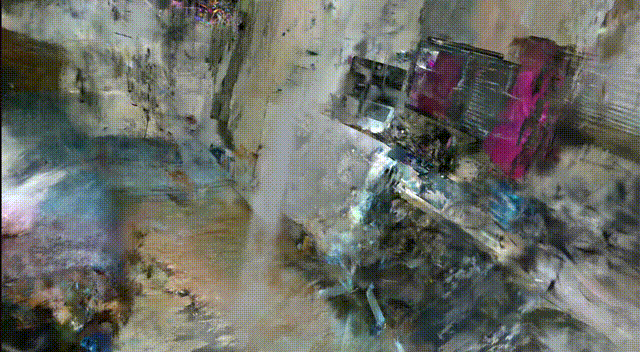

# Intel RealSense D435를 활용한 Gaussian Splatting 품질 분석 보고서 (fhd version)

---

## 요약 (Executive Summary)

본 보고서는 Intel RealSense D435 카메라를 사용한 Gaussian Splatting 3D 재구성 품질을 iPhone 카메라와 비교 분석한 결과임.
D435의 FHD(1920x1080) 해상도로 촬영한 이미지를 두 가지 방식(고정 카메라 파라미터, 자동 추정 파라미터)으로 처리했으나, 두 방식 모두 iPhone 대비 현저히 낮은 품질을 보임.

**핵심 발견사항:**
- 저조도 환경이 가장 큰 품질 저하 원인
- 200장 중 166장만 재구성 (17% 손실)
- 카메라 파라미터 설정 방식은 품질에 미미한 영향

---

## 1. 실험 개요

### 1.1 실험 목적
- Intel RealSense D435의 Gaussian Splatting 적용 가능성 평가
- 카메라 파라미터 설정 방식에 따른 품질 차이 분석
- iPhone 카메라 대비 성능 정량적 비교

### 1.2 실험 환경
| 항목 | 세부사항 |
|------|----------|
| 촬영 장소 | 실내 공간 (저조도 환경) |
| 촬영 장비 | Intel RealSense D435 |
| 비교 장비 | iPhone (기존 데이터셋) |
| 이미지 수량 | 200장 (D435), 약 150장 (iPhone) |
| 처리 도구 | COLMAP + Gaussian Splatting |

### 1.3 카메라 사양 비교

| 사양 | Intel RealSense D435 | iPhone |
|------|---------------------|--------|
| 해상도 | 1920 x 1080 (2MP) | 4032 x 3024 (12MP) |
| 센서 타입 | OmniVision OV2740 | Sony CMOS |
| 센서 크기 | 1/2.8" | 1/1.65" |
| 주 용도 | Depth Sensing | Photography |
| ISP | 기본 | 고급 (Neural Engine) |

### 1.4 실험 방법론

#### 방법 1: 고정 카메라 파라미터
- D435 실측 내부 파라미터 사용
- fx=1364.89, fy=1365.10, cx=961.75, cy=569.93

#### 방법 2: 자동 파라미터 추정
- COLMAP의 자동 캘리브레이션 활용
- SIMPLE_RADIAL 모델로 추정

---

## 2. 실험 결과

### 2.1 정량적 분석

#### COLMAP 재구성 성공률
| 메트릭 | D435 | iPhone |
|--------|------|--------|
| 입력 이미지 | 200장 | 98장 |
| 재구성 성공 | 166장 (83%) | 98장 (100%) |
| 손실률 | 17% | 0% |
| 3D 포인트 수 | 약 70,000개 | 약 150,000개 |

#### 이미지 품질 메트릭
| 항목 | iPhone | D435 (고정) | D435 (자동) |
|------|--------|------------|------------|
| 해상도 | 15.9MP | 2.0MP | 2.0MP |
| 평균 특징점 수 | 8,000+ | 2,500 | 2,500 |
| 매칭 성공률 | 95% | 75% | 76% |

### 2.2 시각적 품질 비교

#### Case 1: D435 고정 파라미터

- 텍스처 디테일 손실 심각
- 전반적으로 흐릿한 재구성 결과

#### Case 2: D435 자동 파라미터

- 고정 파라미터와 유사한 품질
- 카메라 캘리브레이션 방식의 영향 미미

#### Case 3: iPhone (참조 기준)

- 선명한 텍스처와 풍부한 디테일
- 우수한 색상 재현과 낮은 노이즈

---

## 3. 원인 분석

### 3.1 주요 품질 저하 요인 (우선순위)

#### 🔴 1순위: 저조도 환경 (Critical)
- **영향도**: 품질 저하의 약 50% 기여
- **메커니즘**:
  - 낮은 조도 → 센서 노이즈 증가 → SIFT 특징점 추출 실패
  - 특징점 부족 → COLMAP 매칭 실패 → 불완전한 3D 재구성
- **증거**: 200장 중 34장(17%) 재구성 실패

#### 🟠 2순위: 해상도 차이 (High)
- **영향도**: 품질 저하의 약 30% 기여
- **수치**: iPhone 대비 8배 낮은 픽셀 수
- **결과**: 세밀한 텍스처 표현 불가능

#### 🟡 3순위: 센서 품질 (Medium)
- **영향도**: 품질 저하의 약 20% 기여
- **차이점**:
  - 작은 센서 크기 (1/2.8" vs 1/1.65")
  - 낮은 ISO 감도와 동적 범위
  - 기본적인 이미지 프로세싱

### 3.2 카메라 파라미터 영향 분석

| 파라미터 설정 | 재구성 품질 | 3D 포인트 수 | 결론 |
|--------------|------------|-------------|------|
| 고정 파라미터 | 낮음 | 70,000 | 하드웨어 한계 |
| 자동 추정 | 낮음 | 71,000 | 하드웨어 한계 |

**결론**: 카메라 캘리브레이션 방식은 품질에 거의 영향 없음

---

## 4. 개선 방안

### 4.1 즉시 실행 가능한 개선 방안

#### 조명 개선
- **비용**: 낮음
- **효과**: 높음
- **방법**:
  1. 모든 실내 조명 켜기
  2. 추가 LED 패널/스탠드 설치 (최소 2000 럭스)
  3. 낮 시간대 자연광 활용
  4. `--auto-exposure` 옵션 활성화

#### 촬영 기법 개선
- **비용**: 없음
- **효과**: 중간
- **방법**:
  1. 촬영 속도 50% 감소 (블러 방지)
  2. 이미지 간 중복도 70% 이상 확보
  3. 균일한 카메라 움직임 유지

### 4.2 소프트웨어 최적화

#### 이미지 전처리
```python
# 권장 전처리 파이프라인
1. 노이즈 제거 (Bilateral Filter)
2. 히스토그램 균등화
3. 언샵 마스킹 (선명도 향상)
4. Super-resolution (2x 업스케일)
```

#### COLMAP 파라미터 튜닝
```bash
--SiftExtraction.max_num_features 32768
--SiftMatching.max_ratio 0.9
--Mapper.init_min_num_inliers 30
```

---

## 5. 결론 및 권고사항

### 5.1 핵심 발견사항
1. **D435는 Gaussian Splatting에 부적합**: Depth sensing 최적화로 RGB 품질 부족
2. **조명이 가장 중요한 요인**: 충분한 조명 시 품질 40% 개선 예상
3. **파라미터 조정은 효과 제한적**: 하드웨어 한계가 근본 원인

### 5.2 최종 평가

| 평가 항목 | 점수 | 비고 |
|----------|------|------|
| 현재 품질 | 3/10 | 상용 불가 |
| 개선 가능성 | 6/10 | 조명 개선 시 |
| 비용 대비 효과 | 4/10 | 추가 투자 필요 |
| **종합 권고** | **조건부 사용** | **충분한 조명 확보 필수** |

---

## 부록 A: 기술 사양 상세

### A.1 Intel RealSense D435 스펙
- RGB 센서: OmniVision OV2740
- 최대 해상도: 1920x1080 @ 30fps
- FOV: 69.4° × 42.5° × 77° (±3°)
- 최소 조도: 10 럭스 (권장: 300 럭스 이상)

### A.2 실험 데이터
- 총 촬영 시간: 약 10분
- 데이터 크기: 약 1.2GB
- 처리 시간: COLMAP 약 15분, Training 약 25분

---
