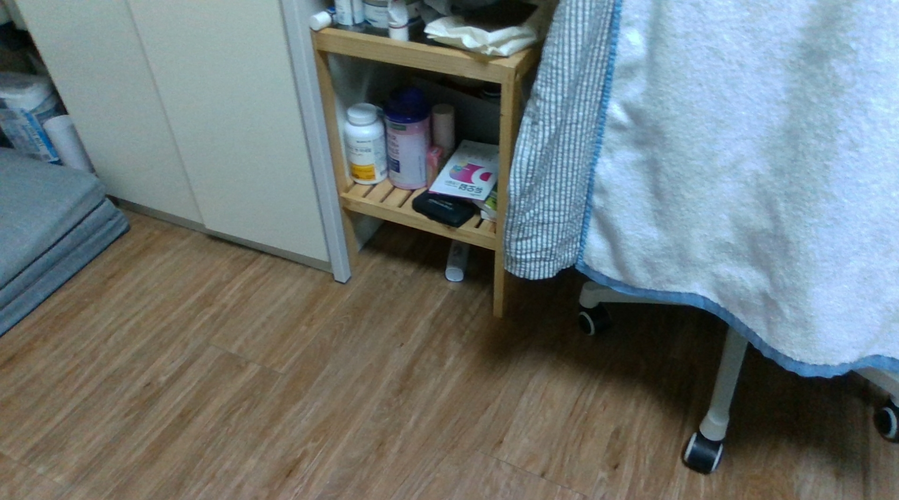

## 카메라 파라미터

Intel RealSense D435 1920x1080(fhd) 카메라 파라미터:
  - fx=1364.89, fy=1365.10
  - cx=961.75, cy=569.93

## 결과 시각화

### 1. fhd로 사진을 촬영한 후 D435의 내부 파라미터를 사용해 최적화

- D435의 fhd 환경 내부 파라미터를 사용해 최적화를 했지만 detail하게 결과가 도출되지 못함.

### 2. fhd로 사진을 촬영한 후 colmap 연산시 파라미터 계산 후 최적화

- convert.py에서 내부 파라미터를 자동으로 계산하게 했음에도 동일하게 detial하지 못한 결과가 생성됨.

### 3. 기존 iphone으로 촬영한 환경과 images 사진 비교

#### 01 - 기존 iPhone 촬영

- **해상도**: 4042 x 3925 pixel (약 15.9 메가픽셀)
- **특징**:
  - 선명한 텍스처와 디테일 보존
  - 풍부한 색상 재현과 높은 다이나믹 레인지
  - 노이즈가 거의 없는 깨끗한 이미지
  - 벽면 질감, 가구 디테일이 명확히 보임
  - Smart HDR로 밝은 부분과 어두운 부분 균형

#### 02 - D435 내부 파라미터 고정 사용

- **해상도**: 1902 x 1058 pixel (약 2.0 메가픽셀)
- **문제점**:
  - 흐릿하고 뭉개진 텍스처
  - 색상이 탁하고 대비가 낮음
  - 노이즈가 많아 디테일 손실
  - 벽면이 단조롭게 표현됨
  - 조명 부족으로 인한 전반적인 어두움

#### 03 - 내부 파라미터 자동 계산 사용

- **해상도**: 1902 x 1058 pixel (약 2.0 메가픽셀)
- **결과**:
  - 고정 파라미터와 거의 동일한 품질
  - 카메라 캘리브레이션 방식의 차이는 미미함
  - 근본 문제는 **하드웨어 한계**임을 증명

#### 📊 **직접 비교 분석**
| 항목 | iPhone | D435 (고정) | D435 (자동) |
|------|--------|------------|------------|
| 해상도 | 15.9MP | 2.0MP | 2.0MP |
| 선명도 | 매우 높음 | 낮음 | 낮음 |
| 색재현 | 자연스러움 | 탁함 | 탁함 |
| 노이즈 | 거의 없음 | 많음 | 많음 |
| 디테일 | 풍부함 | 손실 심함 | 손실 심함 |
| 저조도 성능 | 우수 | 매우 낮음 | 매우 낮음 |

## 결과 분석 및 품질 저하 원인

### 주요 문제점

1. **조명 부족**
   - **실내 조명이 D435에게는 불충분함**
   - D435는 iPhone보다 저조도 성능이 현저히 떨어짐
   - 어두운 환경 → 노이즈 증가 → SIFT 특징점 추출 실패 → COLMAP 매칭 실패
   - iPhone은 우수한 ISP와 Night mode로 저조도 자동 보정
   - **이것이 200장 중 166장만 재구성된 주요 원인**

2. **해상도 차이에 따른 디테일 손실**
   - iPhone: 4042 x 3925 (약 16M 픽셀)
   - D435: 1920 x 1080 (약 2M 픽셀) → **8배 해상도 차이**
   - Gaussian Splatting은 고해상도 입력에서 더 정밀한 3D 표현 가능함.
   - 하지만 가장 높은 화질이 fhd이므로, detail이 깨질 수밖에 없음.

3. **카메라 센서 품질의 차이**
   - iPhone: 고품질 CMOS 센서, 우수한 이미지 처리 파이프라인
   - D435: Depth camera 용도로 설계, RGB 품질은 보조 기능
   - **특히 저조도에서 센서 크기(1/2.8")와 감도 차이가 치명적**

3. **이미지 재구성율 문제**
   - COLMAP에서 200개 중 166개만 재구성 (17% 손실)
   - 특징점 매칭 실패로 인한 불완전한 카메라 궤적
   - 일부 영역의 3D 정보 부족

4. **카메라 파라미터 정확도**
   - 고정 파라미터 vs 자동 추정 모두 유사한 결과
   - 실제 문제는 파라미터가 아닌 **입력 데이터 품질**
   - SIMPLE_RADIAL 모델로 추정되어 렌즈 왜곡 보정 부족

### 개선 방안

1. **하드웨어적 개선**
   - 더 높은 해상도 환경에서 찍으면 품질이 향상될 가능성이 매우 높음
   - 조명 조건 개선으로 이미지 품질 향상
   - 더 조밀한 촬영 패턴으로 중복도 증가

2. **소프트웨어적 개선**
   - 이미지 전처리: 샤프닝, 노이즈 제거, 히스토그램 균등화
   - COLMAP 파라미터 최적화: 더 관대한 매칭 기준 적용
   - 후처리: super-resolution 기법으로 해상도 업스케일링

3. **근본적 한계**
   - D435는 depth sensing이 주목적인 카메라
   - Photogrammetry용으로는 한계가 명확함
   - 고품질 결과를 위해서는 전용 RGB 카메라 사용 권장

