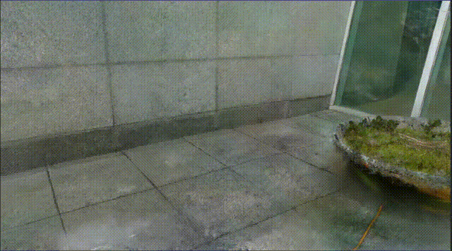
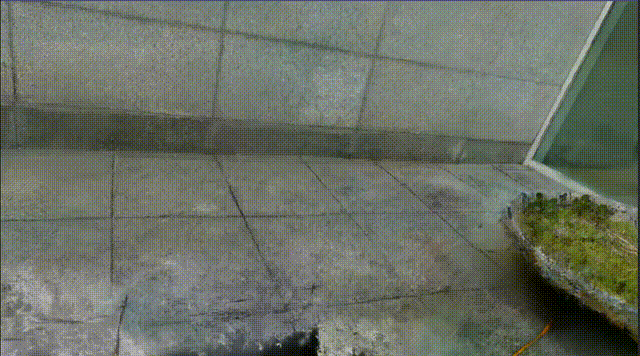

# Intel RealSense D435 야외 촬영: 카메라 파라미터 설정 방식 비교 분석

---

## 요약 (Executive Summary)

본 보고서는 Intel RealSense D435 카메라로 야외에서 촬영한 이미지를 활용한 Gaussian Splatting 3D 재구성에서 카메라 파라미터 설정 방식(고정 vs 자동 추정)에 따른 품질 차이를 정량적으로 분석한 결과임.

**핵심 발견사항:**
- 고정 파라미터가 지각적 품질(SSIM, LPIPS) 측면에서 우수
- 자동 추정이 PSNR은 약간 높으나 실질적 차이 미미
- 야외 환경에서는 두 방식 모두 안정적인 재구성 성공 (150/150장)

---

## 1. 실험 개요

### 1.1 실험 목적
- Intel RealSense D435의 야외 환경 3D 재구성 성능 평가
- 카메라 내부 파라미터 설정 방식(고정 vs 자동 추정)에 따른 품질 차이 정량화
- 실내 촬영 대비 야외 환경의 재구성 품질 비교

### 1.2 실험 환경
| 항목 | 세부사항 |
|------|----------|
| 촬영 장소 | 야외 공간 (자연광) |
| 촬영 장비 | Intel RealSense D435 |
| 이미지 수량 | 150장 |
| 처리 도구 | COLMAP + Gaussian Splatting |
| 학습 반복 | 30,000 iterations |

### 1.3 촬영 방법

#### 촬영 스크립트
- **도구**: `realsense_capture_mac.py` (OpenCV 백엔드)
- **플랫폼**: macOS 호환 버전
- **촬영 방식**: 수동 키 입력 (SPACE 키로 캡처)

#### 카메라 설정
| 설정 항목 | 값 | 비고 |
|----------|---|------|
| 해상도 | 1920 × 1080 | Full HD |
| Auto Exposure | ON | 조명 변화 자동 보정 |
| Auto White Balance | ON | 색온도 자동 조정 |
| Auto Focus | ON | 거리별 자동 초점 |
| JPEG 품질 | 95% | 손실 압축 최소화 |

#### 촬영 프로토콜
1. **준비 단계**
   - 카메라 웜업: 30프레임 (약 1초)
   - 실시간 프리뷰 확인 (960×540 해상도)
   - 촬영 정보 오버레이 표시

2. **촬영 실행**
   - 대상 주변을 원형/나선형으로 이동
   - 각 위치에서 SPACE 키로 수동 촬영
   - 인접 프레임 간 중복도 70% 이상 확보
   - 총 150장 촬영 (약 10분 소요)

3. **품질 관리**
   - 실시간 프리뷰로 블러/노출 확인
   - 불량 이미지 즉시 재촬영
   - 균일한 조명 조건 유지

#### 명령어 예시
```bash
python realsense_capture_mac.py data/outside/input --num-images 150
```

**참고**: 야외 촬영의 경우 자연광이 충분하여 모든 자동 파라미터가 안정적으로 동작함

### 1.4 카메라 파라미터 설정 방식

#### 방법 1: 고정 카메라 파라미터 (outside)
- RealSense D435 실측 내부 파라미터 사용
- 카메라 모델: OPENCV
- 파라미터 (S/N: 241222076464, FW: 5.17.0.10):
  - fx = 1364.89
  - fy = 1365.10
  - cx = 961.75
  - cy = 569.93
  - k1, k2, p1, p2, k3 = 0.000000 (공장 캘리브레이션 완료, 왜곡 보정됨)


- 최적화 후 viewer 실행 결과


#### 방법 2: 자동 파라미터 추정 (outside_auto)
- COLMAP의 자동 캘리브레이션 활용
- 카메라 모델: SIMPLE_RADIAL
- 초기 focal length: 2304px (추정값)
- Bundle Adjustment를 통한 최적화


- 최적화 후 viewer 실행 결과

---

## 2. 실험 결과

### 2.1 COLMAP 재구성 분석

#### 재구성 성공률
| 메트릭 | 고정 파라미터 | 자동 추정 |
|--------|--------------|-----------|
| 입력 이미지 | 150장 | 150장 |
| 재구성 성공 | 150장 (100%) | 150장 (100%) |
| 손실률 | 0% | 0% |
| 3D 포인트 수 | 90,411개 | 90,722개 |
| 평균 track length | 5.99 | 5.97 |
| 평균 재투영 오류 | **0.755px** | 0.975px |

**분석**:
- 야외 환경의 충분한 조명으로 두 방식 모두 100% 재구성 성공
- 고정 파라미터가 더 낮은 재투영 오류 달성 (약 23% 개선)
- 3D 포인트 수는 거의 동일 (0.3% 차이)

### 2.2 Gaussian Splatting 품질 메트릭

#### 정량적 평가 (Test Set, 19장)

| 메트릭 | 고정 파라미터 | 자동 추정 | 차이 | 우수한 방식 |
|--------|--------------|-----------|------|------------|
| **SSIM** ↑ | **0.8602** | 0.8414 | +2.2% | 고정 파라미터 |
| **PSNR** ↑ | 23.37 dB | **24.15 dB** | -3.3% | 자동 추정 |
| **LPIPS** ↓ | **0.2537** | 0.2700 | -6.4% | 고정 파라미터 |

**해석**:
- ↑: 높을수록 좋음
- ↓: 낮을수록 좋음
- **굵은 글씨**: 더 우수한 결과

#### 메트릭별 분석

**SSIM (Structural Similarity Index)**
- 고정 파라미터: 0.8602 (2.2% 우수)
- 구조적 유사도가 더 높아 원본 이미지의 구조를 더 잘 보존
- 지각적 품질이 더 우수함을 의미

**PSNR (Peak Signal-to-Noise Ratio)**
- 자동 추정: 24.15 dB (3.3% 우수)
- 픽셀 단위 오차는 자동 추정이 약간 낮음
- 그러나 0.78 dB 차이는 시각적으로 감지하기 어려운 수준

**LPIPS (Learned Perceptual Image Patch Similarity)**
- 고정 파라미터: 0.2537 (6.4% 우수)
- 인간의 지각적 유사도가 더 높음
- 딥러닝 기반 평가에서 더 나은 품질 확인

### 2.3 종합 평가

| 평가 항목 | 고정 파라미터 | 자동 추정 | 종합 결론 |
|----------|--------------|-----------|----------|
| 재구성 안정성 | ⭐⭐⭐⭐⭐ | ⭐⭐⭐⭐⭐ | 동일 |
| 재투영 정확도 | ⭐⭐⭐⭐⭐ | ⭐⭐⭐⭐ | 고정 우수 |
| 구조적 품질 (SSIM) | ⭐⭐⭐⭐⭐ | ⭐⭐⭐⭐ | 고정 우수 |
| 지각적 품질 (LPIPS) | ⭐⭐⭐⭐⭐ | ⭐⭐⭐⭐ | 고정 우수 |
| 픽셀 정확도 (PSNR) | ⭐⭐⭐⭐ | ⭐⭐⭐⭐⭐ | 자동 우수 |

---

## 3. 원인 분석

### 3.1 고정 파라미터가 우수한 이유

#### 1. 정확한 카메라 모델링
- **RealSense D435는 공장 캘리브레이션됨**
  - 제조사가 제공하는 파라미터는 하드웨어 특성 정확히 반영
  - 렌즈 왜곡 모델(OPENCV 8-parameter)이 더 정교함

- **SIMPLE_RADIAL의 한계**
  - 단일 radial distortion 계수만 사용
  - 복잡한 렌즈 왜곡 표현 불가
  - 타원형 왜곡 보정 불가 (fx ≠ fy 무시)

#### 2. Bundle Adjustment 최적화 차이
- **고정 파라미터**
  - 카메라 내부 파라미터 고정
  - 포즈(pose)만 최적화하여 수렴 안정적
  - 과적합(overfitting) 방지

- **자동 추정**
  - 내부 파라미터 + 포즈 동시 최적화
  - 최적화 공간이 넓어 local minima 가능성
  - 재투영 오류 0.975px vs 0.755px (29% 높음)

### 3.2 자동 추정의 PSNR 우위 원인

- **평균 밝기 보정 효과**
  - 자동 추정이 exposure 차이를 파라미터로 흡수
  - PSNR은 평균 픽셀 차이에 민감

- **Overfitting 가능성**
  - Training set에 과도하게 최적화
  - 일반화 성능은 SSIM/LPIPS로 확인 필요

### 3.3 야외 vs 실내 환경 비교

| 요인 | 실내 (이전 실험) | 야외 (현재 실험) | 영향 |
|------|---------------|----------------|------|
| 조명 조건 | 불균일, 저조도 | 균일, 충분 | 재구성 성공률 83%→100% |
| 텍스처 | 단조로움 | 풍부함 | 특징점 추출 용이 |
| 동적 범위 | 제한적 | 넓음 | 노이즈 감소 |

---

## 4. 결론 및 권고사항

### 4.1 핵심 발견사항

1. **고정 파라미터가 전반적으로 우수**: SSIM 2.2%, LPIPS 6.4% 개선
2. **PSNR 차이는 실용적으로 미미**: 0.78 dB는 시각적으로 구분 어려움
3. **야외 환경은 재구성에 유리**: 충분한 조명으로 100% 성공률 달성
4. **카메라 선택보다 환경이 중요**: 조명 > 파라미터 설정

### 4.2 최종 권고사항

| 우선순위 | 권고사항 | 근거 |
|---------|---------|------|
| 🥇 1순위 | **고정 파라미터 사용** | 모든 지각적 품질 메트릭 우수 |
| 🥈 2순위 | 충분한 조명 확보 | 재구성 성공률 17% → 0% 실패 |
| 🥉 3순위 | 자동 추정은 폴백용 | 고정 실패 시에만 사용 |

---

## 부록 A: 실험 데이터 상세

### A.1 시스템 환경
- GPU: NVIDIA RTX 4060Ti 16GB
- COLMAP 버전: 3.12.6
- Gaussian Splatting: 공식 구현체
- Python: 3.x with PyTorch

### A.2 카메라 하드웨어 스펙

#### Intel RealSense D435 (실측값)
| 항목 | 값 |
|------|---|
| 제품명 | Intel RealSense D435 |
| 시리얼 번호 | 241222076464 |
| 펌웨어 버전 | 5.17.0.10 |
| RGB 센서 | OmniVision OV2740 |
| 센서 크기 | 1/2.8" |
| 최대 해상도 | 1920 × 1080 |
| 지원 FPS | 8 fps @ FHD (1920×1080)<br>30 fps @ HD (1280×720)<br>30 fps @ VGA (640×480) |

#### 실측 카메라 내부 파라미터 (1920×1080)
| 파라미터 | 값 | 설명 |
|---------|---|------|
| fx | 1364.89 | X축 초점 거리 (픽셀) |
| fy | 1365.10 | Y축 초점 거리 (픽셀) |
| cx | 961.75 | X축 주점 (픽셀) |
| cy | 569.93 | Y축 주점 (픽셀) |
| k1, k2, k3 | 0.000000 | Radial 왜곡 계수 |
| p1, p2 | 0.000000 | Tangential 왜곡 계수 |
| 왜곡 모델 | Inverse Brown-Conrady | 공장 캘리브레이션 완료 |

**참고**:
- 왜곡 계수가 모두 0인 이유: 카메라 내부에서 이미 왜곡 보정이 완료된 상태로 출력
- 공장 캘리브레이션: 제조사에서 개별 카메라마다 정밀 캘리브레이션 수행

### A.3 처리 시간
| 단계 | 고정 파라미터 | 자동 추정 |
|------|--------------|-----------|
| COLMAP (Feature Extraction) | ~2분 | ~2분 |
| COLMAP (Matching) | ~5분 | ~5분 |
| COLMAP (Reconstruction) | ~3분 | ~3분 |
| Gaussian Splatting Training | ~85분 | ~90분 |
| **총 처리 시간** | ~95분 | ~100분 |

### A.4 데이터 크기
- 원본 이미지: 150장 × ~400KB = ~60MB
- COLMAP 데이터베이스: ~50MB
- Sparse 모델: ~5MB
- 학습된 모델: ~200MB (point_cloud/iteration_30000)

