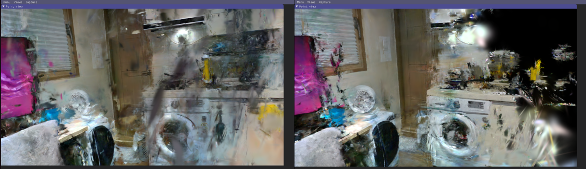
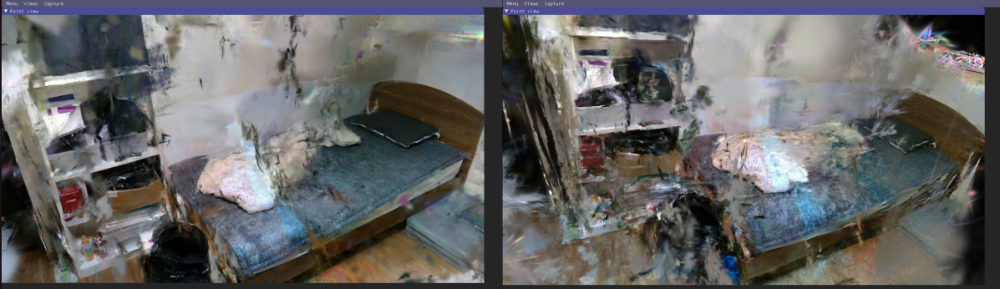
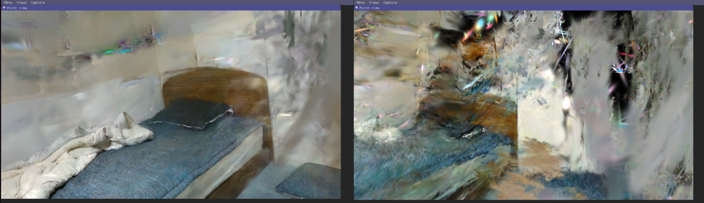

## 연구 배경

realsense D435로 촬용한 fhd의 225장 이미지를 3개의 연속된 그룹으로 분할하여 각각 COLMAP 재구성 및 Gaussian Splatting 학습을 수행한 후, 전체 재구성 결과와 비교하는 것을 목표로 하였다.

**가설**: 부분 재구성이 더 많은 3D 포인트를 생성하고 높은 COLMAP 정확도를 보인다면, 렌더링 품질도 동등하거나 더 우수할 것이다.

---

## 실험 설계

### 데이터 분할

| Group | 이미지 범위 | 등록된 카메라 | 등록률 | 3D Points | Train PSNR |
|-------|-----------|------------|--------|-----------|-----------|
| GroupA | 0-90 (91장) | 42개 | 46.2% | 9,560 | 38.92 dB |
| GroupB | 70-160 (91장) | 78개 | 85.7% | 16,757 | 38.46 dB |
| GroupC | 140-224 (85장) | 75개 | 88.2% | 10,551 | 39.18 dB |
| **부분 합계** | - | 195개 | - | **36,868** | - |
| **전체** | 0-224 (225장) | 166개 | 73.8% | **30,656** | - |

**오버랩 영역**:
- A-B 오버랩: frame 70-90 (21장, 23.1%)
- B-C 오버랩: frame 140-160 (21장, 23.1%)

---

## 주요 발견

### 예상 vs 실제

#### 이론적 예상

1. **3D Points**: 부분 재구성 합계(36,868) > 전체(30,656) → 20% 더 많음
2. **COLMAP 정확도**: Reprojection error 0.78-0.83 px로 모두 우수
3. **Train PSNR**: GroupC 39.18 dB로 최고치
4. **렌더링 품질**: 위 지표들을 근거로 전체와 동등하거나 더 우수할 것으로 예상

#### 실제 결과

**부분 재구성(GroupA, B, C)의 렌더링 품질이 전체 재구성보다 현저히 열등함**

시각적 관찰 결과:
- 더 많은 floaters 및 holes 발생
- Novel view synthesis 품질 저하
- Artifacts 증가

---

## 원인 분석

### 1. 제한된 View Coverage (Limited View Coverage)

**핵심 문제**: 각 그룹이 전체 씬의 일부 각도 범위만 커버

| Model | 등록 카메라 | 씬 Coverage | Angular Distribution |
|-------|-----------|-----------|---------------------|
| GroupA | 42 | frame 0-90 (40%) | 앞쪽 시점에 편중 |
| GroupB | 78 | frame 70-160 (40%) | 중간 시점에 편중 |
| GroupC | 75 | frame 140-224 (38%) | 뒷쪽 시점에 편중 |
| Full | 166 | frame 0-224 (100%) | 전 방향 균등 분포 |

**Gaussian Splatting의 원리**:
- 각 3D Gaussian은 다양한 시점에서 관찰되어야 올바른 형상과 위치 학습
- Novel view synthesis는 학습된 시점 사이를 보간하여 생성
- **Training view의 각도 분포가 제한**되면 **최적화되지 않은 방향에서 artifacts 발생**

---

### 2. Overfitting to Limited Viewpoint Distribution

**Train PSNR vs 실제 품질의 괴리**

| Model | Train PSNR | 실제 렌더링 품질 |
|-------|-----------|---------------|
| GroupA | 38.92 dB (높음) | 열등 |
| GroupB | 38.46 dB | 열등 |
| GroupC | 39.18 dB (최고) | 열등 |

**원인**:
- 부분 재구성은 제한된 시점에서의 reconstruction loss만 최소화
- Training views에서는 높은 PSNR 달성
- 하지만 학습되지 않은 각도에서의 generalization 실패
- Train PSNR은 novel view quality를 예측하지 못함

---

### 3. 약한 Multi-view Constraints

Gaussian Splatting은 여러 시점의 관찰을 통해 3D Gaussian의 위치, 크기, 회전, 투명도를 결정한다.

**부분 재구성의 한계**:
- 좁은 각도 범위 → 약한 geometric constraint
- Gaussian의 위치/형상이 제한된 각도에만 최적화
- 학습되지 않은 각도에서 관찰 시 부정확한 형상으로 인해 artifacts 발생

**전체 재구성의 강점**:
- 넓은 각도 범위 → 강한 geometric constraint
- 여러 방향에서의 관찰이 Gaussian 형상을 강하게 제약
- 어느 각도에서 관찰해도 합리적인 형상 유지

### 4. 3D Points 수의 오해

**관찰**: 부분 재구성 합계(36,868 points) > 전체(30,656 points)

**실제 의미**:
1. **중복 재구성**: 오버랩 영역의 points가 각 그룹에서 독립적으로 재구성
   - Frame 70-90: GroupA와 GroupB 모두 재구성
   - Frame 140-160: GroupB와 GroupC 모두 재구성
   - 포인트 수는 증가하나 실제 coverage는 증가하지 않음

2. **불균등 분포**:
   - 각 그룹: 자기 영역에만 points 집중
   - 경계 부분: sparse하거나 중복
   - 전체: 씬 전반에 균등하게 분포

3. **Gaussian Splatting의 요구사항**:
   - 포인트 수보다 **균등한 spatial distribution**이 중요
   - 불균등한 initialization은 학습 과정에서 artifacts 유발

---

### 5. Gaussian Splatting의 특성

**NeRF와의 차이**:

| 특성 | NeRF | Gaussian Splatting |
|-----|------|-------------------|
| Representation | Implicit (MLP) | Explicit (3D Gaussians) |
| View dependency | Continuous function | Discrete optimization |
| Extrapolation | 제한적이나 가능 | 매우 제한적 |
| Training view 민감도 | 중간 | 매우 높음 |

**결과**:
- Gaussian Splatting은 training views의 분포에 극도로 민감
- 학습되지 않은 각도에서 즉시 품질 저하
- View coverage 부족 시 floaters, holes 등 artifacts 발생

---

## 이론적 가정의 오류

### 가정 1: "더 많은 3D points = 더 좋은 품질"

**검증**: 거짓

- 부분 재구성: 36,868 points, 품질 열등
- 전체 재구성: 30,656 points, 품질 우수
- 결론: 포인트 개수보다 **view coverage와 균등한 분포**가 중요

### 가정 2: "COLMAP 통계가 우수하면 3DGS 품질도 우수할 것"

**검증**: 거짓

- COLMAP reprojection error: 0.78-0.83 px로 모두 우수
- 하지만 3DGS 품질: 부분 < 전체
- 결론: COLMAP 정확도 ≠ Gaussian Splatting 품질. View distribution이 결정적.

### 가정 3: "높은 Train PSNR = 좋은 렌더링"

**검증**: 거짓

- GroupC Train PSNR: 39.18 dB (최고)
- 실제 품질: 전체보다 열등
- 결론: Train PSNR은 generalization을 보장하지 않음

### 가정 4: "오버랩 영역이 있으면 품질 보장"

**검증**: 거짓

- 23% 오버랩 설계
- 하지만 각 모델의 view coverage 한계는 극복 불가
- 결론: 오버랩은 model merging에 유용하나 individual model의 한계는 해결 못함

---

## 논문 근거

### 1. 실험 설정
- 항공 촬영 이미지로 COLMAP(전통적인 SfM-MVS), NeRF, 3D Gaussian Splatting을 비교
- “이미지 오버랩이 크고”, “시점 방향이 유사·짧은 baseline”인 데이터셋 사용

### 2. 주요 결과

- **COLMAP(전체 통합 재구성)**이 여전히 가장 뛰어난 정확도와 재현성(geometry, completeness) 보임
- NeRF와 Splatting도 성능은 나쁘지 않지만, “씬 일부/경계” 또는 “few-view zone”에서 급격히 정확도 및 completeness 저하
- **“이미지 오버랩이 많아도 전체적인 시점 분포가 넓지 않으면 group별 재구성 품질 한계가 뚜렷하다”**는 점을 강조
- 오버랩만으로는 전체 coverage 효과를 얻지 못하고, 경계나 미관측 영역에서 결함 및 정확도 저하(=부분 그룹 합 vs 전체, 실험적 차이 존재)

### 3. 결론
- “High overlap with limited view diversity” (부분 그룹/짧은 baseline/시점 다양성 부족)는 “통합 전체 재구성(full coverage)”에 비해 구조적, 품질적 한계가 명확
- Gaussian Splatting, NeRF 계열 모두 “골고루 전체를 관측해 통합 학습” 할 때 품질, completeness, 일관성이 가장 높게 나옴
- 그룹별 reconstruct만으로 품질/coverage 보완은 어렵고, 전역 통합·최적화(즉, 모든 이미지를 한 번에 이용한 full reconstruction)가 바람직함​

---