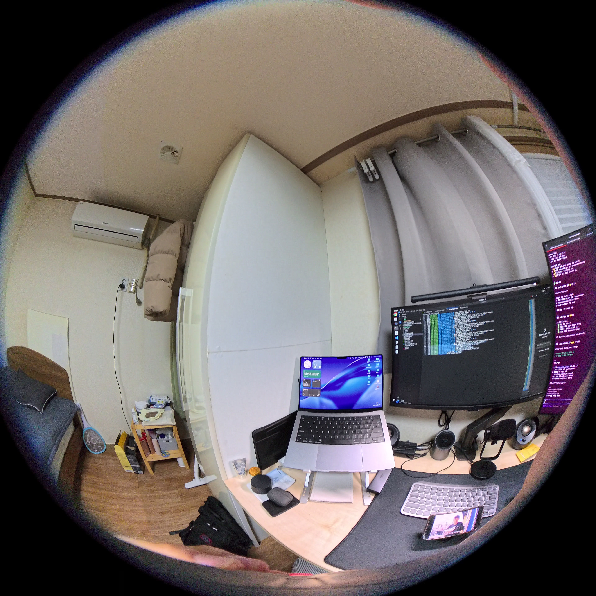

## 1. 3DGUT

### 3DGUT 예시 (youtube 링크)

1. https://www.youtube.com/watch?v=7AOcPGJCOns
2. https://www.youtube.com/watch?v=LwbzALOdFlY

- 최대 4K 화질로 view 할 수 있었으며, 두번째 영상에는 Insta360 X5로 PureVideo 모드로 설정해 촬영했다는 것이 명시되어 있음.

### 직접 촬영한 이미지 중 1 프레임


- 8K (3840x3840) 로 촬영됨.
- 3DGUT의 Unscented Transform은 OPENCV_FISHEYE 같은 명시적 왜곡 모델 없이도 비선형 투영을 정확하게 처리할 수 있어, 카메라 모델별 Jacobian 유도가 불필요하고 더 범용적임.
- OPENCV_FISHEYE도 200도+ FOV를 지원하지만, 극단적 왜곡에서 COLMAP 재구성이 불안정할 수 있는 반면, 3DGUT는 이를 더 robust하게 처리함.

---

## 2. 캘리브레이션 파라미터

### 2.1 카메라 모델

- fx, fy: x 및 y 방향의 초점 거리 (픽셀)
- cx, cy: 주점 좌표 (픽셀)
- k1, k2, k3, k4: 방사형 왜곡 계수

### 2.2 내부 파라미터 (Intrinsic Parameters)

| 파라미터 | 설명 | 렌즈 1 (왼쪽) | 렌즈 2 (오른쪽) | 단위 |
|---------|------|--------------|----------------|------|
| **이미지 크기** | 센서 해상도 | 10752 x 5376 | 10752 x 5376 | 픽셀 |
| **fx** | X축 초점 거리 | 4287.47 | 4287.74 | 픽셀 |
| **fy** | Y축 초점 거리 | 4287.85 | 4286.98 | 픽셀 |
| **cx** | 주점 X 좌표 | 2697.06 | 8075.65 | 픽셀 |
| **cy** | 주점 Y 좌표 | 2680.98 | 2671.26 | 픽셀 |

### 2.3 왜곡 계수 (Distortion Coefficients)

| 왜곡 계수 | 설명 | 렌즈 1 (왼쪽) | 렌즈 2 (오른쪽) |
|----------|------|--------------|----------------|
| **k1** | 1차 방사형 왜곡 | 0.196121 | 0.185774 |
| **k2** | 2차 방사형 왜곡 | 2.0279 | 2.04347 |
| **k3** | 3차 방사형 왜곡 | -3.22665 | -3.24968 |
| **k4** | 4차 방사형 왜곡 | -0.00106014 | -0.0004485 |

### 2.4 외부 파라미터 (Extrinsic Parameters)

| 파라미터 | 설명 | 렌즈 1 (왼쪽) | 렌즈 2 (오른쪽) | 단위 |
|---------|------|--------------|----------------|------|
| **Roll** | 롤 회전각 | -0.241 | 0.146 | 도 |
| **Pitch** | 피치 회전각 | 0.053 | -0.131 | 도 |
| **Yaw** | 요 회전각 | 90.046 | 89.947 | 도 |
| **tx** | X축 변환 | 0.0 | -0.001065 | 미터 |
| **ty** | Y축 변환 | 0.0 | 0.000087 | 미터 |
| **tz** | Z축 변환 | 0.0 | -0.031863 | 미터 |

---

## 3. 모든 해상도별 캘리브레이션 파라미터

### 3.1 파라미터 스케일링 방법론

**스케일링 규칙:**
- 스케일 비율 = 출력_해상도_너비 / 원본_해상도_너비 (10752)
- 초점 거리(fx, fy)와 주점(cx, cy)은 스케일 비율에 비례하여 스케일링
- 왜곡 계수(k1, k2, k3, k4)는 변하지 않음 (렌즈 고유 특성)
- 렌즈 2의 cx는 분리 후 조정: (cx_원본 - 5376) × 스케일

### 3.2 원본 해상도 (10752 x 5376)

**렌즈 1 (왼쪽):**
```
해상도: 5376 x 5376 (분리 후)
fx: 4287.47
fy: 4287.85
cx: 2697.06
cy: 2680.98
k1: 0.196121
k2: 2.0279
k3: -3.22665
k4: -0.00106014
```

**렌즈 2 (오른쪽):**
```
해상도: 5376 x 5376 (분리 후)
fx: 4287.74
fy: 4286.98
cx: 2699.65 (분리 후 조정: 8075.65 - 5376)
cy: 2671.26
k1: 0.185774
k2: 2.04347
k3: -3.24968
k4: -0.0004485
```

### 3.3 8K 해상도 (7680 x 3840)

**스케일 비율:** 0.714285714

**렌즈 1:**
```
해상도: 3840 x 3840 (분리 후)
fx: 3062.76
fy: 3063.04
cx: 1926.90
cy: 1914.99
k1: 0.196121
k2: 2.0279
k3: -3.22665
k4: -0.00106014
```

**렌즈 2:**
```
해상도: 3840 x 3840 (분리 후)
fx: 3062.96
fy: 3062.42
cx: 1928.04
cy: 1908.05
k1: 0.185774
k2: 2.04347
k3: -3.24968
k4: -0.0004485
```

### 3.4 5.7K 해상도 (5760 x 2880)

**스케일 비율:** 0.535714286

**렌즈 1:**
```
해상도: 2880 x 2880 (분리 후)
fx: 2297.07
fy: 2297.28
cx: 1445.17
cy: 1436.24
k1: 0.196121
k2: 2.0279
k3: -3.22665
k4: -0.00106014
```

**렌즈 2:**
```
해상도: 2880 x 2880 (분리 후)
fx: 2297.22
fy: 2296.81
cx: 1446.03
cy: 1431.04
k1: 0.185774
k2: 2.04347
k3: -3.24968
k4: -0.0004485
```

### 3.5 4K 해상도 (3840 x 1920)

**스케일 비율:** 0.357142857

**렌즈 1:**
```
해상도: 1920 x 1920 (분리 후)
fx: 1531.38
fy: 1531.52
cx: 963.46
cy: 957.49
k1: 0.196121
k2: 2.0279
k3: -3.22665
k4: -0.00106014
```

**렌즈 2:**
```
해상도: 1920 x 1920 (분리 후)
fx: 1531.48
fy: 1531.21
cx: 964.02
cy: 954.02
k1: 0.185774
k2: 2.04347
k3: -3.24968
k4: -0.0004485
```

### 3.6 LRV 해상도 (1664 x 832)

**스케일 비율:** 0.154761905

**렌즈 1:**
```
해상도: 832 x 832 (분리 후)
fx: 663.42
fy: 663.48
cx: 417.37
cy: 414.88
k1: 0.196121
k2: 2.0279
k3: -3.22665
k4: -0.00106014
```

**렌즈 2:**
```
해상도: 832 x 832 (분리 후)
fx: 663.46
fy: 663.34
cx: 417.64
cy: 413.36
k1: 0.185774
k2: 2.04347
k3: -3.24968
k4: -0.0004485
```

### 3.7 LRV 해상도 (1280 x 720)

**스케일 비율:** 0.119047619

**렌즈 1:**
```
해상도: 640 x 720 (분리 후)
fx: 510.46
fy: 510.51
cx: 321.12
cy: 319.11
k1: 0.196121
k2: 2.0279
k3: -3.22665
k4: -0.00106014
```

**렌즈 2:**
```
해상도: 640 x 720 (분리 후)
fx: 510.49
fy: 510.40
cx: 321.39
cy: 318.03
k1: 0.185774
k2: 2.04347
k3: -3.24968
k4: -0.0004485
```

### 3.8 해상도별 파라미터 요약표

| 해상도 | 스케일 | 렌즈 | fx | fy | cx | cy |
|--------|--------|------|-----|-----|-----|-----|
| **10752x5376** | 1.0 | 렌즈 1 | 4287.47 | 4287.85 | 2697.06 | 2680.98 |
| | | 렌즈 2 | 4287.74 | 4286.98 | 2699.65 | 2671.26 |
| **7680x3840** | 0.714 | 렌즈 1 | 3062.76 | 3063.04 | 1926.90 | 1914.99 |
| | | 렌즈 2 | 3062.96 | 3062.42 | 1928.04 | 1908.05 |
| **5760x2880** | 0.536 | 렌즈 1 | 2297.07 | 2297.28 | 1445.17 | 1436.24 |
| | | 렌즈 2 | 2297.22 | 2296.81 | 1446.03 | 1431.04 |
| **3840x1920** | 0.357 | 렌즈 1 | 1531.38 | 1531.52 | 963.46 | 957.49 |
| | | 렌즈 2 | 1531.48 | 1531.21 | 964.02 | 954.02 |
| **1664x832** | 0.155 | 렌즈 1 | 663.42 | 663.48 | 417.37 | 414.88 |
| | | 렌즈 2 | 663.46 | 663.34 | 417.64 | 413.36 |
| **1280x720** | 0.119 | 렌즈 1 | 510.46 | 510.51 | 321.12 | 319.11 |
| | | 렌즈 2 | 510.49 | 510.40 | 321.39 | 318.03 |

---ㅎ