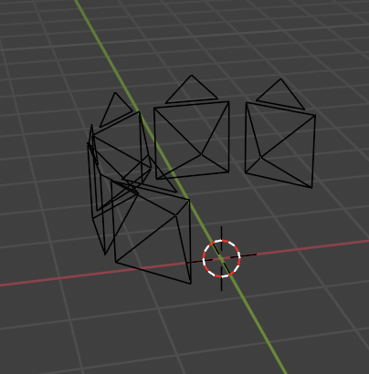
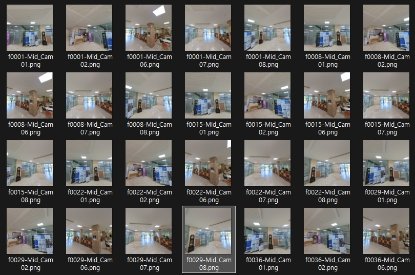
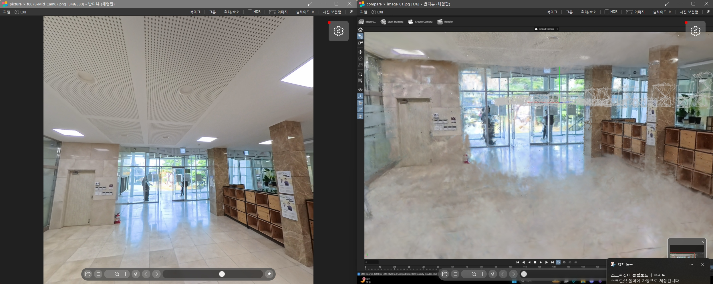
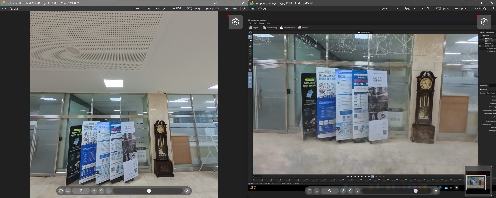
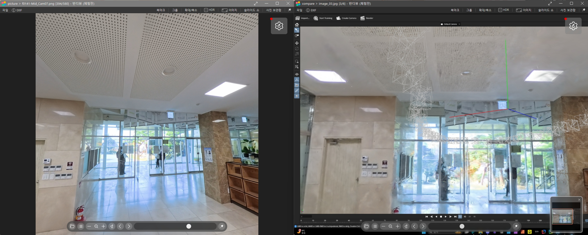
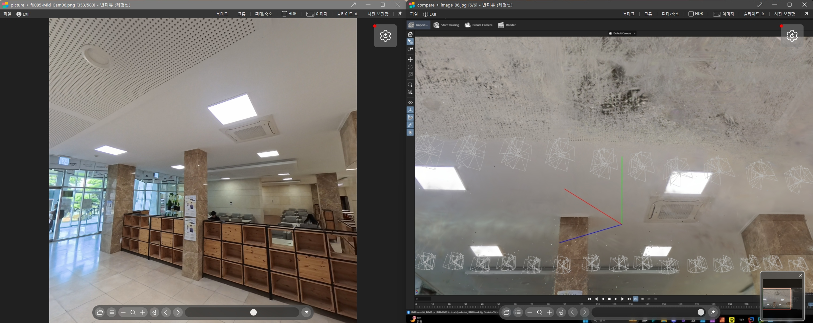
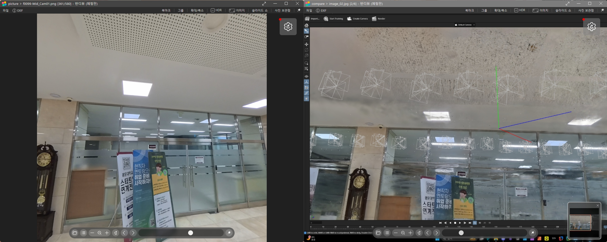

# Insta360 X5를 활용한 실내 공간 Gaussian Splatting 재구성 보고서

촬영 장소: 새빛관 1층  
카메라: Insta360 X5  
처리 도구: Insta360 Studio, Blender, Postshot

---

**핵심 발견사항:**
- 360도 영상에서 8개 가상 카메라 중 5개를 선택하여 다시점 이미지 생성
- 벽면과 같이 시야 각도에 포함된 영역은 높은 디테일 재현
- 바닥과 천장은 시야 제한으로 인해 point cloud 생성 부족
- 360도 영상 기반 접근법의 가능성과 한계 확인

---

## 1. 실험 개요

### 1.1 실험 목적
- Insta360 X5의 360도 영상을 활용한 Gaussian Splatting 재구성 가능성 검증
- Blender 360 Extractor를 통한 다시점 이미지 생성 파이프라인 구축
- 실내 공간에서의 재구성 품질 및 coverage 분석

### 1.2 실험 환경

| 항목 | 세부사항 |
|------|----------|
| 촬영 장소 | 새빛관 1층 실내 복도 |
| 촬영 장비 | Insta360 X5 |
| 촬영 시간 | 19초 (570 프레임 @ 30fps) |
| 원본 해상도 | 8K (360도 영상, *.insv) |
| 처리 도구 | Insta360 Studio, Blender, Postshot |
| 최종 출력 해상도 | 1920 × 1920 (정방형) |

### 1.3 카메라 사양

| 사양 | Insta360 X5 |
|------|-------------|
| 센서 타입 | Dual Fisheye Lens |
| 최대 해상도 | 8K @ 30fps (360도) |
| FOV | 360° × 180° (전방위) |
| 이미지 안정화 | FlowState 안정화 지원 |
| 파일 포맷 | *.insv (전용 포맷) |

---

## 2. 처리 파이프라인

### 2.1 전체 워크플로우

```
1. 360도 영상 촬영 (Insta360 X5)
   ↓
2. 안정화 및 스티칭 (Insta360 Studio)
   ↓
3. 다시점 이미지 추출 (Blender 360 Extractor)
   ↓
4. Gaussian Splatting 학습 (Postshot)
   ↓
5. 3D 재구성 결과 분석
```

### 2.2 단계별 상세 설명

#### Step 1: 360도 영상 촬영
- **장비**: Insta360 X5
- **촬영 시간**: 19초
- **프레임 레이트**: 30fps (총 570 프레임)
- **해상도**: 8K
- **파일 포맷**: *.insv (Insta360 전용 포맷)

**촬영 방법**:
- 새빛관 1층 복도를 따라 직선 이동
- 카메라를 수평으로 유지하며 일정한 속도로 이동
- 전방위 시야 확보를 위한 360도 촬영

#### Step 2: 안정화 및 내보내기 (Insta360 Studio)
- **안정화 유형**: FlowState 안정화
- **안정화 옵션**: 방향 잠금 (Horizon Lock)
- **출력 포맷**: MP4 (360도 Equirectangular)
- **출력 해상도**: 8K 유지

**목적**: 카메라 흔들림 제거 및 표준 비디오 포맷 변환

#### Step 3: 다시점 이미지 추출 (Blender)
- **도구**: Blender 360 Extractor 애드온
- **방법**: 가상 카메라 그룹을 이용한 프레임 렌더링

**Camera Group 설정**:



| 설정 항목 | 값 | 설명 |
|---------|---|------|
| 사용 카메라 | 1, 2, 6, 7, 8번 (5개) | 3, 4, 5번 카메라 제외 |
| 제외 카메라 | 3, 4, 5번 | 사람이 나오는 카메라 제외 |
| 출력 해상도 | 1920 × 1920 | 정방형 포맷 |
| 카메라 높이 (Height) | 1.00 |  |
| 틸트 각도 (Tilt Angle) | 0도 |  |

**카메라 배치 전략**:
- 카메라 1, 2, 6, 7, 8 : 전방 및 측면
- 카메라 7: 전방
- 수평 방향 주요 시점 확보

#### Step 4: Gaussian Splatting 수행 (Postshot)
- **입력**: Blender에서 추출한 이미지 시퀀스
- **처리**: 자동 카메라 포즈 추정 및 3D 재구성
- **출력**: 3D Gaussian Splatting 모델

### 2.3 추출된 이미지 예시



**이미지 특징**:
- 총 290장의 이미지 추출 (5프레임 당 하나씩)
- 각 프레임당 5개 시점에서 렌더링된 이미지 생성
- 정방형(1920×1920) 포맷으로 균일한 해상도
- 시간에 따라 카메라 위치가 이동하는 동시에 5개 방향 시야 확보
- 인접 프레임 간 충분한 시각적 오버랩 확보

---

## 3. 실험 결과

### 3.1 시각적 품질 분석

#### 3.1.1 Gaussian Splatting View vs 원본 이미지 비교

**비교 샘플 1**:


**비교 샘플 2**:


**비교 샘플 3**:


**비교 샘플 4**:


**비교 샘플 5**:


### 3.2 정성적 평가

#### 3.2.1 재구성 성공 영역

| 영역 | 관찰 내용 |
|------|----------|
| **벽면** | 텍스처 디테일 우수하게 재현 |
| **복도 구조** |  전반적인 기하학적 구조 정확 |
| **조명 기구** |  천장 조명 형상 잘 보존 |
| **창문/문** | 경계 및 디테일 재현 양호 |

**성공 요인**:
- 5개 가상 카메라에서 모두 관찰되는 벽면 영역
- 충분한 텍스처와 특징점을 포함한 표면
- 다양한 각도에서 일관되게 관찰됨
- Multi-view constraint가 강하게 작용

#### 3.2.2 재구성 실패/한계 영역

| 영역 | 관찰 내용 |
|------|----------|
| **바닥** |Point cloud 밀도 낮음 |
| **천장** |  부분적으로 재구성 미흡 |
| **코너 영역** |  일부 artifacts 발생 |

**실패 요인**:
- 카메라 3, 4, 5번(바닥/천장 시점) 제외
- 수평 시선(Tilt Angle 0도)으로 인한 시야 제한
- 바닥/천장에 대한 관찰 샘플 부족
- Weak geometric constraint

---

## 4. 원인 분석

### 4.1 Coverage 한계

#### 4.1.1 카메라 시야각 제약

```
수평 방향 Coverage: 5개 카메라로 360도 커버
수직 방향 Coverage: 0도 tilt, 바닥/천장 시야 부족
```

**분석**:
- 수평 방향은 360도 전방위 시야로 인해 우수한 coverage
- 수직 방향은 0도 틸트로 인해 바닥/천장 관찰 제한적
- Gaussian Splatting은 관찰된 영역만 정확히 재구성 가능
