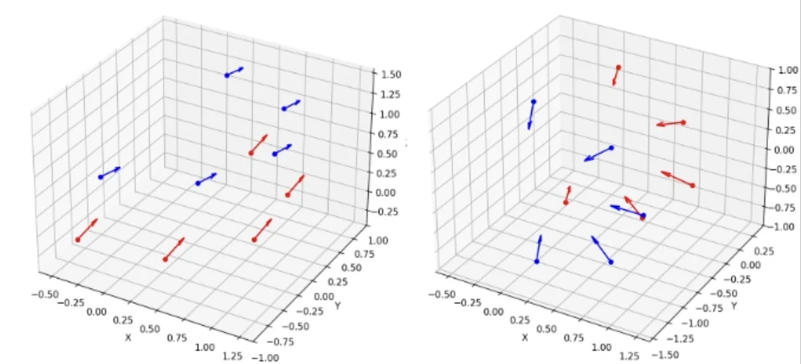
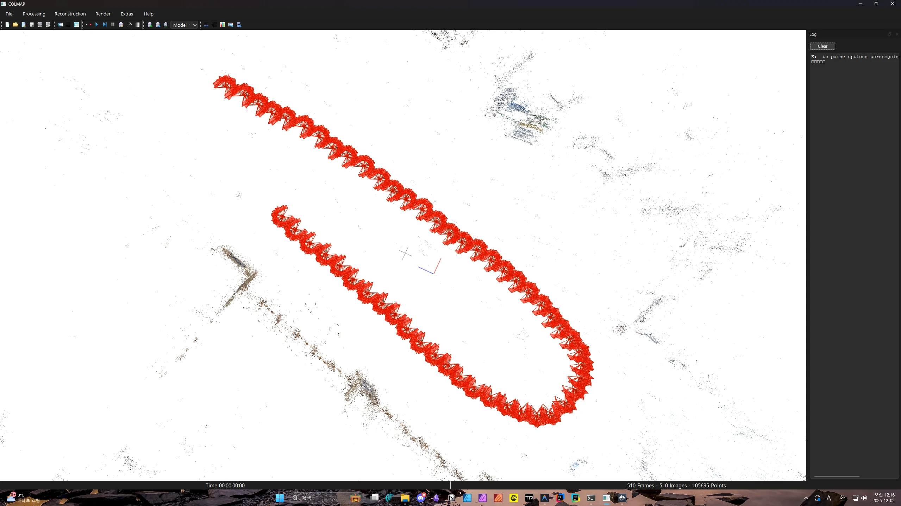
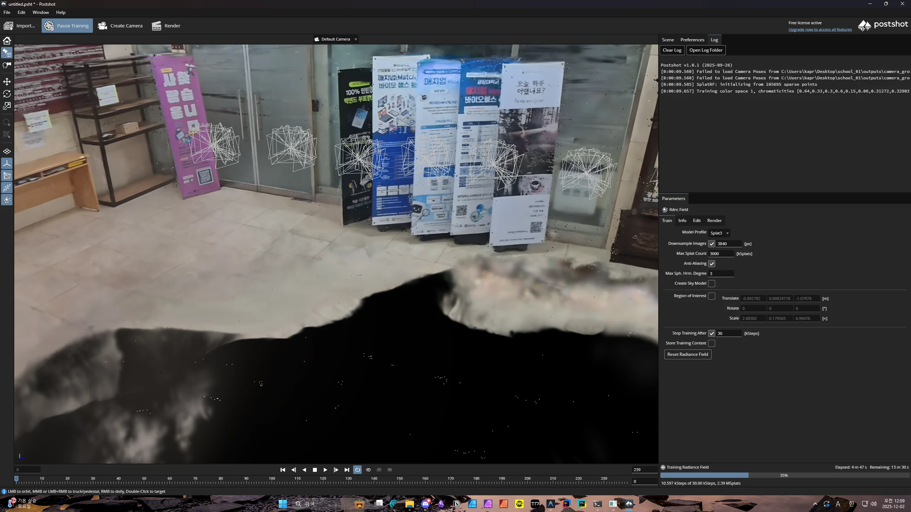

### 1. 데이터 전처리 및 좌표계 보정 (Data Prep & Coordinate Fix)
*   **입력 데이터**: `camera_groups_2025-12-01.json`
    * 카메라 수: 10개 (Up group 5개, Down group 5개)
    * 포함 정보: 각 카메라의 상대적 위치(Translation), 회전(Rotation), rig 그룹 정의
    * 좌표계: Z-up
*   **좌표계 변환**: 입력 데이터(OpenGL 좌표계)와 Colmap 좌표계 간의 불일치를 해결하기 위해, X축 90도 회전 (RotX_90)을 적용하여 카메라가 올바른 방향(정면)을 향하도록 보정함.
    
    
  - 좌 : Input된 Blender의 json 파일(`camera_groups_2025-12-01.json`).
  - 우 : 좌표계 변환 후의 json 파일(`rig_config.json`).

### 2. 마스크 생성 (Mask Generation)
*   "Down" 그룹 카메라 이미지의 **하단 20%** 영역을 검은색으로 마스킹 처리함.


### 3. 특징점 추출 및 매칭 (Feature Extraction & Matching)
```bash
colmap feature_extractor \
    --database_path outputs/school_01/database.db \
    --image_path inputs/school_01/ \
    --ImageReader.mask_path outputs/school_01/masks/

colmap sequential_matcher \
    --database_path outputs/school_01/database.db \
    --SiftMatching.guided_matching=true \
    --SiftMatching.max_error=4.0
```
마스크가 적용된 이미지에서 특징점을 추출한 후, 비디오 시퀀스의 연속성을 고려하여 **Sequential Matching (Overlap=20)**을 수행함.

### 4. 경로 추정 및 구조화 (Structure-from-Motion)
```bash
colmap mapper \
    --database_path outputs/school_01/database.db \
    --image_path inputs/school_01/ \
    --output_path outputs/school_01/sparse/ \
    --Mapper.ba_refine_rig=0 \
    --Mapper.init_min_num_inliers=100
```
매칭된 특징점을 기반으로 카메라의 궤적과 3D 포인트 클라우드를 1차적으로 생성함.

### 5. Rig 제약조건 적용 및 최적화 (Rig Configuration & Optimization)
*   **명령어**: `colmap rig_configurator`, `colmap bundle_adjuster`
```bash
colmap rig_configurator \
    --database_path outputs/school_01/database.db \
    --rig_config_path outputs/school_01/rig_config.json \
    --output_path outputs/school_01/

colmap bundle_adjuster \
    --input_path outputs/school_01/sparse/ \
    --output_path outputs/school_01/sparse/ \
    --BundleAdjustment.refine_rig=0
```
 앞서 추정된 경로에 JSON에서 추출한 **Rig 제약조건**을 강제로 적용함. 이후 Bundle Adjustment를 통해 전체 재구성 오차를 최소화하여 최종적으로 정렬된 3D 모델을 완성함.

## 실행 폴더 구조 (Project Structure)

```text
school_01/
├── inputs/                     # [Input] 입력 데이터 폴더
│   ├── camera_groups_*.json    # 카메라 Rig 설정 파일 (필수)
│   └── {dataset_name}/         # 이미지 폴더 (또는 비디오)
├── outputs/                    # [Output] 결과물 저장 폴더
│   └── {dataset_name}/
│       ├── masks/              # 생성된 마스크 이미지
│       ├── database.db         # Colmap 데이터베이스
│       ├── rig_config.json     # 생성된 Rig 설정 파일
│       └── sparse/
│           └── rig_adjusted/   # [Final] 최종 3D 재구성 모델 (Rig 적용됨)
├── src/                        # [Source] 소스 코드
│   ├── colmap_runner.py        # Colmap 명령어 실행 래퍼
│   ├── data_prep.py            # 데이터 준비 및 Rig 설정 생성
│   ├── database.py             # DB 생성 및 제어
│   ├── masking.py              # 마스크 생성 로직
│   ├── pipeline.py             # 전체 파이프라인 제어
│   └── visualization.py        # 결과 시각화 스크립트
└── main.py                     # [Entry] 메인 실행 
```

## 결과물 (Outputs)

`outputs/school_01/sparse/rig_adjusted` 경로에 rig 제약이 적용된 colmap 데이터가 생성됨.


### Rig 제약 전 후 내부 파라미터 변화 비교
| Camera | Δfx | Δfy | Δcx | Δcy | ΔR (도) | Δt (mm) | 상태 |
|---|---|---|---|---|---|---|---|
| All | 0 | 0 | 0 | 0 | 0 | 0 | 고정 (Constraints Enforced) |
* Rig 제약이 강제되어 카메라 파라미터 조정 없음.

## 고찰

### 1. 마스킹으로 인한 바닥면 흑색화 현상 (Black Floor Artifact)

- Down Group 의 pose가 Tilt Angle을 내리기에는 손 형태가 너무 많이 보이고, 올리기에는 기존 Up Group과 보이는 pose가 큰 차이가 없었음.
- 이로 인해 하단 20%를 검은색으로 mask하는 방식을 택했지만, 최종적으로 Postshot train 도중 해당 영역이 검은색 물체로 학습되는 치명적인 에러가 발생함.
