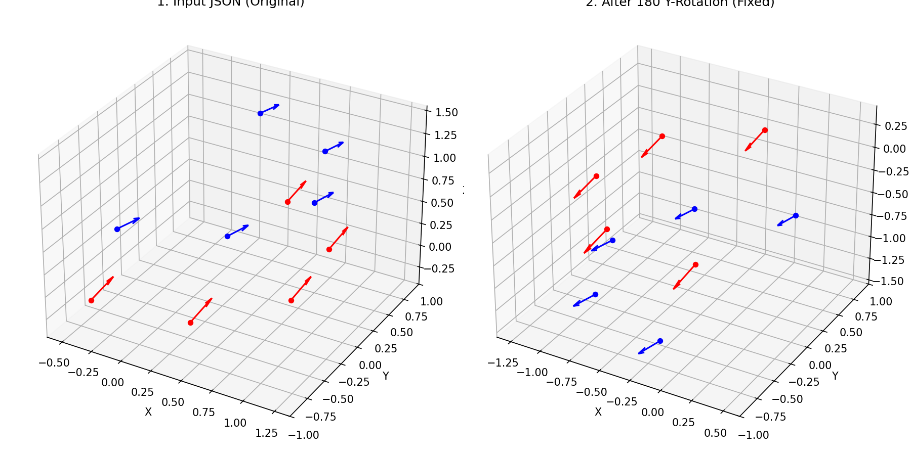
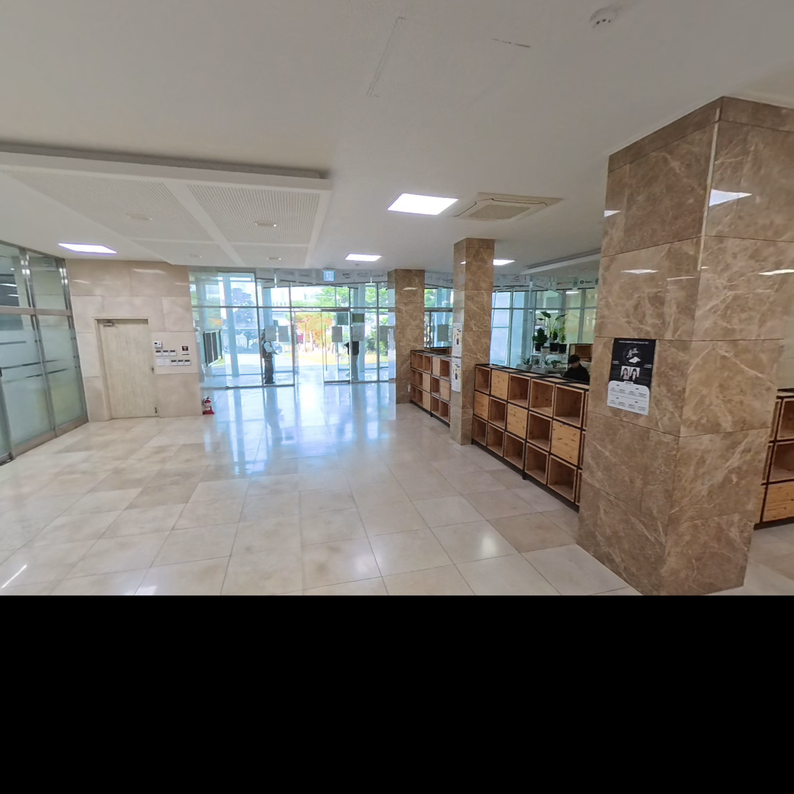

## 수행 방법 및 파이프라인

### 1. 데이터 전처리 및 좌표계 보정 (Data Prep & Coordinate Fix)
*   **입력 데이터**: `camera_groups_*.json` 파일에 정의된 10개 카메라의 상대적 위치(Translation)와 회전(Rotation) 정보를 사용함.
*   **좌표계 변환**: 입력 데이터(OpenGL 좌표계)와 Colmap 좌표계 간의 불일치를 해결하기 위해, **Y축 180도 회전**을 적용하여 카메라가 올바른 방향(정면)을 향하도록 보정함.
    
    
    *그림: 입력 데이터와 Colmap 좌표계 간의 방향 보정 (Y축 180도 회전)*

### 2. 마스크 생성 (Mask Generation)
*   `src/masking.py`를 통해 "Down" 그룹 카메라 이미지의 **하단 25%** 영역을 검은색으로 마스킹 처리함.


### 3. 특징점 추출 및 매칭 (Feature Extraction & Matching)
*   **명령어**: `colmap feature_extractor`, `colmap sequential_matcher` 
*   **내용**: 마스크가 적용된 이미지에서 특징점을 추출한 후, 비디오 시퀀스의 연속성을 고려하여 **Sequential Matching (Overlap=20)**을 수행함.

### 4. 경로 추정 및 구조화 (Structure-from-Motion)
*   **명령어**: `colmap mapper`
*   **내용**: 매칭된 특징점을 기반으로 카메라의 궤적(Trajectory)과 3D 포인트 클라우드를 1차적으로 생성함.

### 5. Rig 제약조건 적용 및 최적화 (Rig Configuration & Optimization)
*   **명령어**: `colmap rig_configurator`, `colmap bundle_adjuster`
*   **내용**: 앞서 추정된 경로에 JSON에서 추출한 **Rig 제약조건(카메라 간 고정된 상대 위치)**을 강제로 적용함. 이후 Bundle Adjustment를 통해 전체 재구성 오차를 최소화하여 최종적으로 정렬된 3D 모델을 완성함.

## 실행 폴더 구조 (Project Structure)

```text
school_01/
├── inputs/                     # [Input] 입력 데이터 폴더
│   ├── camera_groups_*.json    # 카메라 Rig 설정 파일 (필수)
│   └── {dataset_name}/         # 이미지 폴더 (또는 비디오)
├── outputs/                    # [Output] 결과물 저장 폴더
│   └── {dataset_name}/
│       ├── masks/              # 생성된 마스크 이미지
│       ├── database.db         # Colmap 데이터베이스
│       ├── rig_config.json     # 생성된 Rig 설정 파일
│       └── sparse/
│           └── rig_adjusted/   # [Final] 최종 3D 재구성 모델 (Rig 적용됨)
├── src/                        # [Source] 소스 코드
│   ├── colmap_runner.py        # Colmap 명령어 실행 래퍼
│   ├── data_prep.py            # 데이터 준비 및 Rig 설정 생성
│   ├── database.py             # DB 생성 및 제어
│   ├── masking.py              # 마스크 생성 로직
│   ├── pipeline.py             # 전체 파이프라인 제어
│   └── visualization.py        # 결과 시각화 스크립트
├── main.py                     # [Entry] 메인 실행 스크립트
└── README.md                   # 문서
```

## 결과물 (Outputs)

`outputs/school_01/sparse/rig_adjusted` 경로에 rig 제약이 적용된 colmap 데이터가 생성됨.


## 고찰

### 마스킹으로 인한 바닥면 흑색화 현상 (Black Floor Artifact)
- 현재 파이프라인에서는 Rig 촬영자의 손 노출을 막기 위해 하단 25%를 검은색으로 마스킹했는데, 이로 인해 Postshot 학습 시 해당 영역이 검은색 물체로 학습되는 현상이 발생함.

- 발생 원인 : Down Group 의 pose가 내리기에는 손 형태가 너무 많이 보이고, 올리기에는 기존 Up Group과 보이는 pose가 큰 차이가 없어 mask하는 방식을 택했지만, 최종적으로 Postshot 학습에서 치명적인 에러가 발생함.