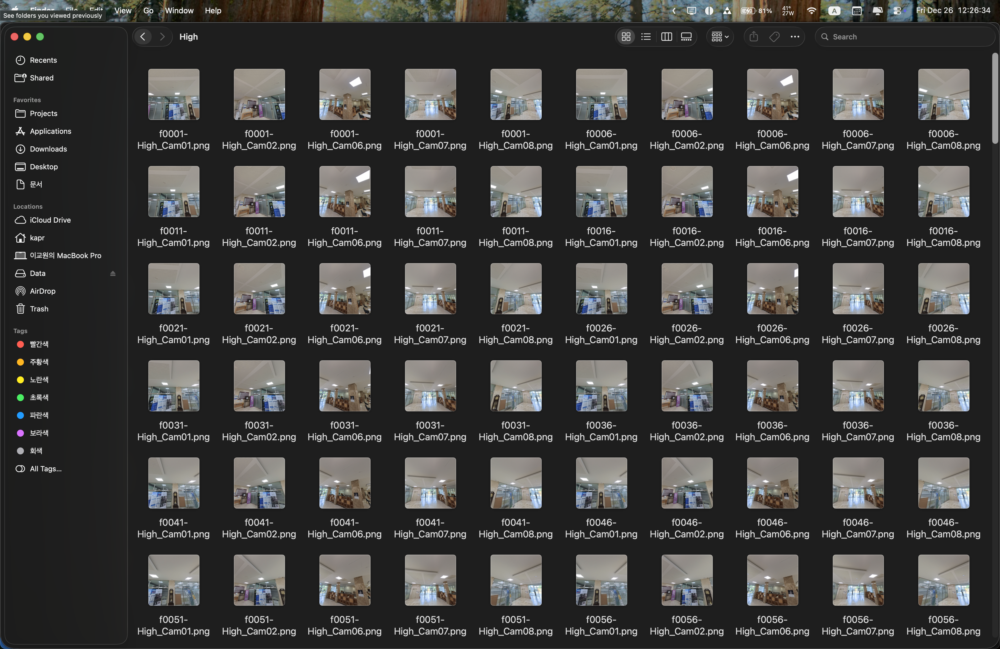
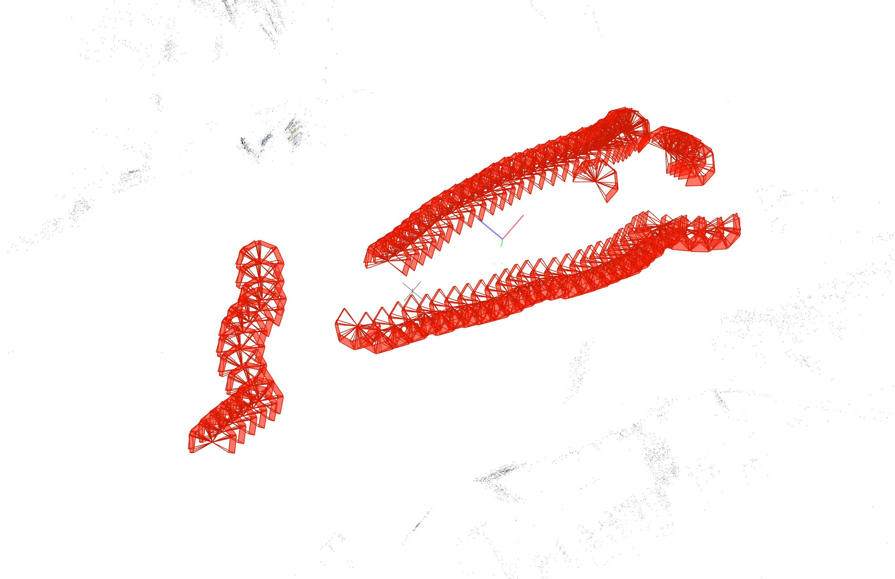

# COLMAP Rigged SfM 실행

## 환경
- OS: macOS (Darwin)
- CPU: Apple M1 Pro
- COLMAP: 3.13.0

## 입력
- Images: images/High/*.png, images/Low/*.png

- Pose metadata: camera_groups_2025-12-25.json (쿼터니언 순서 [w, x, y, z])
- Sensors (총 7개): High_Cam01, High_Cam02, High_Cam06, High_Cam07, High_Cam08, Low_Cam01, Low_Cam02

## pipeline 요약
1. 이미지 준비
   - 형식: 7개 센서 전체 프레임 교집합만 사용
   - 결과: 81 프레임, 총 567 이미지 (81 프레임 x 7 센서)

2. Rig 설정 생성
   - 출력: rig_config.json
```json
   "cameras": [
      {
        "image_prefix": "rig1/High_Cam01/",
        "ref_sensor": true
      },
      {
        "image_prefix": "rig1/High_Cam02/",
        "cam_from_rig_rotation": [
          0.9238795405269793,
          3.91897042927183e-08,
          0.35960475987789703,
          -0.13088548914534553
        ],
        "cam_from_rig_translation": [
          0.7071067934564331,
          -0.10017545698773801,
          -0.2752295188867947
        ]
      },
      ...
```
   - 기준 센서: High_Cam01
   - cam_from_rig: Blender 포즈를 OpenCV 좌표로 변환 (C = diag(1, -1, -1))

3. 특징 추출
   - Command: `colmap feature_extractor --ImageReader.single_camera_per_folder 1`

4. Rig 적용
   - Command: `colmap rig_configurator`
   - 결과: 7개 센서, 81 프레임 구성 적용

5. 매칭
   - Command: `colmap sequential_matcher`
   - 옵션: 빌드 지원 시 skip_image_pairs_in_same_frame 사용

6. 맵핑
   - Command: `colmap mapper`
   - Rig 고정: `--Mapper.ba_refine_sensor_from_rig 0`
   - Intrinsics 고정: `--Mapper.ba_refine_focal_length 0`, `--Mapper.ba_refine_extra_params 0`

7. 검증
   - 형식: 등록된 포즈와 rig_config 기준 상대 포즈 비교
```json
{
  "frames_used": 81,
  "sensors_count": 7,
  "registered_images_count": 567,
  "rotation_error_deg": {
    "mean": 2.090426991889572e-08,
    "std": 1.629736117598105e-07,
    "max": 1.7075472925031877e-06
  },
  "translation_error": {
    "mean": 1.6022816848209116e-09,
    "std": 1.2628167141670725e-09,
    "max": 9.870026976300983e-09
  }
}
```

## 정량 결과 (Rig 일관성)
- 사용 프레임 수: 81
- 등록 이미지 수: 567
- 회전 오차 (deg): mean 2.090e-08, std 1.630e-07, max 1.708e-06
- 이동 오차: mean 1.602e-09, std 1.263e-09, max 9.870e-09

> 추정된 상대 카메라 포즈가 설정된 rig와 수치적으로 거의 일치하며, rig 제약이 정상적으로 유지되었다고 판단됨.

## 정성 결과

- 전반적으로는 이동 경로에 따라 생성이 잘 되었지만, 중간에 좌표/포즈가 한 번 크게 튄(불연속) 흔적이 보임.
