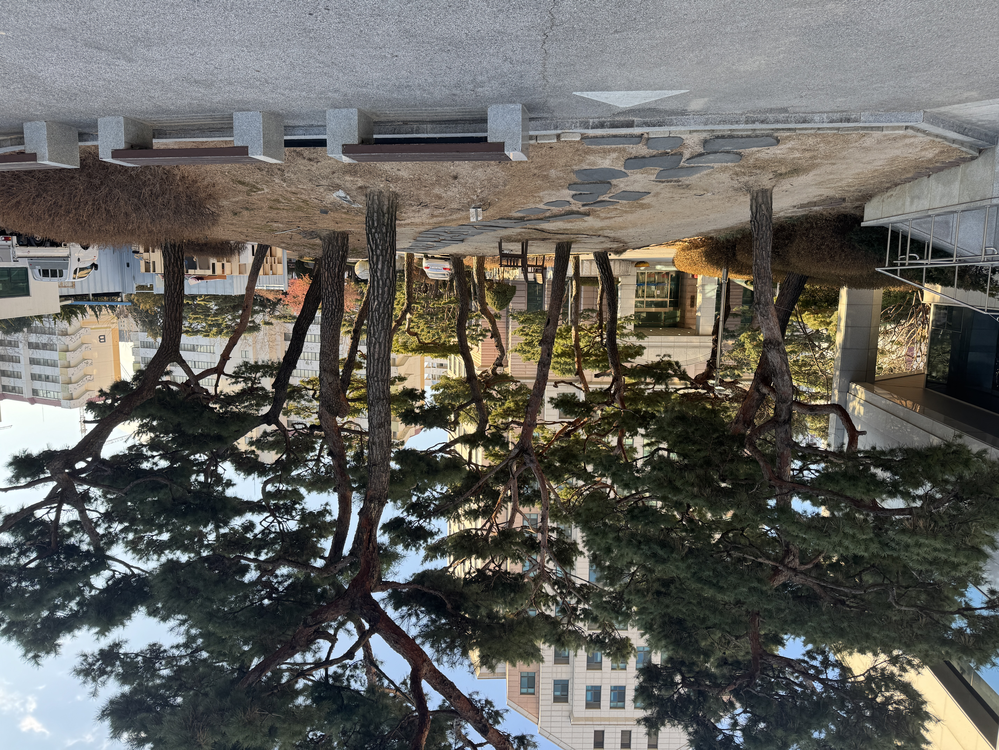
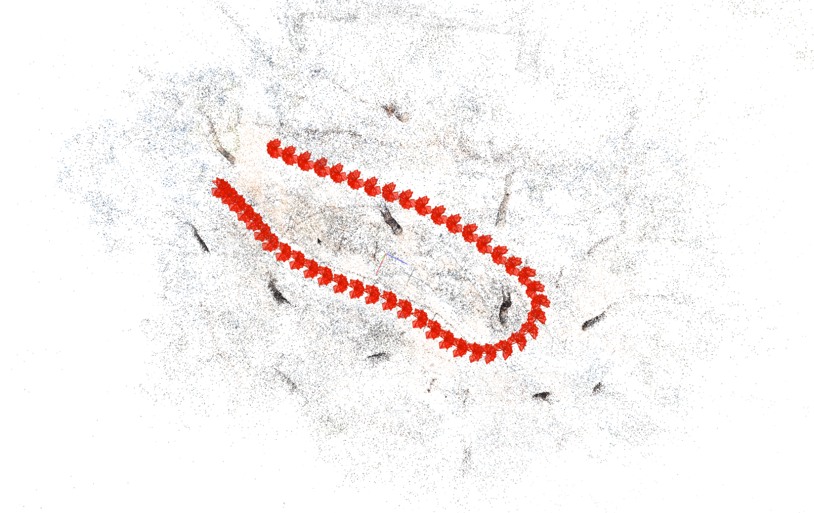
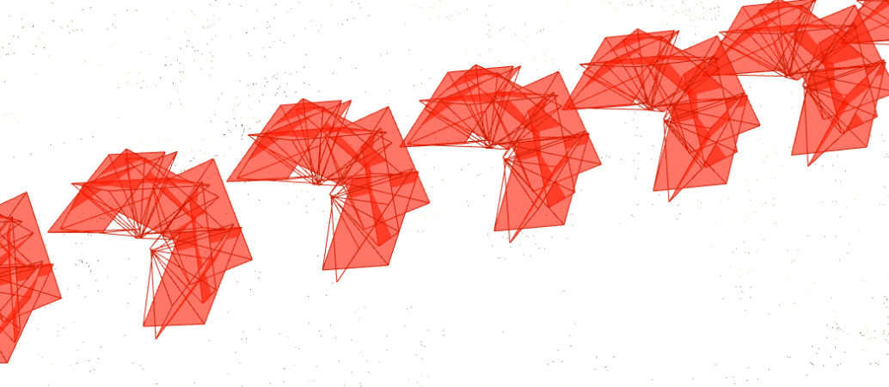
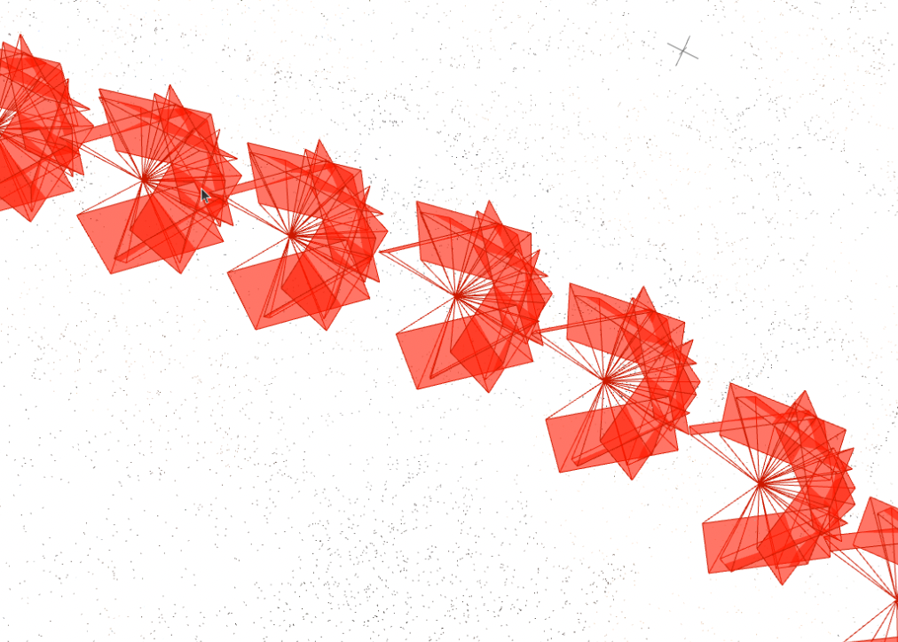

# COLMAP Rig 기반 SfM 결과 보고서

- **No Rig (2-step)**: 표준 COLMAP SfM 실행 후, 그 결과를 참조하여 후처리
- **Rig (1-step)**: 처음부터 Rig 제약을 적용하여 COLMAP SfM 실행

## 1. 수행 환경

| 항목 | 값 |
|------|---|
| COLMAP 버전 | 3.13.0 (CUDA) |
| 플랫폼 | Ubuntu 22.04.5 LTS |
| CPU | AMD Ryzen 7 7700 (8 core / 16 threads) |
| GPU | NVIDIA GeForce RTX 4060 Ti (16GB) |

## 2. 데이터셋

| 항목 | 값 |
|------|---|
| 촬영 장소 | 새빛관 앞 화단 |
| 원본 영상 | 7680×3840 (29.97fps), 30초 |
| 총 이미지 수 | 414장 |
| 카메라 수 | 9대 (High 5대 + Low 4대) |
| 프레임 수 | 46개 |
| 이미지 해상도 | 1920×1920 |




## 3. 파이프라인 설정

### 3.1 카메라 내부 파라미터 (고정)

| 파라미터 | 값 |
|----------|---|
| 모델 | PINHOLE |
| fx, fy | 960, 960 |
| cx, cy | 960, 960 |

### 3.2 Rig 설정

| 파라미터 | 값 |
|----------|---|
| 기준 카메라 | High_Cam01 |
| 회전 | 360 Extractor Tool json file 기반 (Blender → OpenCV 좌표 변환) |
| 이동 | [0, 0, 0] (단일 시점) |


### 3.3 Blender vs COLMAP 파라미터 비교

| 항목 | Blender 360 Extractor | COLMAP 표준 SfM | 비고 |
|------|----------------------|----------------|------|
| fx, fy | 960, 1440 | ≈960, 960 | Blender는 fy 상이 |
| cx, cy | 960, 960 | 960, 960 | 동일 |
| Translation | 원형 배치 (반지름 ~0.5m) | [0, 0, 0] | 단일 시점으로 단순화 |
| Rotation | Blender 좌표계 | OpenCV 좌표계 | 좌표 변환 적용 |

> Blender 360 Extractor 파라미터로 Rig 제약 적용 시 수렴 실패. COLMAP 표준 SfM 결과를 기반으로 파라미터를 재설정하여 진행함.

### 3.4 COLMAP 옵션

**Matching**
```
--FeatureMatching.rig_verification 1    # Rig 기반 geometric verification
```

**Mapper**
```
--Mapper.ba_refine_sensor_from_rig 0    # Rig 제약 고정
--Mapper.ba_refine_focal_length 0       # 초점 거리 고정
--Mapper.ba_refine_principal_point 0    # 주점 고정
--Mapper.ba_refine_extra_params 0       # 기타 파라미터 고정
```

## 4. 실행 시간

### 4.1 No Rig

| 단계 | 소요 시간 |
|------|----------|
| 이미지 재구성 | ~1초 |
| 특징점 추출 (GPU) | ~10초 |
| Sequential Matching (GPU) | ~1분 |
| Mapper | 2분 50초 |
| **총 소요 시간** | **3분 58초** |

### 4.2 Rig

| 단계 | 소요 시간 |
|------|----------|
| 이미지 재구성 | ~1초 |
| Rig 설정 파일 생성 | ~1초 |
| 특징점 추출 (GPU) | ~10초 |
| Rig Configurator | ~1초 |
| Sequential Matching (GPU + Rig Verification) | ~4분 |
| Mapper | 4분 03초 |
| **총 소요 시간** | **9분 17초** |

### 4.3 시간 비교

| 항목 | No Rig | Rig | 배율 |
|------|--------|-----|------|
| 총 소요 시간 | 3분 58초 | 9분 17초 | ×2.3 |
| Mapper 시간 | 2분 50초 | 4분 03초 | ×1.4 |

## 5. 결과

### 5.1 재구성 통계

| 지표 | No Rig | Rig | 변화 |
|------|--------|-----|------|
| Rig 수 | 9 | 1 | 통합됨 |
| 프레임 수 | 414 | 46 | 그룹화됨 |
| 등록된 이미지 | 414 (100%) | 414 (100%) | - |
| **3D 포인트** | 99,681 | **134,796** | **+35%** |
| **Observations** | 436,167 | **956,272** | **+119%** |
| **평균 Track 길이** | 4.38 | **7.09** | **+62%** |
| 이미지당 평균 Obs | 1,054 | 2,310 | +119% |
| 재투영 오차 | 0.87 px | 0.92 px | +6% |

#### 5.1.1 No Rig COLMAP GUI

- Rig 제약 없이 각 이미지가 독립적으로 처리됨

#### 5.1.2 Rig COLMAP GUI

- 9개 카메라가 하나의 Rig로 묶여 프레임 단위로 처리됨


### 5.2 프레임 그룹화

COLMAP `rig_configurator`가 동일 파일명의 이미지를 하나의 프레임으로 그룹화:

```
Frame (f0001.png):
├── High_Cam01/f0001.png
├── High_Cam02/f0001.png
├── High_Cam06/f0001.png
├── High_Cam07/f0001.png
├── High_Cam08/f0001.png
├── Low_Cam01/f0001.png
├── Low_Cam02/f0001.png
├── Low_Cam07/f0001.png
└── Low_Cam08/f0001.png
```

## 6. 분석

### 6.1 Rig 제약의 효과

- **3D 포인트 35% 증가**: 9개 카메라 간 기하학적 관계가 고정되어 더 많은 3D 포인트 삼각측량 성공
- **Observations 119% 증가**: 프레임 간 일관된 매칭으로 특징점 활용도 향상
- **Track 길이 62% 증가**: 동일 3D 포인트가 더 많은 이미지에서 관측됨

### 6.2 Rig Verification 효과

`--FeatureMatching.rig_verification 1` 옵션은 Rig 제약을 활용한 geometric verification을 수행하여 불량 매칭을 사전에 필터링함. 이로 인해 Mapper의 수렴 속도가 향상됨.

### 6.3 재투영 오차 증가 (0.87px → 0.92px)

Rig 제약으로 인해 카메라 포즈의 자유도가 제한되어 재투영 오차가 소폭 증가함. 그러나 0.92px는 일반적으로 양호한 수준이며, 재구성 밀도의 큰 향상(+35%)을 고려하면 허용 가능한 trade-off임.

### 6.4 수행 시간 증가 (×2.3)

Rig 방식이 더 오래 걸리는 주요 원인:
- Sequential Matching 단계에서 Rig Verification 추가 연산
- Mapper에서 Rig 제약 조건을 유지하며 Bundle Adjustment 수행

## 7. 결론

COLMAP 3.13의 Rig 기반 SfM을 적용한 결과

1. **모든 이미지 등록 성공** (414/414, 100%)
2. **재구성 품질 향상**: 3D 포인트 +35%, Observations +119%
3. **수행 시간**: No Rig 대비 2.3배 증가 (3분 58초 → 9분 17초)
4. **재투영 오차**: 0.92px로 양호한 수준 유지

Rig 제약을 통해 다중 카메라 간 기하학적 일관성이 보장됨.
