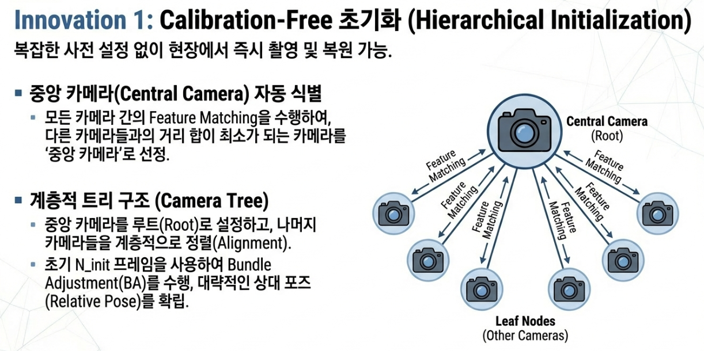
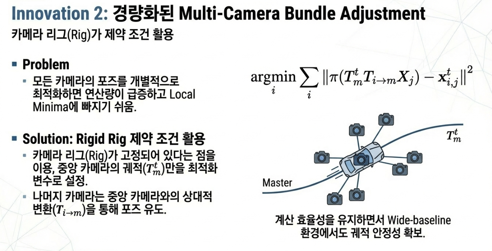
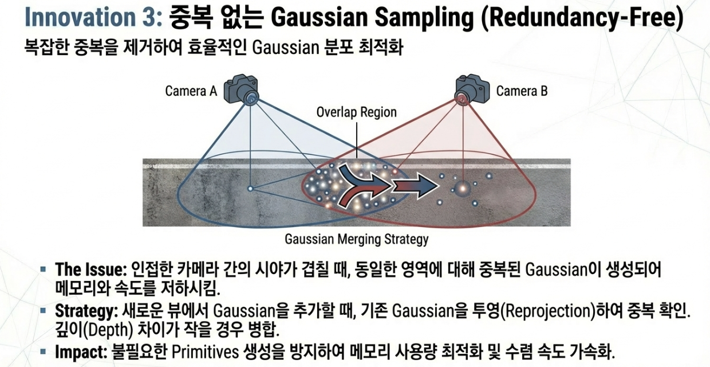
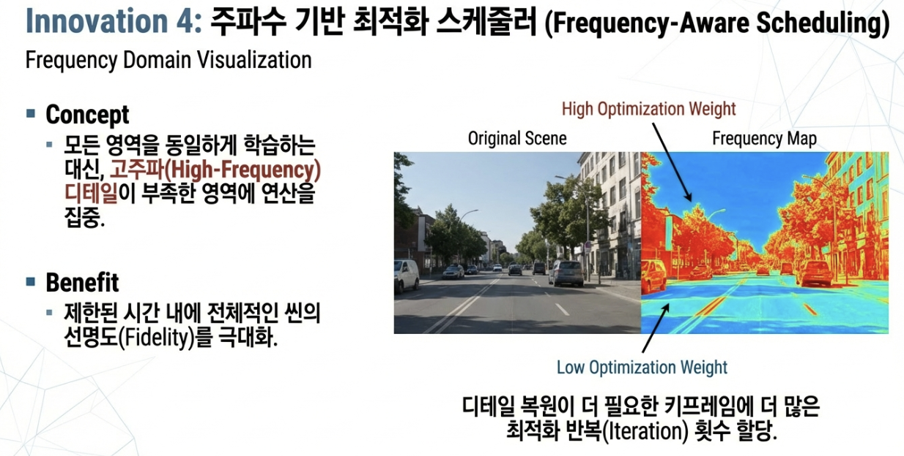
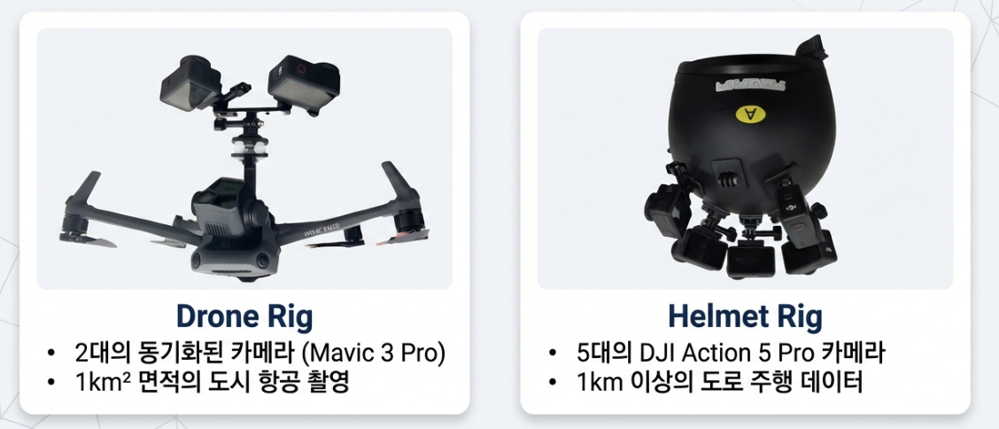
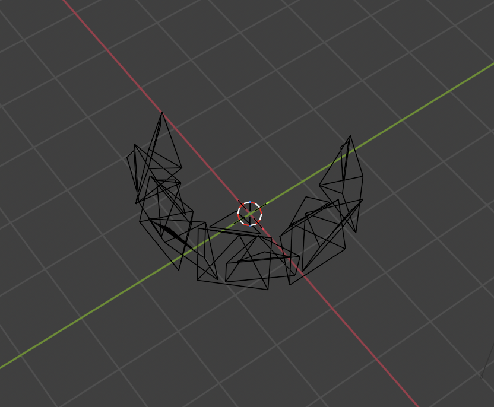

# ontheflynvs에 rig sfm 적용

## 0. 참고 문헌
[https://arxiv.org/pdf/2512.08498](https://arxiv.org/pdf/2512.08498)

## 1. ontheflynvs 파이프라인 (현재 진행해야 함)

```
360 영상 촬영 (Insta360 X5)
       ↓
다시점 이미지 추출 (Blender 360 Extractor)
       ↓
COLMAP SfM (Feature Extraction → Matching → Mapper)
       ↓
3DGS 학습 (PostShot)
       ↓
Novel View 렌더링
```

## 2. Rig SfM 적용 시 코드 문제점

| 문제 | 설명 |
|------|------|
| 자동화 부재 | 좌표계 변환(Blender→COLMAP), Rig 설정 생성, 프레임 동기화 모두 수동 |
| 좌표계 변환 | Blender(+Y forward, +Z up) → COLMAP(+Y down, +Z forward) 변환 스크립트 없음 |
| 파라미터 고정 | `ba_refine_sensor_from_rig=0` 사용 시 초기 파라미터 오류 수정 불가 |

- **ontheflynvs는 기본적으로 multi pose에 대한 train을 지원하지 않기 때문에, 코드를 전부 수정해야 함.**

## 3. 논문의 핵심 기법

### 3.1 Calibration-Free 초기화 (Hierarchical Initialization)



- 중앙 카메라 자동 식별: 카메라 그래프에서 다른 카메라들과의 경로 합이 최소인 중심 카메라 선택
- 계층적 트리 구조로 카메라 정렬, 각 카메라의 상대 포즈(Relative Pose) 획득

### 3.2 경량화된 Multi-Camera Bundle Adjustment



- Rigid Rig 제약 활용: 중앙 카메라 포즈만 최적화, 나머지는 상대 변환으로 도출
- 계산 효율성 유지 + Wide-baseline 환경에서 궤적 안정성 확보

### 3.3 중복 없는 Gaussian Sampling (Redundancy-Free)



- 인접 카메라 간 시야 중복 시 동일 영역에 중복 Gaussian 생성 방지
- 기존 Gaussian 투영(Reprojection) 후 깊이 차이 적으면 병합

### 3.4 주파수 기반 최적화 스케줄러 (Frequency-Aware Scheduling)



- 고주파 영역(디테일 多)에 더 많은 반복, 저주파 영역에 적은 반복
- 제한된 시간 내 전체 씬 선명도(Fidelity) 극대화

## 4. 논문 vs ontheflynvs 파이프라인 비교

| 항목 | 논문 (On-the-fly 3D Recon) | ontheflynvs (현재) |
|------|---------------------------|-------------------|
| 카메라 | Multi-camera rig | 360 카메라 (Insta360 X5) |
| 캘리브레이션 | Calibration-free (계층적 초기화) | Rig 설정 수동 생성 필요 |
| SfM | 실시간 다중 카메라 번들 조정 | COLMAP 오프라인 처리 |
| 3DGS 최적화 | 주파수 기반 스케줄러 (반복 감소) | PostShot 기본 학습 |
| 가우시안 샘플링 | 중복 제거 샘플링 (프리미티브 감소) | 기본 densification |
| 처리 방식 | On-the-fly (실시간) | 오프라인 |

## 5. 현재 rigged SfM 적용 방안

### 5.1. 논문에서 사용한 camera rig 데이터셋


### 5.2. Blender 360 extractor tool


### 5.3. 260111/260113 실험 결과 연계

| 항목 | 260111 (SfM) | 260113 (3DGS) |
|------|-------------|---------------|
| Rig 구성 | 9대 카메라 (High 5 + Low 4) | 동일 |
| 기준 카메라 | High_Cam01 수동 지정 | - |
| SfM 개선 | 3D 포인트 +35%, Obs +119% | - |
| 3DGS 개선 | - | PSNR +1.24dB, SSIM +0.067 |

**논문 기법 적용 현황**
- 3.1 (Calibration-Free 초기화): Rig 구성이 이미 알려져 있으므로 불필요
- 3.2 (경량화된 BA): COLMAP Rig 제약과 유사하게 적용됨
- 3.3 (중복 제거 Gaussian): **추가 적용 필요**
- 3.4 (주파수 스케줄러): **추가 적용 필요**
