# on-the-fly-nvs에 rig SfM 적용

## 1. 배경 및 목적

260111/260113 실험에서 Rig SfM으로 데이터 준비 완료함.

| 항목 | 260111 (SfM) | 260113 (Postshot) |
|------|-------------|---------------|
| Rig 구성 | 9대 카메라 (High 5 + Low 4) | 동일 |
| 기준 카메라 | High_Cam01 수동 지정 | - |
| SfM 개선 | 3D 포인트 +35%, Obs +119% | - |
| 3DGS 개선 | - | PSNR +1.24dB, SSIM +0.067 |

이 데이터를 활용하여 **on-the-fly NVS**를 수행하고자 함.

참고 문헌 : [On-the-fly 3D Reconstruction from Multi-Camera Rigs (arXiv:2512.08498)](https://arxiv.org/pdf/2512.08498)

---

## 2. On-the-fly NVS rig SfM 파이프라인 개요

```
360 영상 촬영 (Insta360 X5)
       ↓
다시점 이미지 추출 (Blender 360 Extractor)
       ↓
COLMAP SfM (Feature Extraction → Matching → Mapper)
       ↓
3DGS 학습
       ↓
Novel View 렌더링
```

---

## 3. 문제점 (왜 그대로 사용할 수 없는가)

### 3.1 기술적 제약

| 문제 | 설명 |
|------|------|
| 자동화 부재 | 좌표계 변환(Blender→COLMAP), Rig 설정 생성, 프레임 동기화 모두 수동 |
| 좌표계 변환 | Blender(+Y forward, +Z up) → COLMAP(+Y down, +Z forward) 변환 스크립트 없음 |
| 파라미터 고정 | `ba_refine_sensor_from_rig=0` 사용 시 초기 파라미터 오류 수정 불가 |

- on-the-fly-nvs는 기본적으로 multi-camera rig(동시 다중 카메라 입력)을 지원하지 않기 때문에, 코드를 수정해야 함.

### 3.2 논문 vs ontheflynvs 비교

| 항목 | 논문 (On-the-fly 3D Recon) | ontheflynvs (현재) |
|------|---------------------------|-------------------|
| 카메라 | Multi-camera rig | 360 카메라 (Insta360 X5) |
| 캘리브레이션 | Calibration-free (계층적 초기화) | Rig 설정 수동 생성 필요 |
| SfM | 실시간 다중 카메라 번들 조정 | COLMAP 오프라인 처리 |
| 3DGS 최적화 | 주파수 기반 스케줄러 (반복 감소) | PostShot 기본 학습 |
| 가우시안 샘플링 | 중복 제거 샘플링 (프리미티브 감소) | 기본 densification |
| 처리 방식 | On-the-fly (실시간) | 오프라인 |

---

## 4. 논문 2512.08498 핵심 기법 요약

### 4.0 3DGS 메모리 사용 구조

#### Gaussian Primitive 당 메모리 사용량

| 파라미터 | 크기 | 설명 |
|----------|------|------|
| 위치 (μ) | 3 floats (12B) | 3D 공간에서의 중심 좌표 |
| 공분산 (Σ) | 6 floats (24B) | 3×3 대칭 행렬의 상삼각 성분 |
| 색상 (SH) | 48 floats (192B) | Spherical Harmonics 계수 (degree 3) |
| 불투명도 (α) | 1 float (4B) | 투명도 값 |
| **합계** | **~232B/Gaussian** | - |

Adam optimizer는 first/second moment를 저장하므로 실제 메모리는 **232B × 3 = 696B/Gaussian**.

#### 멀티카메라 환경에서의 중복 Gaussian 발생

| 현상 | 원인 | 결과 |
|------|------|------|
| Inter-camera 중복 | 동일 프레임에서 C대 카메라가 같은 영역 관측 | Gaussian 최대 C배 증가 |
| Inter-frame 중복 | 연속 프레임 간 높은 오버랩 | 불필요한 Gaussian 누적 |

이 문제를 해결하기 위해 논문에서는 아래 기법들을 제안함.

### 4.1 Calibration-Free 초기화 (Hierarchical Initialization)

| 단계 | 방법 | 파라미터 |
|------|------|----------|
| 중앙 카메라 식별 | pixel-wise feature distance 기반 pairwise 거리 합 최소 | - |
| 초기화 | 중앙 카메라 첫 N 프레임으로 focal, 포즈, 3D 키포인트 공동 최적화 | N_init=8 |
| 나머지 카메라 | GPU-parallel RANSAC + mini BA로 상대 변환 추정 | - |
| 정렬 | 계층적 트리 구조 (layer-by-layer alignment) | - |

### 4.2 경량화된 Multi-Camera Bundle Adjustment

| 항목 | 내용 |
|------|------|
| 핵심 아이디어 | Rigid Rig 제약: 중앙 카메라 포즈만 최적화 |
| 나머지 카메라 | 중앙 카메라 대비 상대 변환으로 도출 |
| 효과 | 최적화 변수 감소 → 계산량 절감 |

### 4.3 중복 없는 Gaussian Sampling (논문 Section 3.2)

| 중복 유형 | 제거 방법 | 파라미터 |
|----------|----------|----------|
| Inter-frame | LoG 연산자로 삽입 확률 계산 | τ_a=0.2 |
| Inter-camera | Per-camera Gaussian 병합 (bilinear interpolation) | τ_d (깊이 임계값) |

※ 깊이 차이가 큰 경우 (‖d'_i - d_i‖ > τ_d) 병합 안 함 → occlusion 보존

### 4.4 주파수 기반 최적화 스케줄러 (논문 Section 3.3)

| 항목 | 수식/값 |
|------|---------|
| 주파수 점수 | X(I) = Σ‖DFT(I)(i,j)‖² |
| 스케줄링 비율 | r = X(원본) / X(렌더링) |
| Upsampling 조건 | r' < τ_f (τ_f=2.0) |
| 효과 | 고주파 영역에 반복 집중 할당 |

---

## 5. 현재 데이터에 맞는 적용 전략

### 5.1 논문 vs Blender 360 Extractor Rig 비교

| 항목 | 논문 (2512.08498) | Blender 360 Extractor |
|------|-------------------|----------------------|
| **Rig 형태** | 실제 하드웨어 (헬멧 마운트) | 가상 카메라 배열 |
| **카메라 수** | 3~9대 | 9대 (High 5 + Low 4) |
| **배치 구조** | 헬멧 상단 반구형 배치 | 호(Arc) 형태 배치 |
| **중앙 카메라** | 자동 식별 (그래프 중심) | High_Cam08 수동 지정 |
| **캘리브레이션** | Calibration-free (계층적 초기화) | 사전 정의된 상대 포즈 |
| **좌표계** | 카메라 기준 | Blender (+Y forward, +Z up) |
| **데이터 소스** | 실시간 캡처 | 360 Extractor Tool에서 추출 |


<table>
<tr>
<th style="text-align:center; width:50%">논문 Camera Rig</th>
<th style="text-align:center; width:50%">Blender 360 Extractor Rig</th>
</tr>
<tr>
<td style="text-align:center">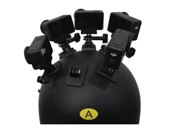</td>
<td style="text-align:center">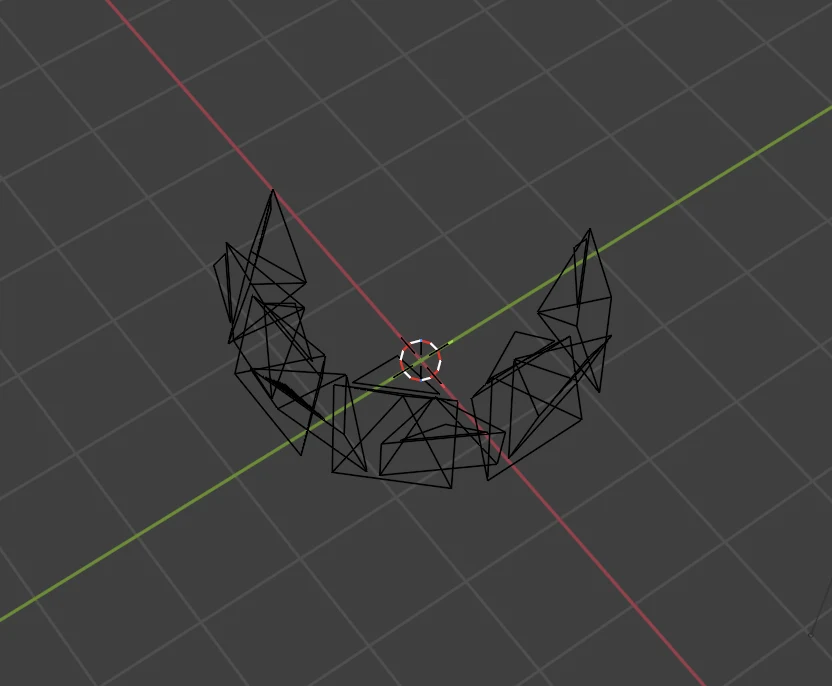</td>
</tr>
<tr>
<td style="text-align:center">헬멧 상단에 카메라 다중 배치</td>
<td style="text-align:center">9개 가상 카메라가 호 형태로 배열</td>
</tr>
</table>

### 5.2 논문 기법 적용

| 논문 기법 | 적용 여부 | 근거 |
|-----------|----------|------|
| 4.1 Calibration-Free 초기화 | 미적용 | Blender에서 Rig 상대 포즈가 사전 정의됨 |
| 4.2 경량화된 BA | 미적용 (COLMAP 대체) | COLMAP `--Mapper.ba_refine_*_from_rig=1` 옵션으로 Rig 제약 BA 수행 |
| 4.3 중복 제거 Gaussian | 구현 완료 | Section 6.2 참조 |
| 4.4 주파수 스케줄러 | 구현 완료 | Section 6.4 참조 |

---

## 6. 코드 수정 내역

### 6.0 수정한 Repository
- on-the-fly-nvs Repository를 fork 후 수정함.
- [on-the-fly-nvs-rig](https://github.com/kyowon1108/on-the-fly-nvs-rig)

### 6.1 수정된 파일 요약

| 파일 | 수정 내용 |
|------|----------|
| `dataloaders/image_dataset.py` | Multi-camera intrinsics 로딩, 하위 디렉토리 지원 |
| `scene/keyframe.py` | Per-camera intrinsics 저장, FOV 계산, PINHOLE 내보내기 |
| `scene/scene_model.py` | Per-keyframe FOV 렌더링, Inter-camera redundancy 제거 |
| `train.py` | Keyframe 생성 시 intrinsics 전달 |
| `utils.py` | 재귀적 이미지 디렉토리 탐색 |

### 6.2 핵심 구현: Inter-Camera Redundancy 제거

**논문 4.3절 구현** - 다른 카메라에서 이미 생성된 Gaussian과 중복되는 새 Gaussian 제거:

```python
# scene_model.py - add_new_gaussians()
current_camera_id = getattr(keyframe, 'camera_id', None)
if current_camera_id is not None and len(new_pts) > 0:
    # 다른 카메라의 최근 keyframe들에서 중복 체크
    for other_kf in other_camera_kfs[:3]:
        # 새 포인트를 다른 카메라 뷰로 투영
        pts_in_other = new_pts @ other_Rt[:3, :3].T + other_Rt[:3, 3]
        # 깊이 비교로 중복 판단 (5% 임계값)
        depth_diff = torch.abs(pts_depth - sampled_depth) / sampled_depth
        redundant = depth_diff < 0.05
    # 중복 Gaussian 제거
    if redundancy_mask.any():
        new_pts = new_pts[~redundancy_mask]
```

### 6.3 기존 핵심 파일 구조

| 파일 | 역할 |
|------|------|
| `train.py` | 학습 루프, keyframe 관리, 실시간 처리 파이프라인 |
| `scene/scene_model.py` | Gaussians, anchors, keyframes 통합 관리, 렌더링/최적화 |
| `scene/keyframe.py` | 카메라 파라미터, 이미지 피라미드, depth 추정 관리 |
| `scene/anchor.py` | Anchor offloading 로직 (GPU→CPU 메모리 이동) |

### 6.4 주파수 스케줄러 코드 수정

**수정된 파일:**

| 파일 | 수정 내용 |
|------|----------|
| `utils.py` | `compute_frequency_score()` 함수 추가 - 이미지 주파수 점수 계산 |
| `args.py` | 주파수 스케줄러 CLI 파라미터 추가 |
| `train.py` | `compute_adaptive_iterations()` 함수 및 스케줄러 통합 |
| `run_full_pipeline.py` | 주파수 스케줄러 파라미터 전달 |

**핵심 함수:**

```python
# utils.py - compute_frequency_score()
def compute_frequency_score(image: torch.Tensor) -> float:
    """이미지의 주파수 점수 계산 (고주파 = 높은 점수)"""
    gray = 0.299 * image[0] + 0.587 * image[1] + 0.114 * image[2]
    laplacian = torch.tensor([[0, 1, 0], [1, -4, 1], [0, 1, 0]],
                             device=image.device, dtype=image.dtype)
    laplacian = laplacian.unsqueeze(0).unsqueeze(0)
    gray_4d = gray.unsqueeze(0).unsqueeze(0)
    edges = F.conv2d(gray_4d, laplacian, padding=1)
    return edges.abs().mean().item()
```

```python
# train.py - compute_adaptive_iterations()
def compute_adaptive_iterations(freq_score, min_iters, max_iters, alpha):
    """주파수 점수 기반 적응형 반복 횟수 계산"""
    normalized = (freq_score - global_min) / (global_max - global_min + 1e-8)
    normalized = max(0.0, min(1.0, normalized))
    adaptive_iters = min_iters + (max_iters - min_iters) * (normalized ** alpha)
    return int(round(adaptive_iters))
```

**CLI 파라미터:**

| 파라미터 | 기본값 | 설명 |
|----------|--------|------|
| `--use_frequency_scheduler` | False | 주파수 스케줄러 활성화 |
| `--freq_min_iters` | 15 | 저주파 영역 최소 반복 횟수 |
| `--freq_max_iters` | 45 | 고주파 영역 최대 반복 횟수 |
| `--freq_alpha` | 1.0 | 스케줄링 커브 조정 (1.0=선형)  |

---

## 7. 실험 결과

### 7.1 환경 설정

| 항목 | 값 |
|------|---|
| 플랫폼 | Ubuntu 22.04.5 LTS |
| CPU | AMD Ryzen 7 7700 (8 core / 16 threads) |
| GPU | NVIDIA GeForce RTX 4060 Ti (16GB) |
| 카메라 | 9대 Rig (High 5 + Low 4) |
| 해상도 | 960×960 (downsampling 2 적용) |

### 7.2 실험 결과 (Frequency Scheduler ON)

| 항목 | 측정값 |
|------|--------|
| COLMAP 처리 이미지 | 414개 (100%) |
| COLMAP 시간 | **595.7초 (9.9분)** |
| NVS 등록 Keyframe | 334개 |
| 최종 Gaussian 수 | ~534,000개 |
| 생성된 Anchor 수 | 4개 |
| NVS 학습 시간 | **277.4초 (4.6분)** |
| 전체 파이프라인 시간 | **873.1초 (14.6분)** |
| 회전 오차 (R°) | 0.052° |
| 이동 오차 (t) | 0.0017 |
| Peak GPU Memory | **9,801 MB (9.57 GB)** |

### 7.3 GPU 메모리 사용량 (실측)

| 단계 | 최소 | 최대 | 비고 |
|------|------|------|------|
| COLMAP Feature Extraction | 479 MB | 3,431 MB | GPU 특징 추출 |
| COLMAP Matching/Mapper | 483 MB | 1,847 MB | 매칭 및 맵 생성 |
| NVS Training (초기) | 1,341 MB | 5,531 MB | Gaussian 초기화 |
| NVS Training (후반) | 8,549 MB | **9,801 MB** | Peak 메모리 도달 |

### 7.4 시간대별 GPU 메모리 추이 (실측)

<p align="center">
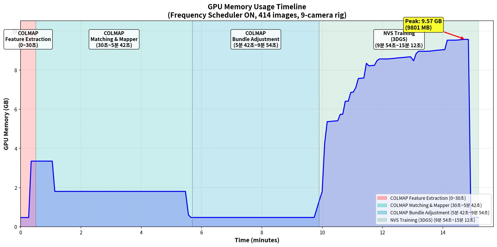
</p>

**단계별 요약:**
| 시간 | 단계 | GPU 메모리 | 비고 |
|------|------|-----------|------|
| 0~0.5분 | COLMAP Feature | 0.5 → 3.4 GB | GPU 특징 추출 |
| 0.5~5.7분 | COLMAP Matcher/BA | 1.8 GB | 매칭 및 번들 조정 |
| 5.7~9.9분 | COLMAP 완료 대기 | 0.5 GB | CPU 중심 처리 |
| 9.9~15분 | NVS Training | 1.3 → 9.8 GB | Gaussian 수 증가에 따른 메모리 상승 |

---

## 8. 정량적 평가

### 8.1 평가 방법

- **Test Set 분리**: `--test_hold 8` 옵션으로 매 8번째 이미지를 테스트셋으로 분리
- **테스트 이미지 수**: 52개 (414개 중 약 12.5%)
- **평가 지표**: PSNR, SSIM, LPIPS

### 8.2 평가 결과

| 지표 | 값 |
|------|-----|
| **PSNR** | 20.39 dB |
| **SSIM** | 0.636 |
| **LPIPS** | 0.356 |

**참고 (PostShot 3DGS 비교):**
| 방법 | PSNR | SSIM | LPIPS |
|------|------|------|-------|
| On-the-fly NVS (Rig) | 20.39 | 0.636 | 0.356 |
| PostShot (Rig, 260113) | 23.27 | 0.809 | 0.132 |

---

## 9. 정성적 평가

### 9.1 GT vs 렌더링 비교

> 좌 : Ground Truth (원본 이미지), 우 : On-the-fly NVS 렌더링 결과

#### High Camera 비교

| Camera | Frame 1 | Frame 2 |
|--------|---------|---------|
| High_Cam01 | 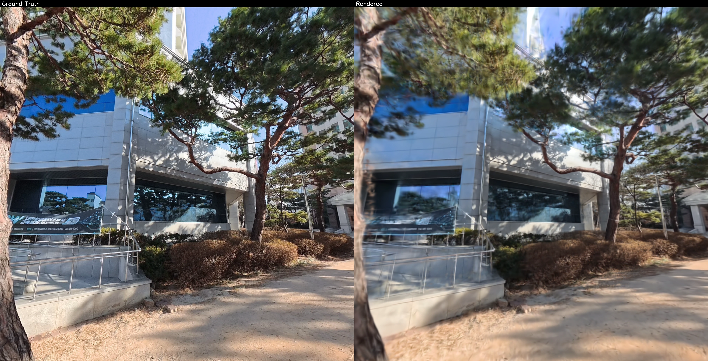 | 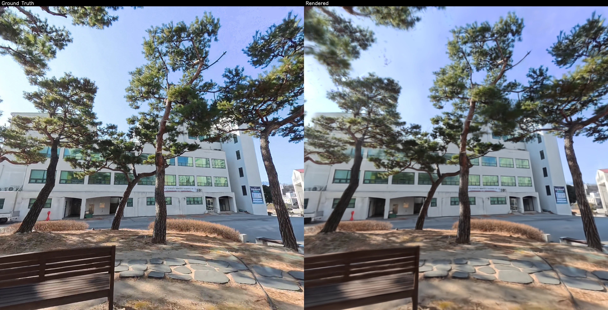 |
| High_Cam02 | 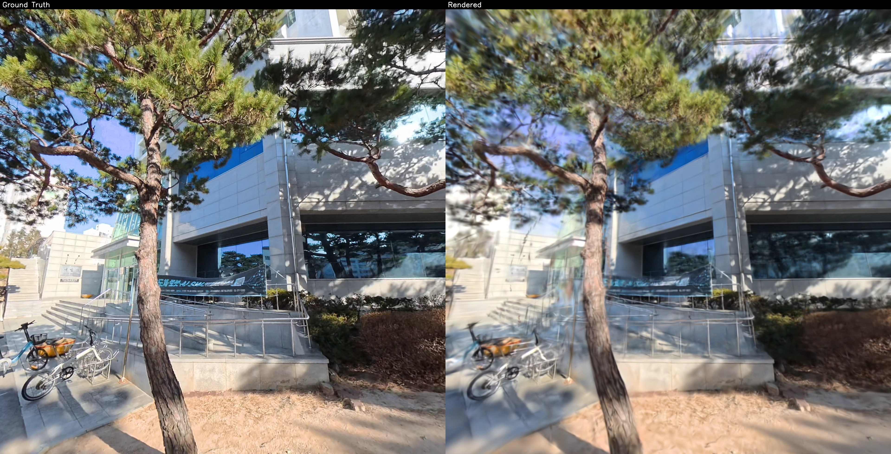 | 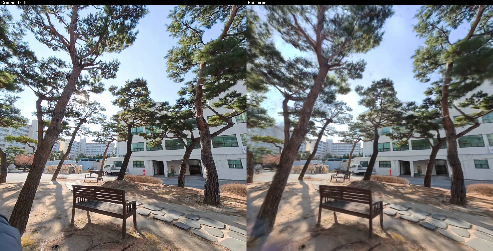 |
| High_Cam06 | 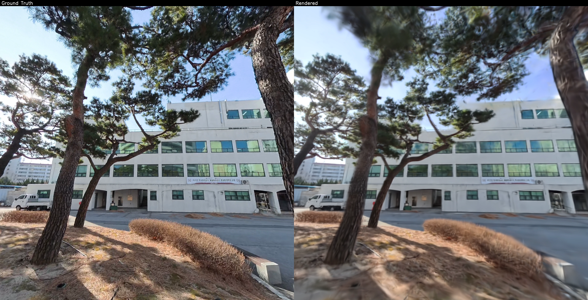 | 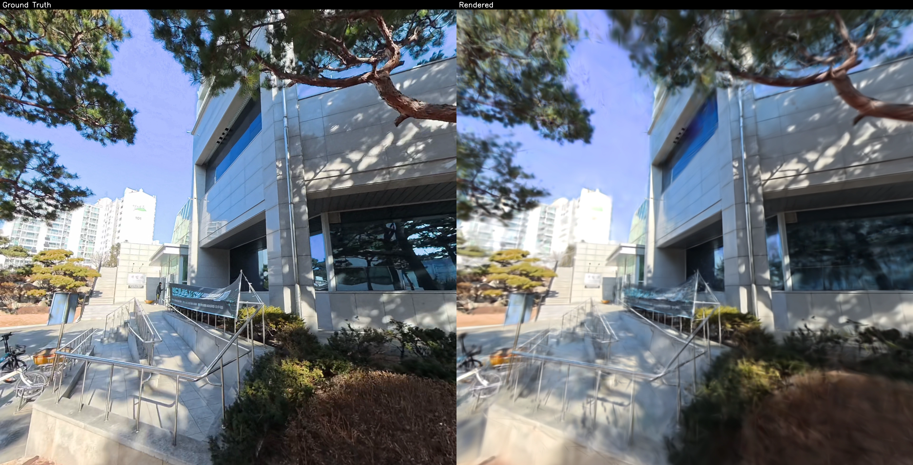 |
| High_Cam07 | 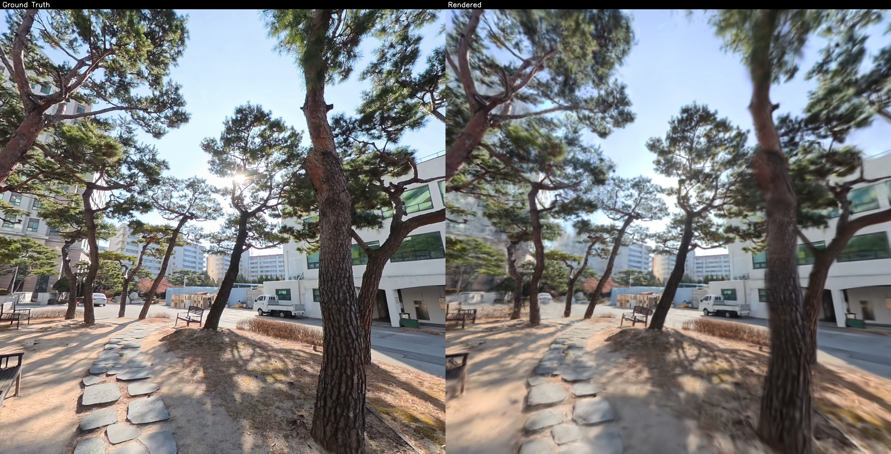 | 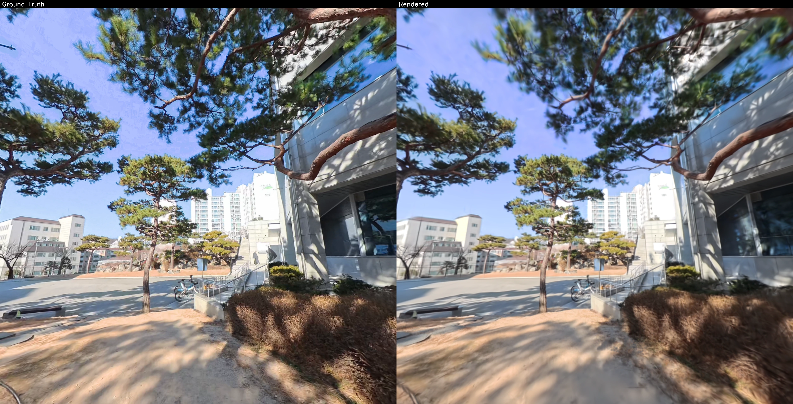 |
| High_Cam08 | 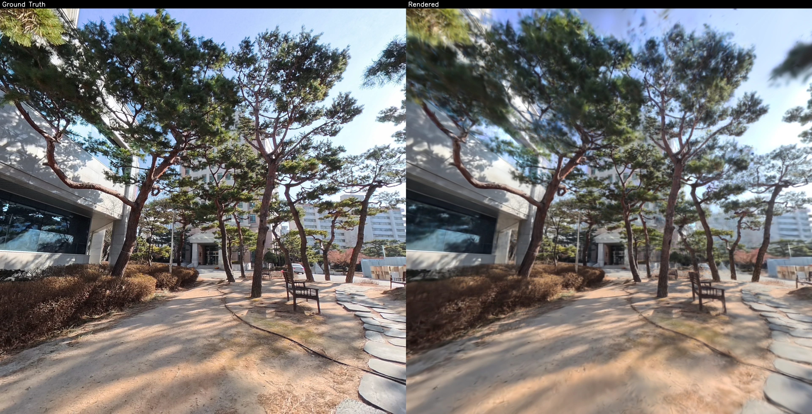 | 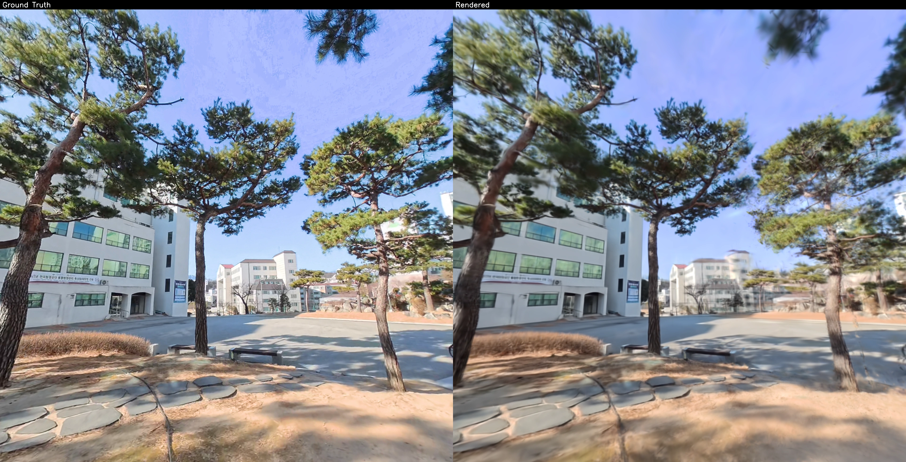 |

#### Low Camera 비교

| Camera | Frame 1 | Frame 2 |
|--------|---------|---------|
| Low_Cam01 | 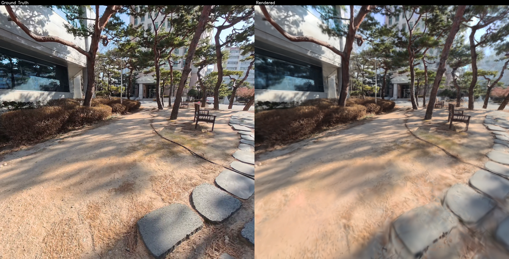 | 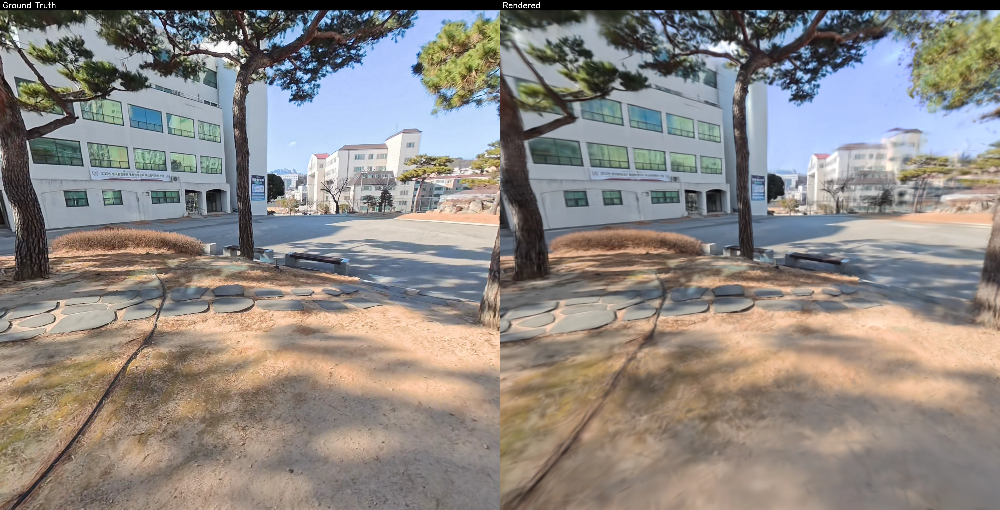 |
| Low_Cam02 | 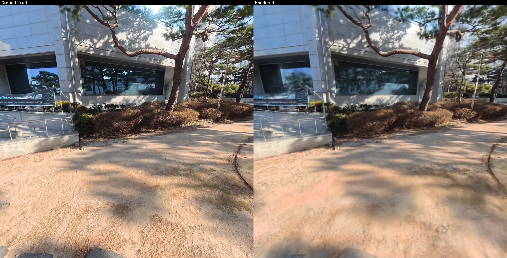 | 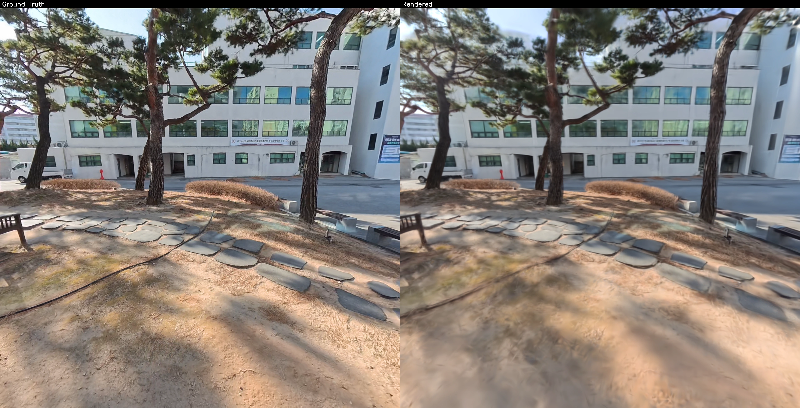 |
| Low_Cam07 | 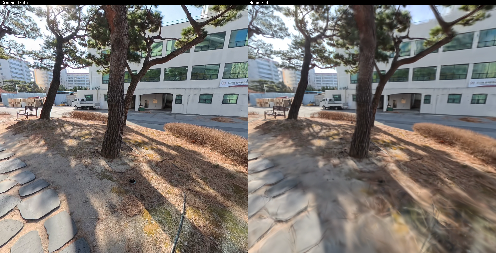 | 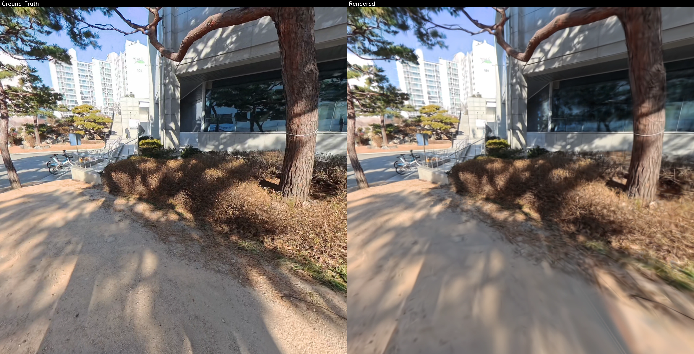 |
| Low_Cam08 | 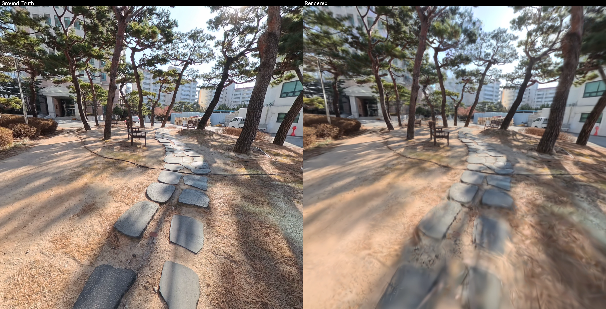 | 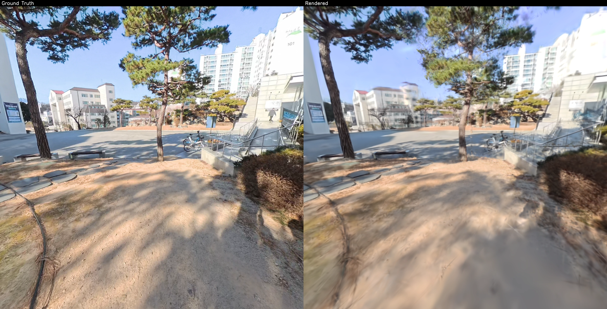 |

### 9.3 아티팩트 분석

| 항목 | 관찰 결과 |
|------|----------|
| **전체 재구성 품질** | 장면의 전반적인 구조는 잘 재구성됨 |
| **세부 표현력** | 텍스처, 엣지 등 디테일에서 블러 현상 관찰 |
| **색상 정확도** | GT 대비 색상은 대체로 유사하나 일부 영역에서 차이 존재 |
| **아티팩트** | 경계 영역에서 약간의 플로팅(floating) Gaussian 관찰 |
