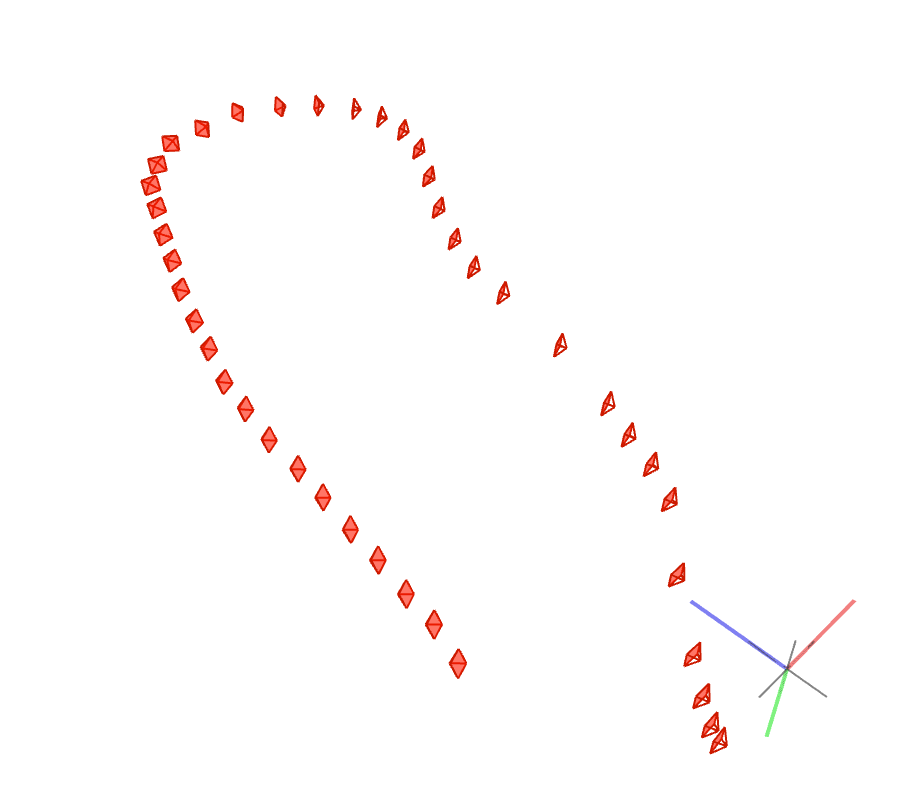

# On-the-fly NVS Multi-camera Rig 성능 분석

## 1. 배경 및 목적

260119 실험에서 On-the-fly NVS를 Multi-camera Rig에 적용하여 기본 파이프라인을 구축함.

| 항목 | 260119 결과 |
|------|-------------|
| 파이프라인 | COLMAP Rig SfM → On-the-fly NVS |
| Rig 구성 | 9대 카메라 (High 5 + Low 4) |
| 해상도 | 960×960 (downsampling 2) |
| 전체 시간 | 14.6분 (COLMAP 9.9분 + NVS 4.6분) |

**목표**
1. **핵심 기법 기여도 분석**: Inter-camera redundancy elimination과 Frequency-aware scheduler의 개별/조합 효과 검증
2. **실시간 스트리밍 구현 방안**: Insta360 X5 SDK 기반 EQR → Virtual Pinhole 변환 아키텍처 설계

참고 문헌: [On-the-fly 3D Reconstruction from Multi-Camera Rigs (arXiv:2512.08498)](https://arxiv.org/pdf/2512.08498)

---

## 2. Ablation Study 결과

### 2.1 실험 환경

| 항목 | 값 |
|------|---|
| GPU | RTX 4060 Ti 16GB |
| 데이터셋 | 9-camera Rig (960×960) |
| 테스트 이미지 | 52개 (test_hold=8) |
| 평가 지표 | PSNR, SSIM, LPIPS |

### 2.2 실험 설계

| 실험 ID | 중복 제거 | 스케줄러 | 설명 |
|---------|----------|---------|------|
| A | OFF | OFF | 바닐라 baseline |
| B | ON | OFF | 중복 제거만 적용 |
| C | OFF | ON | 스케줄러만 적용 |
| D | ON | ON | 전체 적용 |

### 2.3 정량적 비교

| 설정 | PSNR↑ | SSIM↑ | LPIPS↓ | 시간(s) | Peak GPU | 메모리 변화 |
|------|-------|-------|--------|---------|----------|-------------|
| **A (Vanilla)** | **20.62** | **0.645** | **0.345** | 220.7 | 10.27 GB | baseline |
| B (Redundancy) | 20.15 | 0.621 | 0.365 | 214.7 | 9.96 GB | -3.0% |
| C (Scheduler) | 19.31 | 0.612 | 0.358 | 290.0 | 10.98 GB | +6.9% |
| D (Full) | 20.01 | 0.620 | 0.359 | 287.4 | **9.63 GB** | **-6.2%** |
| PostShot (참고) | 23.27 | 0.809 | 0.132 | ~22min | - | - |

**분석**
- **Redundancy removal (B, D)**: 중복 제거로 Peak 메모리 3~6% 감소
- **Scheduler (C)**: 고주파 집중 학습으로 Peak 메모리 7% 증가
- **Full (D)**: 최소 메모리 + 최고 효율성 (2.08 PSNR/GB)

### 2.4 Densification 전략

On-the-fly NVS는 **clone/split 없이** 다음 전략 사용:

| 전략 | 방법 | 임계값 |
|------|------|--------|
| **Gaussian 추가** | Laplacian 기반 확률 + Guided Stereo Depth | init_proba_scaler=2.0 |
| **Opacity Pruning** | 낮은 opacity Gaussian 제거 | opacity > 0.05 |
| **Screen Size Pruning** | 화면상 큰 Gaussian 제거 | screen_size < 0.5×width |
| **Anchor Merging** | 작은 Gaussian k-NN 병합 | small_prop > 40% |

### 2.5 정성적 비교

> GT | A(Vanilla) | B(Redundancy) | C(Scheduler) | D(Full) 순서로 비교

#### High Camera

| View | Ablation 비교 (GT, A, B, C, D) |
|------|-------------------------------|
| High_Cam01 Frame 1 |  |
| High_Cam01 Frame 2 |  |
| High_Cam08 Frame 1 |  |

#### Low Camera

| View | Ablation 비교 (GT, A, B, C, D) |
|------|-------------------------------|
| Low_Cam01 Frame 1 |  |

**관찰 결과:**
- 육안으로는 A, B, C, D 간 큰 차이가 보이지 않음
- 정량적 지표에서 A(Vanilla)가 가장 좋은 수치를 기록
- GT 대비 전체적으로 블러링과 세부 디테일 손실 관찰

---

## 3. 멀티뷰 Leveraging 실험 및 평가

### 3.1 목표
- **각 frame의 view에서 실시간 camera reconstruction을 leveraging 할 수 있는 방안**이 있는가?

### 3.2 진행 방향

원칙을 다음과 같이 설정하고 실험을 진행함:

1. **기본 루프는 Central-only** - 실시간성이 핵심이므로 비용이 큰 기능은 제외
2. **Coverage는 조건부 보조 루프** - 맵 확장 기능, 항상 켜는 기능이 아님
3. **멀티뷰의 목적은 포즈 안정화** - Central이 약할 때 다른 view가 보완
4. **효율화는 camera subset 기반** - 모든 view를 매 프레임 사용하지 않음

**실험 순서:**
```
Central-only Baseline → Coverage Extension → Multiview Pose Logging → Timing 분석
```

### 3.3 실험 결과

#### 3.3.1 Central-only Baseline
| 항목 | 결과 |
|------|------|
| Gaussians | 588,731 |
| FPS | 1.691 |
| Time | 27.2s |
| PSNR | 18.197 |
| SSIM | 0.587 |
| LPIPS | 0.376 |



#### 3.3.2 Coverage Extension (멀티뷰로 맵 확장)
| 항목 | Central-only | Coverage | 변화 |
|------|--------------|----------|------|
| Gaussians | 588,731 | 544,948 | -7.4% |
| FPS | 1.691 | 0.761 | **-55%** |
| Time | 27.2s | 60.5s | **+122%** |
| PSNR | 18.197 | 15.551 | **-2.6 dB** |
| SSIM | 0.587 | 0.492 | **-16%** |
| LPIPS | 0.376 | 0.438 | **+16%** |


**결과: 품질 악화, 속도 악화 - 완전 실패**

#### 3.3.3 Multiview Pose Logging (포즈 안정화)
- High_Cam07이 Central 실패 시 보조 가능 확인
- 하지만 threshold 고정 재비교에서:
  - rig pose: recovery gain **-48.03** (음수)
  - 멀티뷰 추가 시 오히려 악화

### 3.4 평가 - 증명 실패

| 질문 | 결과 |
|------|------|
| EQR → Virtual Pinhole이 interactive time에 가능한가? | 가능함(1.1ms) |
| 실시간 camera reconstruction이 가능한가? | 가능함(580ms (Central-only)) |
| **멀티뷰가 실시간 reconstruction을 leverage할 수 있는가?** | **실패** |

**멀티뷰 Leveraging 시도 결과**
| 방법 | 의도 | 결과 |
|------|------|------|
| Coverage Extension | 맵 확장 | 품질/속도 모두 악화 |
| Multiview Pose | 포즈 안정화 | recovery gain 음수 |

### 3.5 의도와 결과의 차이

**원래 의도**
> 9개 카메라를 활용하여 실시간 3D 재구성의 품질 또는 안정성을 향상

**실제 결과**
> Central-only가 최선. 나머지 8개 카메라는 오히려 성능을 악화시킴.

**괴리 원인 : Rotation-only 데이터의 근본 한계 (추정)**

Insta360 X5의 9개 Virtual Pinhole 카메라는
- **같은 위치**에서 **회전만 다름** (baseline ≈ 0)
- 멀티뷰 기하학의 핵심인 **삼각측량 이득이 없음**
- 동일 3D 점을 여러 각도에서 보지만, **깊이 추정에 기여하지 못함**

논문(arXiv:2512.08498)의 multi-camera rig는
- 물리적으로 분리된 카메라들 (baseline 존재)
- 멀티뷰가 깊이/표면 추정에 실제로 기여

---

## 4. 논문 Limitation (arXiv:2512.08498)

| 한계 | 설명 | 우리 시스템 영향 |
|------|------|------------------|
| **순차 입력 필수** | 이미지 재정렬 불가, >2/3 오버랩 필요 | 360 카메라는 연속 프레임이므로 만족 |
| **충분한 이동 필요** | 순수 회전만으로는 triangulation 불가 | 카메라 이동이 필요 |
| **Pinhole 모델만** | Fisheye/왜곡 미지원, focal length만 최적화 | EQR→Pinhole 변환 후 사용 |
| **Loop Closure 미지원** | 누적 drift 보정 없음 | 대규모 순환 궤적에서 오차 누적 |
| **해상도 제약** | 1-2MP 범위에서 최적 | 960×960은 적합 |
