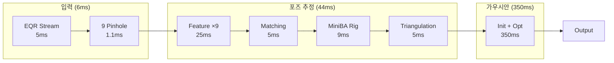
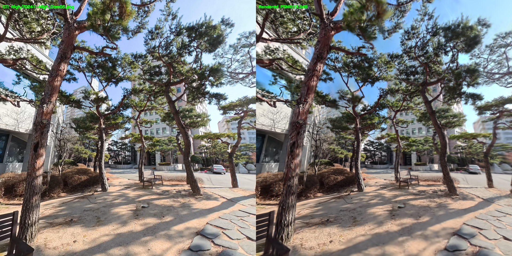
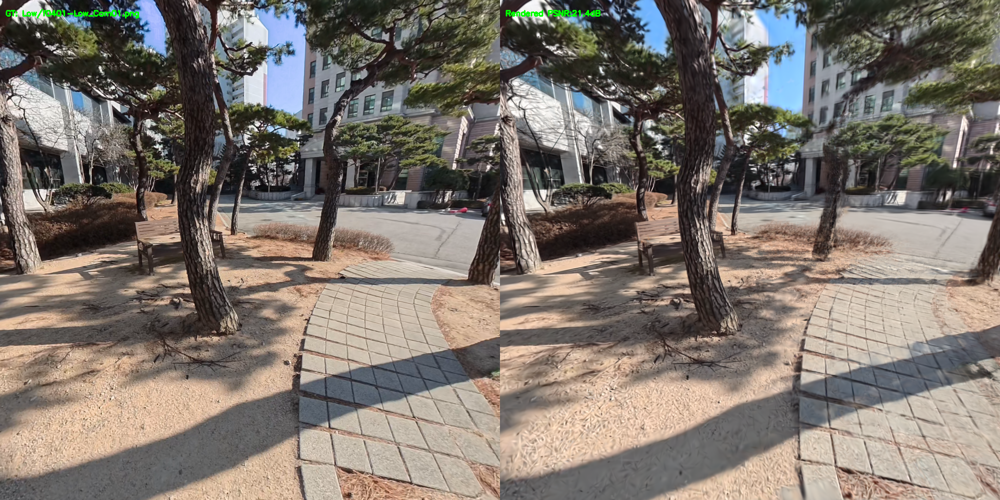
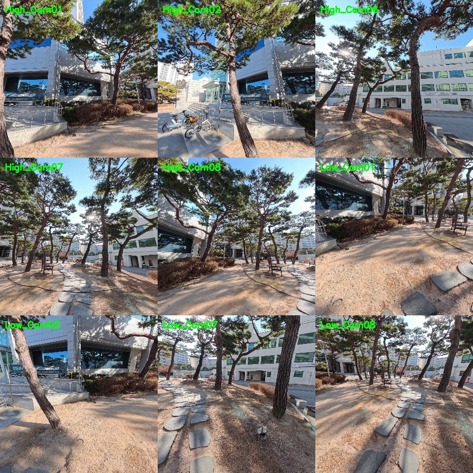

# On-the-fly NVS Multi-camera Rig 성능 분석

## 1. 배경 및 목적

260119 실험에서 On-the-fly NVS를 Multi-camera Rig에 적용하여 기본 파이프라인을 구축함.

| 항목 | 260119 결과 |
|------|-------------|
| 파이프라인 | COLMAP Rig SfM → On-the-fly NVS |
| Rig 구성 | 9대 카메라 (High 5 + Low 4) |
| 해상도 | 960×960 (downsampling 2) |
| 전체 시간 | 14.6분 (COLMAP 9.9분 + NVS 4.6분) |

**목표**
1. **핵심 기법 기여도 분석**: Inter-camera redundancy elimination과 Frequency-aware scheduler의 개별/조합 효과 검증
2. **실시간 스트리밍 구현 방안**: Insta360 X5 SDK 기반 EQR → Virtual Pinhole 변환 아키텍처 설계

참고 문헌: [On-the-fly 3D Reconstruction from Multi-Camera Rigs (arXiv:2512.08498)](https://arxiv.org/pdf/2512.08498)

---

## 2. Ablation Study 결과

### 2.1 실험 환경

| 항목 | 값 |
|------|---|
| GPU | RTX 4060 Ti 16GB |
| 데이터셋 | 9-camera Rig (960×960) |
| 테스트 이미지 | 52개 (test_hold=8) |
| 평가 지표 | PSNR, SSIM, LPIPS |

### 2.2 실험 설계

| 실험 ID | 중복 제거 | 스케줄러 | 설명 |
|---------|----------|---------|------|
| A | OFF | OFF | 바닐라 baseline |
| B | ON | OFF | 중복 제거만 적용 |
| C | OFF | ON | 스케줄러만 적용 |
| D | ON | ON | 전체 적용 |

### 2.3 정량적 비교

| 설정 | PSNR↑ | SSIM↑ | LPIPS↓ | 시간(s) | Peak GPU | 메모리 변화 |
|------|-------|-------|--------|---------|----------|-------------|
| **A (Vanilla)** | **20.62** | **0.645** | **0.345** | 220.7 | 10.27 GB | baseline |
| B (Redundancy) | 20.15 | 0.621 | 0.365 | 214.7 | 9.96 GB | -3.0% |
| C (Scheduler) | 19.31 | 0.612 | 0.358 | 290.0 | 10.98 GB | +6.9% |
| D (Full) | 20.01 | 0.620 | 0.359 | 287.4 | **9.63 GB** | **-6.2%** |
| PostShot (참고) | 23.27 | 0.809 | 0.132 | ~22min | - | - |

**분석**
- **Redundancy removal (B, D)**: 중복 제거로 Peak 메모리 3~6% 감소
- **Scheduler (C)**: 고주파 집중 학습으로 Peak 메모리 7% 증가
- **Full (D)**: 최소 메모리 + 최고 효율성 (2.08 PSNR/GB)

### 2.4 Densification 전략

On-the-fly NVS는 **clone/split 없이** 다음 전략 사용:

| 전략 | 방법 | 임계값 |
|------|------|--------|
| **Gaussian 추가** | Laplacian 기반 확률 + Guided Stereo Depth | init_proba_scaler=2.0 |
| **Opacity Pruning** | 낮은 opacity Gaussian 제거 | opacity > 0.05 |
| **Screen Size Pruning** | 화면상 큰 Gaussian 제거 | screen_size < 0.5×width |
| **Anchor Merging** | 작은 Gaussian k-NN 병합 | small_prop > 40% |

### 2.5 정성적 비교

> GT | A(Vanilla) | B(Redundancy) | C(Scheduler) | D(Full) 순서로 비교

#### High Camera

| View | Ablation 비교 (GT, A, B, C, D) |
|------|-------------------------------|
| High_Cam01 Frame 1 |  |
| High_Cam01 Frame 2 |  |
| High_Cam08 Frame 1 |  |

#### Low Camera

| View | Ablation 비교 (GT, A, B, C, D) |
|------|-------------------------------|
| Low_Cam01 Frame 1 |  |

**관찰 결과:**
- 육안으로는 A, B, C, D 간 큰 차이가 보이지 않음
- 정량적 지표에서 A(Vanilla)가 가장 좋은 수치를 기록
- GT 대비 전체적으로 블러링과 세부 디테일 손실 관찰

---

## 3. 실시간 파이프라인 설계

### 3.1 핵심 아이디어

On-the-fly NVS의 핵심은 **실시간 camera reconstruction**이며, 360 카메라 환경 적용 접근:

1. **EQR 스트리밍 수신** → Insta360에서 실시간 EQR 프레임 획득
2. **Virtual Pinhole 생성** → EQR → 9개 pinhole 이미지 변환
3. **실시간 Reconstruction** → 각 프레임 view에서 pose 추정 + Gaussian 업데이트

### 3.2 파이프라인 타이밍

**Total: ~400ms (동기) → Keyframe 기반 1-6 FPS 운영**

### 3.3 단계별 처리 시간 (RTX 4060 Ti 16GB 실측)

| 단계 | 처리 시간 | 비고 |
|------|----------|------|
| SDK 수신 + 디코딩 | 5 ms | H.265 하드웨어 디코딩 |
| EQR → Pinhole (9개) | 1.1 ms | GPU grid_sample |
| XFeat 특징 추출 (×9) | 25 ms | 2.79ms × 9 카메라 |
| Feature Matching | 5 ms | GPU 가속 |
| MiniBA Bootstrap | 956 ms | 최초 8프레임만 |
| MiniBA Incremental (Rig) | 9 ms | Central cam만 최적화 |
| Triangulation | 5 ms | |
| Gaussian Init + Opt | 350 ms | 30 iters 기준 |
| **Total (Incremental)** | ~400 ms | **Keyframe 기반 운영** |

### 3.4 Insta360 X5 맞춤 전략

| 전략 | 설명 |
|------|------|
| **A: Sequential** | 프레임별 9개 카메라를 하나로 취급, 중앙 카메라 pose 추정 |
| **B: Rig-Constrained** | 중앙 카메라만 최적화, 나머지는 상대 변환 적용 (변수 9배 감소) |
| **C: Multi-frame** | Frame t + t+1의 18개 view로 triangulation (Baseline 확보) |

**360 카메라 특수성 (현재 상황)**:
- 상대 pose 사전 정의 → Calibration-free
- 단일 지점 촬영 → Temporal baseline 필수

### 3.5 기준 카메라 선정

논문 방법론(pairwise feature distance 합 최소)에 따라 **High_Cam08 (315°)** 선정. 중앙 카메라로서 Rig Constraint 최적화의 기준점 역할.

### 3.6 실시간 가능성 평가

**실험 환경**: saebit.mp4 → 46 프레임 × 9 카메라 = 414 이미지, 960×960

| 입력 FPS | 시간 예산 | 처리 시간 | 여유 | 실시간 여부 |
|----------|----------|----------|------|------------|
| **1 FPS** | 1000 ms | 400 ms | **600 ms** | 동기 처리 가능 |
| 3 FPS | 333 ms | 400 ms | -67 ms | Async 필요 |
| 6 FPS | 166 ms | 400 ms | -234 ms | Async 필수 |

### 3.7 정성적 평가 결과

| 메트릭 | 값 |
|--------|-----|
| **Average PSNR** | 17.80 dB |
| **Max PSNR** | 21.42 dB |
| **SSIM** | 0.541 |
| **LPIPS** | 0.391 |

| Frame | 비교 (GT \| Rendered) |
|-------|-------------------------|
| High_f0241-High_Cam08 |  |
| Low_f0401-Low_Cam01 |  |

### 3.8 결론

> **1 FPS SDK 스트리밍 입력 시 실시간 3D 재구성 가능**
> - 처리 시간 400ms < 시간 예산 1000ms (60% 여유)
> - COLMAP 없이 MiniBA + Rig Constraint로 실시간 pose 추정
> - Keyframe 기반 운영으로 1-6 FPS 재구성 가능

### 3.9 참고 이미지

**EQR → 9 Virtual Pinhole 변환**

---

## 4. 논문 Limitation (arXiv:2512.08498)

| 한계 | 설명 | 우리 시스템 영향 |
|------|------|------------------|
| **순차 입력 필수** | 이미지 재정렬 불가, >2/3 오버랩 필요 | 360 카메라는 연속 프레임이므로 만족 |
| **충분한 이동 필요** | 순수 회전만으로는 triangulation 불가 | 카메라 이동이 필요 |
| **Pinhole 모델만** | Fisheye/왜곡 미지원, focal length만 최적화 | EQR→Pinhole 변환 후 사용 |
| **Loop Closure 미지원** | 누적 drift 보정 없음 | 대규모 순환 궤적에서 오차 누적 |
| **해상도 제약** | 1-2MP 범위에서 최적 | 960×960은 적합 |
