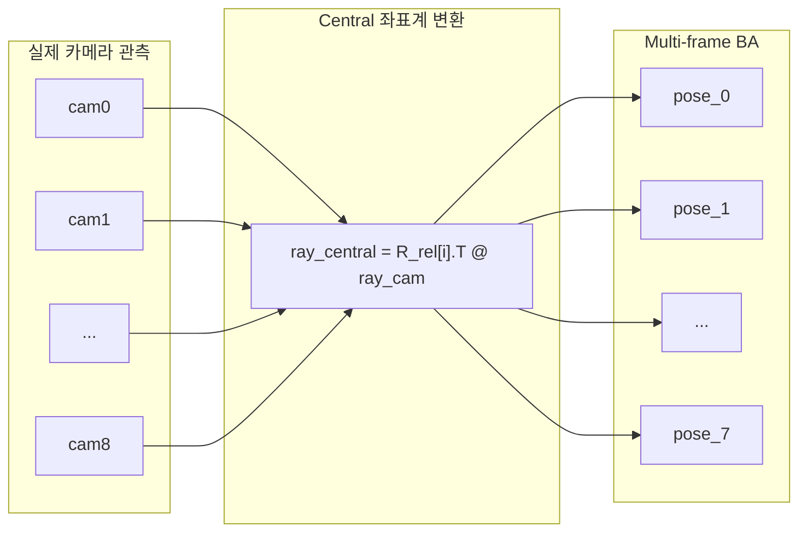
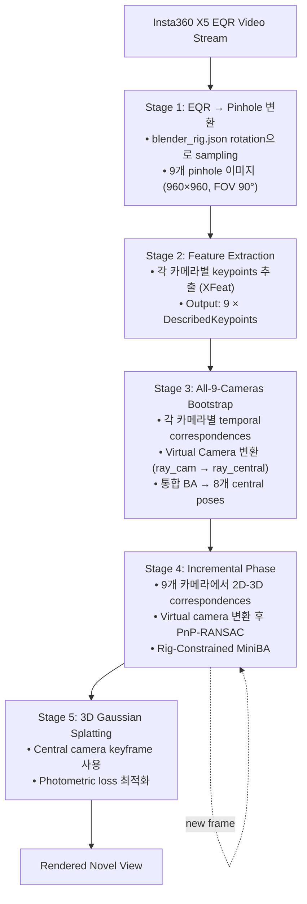

# Rig-Aware All-9-Cameras Bootstrap 구현 설계

## 1. 배경 및 문제 정의

### 1.1 260123 원인 분석

**Rotation-only Rig의 특성 때문에 수행 불가**

| 특성 | 의미 |
|------|------|
| 같은 위치, 다른 방향 | 공간적 baseline 없음 (baseline ≈ 0) |
| 삼각측량 불가 | 같은 frame 내 depth 정보 획득 불가 |
| 멀티뷰 기하학 이득 없음 | 동일 3D 점을 여러 각도에서 보지만 깊이 추정에 기여 못함 |

**논문(arXiv:2512.08498)과의 차이**

| 논문 가정 | 현재 데이터 | 차이점 분석 |
|----------|------------|-------------|
| 물리적 분리 카메라 (baseline 존재) | Rotation-only rig (baseline ≈ 0) | 같은 frame 내 triangulation 불가 |
| Inter-camera stereo 가능 | Inter-camera stereo 불가 | Temporal baseline만 활용 가능 |
| 1개 카메라 pose → 나머지 유도 | 동일 적용 가능 (rig constraint) | R_i = R_rel_i × R_central |

### 1.2 All-9-Cameras Bootstrap 접근법

| 항목 | 값 |
|------|---|
| Bootstrap 정보량 | 72 views (9 cams × 8 frames) |
| Observations | ~36,000 (frame당 ~4,500) |
| Baseline 활용 | Temporal baseline (frame 간 이동) |
| 학술적 근거 | BundledSLAM, MultiCol BA 방식 |

---

## 2. All-9-Cameras Bootstrap 설계

### 2.1 Virtual Camera 패러다임

**BundledSLAM (arXiv:2403.19886) 인용**
> "We introduce the concept of representing multiple cameras with a virtual camera, achieving pose estimation for multiple camera systems using this approach."

- 모든 물리적 카메라의 observations을 **central camera 좌표계**로 변환
- 각 카메라의 ray를 central 좌표계로 재투영
- Central camera의 **8개 frame poses**를 최적화하는 BA 수행

### 2.2 All-9-Cameras 접근법의 이점

| 이점 | 설명 |
|------|------|
| **정보 최대화** | 9배 더 많은 observations |
| **Robustness 향상** | 한 카메라의 bad feature가 전체에 영향 적음 |
| **Coverage 확대** | 360° 전체 관측 |
| **학술적 표준** | COLMAP, BundledSLAM 동일 접근법 |

### 2.3 학술적 근거

**BundledSLAM (arXiv:2403.19886)의 적용 근거**

| BundledSLAM 특성 | 현재 상황 적합성 |
|------------------|-----------------|
| Virtual camera로 multi-cam 통합 | Rotation-only에도 적용 가능 |
| 모든 카메라 observation 활용 | 정보량 9× 증가 |
| Central 좌표계로 ray 재투영 | ray_central = R_rel[i].T @ ray_cam |

**MultiCol Bundle Adjustment (IJCV 2016)**
> "We extend the common collinearity equations with a general camera model and include the relative orientation of each camera w.r.t to the fixed multi-camera system frame."

---

## 3. 프로세스 플로우

### 3.1 전체 파이프라인

| Stage | 입력 | 처리 | 출력 |
|-------|------|------|------|
| 1 | EQR 8K | 9개 pinhole 변환 | 960×960 × 9 |
| 2 | 9 images | Feature extraction (XFeat) | 9 × DescribedKeypoints |
| 3 | 9 cams × 8 frames | Virtual Camera Bootstrap | 8 central poses |
| 4 | New frame | All-cam PnP → Central pose | Central pose |
| 5 | Central keyframes | 3DGS optimization | Rendered view |

### 3.2 상세 플로우

---

## 4. 참고문헌

1. **BundledSLAM** (arXiv:2403.19886)
   - Virtual camera 개념
   - https://arxiv.org/abs/2403.19886

2. **MultiCol Bundle Adjustment** (IJCV 2016)
   - Generalized camera model
   - Urban & Jutzi

3. **On-the-fly NVS** (arXiv:2512.08498)
   - 기본 파이프라인
   - https://arxiv.org/abs/2512.08498

4. **COLMAP Rig BA**
   - Rig constraint 구현 참고
   - https://colmap.github.io/rigs.html
