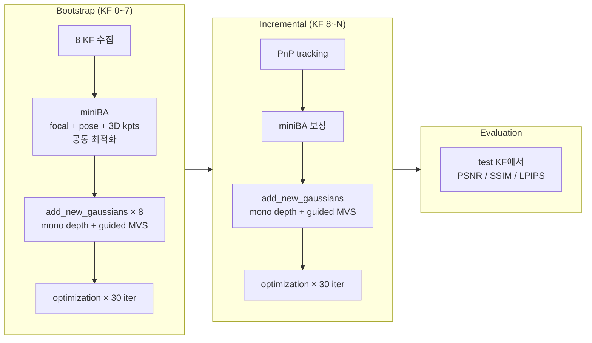
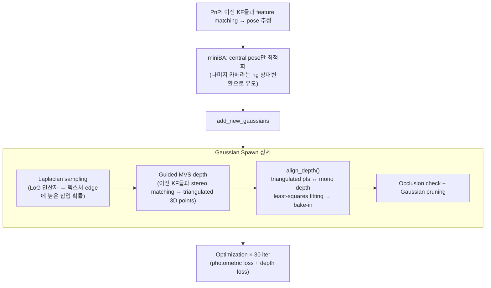
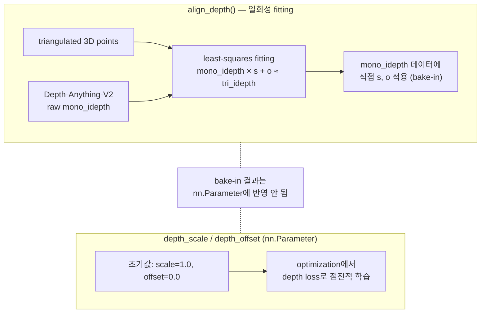
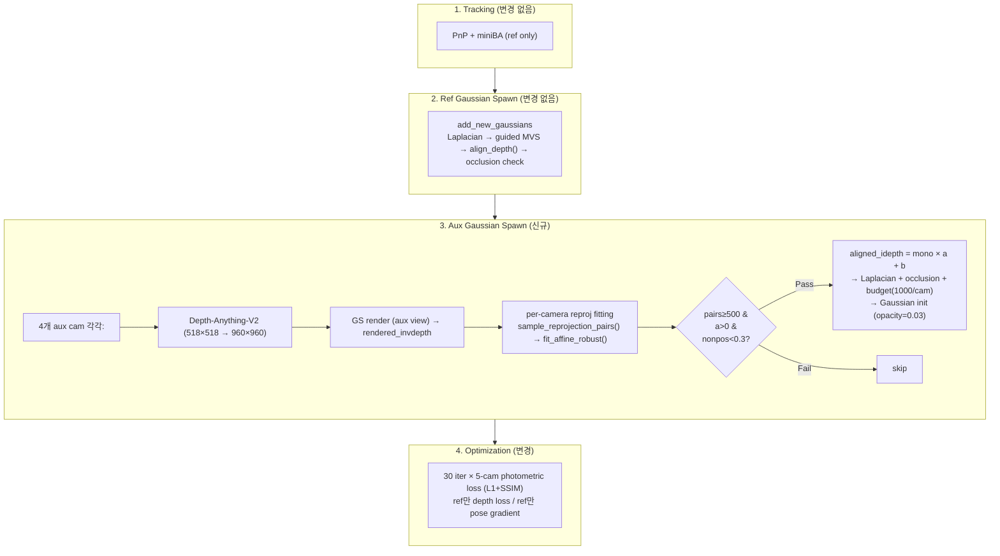
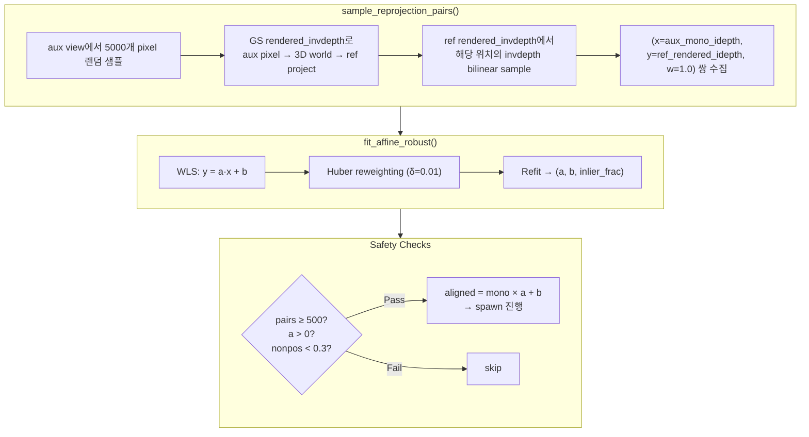

# On-the-fly NVS Multiview Gaussian Spawning

## Part 1: 원본 On-the-fly NVS 파이프라인

### 1.1 전체 구조

([arXiv:2512.08498](https://arxiv.org/pdf/2512.08498) 기반 파이프라인) 단일 ref camera 비디오 스트림에서 실시간으로 3DGS scene을 구축함.

### 1.2 Bootstrap

초기 8 프레임을 수집해서 miniBA로 focal, pose, 3D keypoints를 공동 최적화함. 그 후 각 keyframe마다 `add_new_gaussians`로 초기 Gaussian scene을 생성함.

### 1.3 Incremental

매 keyframe마다 아래 순서를 반복함:

### 1.4 align_depth() 메커니즘

mono depth(Depth-Anything-V2)는 상대적 inverse depth만 출력하므로 절대 스케일 정렬이 필요함.

bake-in 결과와 nn.Parameter가 구조적으로 분리되어 있음. 이 특성이 aux camera depth alignment 시 문제를 일으켰음 (Part 2 참조).

### 1.5 논문 rig vs 현재 데이터

현재 데이터는 Insta360 X5 360 영상을 Blender 360 Extractor로 5개 virtual pinhole camera로 추출한 것임. 논문의 물리적 rig과 근본적으로 다름.

| 항목 | 논문 ([arXiv:2512.08498](https://arxiv.org/pdf/2512.08498)) | 현재 데이터 |
|------|------------------------|------------|
| Rig 형태 | 물리적 하드웨어 (헬멧 마운트) | 가상 pinhole 배열 |
| Baseline | 수 cm~수십 cm | ≈ 0 (rotation-only) |
| 삼각측량 | 동일 프레임 내 카메라 간 가능 | 불가 (temporal만 가능) |
| 캘리브레이션 | Calibration-free (자동 추정) | `blender_rig.json`에 사전 정의 |
| 카메라 수 | 3~9대 | 5대 (High_Cam06/07/08, Low_Cam07/08) |
| Focal length | miniBA에서 최적화 | 480.0 고정 |

rotation-only rig이므로 baseline ≈ 0이고, 동일 프레임 내 카메라 간 삼각측량이 불가능함. temporal baseline(촬영자 보행)에만 의존함.

---

## Part 2: 변경한 파이프라인

### 2.1 변경된 Incremental 흐름

원본 대비 달라진 부분

| 항목 | 원본 | 변경 후 |
|------|------|--------|
| Optimization loss | ref 1-cam photometric loss | 5-cam photometric loss (L1 + SSIM) |
| Gaussian spawn | ref camera만 | ref + aux 4대 (KF 8~ 활성화) |
| Aux depth alignment | 해당 없음 | per-camera reprojection fitting |

### 2.2 Aux Gaussian Spawning

aux camera 4대(High_Cam06/08, Low_Cam07/08)에서 Gaussian을 추가 spawn함. `multiview_spawn_warmup=8` 이후(KF 8~)부터 활성화됨. bootstrap 구간에서는 pose가 불안정해서 비활성화한 것임.

aux camera는 ref와 optical center가 같으므로(rotation-only rig) guided MVS를 쓸 수 없음. mono depth만 사용함.

### 2.3 Per-Camera Reprojection Depth Alignment

aux의 mono depth를 절대 스케일로 정렬하기 위해 per-camera 독립 affine fitting을 수행함.

ref에서는 `align_depth()`가 triangulated points를 기준으로 fitting하지만, aux에서는 triangulated points가 없음 (baseline ≈ 0이므로). 대신 GS rendered depth를 매개로 aux↔ref 대응점을 수집함.

safety check를 통과하지 못하면 해당 camera/KF에서는 spawn하지 않음. 이 skip 메커니즘이 불확실한 fitting을 자연 차단해서 잘못된 Gaussian이 대량 생성되는 것을 방지함.

이 방식에 도달하기까지 두 번의 시행착오가 있었음:
1. **첫 시도**: aux에 depth_scale/depth_offset nn.Parameter를 그대로 읽었는데, bake-in과 분리된 구조 때문에 초기값(1.0, 0.0) 그대로 적용되어 사실상 정렬이 안 되었음
2. **두 번째 시도**: ref의 fitted scale/offset을 aux에 공유했는데, Depth-Anything-V2의 per-image normalization이 카메라마다 달라서 pixel-wise depth가 부정확해짐. 필터 통과율이 급증하면서 잘못된 위치에 ~120K개가 spawn되어 오히려 PSNR이 -0.86 악화되었음

per-camera reprojection fitting은 카메라별로 독립된 (a, b)를 추정하므로 이 문제가 해소되었음.

---

## Part 3: 평가

### 3.1 정량 비교

| Metric | 원본 (ref-only) | **최종 (multiview spawn)** |
|--------|----------------|--------------------------|
| PSNR | 16.686 | **17.331** (+0.645) |
| SSIM | 0.505 | **0.528** (+0.023) |
| LPIPS | 0.437 | **0.423** (-0.014) |
| Gaussians | 740,626 | 720,861 |
| Time (s) | 28.60 | 129.34 |

시간이 28s → 129s로 늘어난 건 5-cam rendering + aux depth fitting + aux spawning 오버헤드 때문임.

### 3.2 Per-Camera Fitting 통계

| Camera | 성공/전체 | skip률 | a (median±std) | b (median±std) | pairs (median) | 총 spawned |
|--------|---------|--------|---------------|---------------|---------------|-----------|
| High_Cam06 | 10/26 | 62% | 0.396±0.190 | 1.633±0.408 | 1,687 | 10,000 |
| High_Cam08 | 18/21 | 14% | 0.245±0.169 | 1.031±0.314 | 4,232 | 17,316 |
| Low_Cam07 | 19/26 | 27% | 0.512±0.198 | 1.584±0.305 | 1,581 | 19,000 |
| Low_Cam08 | 17/25 | 32% | 0.457±0.332 | 1.455±0.395 | 3,841 | 17,000 |

- a 값이 카메라마다 0.245~0.512로 다름. shared fitting이 부적절했다는 가설이 수치로 확인되었음.
- High_Cam06은 skip률 62%로 가장 높았음. 좌측 45° 시야가 GS scene coverage와 가장 적게 겹쳐서 pair가 500 미만인 KF가 많았음.
- High_Cam08은 14% skip으로 안정적이었음. 촬영 궤적상 우측 방향 노출이 더 많았기 때문으로 추정됨.
- 성공한 fitting에서는 nonpos_ratio가 전부 0.0000이었음.
- 총 63K spawn으로 B3-fix ~120K 대비 절반임.

### 3.3 정성적 비교: GT vs 최종 렌더링

KF→frame 매핑은 `metadata.json`의 keyframes 배열 인덱스 기준임.

#### KF 0 (frame_00001.png)

| Camera | GT | Render |
|--------|----|----|
| High_Cam07 (Ref) |  |  |
| High_Cam06 (Left 45°) |  |  |
| High_Cam08 (Right 45°) |  |  |
| Low_Cam07 (Down-Left) |  |  |
| Low_Cam08 (Down-Right) |  |  |

#### KF 10 (frame_00301.png)

| Camera | GT | Render |
|--------|----|----|
| High_Cam07 (Ref) |  |  |
| High_Cam06 (Left 45°) |  |  |
| High_Cam08 (Right 45°) |  |  |
| Low_Cam07 (Down-Left) |  |  |
| Low_Cam08 (Down-Right) |  |  |

#### KF 20 (frame_00521.png)

| Camera | GT | Render |
|--------|----|----|
| High_Cam07 (Ref) |  |  |
| High_Cam06 (Left 45°) |  |  |
| High_Cam08 (Right 45°) |  |  |
| Low_Cam07 (Down-Left) |  |  |
| Low_Cam08 (Down-Right) |  |  |

#### KF 30 (frame_00721.png)

| Camera | GT | Render |
|--------|----|----|
| High_Cam07 (Ref) |  |  |
| High_Cam06 (Left 45°) |  |  |
| High_Cam08 (Right 45°) |  |  |
| Low_Cam07 (Down-Left) |  |  |
| Low_Cam08 (Down-Right) |  |  |
