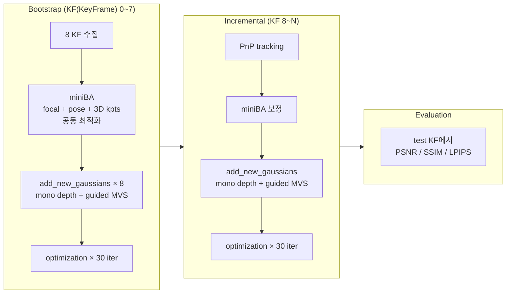
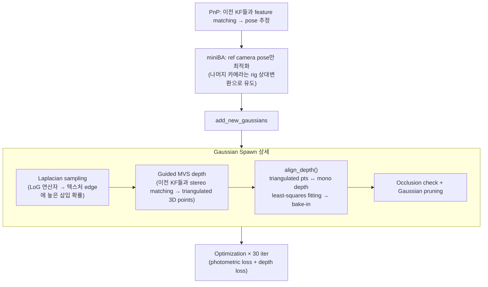
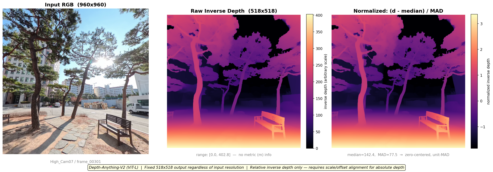
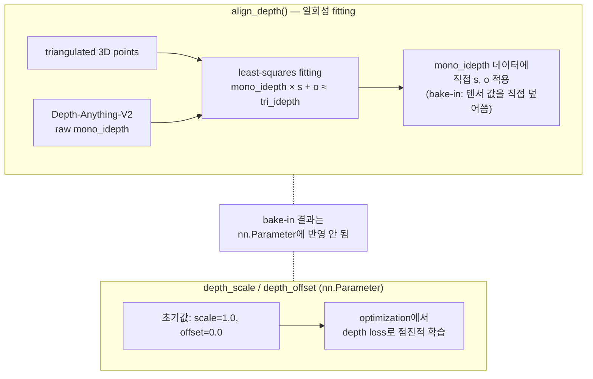
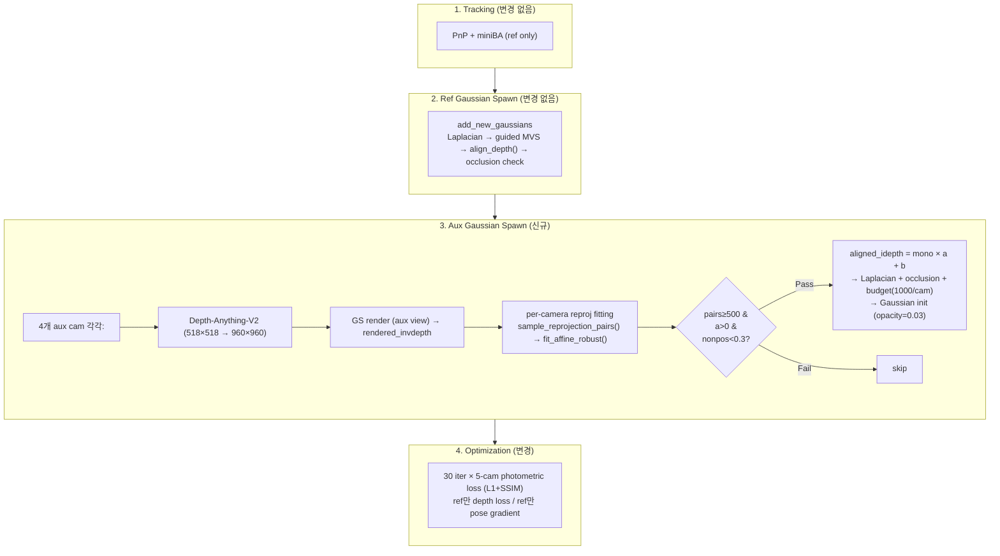
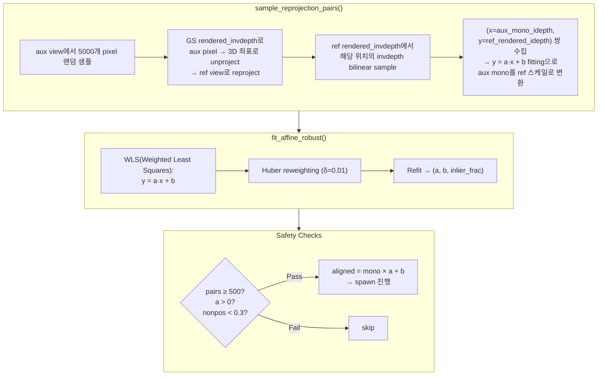
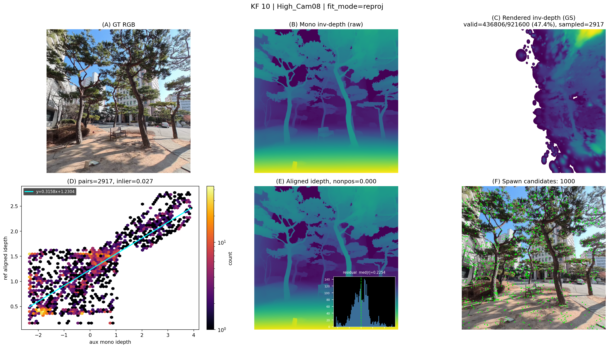

# On-the-fly NVS Multiview Gaussian Spawning

## 1. arXiv:2512.08498 기반 on-the-fly-NVS 파이프라인

### 1.1 전체 구조

([arXiv:2512.08498](https://arxiv.org/pdf/2512.08498) 기반 파이프라인) 단일 ref camera 비디오 스트림에서 실시간으로 3DGS scene을 구축함.



### 1.2 Bootstrap

초기 8 프레임을 수집해서 miniBA로 focal, pose, 3D keypoints를 공동 최적화함. 그 후 각 keyframe마다 `add_new_gaussians`로 초기 Gaussian scene을 생성함.

### 1.3 Incremental

매 keyframe마다 아래 순서를 반복함.



### 1.4 align_depth() 메커니즘

mono depth(Depth-Anything-V2)는 상대적 inverse depth(1/depth — 가까울수록 값이 크고, 수치적으로 안정적이라 depth 대신 사용)만 출력하므로 절대 스케일 정렬이 필요함.



- 입력 해상도(960×960)와 무관하게 518×518 고정 출력함
- raw 출력 range [0, 403]은 임의 단위이며, 절대 거리(m) 정보가 없음
- pipeline 내부에서 `(d − median) / MAD`(MAD = Median Absolute Deviation) 정규화 후 사용함



`align_depth()`는 fitting된 s, o를 `mono_idepth` 텐서에 직접 곱/더하기로 반영(bake-in)하지만, `depth_scale`/`depth_offset` nn.Parameter는 건드리지 않음. 즉 bake-in 후에도 nn.Parameter는 초기값(1.0, 0.0)을 유지함. 이 구조적 분리가 aux camera에서 depth를 정렬하려 할 때 문제가 됨 — aux가 nn.Parameter를 읽으면 초기값(1.0, 0.0) 그대로이므로 사실상 정렬이 수행되지 않음. 이 문제의 해결이 2.3절의 핵심임.

### 1.5 논문 rig vs 현재 데이터

| 항목 | 논문 ([arXiv:2512.08498](https://arxiv.org/pdf/2512.08498)) | 현재 데이터 |
|------|------------------------|------------|
| Rig 형태 | 물리적 하드웨어 (헬멧 마운트) | 가상 pinhole 배열 |
| Baseline | 수 cm~수십 cm | ≈ 0 (rotation-only) |
| 삼각측량 | 동일 프레임 내 카메라 간 가능 | 불가 (temporal만 가능) |
| 캘리브레이션 | Calibration-free (자동 추정) | `blender_rig.json`에 사전 정의 |
| 카메라 수 | 3~9대 | 5대 (High_Cam06/07/08, Low_Cam07/08) |
| Ref camera | 자동 추정 | High_Cam07 |
| Focal length | miniBA에서 최적화 | 480.0 고정 |

원본 rig는 9대(High 5 + Low 4)이나, 이 중 High_Cam06/07/08, Low_Cam07/08 5대만 사용하고 High_Cam07을 ref camera로 지정함 (rig 전체 구성은 [260111-saebit_rigged_SfM.md](260111-saebit_rigged_SfM.md) 참조).

5대 가상 카메라가 동일 좌표에서 회전만 다르므로, 동일 프레임 내 카메라 간에는 시각차(parallax)가 없음. 삼각측량에는 시각차가 필수이므로 동일 프레임 내 카메라 간 삼각측량은 불가능하고, 촬영자 보행으로 인한 temporal baseline에만 의존함.

---

## 2. 변경한 파이프라인

원본 파이프라인은 **ref camera(중심 카메라) 1대로만 Gaussian을 생성**하므로, **aux camera(나머지 4대) 방향의 scene coverage가 부족**하여 aux view 렌더링 품질이 낮았음. 이를 개선하기 위해 (1) 5-cam photometric loss와 (2) aux camera에서의 추가 Gaussian spawn을 적용함.

### 2.1 변경된 Incremental 흐름



원본 대비 달라진 부분

| 항목 | 원본 | 변경 후 |
|------|------|--------|
| Optimization loss | ref 1-cam photometric loss | 5-cam photometric loss (L1 + SSIM) |
| Gaussian spawn | ref camera만 | ref + aux 4대 (KF 8~ 활성화) |
| Aux depth alignment | 해당 없음 | per-camera reprojection fitting |

### 2.2 Aux Gaussian Spawning

- aux camera 4대(High_Cam06/08, Low_Cam07/08)에서 Gaussian을 추가 spawn함. `multiview_spawn_warmup=8` 이후(KF 8~)부터 활성화됨.

- bootstrap 구간(KF 0~7)에서는 비활성화함. (bootstrap에서는 pose가 아직 불안정하여 GS scene 자체가 부정확하고, reproj fitting의 기준이 되는 rendered depth도 신뢰할 수 없기 때문)

- aux camera는 ref와 optical center가 같으므로(rotation-only rig) guided MVS를 쓸 수 없음. mono depth만 사용함.

### 2.3 Per-Camera Reprojection Depth Alignment

| | ref | aux (원본) | aux (최종) |
|--|-----|-----------|-----------|
| 정렬 기준 | triangulated points | nn.Parameter (1.0, 0.0) | GS rendered depth |
| fitting | `align_depth()` bake-in | 없음 (초기값 그대로) | per-camera affine (a, b) |
| 결과 | 정상 정렬 | 정렬 안 됨 (1.4절 참조) | 카메라별 독립 정렬 |



safety check 조건 하나라도 실패하면 해당 camera/KF skip함.

| 조건 | 의미 |
|------|------|
| pairs < 500 | 대응점 부족 → fitting 불안정 |
| a ≤ 0 | mono↔render 간 양의 상관 없음 |
| nonpos_ratio ≥ 0.3 | aligned_idepth ≤ 0 pixel이 30% 이상 → depth 무한대/음수 |


### 2.4 Depth Alignment 진단 패널 (KF 10, High_Cam08)

`add_new_gaussians_aux()` 내부 6단계를 한 장에 보여주는 debug 시각화. `--debug_kf 10 --debug_cam High_Cam08`로 생성함.



#### 패널별 설명

**(A) GT RGB** — High_Cam08(ref 대비 우 45°)이 촬영한 ground truth 이미지. 이후 모든 패널의 입력 원본.

**(B) Mono inv-depth (raw)** — Depth-Anything-V2가 (A)에서 추정한 raw inverse depth. 상대 스케일만 있고 절대 스케일이 없으므로, 이 값을 직접 쓰면 Gaussian depth가 틀림. 이것을 ref 스케일로 변환하는 게 (D)→(E) 과정.

**(C) Rendered inv-depth (GS)** — 기존 Gaussian scene을 High_Cam08 시점에서 렌더링한 inverse depth. 검정 영역은 Gaussian이 없는 곳.
- `valid=436,806/921,600 (47.4%)` : 전체 픽셀의 절반 미만만 유효한 rendered depth를 가짐
- `sampled=2,917` : valid 픽셀에서 5,000개를 샘플링 시도했으나 ref view 범위 안에 떨어지는 쌍은 2,917개
- coverage가 낮을수록 (D)에서 쓸 수 있는 pair 수가 줄고 outlier 비율이 올라감

**(D) Hexbin density + fitted line** — (B)의 aux mono idepth(x축)와 ref aligned idepth를 reprojection으로 대응시킨 쌍(y축)의 밀도 분포.
- `pairs=2917` : 유효 대응 쌍 수. safety check 기준(500) 통과
- `inlier=0.027` : Huber δ=0.01 기준 inlier 비율 2.7%. 수치만 보면 낮지만, hexbin에서 밝은(=밀도 높은) 영역이 fitted line(`y=0.6341x+1.2204`, cyan) 위에 집중되어 있음. Huber fitting은 이 dense core만으로 (a, b)를 결정하고 나머지 outlier는 가중치를 줄여 무시함
- outlier 원인: (C)에서 보이듯 coverage 47%만 유효하여, 빈 영역 경계의 부정확한 rendered depth가 잘못된 reprojection pair를 만듦

**(E) Aligned idepth + residual histogram** — (B)에 fitted affine `0.6341x + 1.2204`를 적용한 결과. ref와 동일한 절대 스케일의 inverse depth.
- `nonpos=0.000` : aligned_idepth ≤ 0인 픽셀 0%. safety check 기준(30%) 통과
- 우하단 inset: fitting residual(`a*x + b - y`) 분포. `med|r|=0.4291`이고 0 근처에 sharp peak 존재. peak은 fitting이 잘 된 pair, long tail은 (D)에서 Huber가 다운웨이트한 outlier

**(F) Spawn candidates** — (A) 위에 최종 spawn 위치를 초록 점으로 표시.
- 회색 반투명 = Laplacian sampling mask (텍스처 경계에서 높은 확률)
- 초록 점 1,000개 = confidence > 0.3 필터 + occlusion check + budget 1,000/cam 적용 후 살아남은 최종 Gaussian 생성 위치
- 나무 경계, 건물 윤곽 등 텍스처가 강한 곳에 집중됨

#### 파이프라인 연쇄 관계

```
(B) raw mono → (C) rendered depth에서 pair 추출 → (D) affine fitting → (E) 스케일 정렬 → (F) spawn
```

(C)의 coverage가 부족하면 → (D)의 pair quality가 떨어지고 → (D)의 fitting이 나쁘면 → (E)가 틀어지고 → (F)에서 잘못된 위치에 Gaussian이 생김. 이 KF에서는 coverage 47%에도 dense core가 선형 관계를 유지하여 fitting이 정상 작동함.

---

## 3. 평가

### 3.1 정량 비교

| Metric | 원본 (ref-only) | **최종 (multiview spawn)** |
|--------|----------------|--------------------------|
| PSNR | 16.686 | **17.331** (+0.645) |
| SSIM | 0.505 | **0.528** (+0.023) |
| LPIPS | 0.437 | **0.423** (-0.014) |
| Gaussians | 740,626 | 720,861 |
| Time (s) | 28.60 | 129.34 |

- PSNR +0.645 : 5-cam photometric loss(+0.627)와 aux Gaussian spawn(+0.018)의 합산 효과
- Gaussian 수가 원본(740K) 대비 최종(720K)에서 오히려 줄어든 이유 : 5-cam loss로 optimization이 더 효과적으로 작동하여 불필요한 Gaussian이 pruning된 결과
- 시간이 28s → 129s로 늘어난 이유 : 5-cam rendering + aux depth fitting + aux spawning 오버헤드 때문

### 3.2 Per-Camera Fitting 통계


| Camera | 성공/전체 | skip률 | a (median±std) | b (median±std) | pairs (median) | 총 spawned |
|--------|---------|--------|---------------|---------------|---------------|-----------|
| High_Cam06 | 10/26 | 62% | 0.396±0.190 | 1.633±0.408 | 1,687 | 10,000 |
| High_Cam08 | 18/21 | 14% | 0.245±0.169 | 1.031±0.314 | 4,232 | 17,316 |
| Low_Cam07 | 19/26 | 27% | 0.512±0.198 | 1.584±0.305 | 1,581 | 19,000 |
| Low_Cam08 | 17/25 | 32% | 0.457±0.332 | 1.455±0.395 | 3,841 | 17,000 |

a 값이 카메라마다 0.245~0.512로 달라 per-camera 독립 fitting이 필요했음을 확인함. High_Cam06(좌 45°)이 skip 62%로 가장 불안정했는데, 같은 45°인 High_Cam08(우 45°)은 14%에 불과함. 이는 ref 대비 각도가 아니라, 보행 궤적과 장면 구조상 좌측 방향의 GS scene coverage가 부족하여 유효 reprojection pair가 적었기 때문임.

> median/std는 성공한 KF만의 값이며, "전체" 시도 수 ≠ 30인 이유는 rendered depth가 비어있는 KF에서는 fitting이 시도되지 않기 때문임.

### 3.3 정성적 비교: GT vs 최종 렌더링

#### frame_00001

| Camera | GT | Render |
|--------|----|----|
| High_Cam07 (Ref) |  |  |
| High_Cam06 (Left 45°) |  |  |
| High_Cam08 (Right 45°) |  |  |
| Low_Cam07 (Down-Left) |  |  |
| Low_Cam08 (Down-Right) |  |  |

#### frame_00301

| Camera | GT | Render |
|--------|----|----|
| High_Cam07 (Ref) |  |  |
| High_Cam06 (Left 45°) |  |  |
| High_Cam08 (Right 45°) |  |  |
| Low_Cam07 (Down-Left) |  |  |
| Low_Cam08 (Down-Right) |  |  |

#### frame_00521

| Camera | GT | Render |
|--------|----|----|
| High_Cam07 (Ref) |  |  |
| High_Cam06 (Left 45°) |  |  |
| High_Cam08 (Right 45°) |  |  |
| Low_Cam07 (Down-Left) |  |  |
| Low_Cam08 (Down-Right) |  |  |

#### frame_00721

| Camera | GT | Render |
|--------|----|----|
| High_Cam07 (Ref) |  |  |
| High_Cam06 (Left 45°) |  |  |
| High_Cam08 (Right 45°) |  |  |
| Low_Cam07 (Down-Left) |  |  |
| Low_Cam08 (Down-Right) |  |  |
