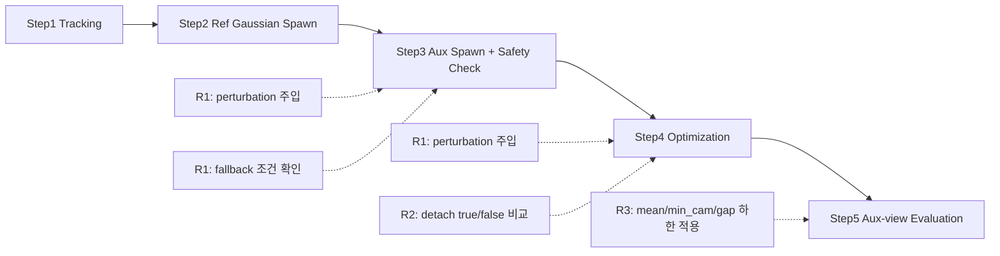

# 260216 - on-the-fly-nvs Rig 제약 대응 검증 보고

## 0. SfM 처리 시간 비교(별도 참고)

이 섹션은 260205 비교 문서 기준의 시간 비교 참고용임.  

| 단계 | On-the-fly | COLMAP Rig SfM |
|---|---:|---:|
| Image Reorganization | - | 0.01s |
| Rig Config Creation | - | <0.01s |
| Feature Extraction | - | 4.85s |
| Rig Configurator | - | 0.80s |
| Sequential Matching | - | 1319.93s |
| Mapper | - | 91.15s |
| 총 소요 시간 | 129.34s | 1416.74s |

## 1. 목적

260131 데이터/설정으로 정의한 운영 기준(통과율 `9/12`, fallback 기준 `0.35`)이 재실행에서도 유지되는지 확인함.
R1은 rotation-only 가정 위반 조건(`translation perturbation`)에서 경계가 어디서 깨지는지 확인하는 항목임.
R2/R3는 운영 조건(가정 위반 주입 없음)에서 학습 안정성과 보조 시점 품질 유지 여부를 확인하는 항목임.

## 2. 확인 질문(R1/R2/R3)

| 항목 | 무엇을 틀어 확인했는지 | 확인 이유 |
|---|---|---|
| R1. 회전 민감도 | `translation perturbation`(0.0/0.5/1.0/2.0%) 주입 | rotation-only 가정 위반 시 `fallback_triggered_rate`가 기준 `0.35`를 초과하는지 확인하기 위함임 |
| R2. 보조 포즈 경로 안정성 | 경로 A/B(`detach=true/false`) 변경 | 경로 변경 시 `nan_detected` 발생 또는 학습 중단 여부를 확인하기 위함임 |
| R3. 보조 시점 화질 유지 | 기준설정 단계에서 산출한 하한을 기준적용 단계에 고정 적용 | 기준적용 단계에서도 통과율 기준(`>=75%`)을 유지하는지 확인하기 위함임 |

### 2.1 260131 프로세스 매핑

| 검증 항목 | 260131 프로세스 구간 | 실제 진행 방식 | 확인 지표 |
|---|---|---|---|
| R1. 회전 민감도 | `2.1 변경된 Incremental 흐름`의 Step3(Aux Gaussian Spawn) + Step4(Optimization) | `compose_aux_pose` 경로에서 `translation_perturb`를 적용해 aux pose translation을 변형함. 이 pose를 Step3/Step4에서 공통 사용하고, `b3_2_fit_log.csv`의 `fallback_triggered=true` 비율(`fallback_triggered_rate`)을 집계함 | 통과율, `fallback_triggered_rate` |
| R2. 보조 포즈 경로 안정성 | `2.1 변경된 Incremental 흐름`의 Step3(Aux Gaussian Spawn) + Step4(Optimization) | `aux_pose_detach` A/B(`detach=true/false`)를 바꿔 동일 데이터·시드·설정으로 재실행하고, `nan_detected`와 variant 평균 PSNR winner를 비교함 | `nan_detected`, winner(A/B) |
| R3. 보조 시점 화질 유지 | Step4 이후 `aux_eval_summary.csv` 산출 결과 | 기준설정 단계에서 산출한 aux 화질 하한(mean/min_cam/gap)을 기준적용 단계에 고정 적용해 통과율을 확인함 | aux 화질 통과율 |

- R2의 winner(A/B)는 variant 평균 PSNR이 더 큰 쪽으로 정의함.

### 2.2 검증 위치 다이어그램

- R1은 `compose_aux_pose`에서 `translation_perturb`를 적용하고, 해당 aux pose를 Step3/Step4에서 공통 사용하는 검증임.
- R2는 Step3/Step4에서 `aux_pose_detach` A/B를 바꿔 `nan_detected`와 winner 변화를 확인하는 검증임.
- R3는 Step5 평가 구간에서 기준설정 단계 하한(mean/min_cam/gap)을 기준적용 단계에 고정 적용해 통과율을 확인하는 검증임.
- `fallback_triggered=true` 기록 조건은 `pairs<min_pairs` 또는 `a<=0`임.
- `nonpos_ratio>0.3`은 skip 처리하지만 `fallback_triggered=false`로 기록됨.
- `fallback_triggered_rate`는 `b3_2_fit_log.csv`에서 `fallback_triggered=true` row 비율임.

## 3. 진행

### 3.1 실행 순서

1. 먼저 기준설정 단계를 실행해 R3 하한(mean/min_cam/gap)과 기준설정 단계 판정 결과를 산출함.
2. 다음으로 기준적용 단계에서 위 하한을 고정한 상태로 동일 데이터·시드·설정으로 재실행함.
3. 마지막으로 판정을 재계산해 기준적용 단계 결과와 일치하는지 대조함.

### 3.2 대상/조건

- 260131 기준 5개 virtual pinhole 시점(High_Cam06/07/08, Low_Cam07/08, ref=High_Cam07) 사용함.
- 동일 EQR 프레임에서 추출한 시점이라 camera center는 동일하고 회전만 다른 조건임.
- R1의 perturbation은 실제 운영 입력 재현이 아니라 가정 위반 조건 경계 확인 목적임.

## 4. 평가 결과

### 4.1 정량 평가

| 항목 | 기준 | 관측 결과 | 상태 |
|---|---|---|---|
| R1. 회전 민감도 | 통과율 `9/12`, fallback 기준 `0.35` | 통과율 `6/12`, 실패 6건 모두 `propagation_C=Fail`, 실패 run fallback `0.3628~0.4804` | 미충족 |
| R2. 보조 포즈 경로 안정성 | winner variant에서 `nan_detected=False` | pilot은 A/B 모두 `nan_detected=False`; operational은 `A(seed0)=True`, B는 `3/3` 모두 False, winner `A->B` 변경 | 충족(러너 기준) |
| R3. 보조 시점 화질 유지 | 통과율 `>=75%`, `mean>=11.0714`, `min_cam>=10.0714`, `gap<=3.6314` | 기준설정 `15/15`, 기준적용 `13/15` (실패 2건: `rotation_S4_seed2`=mean/min_cam/gap 동시 미달, `pose_path_varB_seed2`=min_cam 미달) | 충족 |

- fallback 기준 `0.35`는 실행 중 추정값이 아니라 `validation_protocol`에 고정된 운영 기준값임.
- 기준설정 `15/15`는 pilot 집계 규칙(유효 aux row를 pass로 집계) 결과임. 기준적용 `13/15`는 고정 하한을 적용한 실제 pass count임.
- R1 `pass_fail`은 `geom_A + quality_B + propagation_C` 동시 충족 기준임. 운영 실패 6건은 모두 `propagation_C` 미충족으로 발생함.

최종 판정은 Hold임.

### 4.2 정성 평가

| 관측 원천 | 관측 내용 | 의미 |
|---|---|---|
| 운영 로그 | 실패 6 run 로그에서 `FALLBACK (skip): only ... pairs < 500`가 관측됨 | 대응쌍 부족이 fallback 발생 조건으로 기록됨 |
| 운영 `r1_summary.csv` | Fail 6건 모두 `propagation_C=Fail`; 실패 run `fallback_triggered_rate=0.3628~0.4804` 관측됨 | R1 미충족의 직접 원인이 `fallback_triggered_rate > 0.35`임을 보여줌 |

카메라별 fitting/skip 통계(260131):

## 5. 결론

| 의도한 부분 | 나온 결과 | 해석 |
|---|---|---|
| R1: 가정 위반 조건에서 fallback 급증 여부를 확인함 | 통과율 `6/12`로 기준 `9/12` 미달, 실패 6건 모두 `propagation_C=Fail`, 실패 run fallback `0.3628~0.4804`로 기준 `0.35` 초과함 | R1 판정식(`geom_A+quality_B+propagation_C`)에서 미충족 원인은 `propagation_C`임. rotation-only 경계를 넘기면 운영 기준이 깨짐을 확인함 |
| R2: 보조 포즈 경로가 발산 없이 유지되는지 확인함 | pilot은 A/B 모두 `nan_detected=False`; operational은 `A(seed0)=True`, B는 `3/3` 모두 False, winner `A->B` 변경됨 | winner가 B이고 B에서 NaN이 없으므로 runner gate 기준(`winner_stable`)은 충족함 |
| R3: 보조 시점 화질 하한이 운영 단계에서도 유지되는지 확인함 | 기준설정 `15/15`, 기준적용 `13/15`; 하한은 `mean>=11.0714`, `min_cam>=10.0714`, `gap<=3.6314`로 적용됨 | 운영 단계에서도 R3 기준은 충족함. 실패 2건은 `rotation_S4_seed2`(mean/min_cam/gap 동시 미달), `pose_path_varB_seed2`(min_cam 미달)임 |
| 최종 운영 가능 여부를 판정함 | 최종 판정 Hold임 | Hold의 직접 원인은 R1 미충족임. 다음 실험은 `aux_fit_min_pairs` 민감도, fallback 경로(`skip` vs `homography_low`) 비교, `High_Cam06` 집중 분석 3개로 고정함 |

