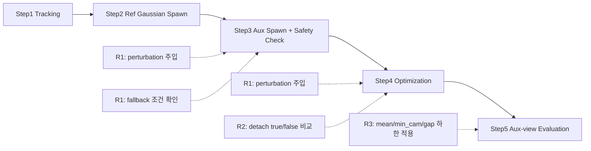

# 260216 - on-the-fly-nvs Rig 제약 대응 검증 보고

## 0. SfM 처리 시간 비교(별도 참고)

이 섹션은 260205 비교 문서 기준의 시간 비교 참고용  

| 단계 | On-the-fly | COLMAP Rig SfM |
|---|---:|---:|
| Image Reorganization | - | 0.01s |
| Rig Config Creation | - | <0.01s |
| Feature Extraction | - | 4.85s |
| Rig Configurator | - | 0.80s |
| Sequential Matching | - | 1319.93s |
| Mapper | - | 91.15s |
| 총 소요 시간 | 129.34s | 1416.74s |

## 1. 목적

260131 데이터/설정으로 정의한 운영 기준(통과율 `9/12`, fallback 기준 `0.35`)이 재실행에서도 유지되는지 확인함.
R1은 rotation-only 가정 위반 조건(`translation perturbation`)에서 민감도를 보는 항목이며, EQR→pinhole 데이터의 rotation-only 전제 정합성을 간접 점검하는 용도로 해석함.
R2/R3는 운영 조건(가정 위반 주입 없음)에서 학습 안정성과 보조 시점 품질 유지 여부를 확인하는 항목.

### 1.1 용어 정의

이 문서에서 사용하는 주요 용어 정의. 파이프라인 상세는 [260131-ontheflynvs_multiview_spawn.md](260131-ontheflynvs_multiview_spawn.md) 참조.

| 용어 | 의미 |
|------|------|
| rotation-only 가정 | 모든 aux 카메라가 ref와 동일한 optical center를 공유하고 회전만 다른 조건. 동일 EQR 프레임에서 pinhole을 추출하면 자연스럽게 성립함 |
| ref / aux 카메라 | ref(High_Cam07)는 on-the-fly-nvs가 직접 처리하는 기준 카메라. aux(High_Cam06/08, Low_Cam07/08)는 ref 기준 상대 pose로 Gaussian을 추가 생성하는 보조 카메라 |
| `compose_aux_pose` | ref camera pose에 rig 상대변환을 적용해 aux camera pose를 계산하는 함수 |
| `fallback_triggered` | aux spawn 시 safety check 실패로 해당 카메라/KF를 skip한 경우. `pairs<min_pairs`(대응점 부족) 또는 `a<=0`(depth fitting 실패) 조건에서 발생 |
| `detach` (A/B) | aux pose gradient 흐름 제어. A(`detach=true`)는 gradient 차단(안정적이나 pose 미세조정 불가), B(`detach=false`)는 gradient 허용(pose 미세조정 가능하나 발산 위험) |
| `mean` / `min_cam` / `gap` | aux view PSNR 품질 지표. `mean`=4개 aux 카메라 PSNR 평균, `min_cam`=가장 낮은 카메라 PSNR, `gap`=최고-최저 PSNR 차이 |
| `geom_A` / `quality_B` / `propagation_C` | R1 pass 판정의 3가지 하위 조건. `geom_A`=기하 정합성, `quality_B`=렌더링 품질, `propagation_C`=fallback_triggered_rate ≤ 0.35. 모두 충족해야 pass |

## 2. 검증 항목(R1/R2/R3)

| 검증 항목 | 260131 프로세스 구간 | 실제 진행 방식 | 확인 지표 |
|---|---|---|---|
| R1. 회전 민감도 | `2.1 변경된 Incremental 흐름`의 Step3(Aux Gaussian Spawn) + Step4(Optimization) | `compose_aux_pose` 경로에서 `translation_perturb`를 적용해 aux pose translation을 변형함. 이 pose를 Step3/Step4에서 공통 사용하고, `b3_2_fit_log.csv`의 `fallback_triggered=true` 비율(`fallback_triggered_rate`)을 집계함 | 통과율, `fallback_triggered_rate` |
| R2. 보조 포즈 경로 안정성 | `2.1 변경된 Incremental 흐름`의 Step3(Aux Gaussian Spawn) + Step4(Optimization) | `aux_pose_detach` A/B(`detach=true/false`)를 바꿔 동일 데이터·시드·설정으로 재실행하고, `nan_detected`와 variant 평균 PSNR winner를 비교함 | `nan_detected`, winner(A/B) |
| R3. 보조 시점 화질 유지 | Step4 이후 `aux_eval_summary.csv` 산출 결과 | 기준설정 단계에서 산출한 aux 화질 하한(mean/min_cam/gap)을 기준적용 단계에 고정 적용해 통과율을 확인함 | aux 화질 통과율 |

### 2.1 검증 위치 다이어그램

## 3. 진행

### 3.1 실행 순서

1. 먼저 기준설정 단계를 실행해 R3 하한(mean/min_cam/gap)과 기준설정 단계 판정 결과를 산출함.
2. 다음으로 기준적용 단계에서 위 하한을 고정한 상태로 동일 데이터·시드·설정으로 재실행함.
3. 마지막으로 판정을 재계산해 기준적용 단계 결과와 일치하는지 대조함.

### 3.2 대상/조건

- 260131 기준 5개 virtual pinhole 시점(High_Cam06/07/08, Low_Cam07/08, ref=High_Cam07) 사용함.
- 동일 EQR 프레임에서 추출한 시점이라 camera center는 동일하고 회전만 다른 조건임.
- R1의 perturbation은 실제 운영 입력 재현이 아니라 가정 위반 조건 경계 확인 목적임.

## 4. 평가 결과

### 4.1 정량 평가

| 항목 | 기준 | 관측 결과 | 상태 |
|---|---|---|---|
| R1. 회전 민감도 | 통과율 `9/12`, fallback 기준 `0.35` | 통과율 `6/12`, 실패 6건 모두 `propagation_C=Fail`, 실패 run fallback `0.3628~0.4804` | 미충족 |
| R2. 보조 포즈 경로 안정성 | NaN 없는 안정적 경로 존재 | pilot: A/B 모두 NaN 없음. operational: A(seed0)에서 NaN 발생, B는 3개 seed 모두 NaN 없음 → B 채택 | 충족 |
| R3. 보조 시점 화질 유지 | 통과율 `>=75%`, `mean>=11.0714`, `min_cam>=10.0714`, `gap<=3.6314` | 기준설정 `15/15`, 기준적용 `13/15` (실패 2건, 세부 원인 4.3절) | 충족 |

- fallback 기준 `0.35`는 실행 중 추정값이 아니라 `validation_protocol`에 고정된 운영 기준값임.
- fallback 기준 `0.35`의 근거는 `validation_protocol.yaml`의 `gates.fallback_triggered_gate=0.35`임. pilot/operational `manifest.txt`에 동일 값으로 기록됨.
- 기준설정 `15/15`는 pilot 집계 규칙(유효 aux row를 pass로 집계) 결과임. 기준적용 `13/15`는 고정 하한을 적용한 실제 pass count임.
- R1 `pass_fail`은 `geom_A + quality_B + propagation_C` 동시 충족 기준임. 운영 실패 6건은 모두 `propagation_C` 미충족으로 발생함.

### 4.2 정성 평가

| 관측 원천 | 관측 내용 | 의미 |
|---|---|---|
| 운영 로그 | 실패 6 run 로그에서 `FALLBACK (skip): only ... pairs < 500`가 관측됨 | 대응쌍 부족이 fallback 발생 조건으로 기록됨 |
| 운영 `r1_summary.csv` | 모든 Fail run이 `propagation_C=Fail`로 기록됨 | R1 미충족의 직접 원인이 propagation 조건 미충족임을 보여줌 |

카메라별 fitting/skip 통계(260131):

### 4.3 R3 실패 2건 원인 분해(재현성 관점)

| 실패 run | 하한 미달 항목 | 관측값 | 해석 |
|---|---|---|---|
| `rotation_S4_seed2` | mean/min_cam/gap 동시 미달 | `mean=10.4897`, `min_cam=9.1529`, `gap=4.2458` | 보조 시점 화질이 전체적으로 내려간 케이스임. 단일 카메라 저하가 아니라 다중 지표 동시 붕괴임 |
| `pose_path_varB_seed2` | min_cam만 미달 | `mean=11.5265`, `min_cam=9.4249`, `gap=2.7659` | 전체 평균은 유지됐지만 High_Cam06 하한만 깨진 케이스임 |

- 실패 2건이 모두 `seed=2`에서 발생했으므로 seed 민감 재현성 리스크가 존재함.
- 동일 실패가 아님. 하나는 전체 화질 저하형, 하나는 High_Cam06 단독 저하형임.

### 4.4 R1 해석 프레임(운영 vs 전제 점검)

| 해석 관점 | 질문 | 현재 결과 해석 |
|---|---|---|
| 운영 게이트 관점 | 현재 프로세스를 바로 운영 가능한가 | 4.1의 R1 결과가 운영 기준 미달이므로 Hold 해석이 타당함 |
| rotation-only 전제 점검 관점 | 가정을 깨면 성능 저하가 뚜렷한가 | 가정 위반 입력에서 `fallback_triggered_rate` 초과 Fail이 반복되어 민감도 신호로 해석 가능함 |

- 위 2개 관점은 충돌하지 않음. 운영 판정은 Hold로 유지하고, R1 결과는 전제 점검의 간접 근거로 병행 해석함.
- 단, R1 단독으로 “데이터가 절대적으로 rotation-only임”을 증명하는 것은 아님.

## 5. 결론

| 항목 | 결과 |
|------|------|
| R1 | 미충족 (6/12, 기준 9/12) |
| R2 | 충족 (B 경로 채택) |
| R3 | 충족 (13/15, 기준 75%) |
| **최종 판정** | **Hold** (R1 미충족) |
