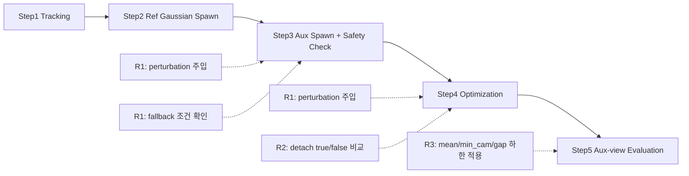

# 260216 - on-the-fly-nvs Rig 제약 대응 검증 보고

## 0. SfM 처리 시간 비교(별도 참고)

| 단계 | On-the-fly | COLMAP Rig SfM |
|---|---:|---:|
| Image Reorganization | - | 0.01s |
| Rig Config Creation | - | <0.01s |
| Feature Extraction | - | 4.85s |
| Rig Configurator | - | 0.80s |
| Sequential Matching | - | 1319.93s |
| Mapper | - | 91.15s |
| 총 소요 시간 | 129.34s | 1416.74s |

## 1. 목적

260131 데이터/설정으로 정의한 운영 기준이 재실행에서도 유지되는지 확인함.

- **R1**: translation perturbation을 주입해서 rotation-only 가정을 의도적으로 위반했을 때 fallback 발생률이 어떻게 변하는지 확인
- **R2**: aux pose gradient 흐름 설정(detach A/B)에 따라 NaN 발생 여부 확인
- **R3**: aux 시점 렌더링 PSNR이 기준값 이상 유지되는지 확인

### 1.1 용어 정의

이 문서에서 사용하는 주요 용어 정의. 파이프라인 상세는 [260131-ontheflynvs_multiview_spawn.md](260131-ontheflynvs_multiview_spawn.md) 참조.

| 용어 | 의미 |
|------|------|
| rotation-only 가정 | 모든 aux 카메라가 ref와 동일한 optical center를 공유하고 회전만 다른 조건. 동일 EQR 프레임에서 pinhole을 추출하면 자연스럽게 성립함 |
| ref / aux 카메라 | ref(High_Cam07)는 on-the-fly-nvs가 직접 처리하는 기준 카메라. aux(High_Cam06/08, Low_Cam07/08)는 ref 기준 상대 pose로 Gaussian을 추가 생성하는 보조 카메라 |
| `compose_aux_pose` | ref camera pose에 rig 상대변환을 적용해 aux camera pose를 계산하는 함수 |
| `fallback_triggered` | aux spawn 시 safety check 실패로 해당 카메라/KF를 skip한 경우. `pairs<min_pairs`(대응점 부족) 또는 `a<=0`(depth fitting 실패) 조건에서 발생 |
| `detach` (A/B) | aux pose gradient 흐름 제어. A(`detach=true`)는 gradient 차단, B(`detach=false`)는 gradient 허용. 상세 분석은 4.5절 참조 |
| `mean` / `min_cam` / `gap` | aux view PSNR 품질 지표. `mean`=4개 aux 카메라 PSNR 평균, `min_cam`=가장 낮은 카메라 PSNR, `gap`=최고-최저 PSNR 차이 |
| `geom_A` / `quality_B` / `propagation_C` | R1 pass 판정의 3가지 하위 조건. `geom_A`=기하 정합성, `quality_B`=렌더링 품질, `propagation_C`=fallback_triggered_rate ≤ 0.35. 모두 충족해야 pass |
| pilot / operational | **pilot**(기준설정): 실험을 돌려서 결과 통계로 기준값을 산출하는 단계. **operational**(기준적용): pilot에서 산출한 기준값을 고정하고 재실행해서 기준 유지 여부를 확인하는 단계 |
| seed | 난수 생성기 초기값. seed=0/1/2로 3회 독립 실행하여 결과의 재현성을 확인함. 같은 seed면 동일한 난수 시퀀스가 발생하므로 결과 재현 가능 |

## 2. 검증 항목(R1/R2/R3)

| 검증 항목 | 260131 프로세스 구간 | 실제 진행 방식 | 확인 지표 |
|---|---|---|---|
| R1. 회전 민감도 | `2.1 변경된 Incremental 흐름`의 Step3(Aux Gaussian Spawn) + Step4(Optimization) | `compose_aux_pose` 경로에서 `translation_perturb`를 적용해 aux pose translation을 변형함. 이 pose를 Step3/Step4에서 공통 사용하고, `b3_2_fit_log.csv`의 `fallback_triggered=true` 비율(`fallback_triggered_rate`)을 집계함 | 통과율, `fallback_triggered_rate` |
| R2. 보조 포즈 경로 안정성 | `2.1 변경된 Incremental 흐름`의 Step3(Aux Gaussian Spawn) + Step4(Optimization) | `aux_pose_detach` A/B(`detach=true/false`)를 바꿔 동일 데이터·시드·설정으로 재실행하고, `nan_detected`와 variant 평균 PSNR winner를 비교함 | `nan_detected`, winner(A/B) |
| R3. 보조 시점 화질 유지 | Step4 이후 `aux_eval_summary.csv` 산출 결과 | pilot에서 산출한 aux 화질 하한(mean/min_cam/gap)을 operational에 고정 적용해 통과율을 확인함 | aux 화질 통과율 |

### 2.1 검증 위치 다이어그램

## 3. 진행

### 3.1 실행 순서

1. **Pilot**: 실험을 돌려서 R3 기준값(mean/min_cam/gap 하한)을 산출함.
2. **Operational**: pilot에서 산출한 기준값을 고정하고, 동일 데이터·시드·설정으로 재실행함.

### 3.2 대상/조건

- 260131 기준 5개 virtual pinhole 시점(High_Cam06/07/08, Low_Cam07/08, ref=High_Cam07) 사용함.
- 동일 EQR 프레임에서 추출한 시점이라 camera center는 동일하고 회전만 다른 조건임.
- R1의 perturbation은 실제 운영 입력 재현이 아니라 가정 위반 조건 경계 확인 목적임.

## 4. 평가 결과

### 4.1 정량 평가

| 항목 | 기준 | 관측 결과 | 상태 |
|---|---|---|---|
| R1. 회전 민감도 | 통과율 `9/12`, fallback 기준 `0.35` | 통과율 `6/12`, 실패 6건 모두 `propagation_C=Fail`, 실패 run fallback `0.3628~0.4804` | 미충족 |
| R2. 보조 포즈 경로 안정성 | NaN 없는 경로 선택 | operational: A(seed0)에서 NaN 발생, B는 3개 seed 모두 NaN 없음 → B 채택 | 결과 서술 (4.5절 참조) |
| R3. 보조 시점 화질 유지 | pilot 결과에서 자동 산출된 기준 적용 | operational `13/15` (실패 2건 모두 seed=2, 세부 4.3절) | 결과 서술 (4.6절 참조) |

- fallback 기준 `0.35`는 `validation_protocol.yaml`의 `gates.fallback_triggered_gate`에 고정된 값임.
- R3 기준값은 pilot 결과 통계에서 자동 산출됨 (4.6절 참조). operational `13/15`는 해당 기준을 고정 적용한 결과임.
- R1 `pass_fail`은 `geom_A + quality_B + propagation_C` 동시 충족 기준임. 운영 실패 6건은 모두 `propagation_C` 미충족으로 발생함.

### 4.2 정성 평가

| 관측 원천 | 관측 내용 | 의미 |
|---|---|---|
| 운영 로그 | 실패 6 run 로그에서 `FALLBACK (skip): only ... pairs < 500`가 관측됨 | 대응쌍 부족이 fallback 발생 조건으로 기록됨 |
| 운영 `r1_summary.csv` | 모든 Fail run이 `propagation_C=Fail`로 기록됨 | R1 미충족의 직접 원인이 propagation 조건 미충족임을 보여줌 |

카메라별 fitting/skip 통계(260131):

### 4.3 R3 실패 2건 원인 분해(재현성 관점)

| 실패 run | 하한 미달 항목 | 관측값 | 해석 |
|---|---|---|---|
| `rotation_S4_seed2` | mean/min_cam/gap 동시 미달 | `mean=10.4897`, `min_cam=9.1529`, `gap=4.2458` | 보조 시점 화질이 전체적으로 내려간 케이스임. 단일 카메라 저하가 아니라 다중 지표 동시 붕괴임 |
| `pose_path_varB_seed2` | min_cam만 미달 | `mean=11.5265`, `min_cam=9.4249`, `gap=2.7659` | 전체 평균은 유지됐지만 High_Cam06 하한만 깨진 케이스임 |

- 실패 2건이 모두 `seed=2`에서 발생했으므로 seed 민감 재현성 리스크가 존재함.
- 동일 실패가 아님. 하나는 전체 화질 저하형, 하나는 High_Cam06 단독 저하형임.

### 4.4 R1 해석

R1은 **perturbation을 주입해서 rotation-only 가정을 의도적으로 위반**한 실험이므로, 결과 해석 시 주의 필요.

| 관점 | 해석 |
|------|------|
| **실험 설계** | translation perturbation 주입 → rotation-only 가정 위반 상태에서 테스트 |
| **관측 결과** | 6/12 실패, 모두 `propagation_C` (fallback rate 초과)로 인한 실패 |
| **의미** | 가정 위반 시 fallback이 증가한다는 것을 확인. 정상 운영 조건(perturbation 없음)과는 다른 상황임 |

- R1 결과로 "운영 불가"를 판정하는 것은 적절하지 않음. perturbation 주입 조건이기 때문.
- R1은 "가정 위반 시 어떻게 되는가"를 확인하는 민감도 테스트로 해석해야 함.

### 4.5 R2 한계점

R2에서 B 경로(`detach=false`)를 채택했으나, 다음 한계점이 존재함.

| 문제 | 설명 |
|------|------|
| **논리적 적합성** | rotation-only rig에서는 상대변환이 `blender_rig.json`에 사전 정의되어 있으므로, gradient를 차단하는 A(`detach=true`)가 논리적으로 적합함. B는 상대변환을 학습으로 조정하려는 것이므로 rig 정의와 충돌할 수 있음 |
| **현상 기반 선택** | B 채택은 "A에서 NaN 발생, B에서 NaN 없음"이라는 현상 기반 선택임. A에서 NaN이 발생한 **근본 원인**이 detach 설정 때문인지 분석되지 않음 |
| **추가 검토 필요** | B 채택 시 상대변환이 학습 과정에서 틀어지지 않았는지 검증 필요. A에서 NaN 발생 원인을 분리해서 detach 외 다른 요인인지 확인 필요 |

### 4.6 R3 기준값 산출 방식 및 해석

R3 기준값은 `runner.py`의 `compute_aux_gates_from_pilot()` 함수에서 pilot 결과를 기반으로 자동 산출됨.

#### 산출 공식

| 기준 | 공식 | 실제 계산 |
|------|------|----------|
| `AUX_PSNR_MEAN_FLOOR` | pilot aux_psnr_mean 평균 - max(0.5, 표준편차) | 11.5714 - 0.5 = **11.0714** |
| `AUX_PSNR_MIN_CAM_FLOOR` | pilot aux_psnr_mean 평균 - max(1.5, 2×표준편차) | 11.5714 - 1.5 = **10.0714** |
| `VIEW_GAP_PSNR_CEIL` | pilot view_gap_psnr 평균 + max(0.5, 표준편차) | 3.0907 + 0.5408 = **3.6314** |

#### 구조적 한계

| 문제 | 설명 |
|------|------|
| **자기 참조적 기준** | 기준이 pilot 결과에서 산출되므로, pilot 통과는 구조상 당연함. 외부 품질 기준이 아님 |
| **min_cam 기준 불일치** | `AUX_PSNR_MIN_CAM_FLOOR`가 실제 `aux_psnr_min_cam` 분포가 아닌 `aux_psnr_mean` 통계에서 산출됨 |
| **PSNR 절대값 의미 부재** | 11.07 dB가 실제로 acceptable한 품질인지에 대한 외부 검증 없음 |

#### 결과 해석

- **Operational 13/15**: 실패 2건(seed=2)은 seed 민감성 존재 신호
- 86.7% ≥ 75% 형식 기준은 충족하나, 기준 자체의 타당성이 약함

→ R3는 "aux spawn 품질이 pilot 수준을 유지하는가"를 확인한 것이며, **절대적 품질 보장의 근거로는 부족**함.

## 5. 결론

| 항목 | 결과 |
|------|------|
| R1 | 6/12 (perturbation 주입 조건, 4.4절 참조) |
| R2 | B 경로 채택 (4.5절 한계점 존재) |
| R3 | operational 13/15 (자기 참조적 기준, 4.6절 참조) |

- R1은 perturbation 주입 실험이므로 운영 판정 근거로 사용하기 어려움.
- R2/R3는 결과를 서술했으나, 각각 한계점이 존재함.
