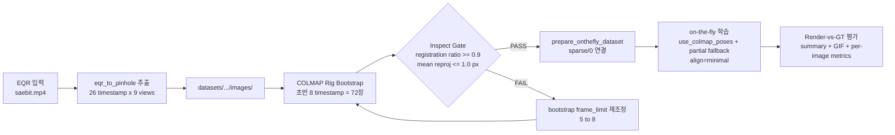
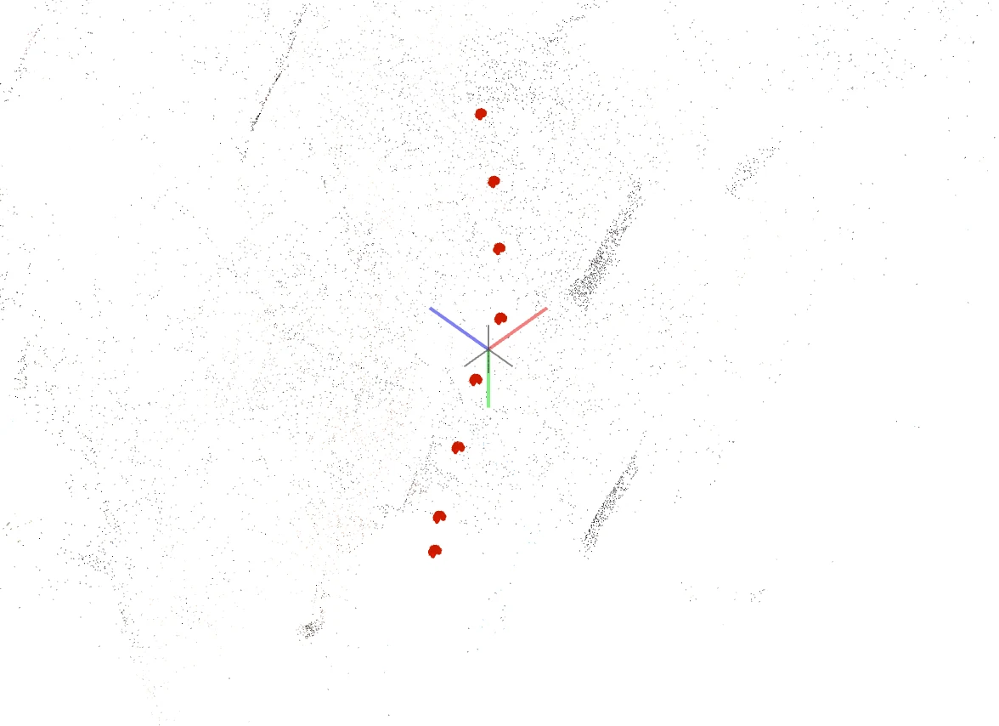
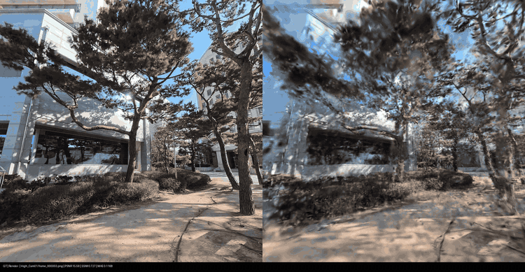
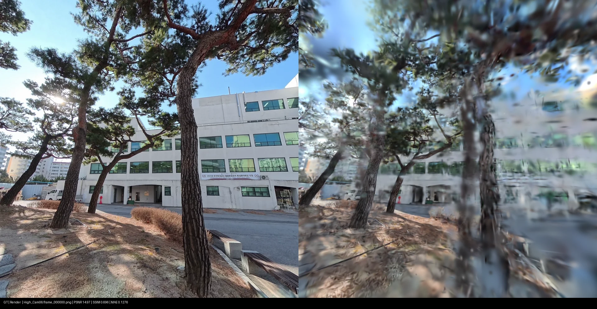
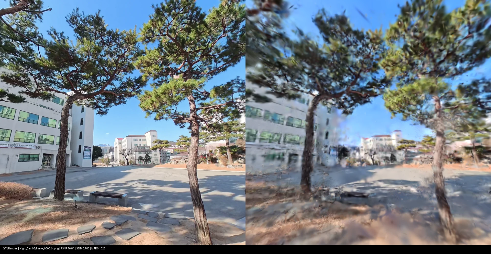
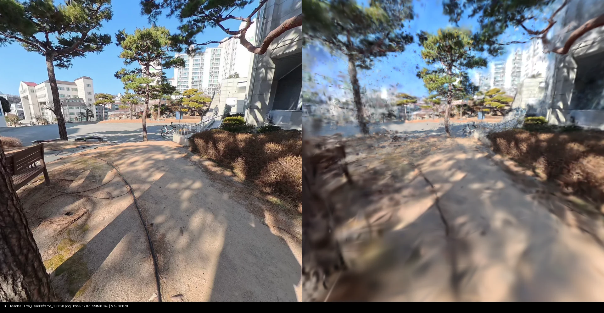

# 260302 - Saebit Rig Pipeline Integration Report

## 수정한 전체 프로세스

---

## 1. 실행 환경

| 항목 | 값 |
|---|---|
| GPU | RTX 4060 Ti 16GB |
| Python 환경 | `conda activate onthefly_nvs` |
| 해상도 | 960 x 960 |
| 사용 뷰 | 9-view (`High_Cam01,02,06,07,08 + Low_Cam01,02,07,08`) |
| Ref view | `High_Cam07` |

---

## 2. 핵심 의사결정

### 2.1 Bootstrap frame 수 결정

| 설정 | 결과 | Gate 판정 | 결론 |
|---|---|---|---|
| `frame_limit=5` | 등록률 `0.4000 (18/45)` | FAIL | 미채택 |
| `frame_limit=8` | 등록률 `1.0000 (72/72)` | PASS | 채택 |

- `frame_limit=5`는 등록률이 gate 기준(>=0.9)에 미달해 실패로 처리.
- `frame_limit=8`은 등록률/재투영 오차 기준 모두 만족하여 채택.

### 2.2 왜 `num_keyframes_miniba_bootstrap=18` 유지했는가?
- COLMAP bootstrap으로 초반 pose 품질(72장)은 확보하되,
- on-the-fly 내부는 **온라인 순차 처리 구조**를 최대한 모사하고,
- 초기 BA/BAB 비용(시간/메모리) 급증을 피하기 위해 bootstrap keyframe 수를 18로 제한.
- 18은 keyframe 기준이며 9-view에서 **약 2 timestamp 분량**임.

---

## 3. 단계별 수행 내용

### 3.1 EQR -> Pinhole 추출
- 26 timestamp에 대해 9-view 이미지 생성 (총 234장)

### 3.2 COLMAP Rig Bootstrap (8 timestamp)
- 입력: 초반 `8 timestamp x 9 view = 72장`
- 설정: `sequential matcher`, `overlap 22`, `quadratic overlap 1`
- 결과: rig sparse 생성 + inspect gate PASS

### 3.3 on-the-fly 학습 (partial COLMAP pose 주입)
- 학습 입력: 전체 `26 timestamp x 9 view` (총 234 keyframe)
- 핵심 옵션: `use_colmap_poses + allow_partial_colmap_poses + colmap_align_mode=minimal`
- 사용 통계: `used=72`, `fallback_estimated=162`

---

## 4. 정량 결과 (최종 Render-vs-GT 기준)

### 4.1 추출

| 항목 | 값 |
|---|---|
| sampled_frames | 26 |
| processed_video_frames (원본 비디오 전체 프레임) | 919 |
| views | 9 |
| intrinsics | `fx=fy=480, cx=cy=480` |

### 4.2 COLMAP bootstrap (8 timestamp)

| 항목 | 값 |
|---|---|
| registered_images | 72 / 72 |
| registration_ratio | 1.0000 |
| num_points3D | 17,173 |
| mean reproj error | 0.5485 px |
| median reproj error | 0.4327 px |

시간 측정:

| 항목 | 값 |
|---|---|
| total pipeline time | 32.00 s |
| prep_subset | 0.17 s |
| make_rig_config | 0.06 s |
| feature_extractor | 1.88 s |
| rig_configurator | 0.32 s |
| sequential_matcher | 19.04 s |
| mapper | 10.26 s |
| inspect_result | 0.27 s |

### 4.3 최종 Render vs GT

| 항목 | 값 |
|---|---|
| num_pairs | 59 |
| mean_psnr | 16.2319 |
| median_psnr | 16.1223 |
| mean_ssim_global | 0.7595 |
| median_ssim_global | 0.7646 |
| mean_mae | 0.1097 |
| median_mae | 0.1084 |

해석 주석:
- `num_pairs=59`는 학습 시 `--test_hold 4`를 사용해 keyframe 인덱스 기준 `i % 4 == 0` 테스트 샘플만 평가했기 때문(총 234개 중 59개).

### 4.4 참고 실행 통계 (품질 비교 지표 아님)

| 항목 | 값 |
|---|---|
| on-the-fly time | 60.7818 s |
| on-the-fly FPS | 3.8498 |
| num anchors | 1 |
| num keyframes | 234 |

---

## 5. 정성 결과

### 5.1 전체 비교 GIF

### 5.2 샘플 프레임 비교

| View / Frame | 비교 이미지 |
|---|---|
| High_Cam06 / frame_000000 |  |
| High_Cam07 / frame_000013 |  |
| High_Cam08 / frame_000024 |  |
| Low_Cam08 / frame_000020 |  |

---
