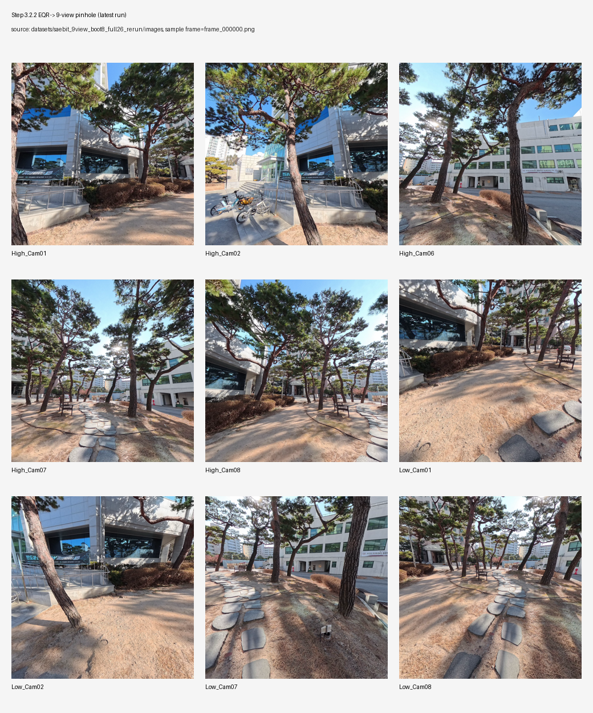
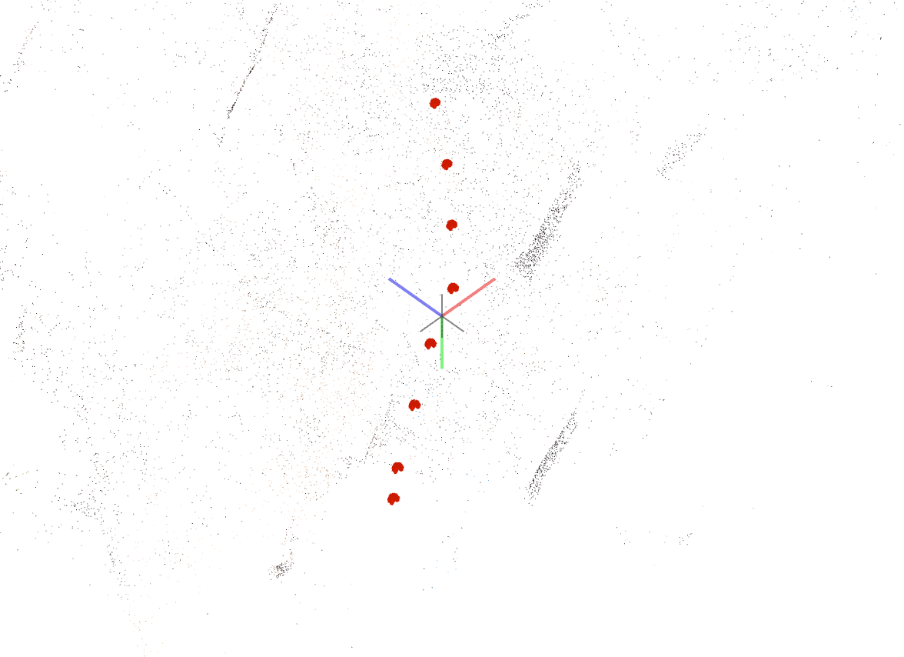
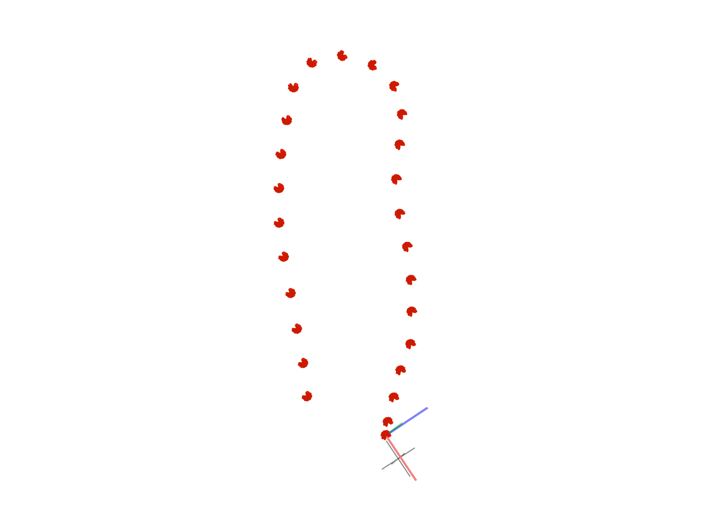
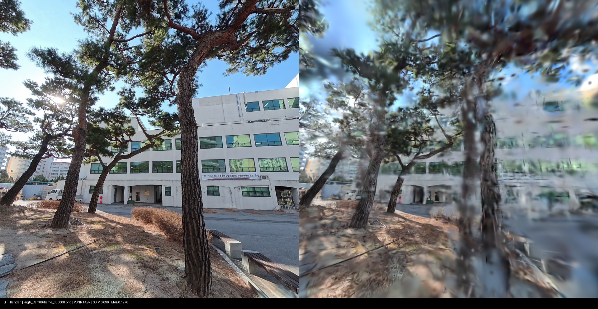
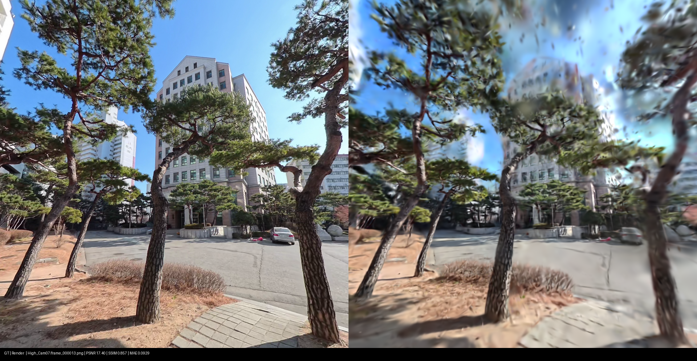
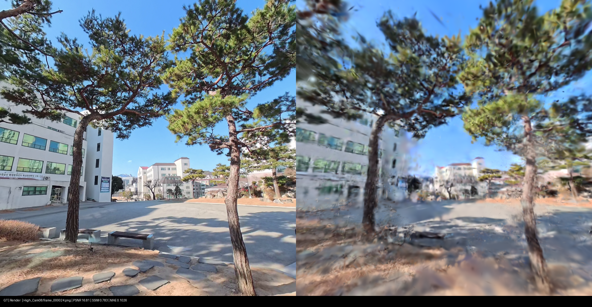
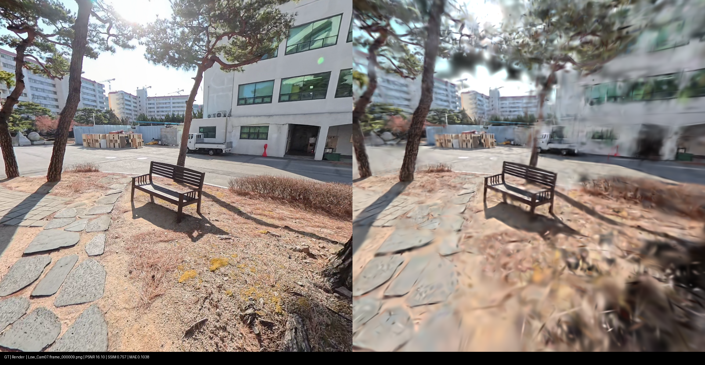
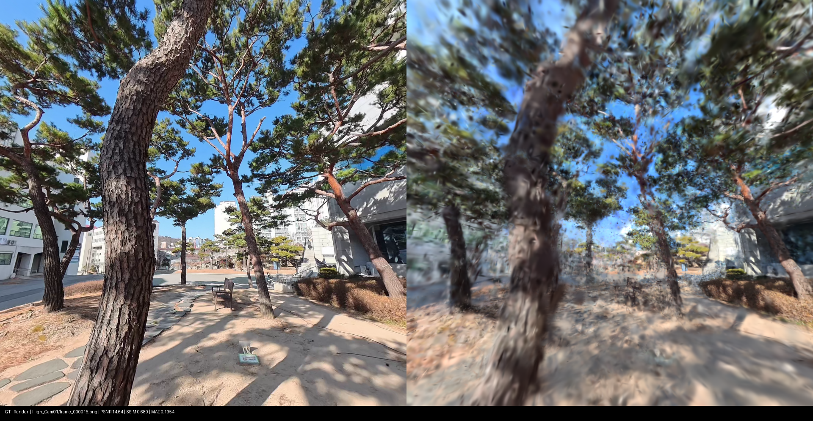

# 260302 - Saebit Rig Bootstrap(8) 재실행 + 저장소 통합

---

## 1. 실행 환경

| 항목 | 값 |
|---|---|
| GPU | RTX 4060 Ti 16GB |
| Python 환경 | `conda activate onthefly_nvs` |
| 해상도 | 960 x 960 |
| 사용 뷰 | 9-view (`High_Cam01,02,06,07,08 + Low_Cam01,02,07,08`) |
| Ref view | `High_Cam06` |

실험 식별자(혼동 방지):
- COLMAP bootstrap(학습에 실제 사용): `datasets/saebit_9view_boot8_full26_rerun/colmap_boot8`
- COLMAP 시간측정용 재실행: `datasets/saebit_9view_boot8_full26_rerun/colmap_boot8_timing`
- on-the-fly 최종 모델: `final_outputs/ontheflynvs_boot8_full26_rerun_rigfix_full`

---

## 2. 수행 과정

## 2.1 Bootstrap frame 수 결정

| 설정 | 결과 | 판단 |
|---|---|---|
| `frame_limit=5` | 등록률 0.4000 (18/45) | 실패 |
| `frame_limit=8` | 등록률 1.0000 (72/72) | 채택 |

최종 결정:
- COLMAP bootstrap은 8 timestamp 사용
- on-the-fly `num_keyframes_miniba_bootstrap=18` 유지
  (keyframe 단위이며, 9-view 기준 대략 2 timestamp 분량이지만 등록 뷰 수에 따라 달라질 수 있음)

## 2.2 전체 파이프라인 실행

- 변경한 코드는 [kyowon1108/on-the-fly-nvs-rig](https://github.com/kyowon1108/on-the-fly-nvs-rig) 에서 확인 가능.

## 2.2.1 EQR 추출 (26 timestamp x 9 view)

동일 timestamp에서 9-view pinhole 이미지를 생성함.

## 2.2.2 COLMAP bootstrap (8 timestamp)

bootstrap 구간(8 timestamp)으로 rig 제약 SfM을 수행함.

- 입력: 초반 8 timestamp x 9 view = 72장
- 설정: sequential matcher, overlap 22, quadratic overlap 1
- 결과: rig sparse 모델 생성 완료

## 2.2.3 COLMAP inspect gate 확인

등록률/재투영 오차 게이트를 통과하는지 확인함.

- registered_images: 72 / 72
- registration_ratio: 1.0000
- num_points3D: 17,173
- mean reproj error: 0.5485 px (median 0.4327 px)
- 판정: PASS

## 2.2.4 on-the-fly 학습

partial COLMAP pose 주입 조건으로 전체 프레임 학습을 수행함.

- 학습 입력: 전체 26 timestamp x 9 view (총 234 keyframe)
- 핵심 옵션: use_colmap_poses + allow_partial_colmap_poses + align minimal
- bootstrap keyframe: 18 (rig timestamp 기준 약 2개 분량)
- 사용 통계: COLMAP pose used 72, fallback_estimated 162
- 성능 요약: 60.78s, FPS 3.8498, PSNR 16.2392 / SSIM 0.4249 / LPIPS 0.5395

---

## 3. 정량 결과

## 3.1 추출

| 항목 | 값 |
|---|---|
| sampled_frames | 26 |
| processed_video_frames (전체 비디오 프레임 수) | 919 |
| views | 9 |
| intrinsics | fx=fy=480, cx=cy=480 |

## 3.2 COLMAP bootstrap (8 timestamp)

- 수행 결과

| 항목 | 값 |
|---|---|
| registered_images | 72 / 72 |
| registration_ratio | 1.0000 |
| num_points3D | 17,173 |
| mean reproj error | 0.5485 px |
| median reproj error | 0.4327 px |

- 시간 측정 결과

| 항목 | 값 |
|---|---|
| total pipeline time | 32.00 s |
| prep_subset | 0.17 s |
| make_rig_config | 0.06 s |
| feature_extractor | 1.88 s |
| rig_configurator | 0.32 s |
| sequential_matcher | 19.04 s |
| mapper | 10.26 s |
| inspect_result | 0.27 s |

## 3.3 on-the-fly 학습

| 항목 | 값 |
|---|---|
| num anchors | 1 |
| num keyframes | 234 |
| time | 60.7818 s |
| FPS | 3.8498 |
| PSNR | 16.2392 |
| SSIM | 0.4249 |
| LPIPS | 0.5395 |

추가 통계:
- COLMAP pose usage: `used=72`, `fallback_estimated=162`

## 3.4 Render-vs-GT

| 항목 | 값 |
|---|---|
| num_pairs | 59 |
| mean_psnr | 16.2319 |
| median_psnr | 16.1223 |
| mean_ssim_global | 0.7595 |
| median_ssim_global | 0.7646 |
| mean_mae | 0.1097 |
| median_mae | 0.1084 |

---

## 4. 정성 결과

### 4.1 전체 비교 GIF

### 4.2 샘플 비교 이미지

| View / Frame | 비교 이미지 |
|---|---|
| High_Cam06 / frame_000000 |  |
| High_Cam07 / frame_000013 |  |
| High_Cam08 / frame_000024 |  |
| Low_Cam07 / frame_000009 |  |
| Low_Cam08 / frame_000020 |  |
| High_Cam01 / frame_000015 |  |

---
