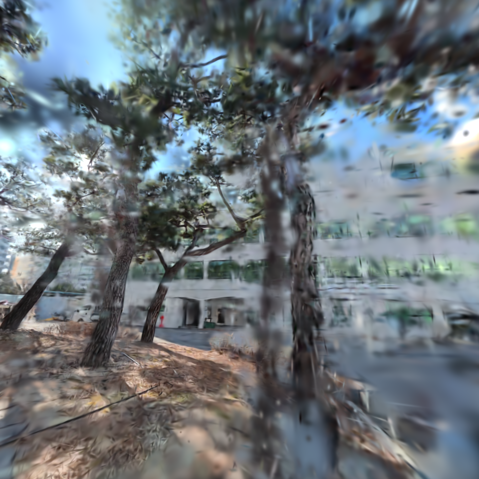
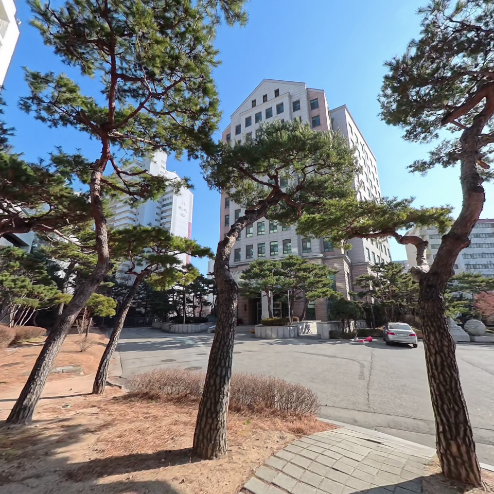
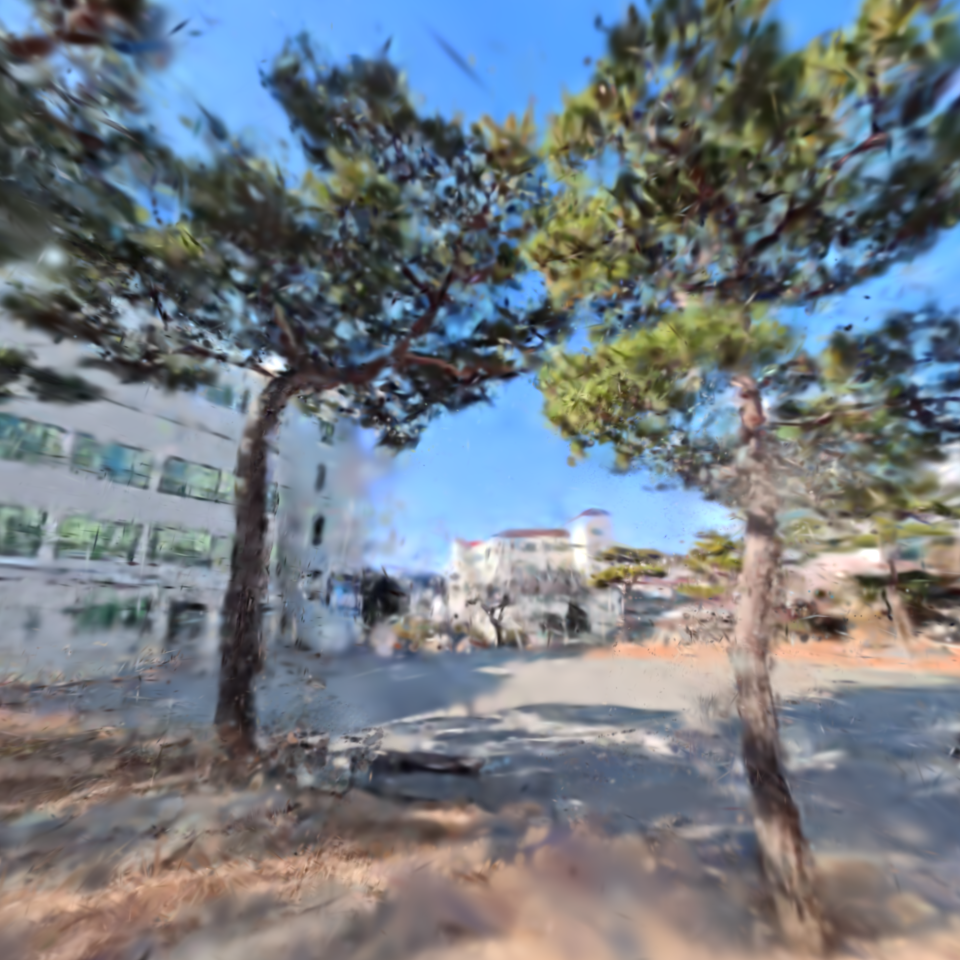
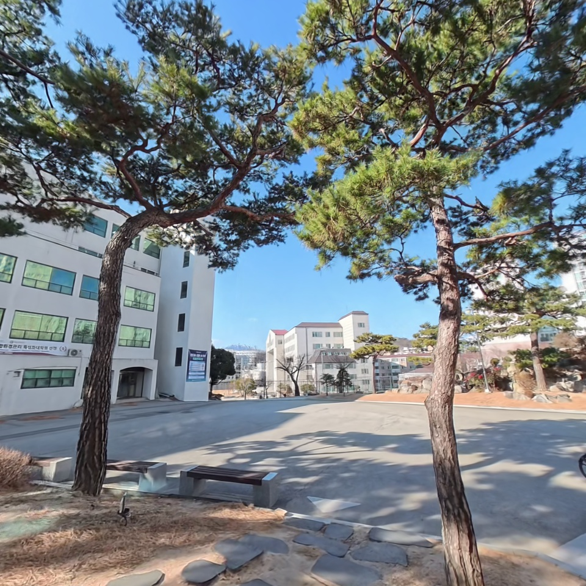
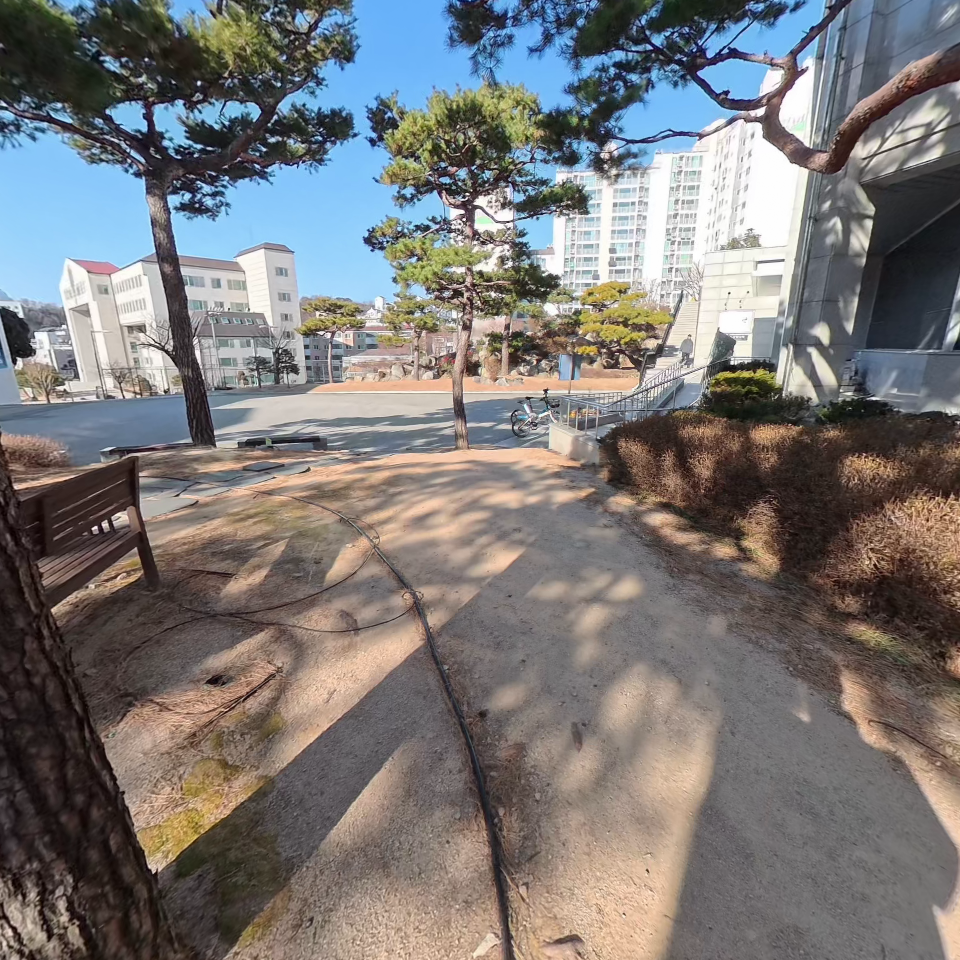

# 260319 - Saebit Rig Pipeline Integration Report

---

## 1. 실행 환경

| 항목 | 값 |
|---|---|
| GPU | RTX 4060 Ti 16GB |
| Python 환경 | `conda activate onthefly_nvs` |
| 해상도 | 960 x 960 |
| 사용 뷰 | 9-view (`High_Cam01,02,06,07,08 + Low_Cam01,02,07,08`) |
| Ref view | `High_Cam07` |

---

## 2. 정성 결과

### 샘플 프레임 비교

| View / Frame | GT | OnTheFlyNVS | PostShot |
|---|---|---|---|
| High_Cam06 / frame_000000 |  |  |  |
| High_Cam07 / frame_000013 |  |  |  |
| High_Cam08 / frame_000024 |  |  |  |
| Low_Cam08 / frame_000020 |  |  |  |

---

## 3. 코드 분석 결과
- 