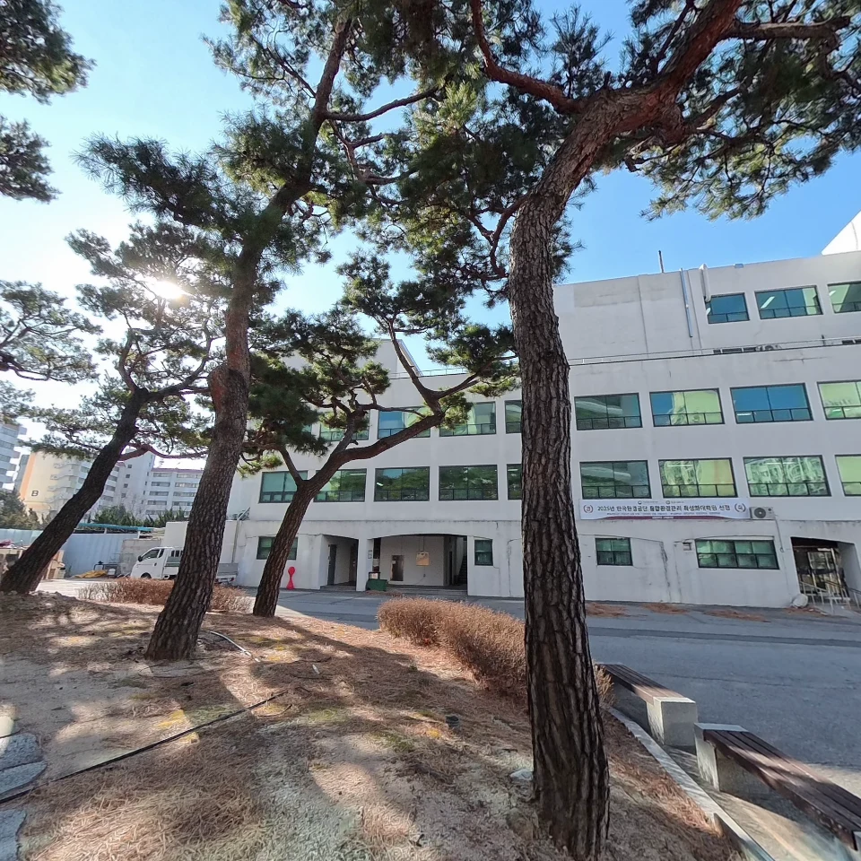
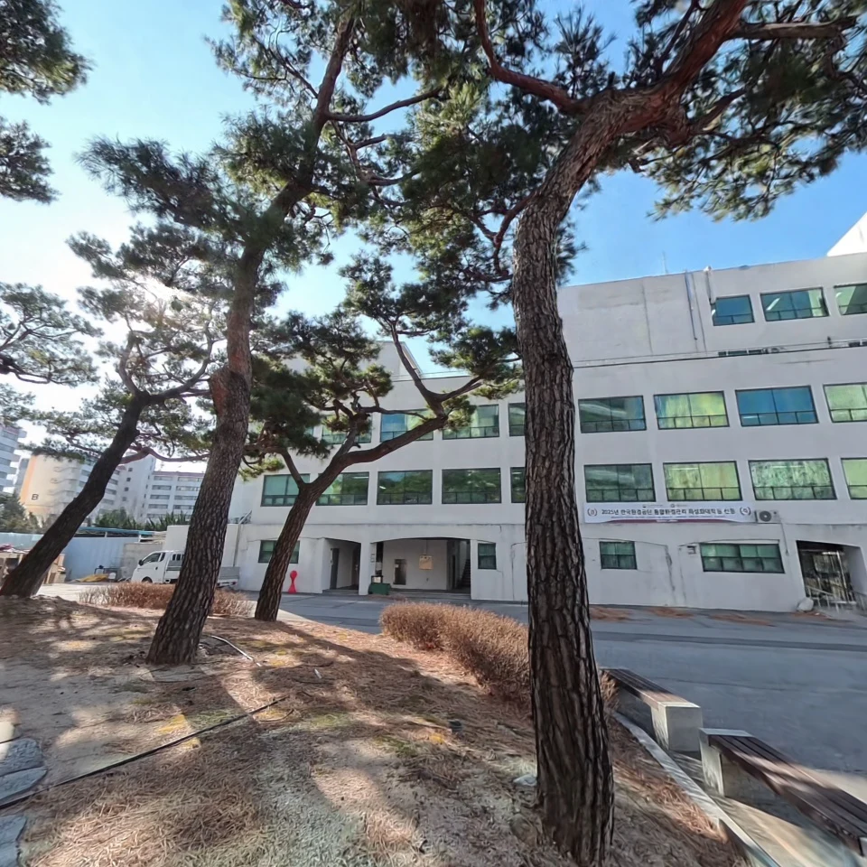
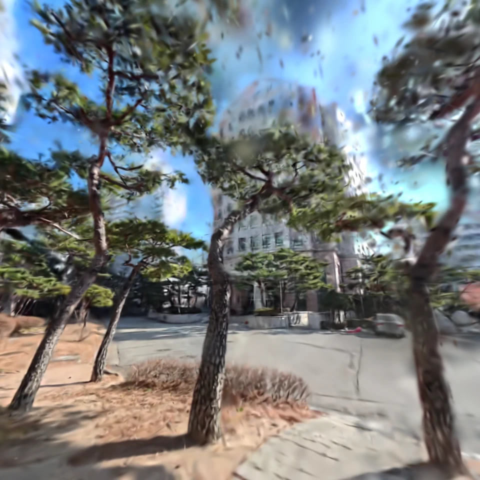
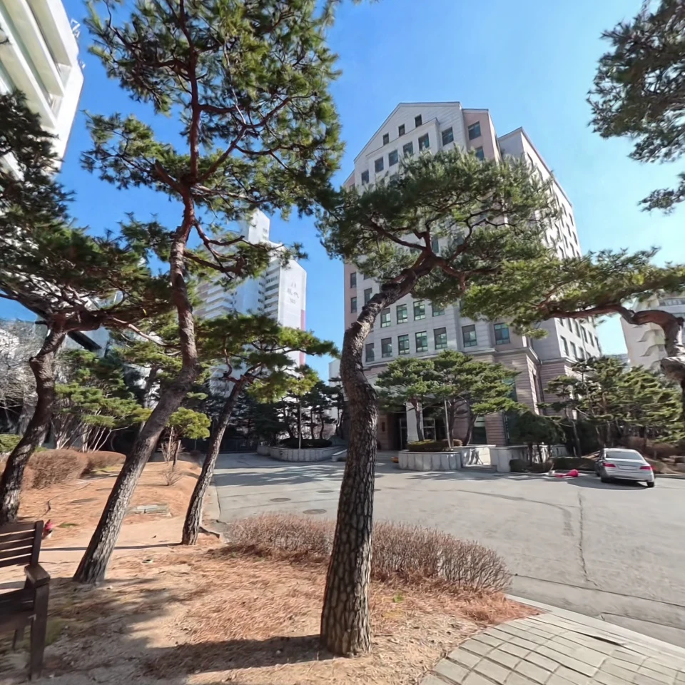
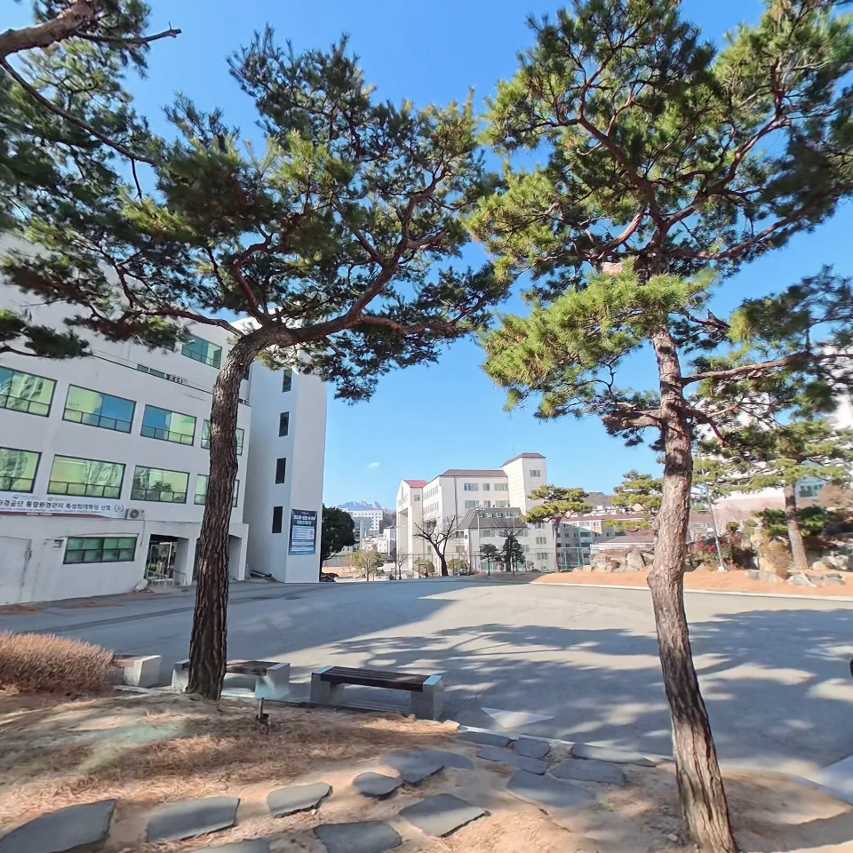
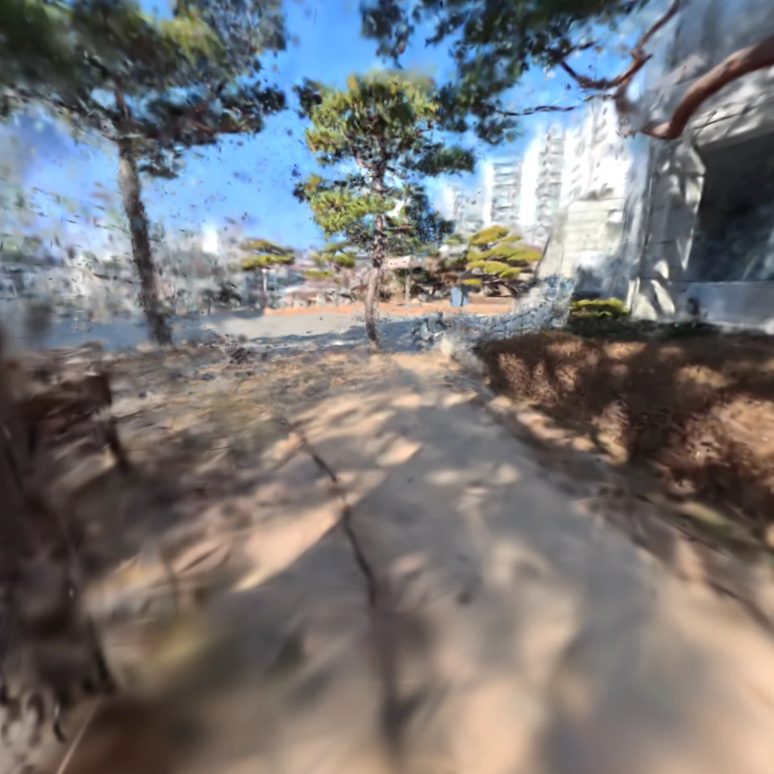
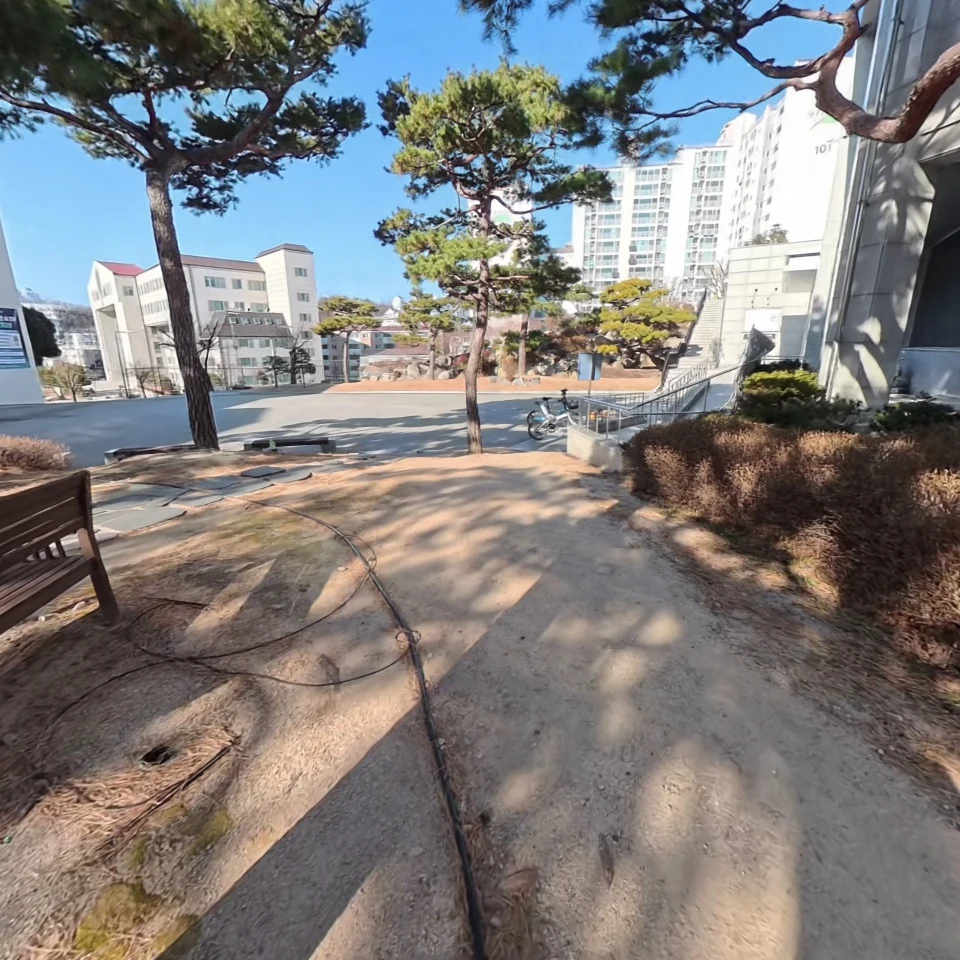

# 260319 - Saebit Rig Pipeline Integration Report

---

## 1. 실행 환경

| 항목 | 값 |
|---|---|
| GPU | RTX 4060 Ti 16GB |
| Python 환경 | `conda activate onthefly_nvs` |
| 해상도 | 960 x 960 |
| 사용 뷰 | 9-view (`High_Cam01,02,06,07,08 + Low_Cam01,02,07,08`) |
| Ref view | `High_Cam07` |

---

## 2. 정성 결과

### 샘플 프레임 비교

| View / Frame | GT | OnTheFlyNVS | PostShot |
|---|---|---|---|
| High_Cam06 / frame_000000 |  |  |  |
| High_Cam07 / frame_000013 |  |  |  |
| High_Cam08 / frame_000024 |  |  |  |
| Low_Cam08 / frame_000020 |  |  |  |

- PostShot은 GT와 비교했을 때 큰 차이가 관찰되지 않았지만, rig 제약을 적용한 on-the-fly-nvs 결과는 시각적으로 뚜렷한 품질 저하가 확인됨.
- 이 때문에 수정한 코드에서 놓친 부분이 있는지 분석함.

---

## 3. 코드 분석 결과

| 구분 | 원본 on-the-fly-nvs의 전체 최적화/업데이트 플로우 | 현재 rig 구현 플로우 | 원래 원했던 플로우 |
|---|---|---|---|
| 기본 단위 | `1 image = 1 keyframe = 1 pose = 1 optimization unit` | `1 timestamp = 1 rig frame = shared pose owner` | `1 timestamp = 1 rig frame = shared pose owner` |
| Bootstrap | 초기 keyframe들을 모아 mini-BA로 pose와 focal을 초기화 | bootstrap 구간에서 COLMAP으로 초기 ref/shared pose를 안정화 | bootstrap에서 rig pose를 안정화하되, 이후 전체 카메라 정보가 자연스럽게 이어지길 기대 |
| Incremental pose init | 새 keyframe pose를 이전 keyframe들의 2D-3D로 초기화 | ref view만으로 incremental pose init 수행 | rig frame 전체 관측이 pose refinement에 더 직접 기여 |
| 지속 pose 최적화 | optimization loop에서 active keyframe을 반복 샘플링하며 pose를 계속 미세조정 | shared RigFrame pose를 계속 최적화하되, 현재는 사실상 ref 중심이며 support view 손실은 기본적으로 shared pose gradient에 반영되지 않음 | shared rig pose가 ref뿐 아니라 support view 손실에서도 의미 있게 계속 보정 |
| Gaussian spawn geometry source | 현재 추가되는 keyframe 자체가 geometry source | rig 모드에서는 ref camera만 geometry source | 원래 기대는 전체 카메라 또는 최소한 더 많은 view가 spawn에 실질 참여 |
| Support view 역할 | 없음 | 현재 scene을 support view에서 렌더링한 결과와 실제 support view 이미지의 차이를 줄이는 손실에만 주로 사용되며, geometry에는 직접 참여하지 않음 | support view가 이미지 손실뿐 아니라 spawn과 pose refinement에도 더 강하게 참여 |
| Anchor / centre 기준 | keyframe camera centre 기준 | rig centre 기준으로 정리됨 | rig centre 기준 유지 |
| 현재 해석 | 단일 카메라 keyframe 기반의 지속 pose 최적화 구조 | 여러 view의 이미지 손실을 일부 활용하지만, geometry는 ref view에만 의존하는 구조에 가까움 | 여러 카메라 관측이 geometry spawn과 pose refinement에 직접 반영되는 구조를 기대 |

---
