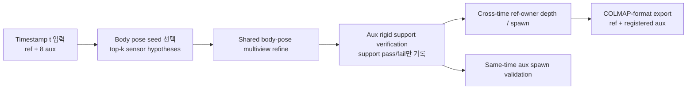
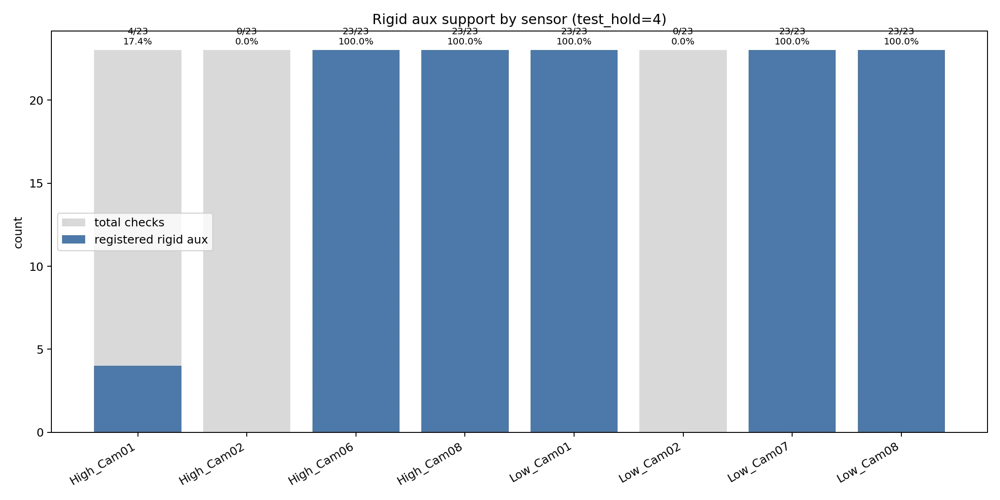
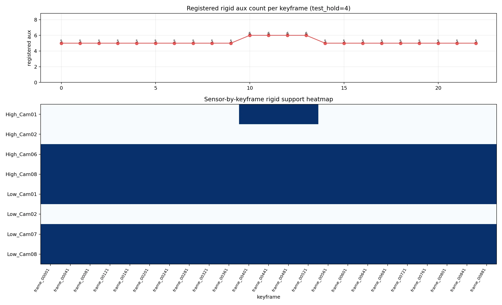
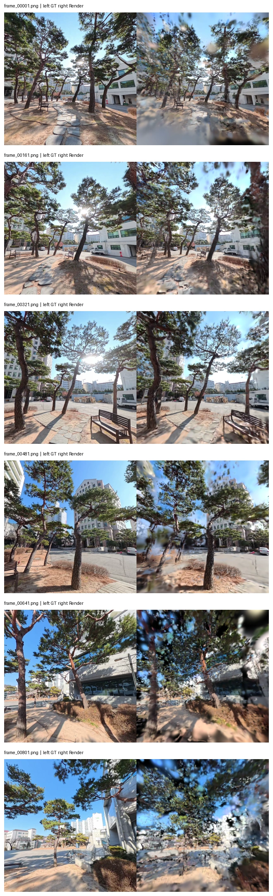
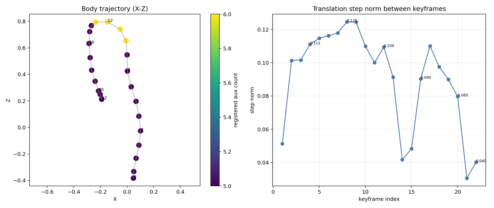

# 260409 - on-the-fly-nvs Rig Body Pose / Rigid Aux Support 통합 보고

---

## 1. 문서 목적

- `single image = single pose` 구조를 `single timestamp = shared body pose` 구조로 바꾼 결과가 실제로 동작하는지
- aux view를 독립 6DoF 카메라처럼 다시 푸는 것이 아니라, 고정 rig 회전 아래의 support sensor로 다루는 것이 맞는지
- 실제 실행 결과에서 `23/23 keyframes`가 안정적으로 등록되는지
- rigid aux support를 적용했을 때 어떤 sensor가 실제로 잘 살아남는지
- same-time aux를 stereo depth source로 쓰지 않고도 Gaussian spawn을 간접적으로 도울 수 있는지

---

## 2. 실행 환경 및 기준

| 항목 | 값 |
|---|---|
| Python 환경 | `conda activate onthefly_nvs` |
| 해상도 | `960 x 960` |
| 공통 intrinsics | `fx=fy=cx=cy=480` |
| ref / gauge view | `High_Cam07` |
| Keyframe 수 | 23 timestamps |
| 평가 설정 | `--test_hold 4` |

---

## 3. upstream 대비 변경 범위

변경 파일 목록:

- `args.py`
- `dataloaders/rig_dataset.py`
- `dataloaders/rig_utils.py`
- `poses/pose_initializer.py`
- `poses/rig_body_optimizer.py`
- `scene/keyframe.py`
- `scene/scene_model.py`
- `scripts/export_rig_metadata.py`
- `train.py`
- `RIG_AUX_SUPPORT_RESULTS.md`

---

## 4. 이번에 실제로 바꾼 구조

### 4.1 원본 on-the-fly-nvs 구조

| 항목 | 원본 구조 |
|---|---|
| 입력 단위 | 1 image |
| pose owner | 1 image = 1 pose |
| bootstrap | 단일 view들로 초기 pose/3D 생성 |
| incremental | 현재 frame 1개를 이전 keyframe들 기준으로 추정 |
| Gaussian spawn | 현재 keyframe 기준 ref-only depth/spawn |

### 4.2 현재 rig 통합 구조

| 항목 | 변경 후 구조 |
|---|---|
| 입력 단위 | 1 timestamp = ref + aux views |
| pose owner | 1 timestamp = 1 shared body pose |
| aux pose | `sensor_from_ref * body_pose`로 rigid하게 파생 |
| incremental pose | 여러 sensor batch를 이용한 shared body-pose refine |
| Gaussian spawn | 여전히 cross-time ref-owner 중심, same-time aux는 validator 역할 |

### 4.3 구현 프로세스 요약

---

## 5. 파일별 변경 목적

| 파일 | 변경 목적 | 결과 |
|---|---|---|
| `args.py` | rig 관련 CLI 옵션 추가 | ref view, aux, pose refine, tail refine, spawn validator를 옵션으로 제어 가능 |
| `dataloaders/rig_dataset.py` | timestamp 단위 sample 구성 | ref 1장 + aux 다중 관측을 한 번에 로드 |
| `dataloaders/rig_utils.py` | Blender rig 기반 상대 회전 계산 | `sensor_from_ref`를 일관되게 생성 |
| `poses/rig_body_optimizer.py` | body pose / sensor pose 조합 및 multiview refine | shared body-pose 추정 가능 |
| `poses/pose_initializer.py` | rig bootstrap / incremental / aux support verification | single-view ref-only에서 multiview shared-pose로 확장 |
| `scene/keyframe.py` | keyframe에 aux sensor 상태 저장 | `registered`, inlier, reproj error 등 aux support state 기록 |
| `scene/scene_model.py` | aux export / aux spawn validation / rig-aware bookkeeping | rigid aux를 export하고 same-time aux를 spawn validator로 사용 |
| `train.py` | rig data path, bootstrap, incremental, metadata 전달 | rig sample이 학습 루프 전체를 통과하도록 연결 |
| `scripts/export_rig_metadata.py` | 실험용 rig 메타데이터 산출 | `camera_names.json`, `intrinsics.json`, `rig_relative_poses.json` 등 생성 가능 |

---

## 6. 중간에 틀렸던 설계와 수정 내용

### 6.1 잘못 갔던 설계

중간 구현에서는 aux를 “검증”한다는 명목으로 sensor별 `PnP + miniBA`를 다시 돌려 사실상 **독립 6DoF 재등록**처럼 처리한 적이 있었음.

문제:

- rotation-only rig에서 same-time aux는 별도 center를 가져서는 안 됨
- 그런데 aux마다 별도 6DoF를 다시 풀면 한 timestamp 안에서 pose가 퍼짐
- 특히 U-turn 이후 same-time sensor가 난잡하게 흩어지는 현상이 발생

### 6.2 현재 수정된 설계

- 추정 대상은 항상 `body pose` 1개
- aux pose는 항상 rigidly derived pose
- aux verification은 “이 rigid pose 아래에서 support가 충분한가”만 검사
- aux를 independent localization 성공처럼 세지 않음
- COLMAP-format export도 rigidly derived pose만 사용

지금의 aux registration 의미 : 
> “독립 pose 추정 성공”이 아니라  
> “공유 body pose 아래에서 support sensor로 채택 가능”

---

## 7. 정량 결과

### 7.1 정량 요약

정량 결과:

| 항목 | 값 |
|---|---|
| total aux checks | 184 |
| rigid support-verified aux | 119 |
| exported COLMAP-format images | 142 = 23 ref + 119 aux |
| num anchors | 1 |
| num keyframes | 23 |
| num geometry keyframes | 23 |
| num tracked-only keyframes | 0 |
| runtime | 22.2332 s |
| FPS | 1.0345 |
| PSNR | 13.0378 |
| SSIM | 0.3392 |
| LPIPS | 0.5644 |
| num test keyframes | 6 |

sensor별 support 결과:

| Sensor | Registered / Total | Ratio |
|---|---:|---:|
| `High_Cam06` | 23 / 23 | 100.0% |
| `High_Cam08` | 23 / 23 | 100.0% |
| `Low_Cam01` | 23 / 23 | 100.0% |
| `Low_Cam07` | 23 / 23 | 100.0% |
| `Low_Cam08` | 23 / 23 | 100.0% |
| `High_Cam01` | 4 / 23 | 17.4% |
| `High_Cam02` | 0 / 23 | 0.0% |
| `Low_Cam02` | 0 / 23 | 0.0% |

증거 이미지:

### 7.2 keyframe별 aux support 분포

- post-pass rigid verification 기준으로 모든 keyframe에 대해 aux support 상태가 다시 채워짐
- 이번 `test_hold=4` run에서는 keyframe당 등록된 aux 수가 `5~6` 수준으로 유지됨
- support가 가장 높은 구간은 `frame_00401`, `frame_00441`, `frame_00481`, `frame_00521`로 6개 aux가 support로 통과함

대표 예시:

| keyframe | tracking view | registered aux count |
|---|---|---:|
| `frame_00001` | `High_Cam07` | 5 |
| `frame_00321` | `Low_Cam08` | 5 |
| `frame_00361` | `Low_Cam08` | 5 |
| `frame_00481` | `High_Cam07` | 6 |
| `frame_00641` | `Low_Cam08` | 5 |
| `frame_00881` | `Low_Cam08` | 5 |

증거 이미지:

---

## 8. 정성 해석

### 8.1 test holdout render 결과

`test_hold=4`로 제외된 6개 keyframe에 대해 GT와 render를 비교한 결과는 아래와 같음.

- holdout frame 6장 모두 render가 정상적으로 생성됨
- `frame_00641`, `frame_00801` 같은 후반부 test frame도 완전히 붕괴하지 않음
- 다만 U-turn tail 구간의 미세한 translation/shape precision은 추가 보정 여지가 남아 있음

### 8.2 body trajectory와 support 관계

최종 rigid aux support run의 body trajectory와 keyframe별 body 이동량

- 전체 trajectory는 U-turn 형태를 유지하면서 23 keyframe이 끝까지 등록됨
- keyframe 간 이동량이 후반부에서도 급격히 0으로 붕괴하지 않음
- support sensor 수가 전체 구간에서 5~6개로 유지되어, same-time aux가 body pose를 계속 지지하고 있음을 확인함

### 8.3 이번 결과가 의미하는 것

1. `rotation-only virtual rig`로 해석하는 방향이 실제 코드 구조와 실험 결과 모두에서 유지 가능함
2. aux를 독립 6DoF로 다시 풀지 않아도, shared body pose 아래 support sensor로 충분히 쓸 수 있음
3. same-time aux는 stereo depth source가 아니지만, spawn validator와 pose support에는 의미가 있음
4. `High_Cam06`, `High_Cam08`, `Low_Cam01`, `Low_Cam07`, `Low_Cam08`은 이번 데이터에서 매우 안정적으로 rigid support를 제공함
5. `High_Cam02`, `Low_Cam02`는 이번 조건에선 사실상 support sensor로 거의 기능하지 못함

---

## 9. 현재 한계 (ChatGPT 교차 검토 결과)

아직 구현되지 않은 항목:

- registered aux를 **cross-time geometry owner**로 사용
- registered aux까지 포함하는 **rig-aware local BA**
- legacy reboot를 대체하는 **rig-aware reboot**
- COLMAP용 실제 sparse `points3D / tracks` export

추가로 주의할 점:

- 원본 on-the-fly-nvs의 `50 keyframe` 기준 로직은 rig-aware global BA가 아니라 legacy reboot 조건에 가까움
- 따라서 `50 / 9` 식으로 단순히 줄이는 것은 맞지 않음
- rig에서는 `1 keyframe = 1 body pose state`이므로, view 수가 아니라 body pose state 기준으로 보정 주기를 설계해야 함

---

## 10. 결론

- upstream 단일 카메라 incremental 구조를 `shared body pose + rigid aux support` 구조로 실제 변경함
- `test_hold=4` 조건에서도 `23 / 23 keyframes`, `23 / 23 geometry keyframes`를 유지함
- aux를 독립 6DoF로 다시 풀지 않고도 `119 / 184` rigid support-verified aux를 얻었음
- holdout 6개 frame의 render가 정상적으로 생성되며, 정량 지표는 `PSNR 13.04 / SSIM 0.339 / LPIPS 0.564` 수준임
- same-time aux는 stereo depth source가 아니라 **support sensor + spawn validator**로 쓰는 방향이 현재 가장 타당함
- `50/9` 같은 legacy trigger 조정보다, **rig-aware local BA**와 **cross-time aux geometry owner** 구현이 필요해 보임 (추정)