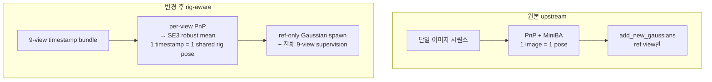

# 260413 - on-the-fly-nvs (rig) vs COLMAP (rig SfM) 비교 보고

---

## 1. 문서 목적

- Phase 4 파이프라인의 코드 변경 범위 정리
- COLMAP rig SfM 대비 등록률·속도·궤적 정확도 정량 비교
- 현재 blocking/non-blocking 이슈와 다음 작업 정리

---

## 2. 실행 환경

| 항목 | 값 |
|---|---|
| GPU | RTX 4060 Ti 16GB |
| Python 환경 | `conda activate onthefly_nvs` |
| 데이터셋 | 새빛관 U-턴 시퀀스 |
| 해상도 | 960 × 960 |
| 공통 intrinsics | `fx=fy=cx=cy=480` (고정) |
| Ref view | `High_Cam07` |
| Keyframe 수 | 23 timestamps × 9 views = 207 images |

---

## Part 1. 코드 변경 요약

### 3. upstream 대비 변경 범위

| 구분 | 파일 | 상태 | 변경 목적 |
|---|---|---|---|
| Rig 수학 엔진 | `rig/__init__.py` | NEW | 모듈 re-export |
| | `rig/rig_loader.py` (82줄) | NEW | blender_rig.json → COLMAP 좌표계 relative pose 변환 |
| | `rig/se3_utils.py` (149줄) | NEW | SE(3) log/exp, Fréchet mean, IRLS robust mean |
| | `rig/rig_pnp.py` (89줄) | NEW | per-view PnP → SE(3) robust combine |
| 데이터 로더 | `dataloaders/rig_image_dataset.py` (~156줄) | NEW | 9-view timestep 단위 로딩, ref first yield |
| Bundle Adjustment | `poses/mini_ba_rig.py` (303줄) | NEW | Rig-constrained LM BA (Schur complement, 6D rotation) |
| Pose 추정 | `poses/pose_initializer.py` | MOD | `initialize_bootstrap_rig()`, `initialize_incremental_rig()` 추가 |
| 학습 루프 | `train.py` | MOD | rig 브랜치 전체 (bootstrap + incremental) |
| Scene | `scene/scene_model.py` | MOD | 0-frustum guard, is_test 제외 |
| CLI | `args.py` | MOD | `--use_rig`, `--rig_config`, `--ref_view` |

### 4. 핵심 설계 결정

| 설계 포인트 | 선택 | 이유 |
|---|---|---|
| Rig pose 결합 | per-view PnP → SE(3) robust mean |  |
| Pose averaging | Lie algebra Fréchet mean + IRLS Huber | SO(3)는 manifold → 단순 행렬 평균 불가. Huber로 outlier down-weight |
| Gaussian 추가 | ref_view에서만 | rotation-only rig → baseline=0 → non-ref에서 depth 결정 불가 (degenerate triangulation) |
| Keyframe 매칭 | per-view prev_keyframes | 360° rig 특성상 U-turn에서도 항상 어떤 view는 이전 프레임과 overlap 존재 |
| Bootstrap BA | rig-constrained LM (timestep당 9D) | view별 독립 최적화 대신 rig constraint로 자유도 축소 → 안정성 확보 |
| Rotation 표현 | 6D (두 열벡터 + Gram-Schmidt) | gimbal lock 없이 매끄러운 gradient 제공 |

### 5. 프로세스 비교



---

## Part 2. COLMAP 대비 정량 비교

### 6. 등록률

| | on-the-fly-nvs (rig) | COLMAP (rig SfM) |
|---|---:|---:|
| Rigs / Frames / Images | 1 / 23 / **207** | 1 / 23 / **207** |
| 등록률 | **100%** | **100%** |

`num_iterations=2` (smoke-level)에서도 pose 추정은 완벽하게 동작함.

### 7. 소요 시간

Bootstrap median depth 0.1 정규화로 on-the-fly-nvs 절대 스케일이 COLMAP보다 약 9.4× 작음 (Umeyama scale = 9.3777).

| 단계 | on-the-fly-nvs | COLMAP | 배율 |
|---|---:|---:|---:|
| Feature extraction | 포함 (아래 총합) | 4.7 s | — |
| Rig configuration | 포함 | < 1 s | — |
| Matching | ≲ 수 초 (per-view prev-kf) | 119 s (sequential + rig verification) | — |
| BA / Pose 추정 | ≲ 수 초 (MiniBARig + incremental) | 43 s (global rig BA) | — |
| Gaussian optimization | 포함 (`num_iterations=2`) | N/A | — |
| **총합** | **27.3 s** | **167 s** | **6.1×** |

COLMAP 병목은 sequential_matcher(119s, 전체의 71%). Quadratic matching + rig verification이 대부분의 시간 차지.

### 8. 궤적 정확도 (ATE)

정렬: ref view(High_Cam07) camera center 23개 → Umeyama similarity 정렬 후 ATE 계산. Scale 9.38은 bootstrap median depth 0.1 정규화에 의한 것으로, COLMAP typical step ≈ 1 unit.

| 지표 | 값 | 비고 |
|---|---:|---|
| ATE mean | 0.1282 | trajectory 스케일(~12 unit) 대비 약 1% |
| ATE median | 0.1046 | |
| ATE max | 0.2789 | trajectory 스케일 대비 약 2.3% |
| ATE RMSE | 0.1404 | |

**구간별 분석:**

| 구간 | ATE 범위 | 특성 |
|---|---:|---|
| ts 0–7 (bootstrap) | 0.10 – 0.15 | MiniBARig 초기값. unit depth 초기화 한계로 약간 높음 |
| ts 8–16 (중간, U-turn 진입) | 0.07 – 0.11 | **최소 구간.** per-view PnP + IRLS가 충분한 overlap 아래 최고 정확도 |
| ts 17–22 (U-turn 복귀) | 0.12 – 0.28 | 단조 증가. loop closure 부재로 인한 incremental drift |

### 9. 궤적 시각화


*좌: 3D camera centres / 중: Top-down XZ / 우: Per-timestep ATE (mean=0.128, max=0.279)*

### 10. 260402 대비 개선

| 항목 | 260402 (Phase 2~3) | 260413 (Phase 4) |
|---|---|---|
| 등록률 | 20~23/23 (fallback 포함) | **23/23 (fallback 0)** |
| U-turn 구간 | pose 실패 → fallback → 발산 | 전량 등록 성공 |
| 10회 반복 fallback 0회 비율 | 4/10 (40%) | **10/10 (100%)** |
| Fallback Q std | 0.098 | N/A |
| Trajectory 후반 | 완전 발산 | 점진적 drift (max 0.28) |
| Timing 편차 (10회) | 미측정 | mean 27.50s ± 0.25s (~1%) |

핵심: per-view prev_keyframes + IRLS Huber Fréchet mean으로 fallback을 완전히 제거함.

**10회 반복 실험 상세:**

| run | keyframes | timesteps | time (s) | "Too few inliers" | rig_pose None |
|---:|---:|---:|---:|---:|---:|
| 1 | 207 | 23 | 27.45 | 0 | 0 |
| 2 | 207 | 23 | 27.52 | 0 | 0 |
| 3 | 207 | 23 | 27.43 | 0 | 0 |
| 4 | 207 | 23 | 27.43 | 0 | 0 |
| 5 | 207 | 23 | 27.49 | 0 | 0 |
| 6 | 207 | 23 | 27.64 | 0 | 0 |
| 7 | 207 | 23 | 27.39 | 0 | 0 |
| 8 | 207 | 23 | 27.47 | 0 | 0 |
| 9 | 207 | 23 | 27.53 | 0 | 0 |
| 10 | 207 | 23 | 27.61 | 0 | 0 |

- 등록률: 10/10 runs 모두 207/207 (100%)
- Fallback (rig_pose is None): 0회 × 10 runs
- "Too few inliers" 경고: 0회 × 10 runs
- Timing: mean 27.50s, min 27.39s, max 27.64s, 편차 ±0.25s (~1%)

---

## Part 3. 진행 상황 및 다음 작업

### 11. 미해결 이슈

| 우선순위 | 이슈 | 심각도 | 상태 |
|---:|---|---|---|
| 1 | CUDA rasterizer crash (`num_rendered=0`) | **Blocking** — `num_iterations ≥ 10` 불가 | Python guard로 우회 중. CUDA 커널 근본 수정 필요 |
| 2 | Huber weight 버그 (`mini_ba_rig.py` L137) | Non-blocking — 수학적으로 부정확하나 현재 치명적이지 않음 | `.sqrt()` 제거 1줄 수정 |
| 3 | 0-frustum guard 한계 (`scene_model.py`) | Non-blocking — #1 해결 시 같이 정리 | #1 CUDA patch 후 제거/soft guard로 전환 |
| 4 | Post-hoc render script 미작성 | Non-blocking — 정량 품질 평가 불가 | PSNR/SSIM/LPIPS 측정 스크립트 필요 |
| 5 | Cross-view matching 미구현 | Enhancement | per-view matching으로 100% 달성 중이라 비시급 |
| 6 | Scale normalization 하드코딩 (0.1) | Enhancement | `--scale_target` 인자 추가 또는 adaptive 방식 |

### 12. 다음 작업 순서

```
Step 1: CUDA rasterizer patch (blocking)
   └→ num_iterations=30 테스트 가능
Step 2: Huber weight 1줄 수정
   └→ bootstrap robustness 정상화
Step 3: render script 작성
   └→ PSNR/SSIM/LPIPS 정량 평가 시작
Step 4: 0-frustum guard 정리 (Step 1 전제)
Step 5: cross-view matching / scale normalization (필요 시)
```

---

## 13. 재현

### on-the-fly-nvs rig

```bash
cd /opt/ftp/files/260411/on-the-fly-nvs
conda run --no-capture-output -n onthefly_nvs python -u train.py \
    -s /opt/ftp/files/260411 --use_rig \
    --rig_config /opt/ftp/files/260411/blender_rig.json \
    --fix_focal --init_fov 90 \
    --viewer_mode none --num_iterations 2
```

### COLMAP rig SfM

```bash
cd /opt/ftp/files/260411/colmap_result
python3 make_rig_config.py
bash run.sh
```

### 궤적 비교 플롯

```bash
conda run --no-capture-output -n onthefly_nvs python \
    /opt/ftp/files/260411/colmap_result/compare_trajectories.py
```
