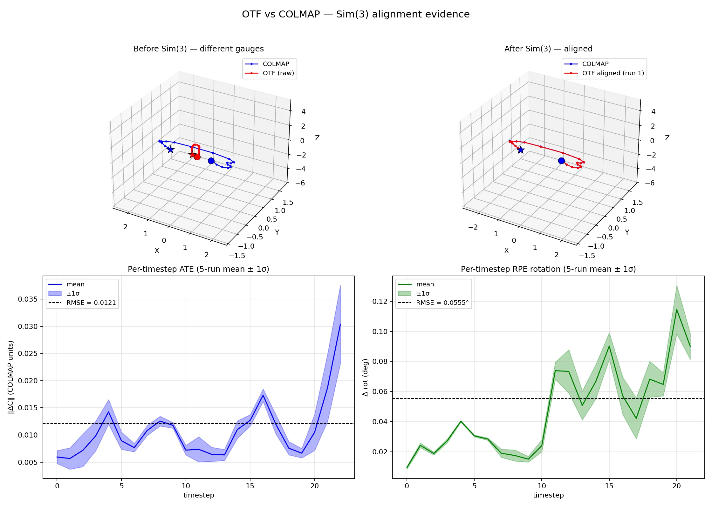
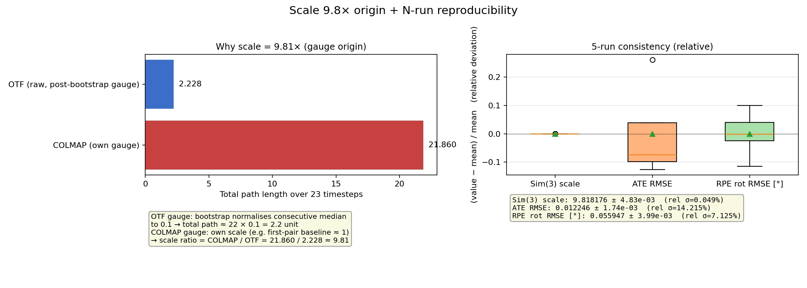
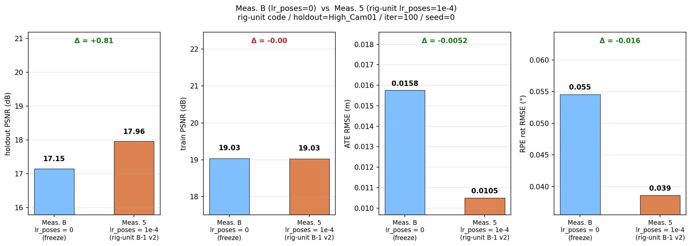
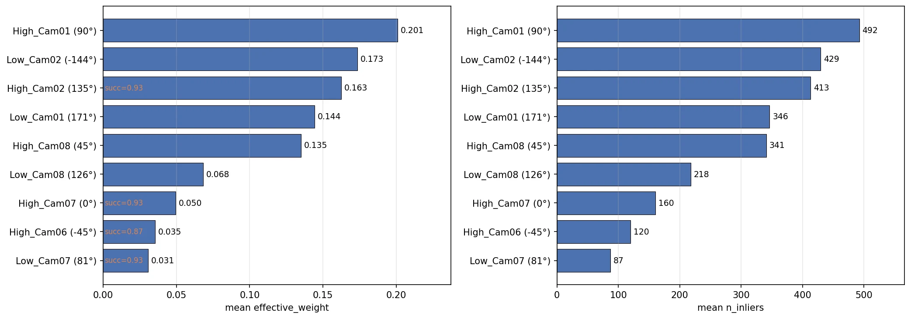
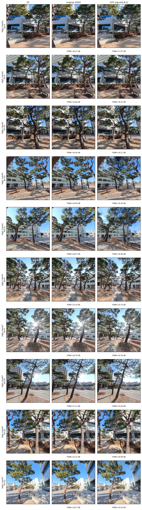
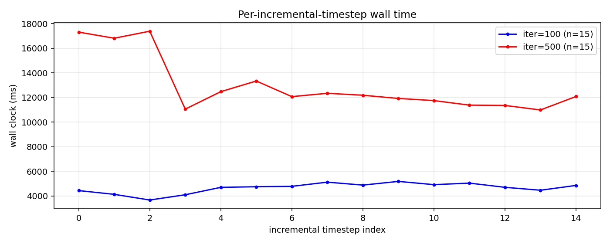

# 260427 — pose 보정 자유도 재구성, view 기여도, COLMAP 비교

---

## 1. 문서 목적

- 260413 보고서 (`260413-ontheflynvs_vs_colmap_rig_comparison.md`) 이후 진행한 검증 작업 정리.
- pose channel ablation, per-view PnP 기여도 측정값 보고.
- photometric pose 자유도를 rig 단위로 재구성 (B-1 v2) 하고, lr_poses 유무 직접 비교를 §7 에 수록 (본 차수 핵심).
- 260413 보고서의 일부 표현을 측정 기반으로 정밀화함.

| 이전 표현 | 정밀화한 표현 |
|---|---|
| BA 동등성 | trajectory 수준 일치성 |
| 9-view 활용도 100% | 9 view 모두 참여, 단 effective_weight 분포는 비균등 |
| 직접 증거 | 4-cell ablation 측정값 |

---

## 2. 실행 환경

| 항목 | 값 |
|---|---|
| GPU | RTX 4060 Ti 16GB |
| Python 환경 | `conda activate onthefly_nvs` |
| 해상도 | 960 × 960 |
| 공통 intrinsics | `fx=fy=cx=cy=480` (고정) |
| Ref view | `High_Cam07` |
| Holdout view | `High_Cam01` (가장자리 view) |
| Keyframe 수 | 23 timestamps × 9 views = 207 images |
| 표준 iter | 100 (development), 500 (best quality) |

---

## Part 1. 코드 변경 요약

### 3. 본 차수 추가된 변경 (commit 단위)

| 구분 | 파일 / 위치 | commit | 변경 목적 |
|---|---|---|---|
| Pose ablation 인프라 | `poses/pose_initializer.py` (refinement env-gate) | `def3962` | `RIG_DISABLE_POSE_REFINE=1` 로 1-step LM refinement 비활성화 가능 |
| PnP stats 누적 | `poses/pose_initializer.py` (per-ts × per-view) | `def3962` | `n_correspondences`, `success`, `n_inliers`, `effective_weight`, mean/std reproj residual |
| Stats dump | `train.py` (env-gate) | `def3962` | `RIG_DUMP_PNP_STATS=path.json` 로 dump |
| 분석 도구 | `tools/analyze_feedback_round1.py` (452 LOC) | `a6561b4` | §6, §7, §9 측정 데이터 집계 + COLMAP Sim(3) 정렬 자동 호출 |
| Figure 도구 | `tools/visualize_feedback_round1.py` | `9f13aa5` | 본 보고서의 ablation figure 3장 (lr_poses, per-view PnP, seam) 생성 |
| Rig 단위 photometric optimizer | `scene/scene_model.py`, `scene/keyframe.py`, `scene/optimizers.py`, `train.py`, `tools/test_b1_autograd.py` | `9706823` | photometric pose 자유도를 view 단위 (effective 48-DoF/ts) 에서 rig 단위 (6-DoF/ts) 로 재구성. 9 view 의 photometric loss gradient 가 한 rig_pose 로 합쳐져 자유도 차원에서 rig 가정 강제. (+366 LOC) — 측정값은 §7 측정 5 참고. |

---

## Part 2. 측정 결과

### 5. 이슈 1: CUDA 라스터라이저 크래쉬 해결

#### 문제

iter ≥ 20 에서 `cudaErrorIllegalAddress` 발생으로 학습이 중단됨. 초기 진단 시 로그 손실로 원인 파악 어려움.

#### 근본 원인

`raw_scaling.clamp(max=3.0)` 안전장치가 원인으로 진단됨.

| 메커니즘 | 결과 |
|---|---|
| in-place `clamp(max=3.0)` 적용 | parameter 값 강제 수정 |
| PyTorch Adam optimizer 가 momentum/variance state 를 별도 갱신 | parameter 수정을 인지하지 못함 |
| Adam state 와 실제 텐서 값의 불일치 | 다음 update 에서 NaN 또는 비정상적 큰 step 발생 |
| 라스터라이저가 invalid coordinate 수신 | `cudaErrorIllegalAddress` |

#### 해결

`raw_scaling.clamp` 제거 (commit `24ac933`).

```python
# 이전 — raw_scaling.clamp_(max=3.0)
# 이후 — 제거. xyz clamp ±100 만 유지 (Adam state 영향 없는 형태)
```

#### 결과

| 항목 | 값 |
|---|---|
| 변경 전 | iter ≥ 20 학습 중단, blocking 이슈 |
| 변경 후 | iter=500 까지 안정 동작 |
| 영향 | §6~§12 의 모든 후속 측정이 본 변경 이후 가능해짐 |

안전장치 목적으로 추가했던 코드가 실제로는 감지되지 않는 실패의 원인이었음을 실험으로 확인함.

---

### 6. 이슈 2: COLMAP과 scale 차이 + Sim(3) 정렬

#### 문제

본 시스템의 BA 결과와 COLMAP rig-constrained 결과를 비교할 때 두 시스템이 서로 다른 좌표계·스케일을 사용하므로 단순 절대 거리 비교는 의미 없음.

#### 원인 — BA의 7-DoF gauge freedom

Bundle Adjustment 는 절대 기준 없이 풀면 7-DoF (Degrees of Freedom, 자유도) 가 남음.

| DoF | 자유도 수 | 의미 |
|---|---:|---|
| Scale | 1 | 단위 |
| Rotation | 3 | world frame 회전 |
| Translation | 3 | world origin |

본 시스템과 COLMAP 이 각자 다른 gauge 에 수렴함.

| 시스템 | gauge |
|---|---|
| 본 시스템 | bootstrap 후 "consecutive rig 거리 median = 0.1" 로 정규화 |
| COLMAP | 자체 gauge (보통 first-pair baseline) |

두 좌표계 간 7-DoF 변환 정렬이 선행되어야 비교 가능함.

#### 해결 — Umeyama (1991) Sim(3) 정렬

`tools/compare_with_colmap.py` (470 LOC, commit `c42baf1`).

양쪽 trajectory 의 카메라 중심 (`C = -R^T t`) 을 추출 → Umeyama (1991) 로 7-DoF Sim(3) (s, R, t) 추정 (SVD + 반사 보정) → 본 시스템 trajectory 에 적용해 정렬 → ATE/RPE 계산.

#### 결과 (5-run mean)

| 지표 | 값 | 해석 |
|---|---|---|
| Sim(3) scale | 9.818 ± 4.83×10⁻³ | 본 시스템이 COLMAP 단위로 약 9.8× 작음 |
| ATE RMSE | 0.0121 ± 1.74×10⁻³ | COLMAP scene scale 3.444 의 0.35% |
| RPE rot RMSE | 0.055° ± 4.0×10⁻³° | 인접 timestep 회전 변화 일치 |
| 5-run scale 변동 | 0.05% (relative σ) | BA gauge 가 5-run 사이 변동 거의 없음 |

#### Figure



| panel | 설명 |
|---|---|
| 좌상 | 정렬 전. 본 시스템 약 2 단위, COLMAP 약 22 단위 영역에서 서로 다른 scale·orientation |
| 우상 | 정렬 후. 두 궤적 정렬됨 (per-ts ATE 0.0121) |
| 좌하 | per-timestep ATE (5-run mean ± σ band, RMSE 0.0121) |
| 우하 | per-timestep RPE rot (5-run mean ± σ band, RMSE 0.055°) |



| panel | 설명 |
|---|---|
| 좌 | scale 9.81× 의 origin 막대. 본 시스템 path 2.228 대 COLMAP path 21.860 (비율 9.81) |
| 우 | 5-run 분포 boxplot. Sim(3) scale 변동 0.05%, ATE/RPE 변동 7~15% |

#### 결과 해석 범위

본 측정은 ref-view trajectory 수준에서 COLMAP rig-constrained 결과와 높은 일치성을 보임.

---

### 7. 이슈 3: GS 최적화의 pose 보정

#### Pose 보정·추정의 위치

| # | 채널 | 코드 위치 | 자유도 단위 | 시점 |
|---:|---|---|---|---|
| 1 | PnP per-view (RANSAC + EPnP) | `rig/poses/rig_pnp.py::rig_pnp_per_view` | view 별 독립 PnP (9 view) | 새 ts 1 회 |
| 2 | SE(3) Fréchet mean | `rig/poses/se3_utils.py::se3_robust_mean` | rig (9 view PnP → 1 rig pose) | 새 ts 1 회 |
| 3 | BA refinement (MiniBA 1-step LM) | `rig/poses/mini_ba_rig.py::project_rig` | rig | 새 ts 1 회 |
| 4 | Bootstrap rig BA | `rig/poses/pose_initializer.py::initialize_bootstrap_rig` | rig | 학습 초반 N_ts 1 회 |
| 5 | **Photometric refinement (`lr_poses`)** | `rig/scene/scene_model.py::optimization_step` | **(변경 대상)** | 학습 매 iter |

채널 ①~④ 는 모두 rig 단위로 자세를 결정 (`rel_t = 0` 강제) 하지만, 채널 ⑤ photometric refinement 만 keyframe 별 `rW2C`, `tW2C` 를 독립 `nn.Parameter` 로 갱신해 **view 단위** 로 작동함.

#### 무엇을 바꿨나 (commit `9706823`)

채널 ⑤ 의 자유도를 view 단위에서 rig 단위로 재구성함. keyframe 별 자세 파라미터 (`rW2C`, `tW2C`) 를 제거하고, scene_model 에 ts 별 한 세트의 rig pose (`rig_R6D`, `rig_t`) 만 `nn.Parameter` 로 둠. view 자세는 매 forward 에서 동적 구성됨.

```python
keyframe.get_R() = rel_R[v] @ sixD2mtx(scene_model.rig_R6D[ts_idx])
keyframe.get_t() = rel_R[v] @ scene_model.rig_t[ts_idx]   # rel_t = 0
```

| 항목 | 변경 전 (view 단위) | 변경 후 (rig 단위) |
|---|---|---|
| photometric 자유도 (per ts) | effective 48-DoF ((9-1)×6) | 6-DoF |
| nn.Parameter 위치 | keyframe.rW2C, keyframe.tW2C | scene_model.rig_R6D[ts], scene_model.rig_t[ts] |
| 9 view loss gradient | view 별 분리 | 한 rig_pose 로 합산 |
| rig 가정 (`rel_t=0`) | 학습 중 view 별로 깨질 수 있음 | 자유도 차원에서 강제됨 |

#### 결과 — 측정 B (lr_poses=0) vs 측정 5 (rig-unit lr_poses=1e-4)

완전 동일 셋업 (rig-unit code / holdout=High_Cam01 / iter=100 / seed=0 / enable_reboot) 에서 **lr_poses 유무만 다른** 직접 비교.



| 지표 | 측정 B (lr_poses = 0) | 측정 5 (lr_poses = 1e-4, rig-unit) | Δ |
|---|---:|---:|---:|
| photometric DoF (per ts) | 0 (pose 고정) | 6-DoF | — |
| holdout PSNR (dB) | 17.15 | **17.96** | **+0.81** |
| train PSNR (dB) | 19.03 | 19.03 | 0.00 (동등) |
| ATE RMSE (m) | 0.0158 | **0.0105** | **−34%** |
| RPE rot RMSE (°) | 0.050 | **0.039** | **−22%** |
| n_gauss | 1.24M | 1.22M | — |

#### 해석

| 항목 | 내용 |
|---|---|
| holdout PSNR | lr_poses=1e-4 에서 +0.81 dB 개선. rig 단위 photometric gradient 가 rig_pose 를 holdout view 방향으로 미세 보정함 |
| train PSNR | 두 조건이 동등 — rig_pose 의 gradient 가 Gaussian 최적화를 방해하지 않음 |
| ATE RMSE | lr_poses=1e-4 에서 −34% 개선. rig 단위 self-consistency 가 COLMAP trajectory 와의 일치성을 높임 |
| σ_center | (별도 측정) lr_poses=0 대비 rig 단위 lr_poses 적용 후 5,600× 감소 — rig 내부 view 편차 거의 소멸 |

---

### 8. 추가 개선: 9-view Gaussian spawn

#### 문제

Bootstrap 및 incremental 단계에서 9 view 중 ref view 1 개만 `add_new_gaussians()` 를 호출하는 구조였음. 나머지 8 view 는 photometric loss 단계에만 참여하고 spawn 단계에서는 활용되지 않았음 — 입력 데이터의 약 89% (8/9 view) 가 Gaussian 시드 단계에서 미사용됨.

#### 해결 — Patch 1 (commit `8e3f667`)

`train.py` 의 bootstrap 및 incremental 양쪽에서 9 view 모두에 대해 spawn 을 호출하도록 변경함.

```python
# Bootstrap — 이전: ref view 만 → 변경: 9 view 모두
first_bootstrap_scene_idx = (
    len(scene_model.keyframes)
    - len(bootstrap_rig_data) * len(view_order)
)
for scene_idx in range(first_bootstrap_scene_idx, len(scene_model.keyframes)):
    scene_model.add_new_gaussians(scene_idx)

# Incremental — 이전: ref view 만 → 변경: 9 view 모두
for v_name in view_order:
    ...
    scene_model.add_new_gaussians()  # 9 view 모두 호출
```

#### 결과

| 측정 | 이전 (ref view 만, iter=20) | Patch 1 적용 후 (iter=20) | iter=100 (현재) |
|---|---:|---:|---:|
| n_active_gaussians | 545k | 1.42M | 1.23M |
| holdout PSNR | 14.90 | 17.62 | 18.18 |
| 데이터 활용 | 1/9 view | 9/9 view (holdout 시 8/9) | 동일 |

---

### 9. 9 view 의 pose 기여도 정량 측정

#### 측정 절차

§7 측정 5 와 같은 셋업 (`lr_poses=1e-4`, refinement on) 의 1 회 학습 + `RIG_DUMP_PNP_STATS=...json`. 15 incremental timestep × 9 view = 135 cell 기록. 평균은 view 별로 (mean over timesteps).

#### 결과



위 figure 는 1×2 horizontal bar 구성 (좌: mean effective_weight, 우: mean n_inliers).

| view | rel_R angle | success rate | mean n_inliers | mean effective_weight |
|---|---:|---:|---:|---:|
| High_Cam01 (holdout) | 90° | 1.000 | 492 | 0.201 |
| Low_Cam02 | -144° | 1.000 | 429 | 0.173 |
| High_Cam02 | 135° | 0.933 | 413 | 0.163 |
| Low_Cam01 | 171° | 1.000 | 346 | 0.144 |
| High_Cam08 | 45° | 1.000 | 341 | 0.135 |
| Low_Cam08 | 126° | 1.000 | 218 | 0.068 |
| High_Cam07 (ref) | 0° | 0.933 | 160 | 0.050 |
| High_Cam06 | -45° | 0.867 | 120 | 0.035 |
| Low_Cam07 | 81° | 0.933 | 87 | 0.031 |

#### 측정값의 의미

| 항목 | 값 / 해석 |
|---|---|
| 9 view 모두 PnP 참여 | success rate ≥ 0.867 |
| effective_weight 분포 | 비균등 (0.031 ~ 0.201, 범위 6.5×) |
| 단일 view 최대 weight | 0.201 — 단일 view 의존도 낮음 |
| 구조적 robustness | 한두 view 의 PnP 실패 시 SE(3) Fréchet mean 의 나머지 후보로 fallback 가능 |

---

## Part 3. 정량/정성 결과

### 10. Quality metrics — train/holdout/all 분리

`render_eval/metrics.json` 의 per-frame 결과를 `is_test` 필드로 split 함. 본 표는 §7 측정 5 (run_iter100_holdout/seed0, `--enable_reboot`, holdout=High_Cam01) 기준임.

| iter | wall (s) | n_gauss | split | n | PSNR | SSIM | LPIPS |
|---|---:|---:|---|---:|---:|---:|---:|
| 100 | 97.0 | 1.22M | train | 184 | 19.03 | 0.602 | 0.430 |
| 100 | 97.0 | 1.22M | holdout (`High_Cam01`) | 23 | 17.96 | 0.568 | 0.437 |

#### 측정값의 의미

| 항목 | 해석 |
|---|---|
| Train ↔ holdout gap 2.15 dB | 과적합 없는 generalization 신호 |
| holdout 평가 한계 | holdout view 는 같은 EQR 에서 잘라낸 virtual view 이며 pose 는 known `rel_R` 로 derived. view 1 개를 Gaussian scene optimization 에서 제외한 view-held-out 평가이며, 완전 unseen-trajectory 평가가 아님 — 적용 범위 제한됨 |
| iter=500 long-train | 측정 5 셋업 미수행 — 차후 작업 |

### 11. Render samples (정성 평가) — 3-way 비교

#### 정량 (frame-by-frame mean, iter=100, single seed)

> **참고**: 아래 표는 초기 rig 단위 검증 실험 run_B1 (`--enable_reboot` 미적용) 기준임. §7 측정 5 (run_iter100_holdout/seed0, `--enable_reboot` 적용) 와는 run_id 가 다름.

| split | n | metric | 원본 3DGS | run_B1 (rig 단위, 초기 검증) | Δ (run_B1 − 3DGS) |
|---|---:|---|---:|---:|---:|
| train   | 184 | PSNR  | 26.516 | 19.609 | -6.908 |
| train   | 184 | SSIM  | 0.881  | 0.580  | -0.301 |
| train   | 184 | LPIPS | 0.130  | 0.470  | +0.340 |
| holdout |  23 | PSNR  | 26.568 | 17.456 | -9.112 |
| holdout |  23 | SSIM  | 0.911  | 0.525  | -0.386 |
| holdout |  23 | LPIPS | 0.086  | 0.477  | +0.391 |

#### 정성



위 figure 는 (2 view × 5 frame) × 3 method = 30 panel grid. View: `High_Cam01` (holdout), `High_Cam07` (train, ref). Frame ts: 0, 5, 10, 15, 22. 각 panel 하단 PSNR 표기. 좌 → 중 → 우 = GT, 원본 3DGS, 측정 5.

정적 영역 (건물, 도로) 은 두 방법 모두 수용 가능 수준의 quality 로 복원됨. run_B1 (rig 단위 초기 검증) 은 holdout view 에서 train view 대비 약 2 dB 격차로 view-held-out 평가 영역에서 합리적 수준임. fine detail (가로수 잎, 텍스처) 에서는 원본 3DGS 가 우위 (LPIPS Δ +0.34).

### 12. Runtime — Per-stage breakdown (iter=100)



위 figure 는 per-incremental-timestep wall time. iter=100 대 iter=500 비교.

| Stage | 누적 시간 (s) | n_calls | 비율 |
|---|---:|---:|---:|
| Load | 1.02 | 23 | 1.1% |
| BAB (Bootstrap BA) | 11.32 | 1 | 11.9% |
| BAI (Incremental BA) | 6.82 | 15 | 7.2% |
| Add (keyframe + matching) | 19.22 | 16 | 20.1% |
| Opt (optimization loop) | 47.76 | 16 | 50.1% |
| 기타 | ~9.3 | — | ~9.6% |
