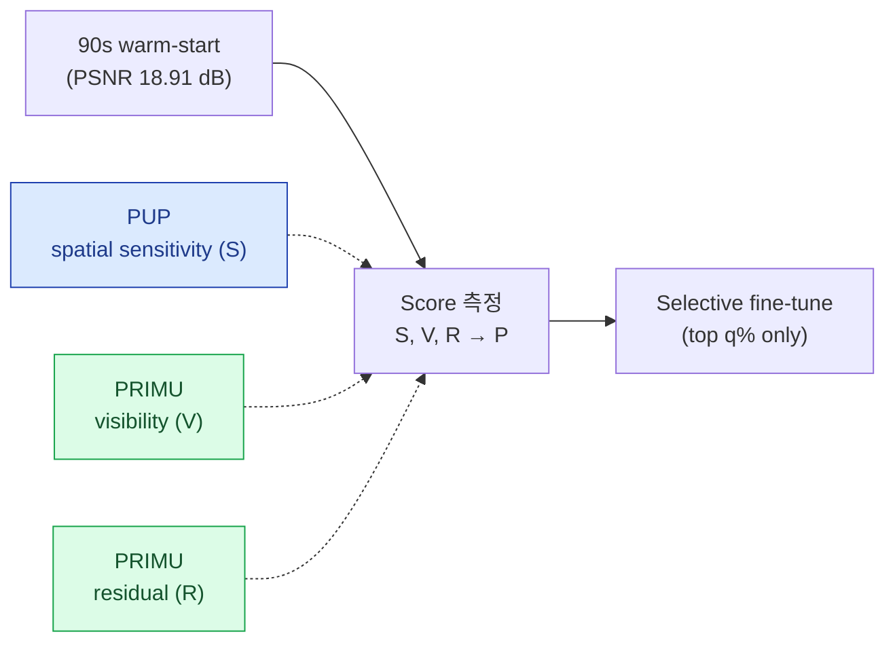

# Confidence-driven Warm-start Fine-tune 설계서

## 0. 요약

### 0.1 전체 흐름



- **PUP 3D-GS** 의 spatial sensitivity 와 **PRIMU** 의 visibility / residual contribution 을 결합한 3-axis score 와 그 priority 를 *rank 기반* 으로 정의함.

$$
P_i = \mathrm{rank}(R_i) + \mathrm{rank}(V_i) + U_i, \qquad U_i = 1 - \mathrm{rank}(S_i)
$$

이 priority 가 실제 fine-tune 대상 선정에 유효한지는 full / random / residual-only / sensitivity-only 와의 6-condition ablation 으로 검증함.

---

## 1. 목표

### 1.1 정의

> 90 초 warm-start 결과에서 각 Gaussian 의 상태를 정량화하고, fine-tune priority 가 높은 Gaussian 만 추가 학습했을 때 full fine-tune 에 가까운 품질 개선을 얻을 수 있는지 검증함.

### 1.2 검증 질문

| 질문 | 내용 |
|---|---|
| 측정 가능성 | 각 Gaussian 별로 "더 학습할 필요가 있는지" 를 정량적으로 표현 가능한가? |
| 선택 효과 | 일부 Gaussian 만 fine-tune 해도 full 대비 비슷한 품질을 얻을 수 있는가? |
| 선행 연구 | 이 가설을 부분적으로 뒷받침하는 선행 연구가 있는가? |

---

## 2. 관련 연구와 역할

단일 `gradient²` 가 낮은 5 가지 케이스 (① 잘 맞음 / ② 안 보임 / ③ opacity 죽음 / ④ saturated / ⑤ under-determined) 는 grad 만으로 분리 불가. 본 연구가 살리려는 것은 ⑤ 한 줄로, 분리에는 *parameter-side* (PUP) + *data-side* (PRIMU) 가 모두 필요.

### 2.1 PUP 3D-GS — Gaussian 별 spatial sensitivity

- 논문 페이지 : https://arxiv.org/pdf/2406.10219

- 학습된 3DGS 에서 각 Gaussian 의 spatial parameter (`xyz` + `scaling`) 가 reconstruction loss 에 얼마나 민감한지를 6×6 block Hessian / Fisher approximation 으로 측정함.
- 원래 목적은 low-sensitivity Gaussian pruning. 본 연구는 *측정 방법* 만 차용함.
- PUP 는 converged 3DGS 가정 (residual 이 작아야 Fisher approximation 정확). 본 base (90 초 warm-start) 는 unconverged → PUP-style sensitivity 단독 사용 X, PRIMU 의 visibility / residual 과 결합.

### 2.2 PRIMU — visibility 와 residual contribution

- 논문 페이지 : https://arxiv.org/pdf/2508.02443

- 학습된 3DGS 의 각 Gaussian primitive 마다 FoV count / coverage (`α_k T_k`) / error contribution 을 post-hoc 으로 측정함.
- 원래 목적은 novel view uncertainty 예측. 본 연구는 *분리 측정 아이디어* 만 차용해 "안 보이는 Gaussian" 과 "보이지만 error 에 기여하는 Gaussian" 을 분리.

---

## 3. 제안 방법

### 3.1 목표 Gaussian

> **training view에서 실제로 보이고, error가 큰 영역과 관련되어 있지만, spatial parameter 기준으로는 아직 안정적으로 정착되지 않았을 가능성이 있는 Gaussian**

이를 위해 Gaussian `i`마다 다음 세 축을 측정함.

| 축 | score | 의미 | 근거 |
|---|---|---|---|
| residual | `R_i` | error가 큰 영역과 관련되는가 | PRIMU |
| visibility | `V_i` | training view에서 실제로 관측되는가 | PRIMU |
| sensitivity | `S_i` | `xyz + scaling` 기준 loss에 얼마나 민감한가 | PUP |

---

### 3.2 세 score의 해석

`R_i`가 높다는 것은 해당 Gaussian이 reconstruction error가 큰 영역과 관련될 가능성이 높다는 뜻임.  
`V_i`가 높다는 것은 해당 Gaussian이 training view에서 실제로 보였고, fine-tune 시 학습 신호가 닿을 가능성이 높다는 뜻임.  
`S_i`는 PUP-style spatial sensitivity로, `xyz + scaling`의 6×6 Fisher matrix의 SVD log determinant로 계산함.

$$
S_i = \sum_{k=1}^{6} \log(\sigma_k^{(i)} + \epsilon)
$$

다만 `S_i`는 raw value가 음수가 될 수 있으므로 priority 계산에는 직접 사용하지 않고, percentile rank 기반 low-sensitivity score를 사용함.

$$
U_i = 1 - \mathrm{rank}(S_i)
$$

---

### 3.3 fine-tune priority

$$
P_i = \mathrm{rank}(R_i) + \mathrm{rank}(V_i) + U_i
$$


#### `P_i`가 높은 Gaussian의 성격

| 항목 | 의미 |
|---|---|
| `rank(R_i)` 높음 | error에 관련됨 |
| `rank(V_i)` 높음 | 실제로 관측됨 |
| `U_i` 높음 | spatial sensitivity가 낮음 |

따라서 `P_i`가 높은 Gaussian을 **추가 fine-tune 후보**로 선택함.

---

### 3.4 선택 방식

모든 Gaussian에 대해 `P_i`를 계산한 뒤, 상위 `q%`만 fine-tune 대상으로 선택함. 나머지 Gaussian은 gradient masking으로 freeze함.

```python
v.grad[~fine_tune_mask] = 0
```

---


## 4. 1차 실험 설계

### 4.1 데이터와 baseline

| 항목 | 설정 |
|---|---|
| Dataset | Insta360 9-rig × 23 timestamp |
| Image resolution | 960×960 |
| Training views | holdout 제외 rig views |
| Holdout | High_Cam01 × 23 timestamp |
| Baseline (C0) | 90 초 warm-start, holdout PSNR 17.96 / SSIM 0.568 / LPIPS 0.437 (전체 207 frame 평균은 18.91 / 0.599 / 0.431) |

### 4.2 6-condition ablation

| 조건 | subset 선택 기준 | 검증 목적 |
|---|---|---|
| C0 | 추가 학습 없음 | warm-start baseline |
| C1 | 전체 Gaussian | full fine-tune 기준선 |
| C2 | random visible 20% | random baseline |
| C3 | `R_i` 상위 20% | residual 단독 효과 |
| C4 | `U_i` 상위 20% (= `S_i` 하위 20%) | low-sensitivity 단독 효과 |
| **C5** | **`P_i` 상위 20%** | **제안 3-axis score 의 효과** |

### 4.3 평가 metric

| metric | 목적 |
|---|---|
| PSNR / SSIM / LPIPS | holdout view 품질 비교 |
| wall time | selective fine-tune 의 비용 이점 확인 (부가 지표) |
| active Gaussian 수 | q% mask sanity |

---

## 참고 문헌

- Alex Hanson et al. **PUP 3D-GS: Principled Uncertainty Pruning for 3D Gaussian Splatting**. CVPR 2025. arXiv: [2406.10219](https://arxiv.org/abs/2406.10219). Code: [github.com/j-alex-hanson/gaussian-splatting-pup](https://github.com/j-alex-hanson/gaussian-splatting-pup).
- Thomas Gottwald et al. **PRIMU: Uncertainty Estimation for Novel Views in Gaussian Splatting from Primitive-Based Representations of Error and Coverage**. arXiv: [2508.02443](https://arxiv.org/abs/2508.02443).
- Wilson et al. **POp-GS: Next Best View in 3D-Gaussian Splatting with P-Optimality**. arXiv: [2503.07819](https://arxiv.org/abs/2503.07819).
- Fan et al. **LightGaussian**. arXiv: [2311.17245](https://arxiv.org/abs/2311.17245).
- Meuleman et al. **On-the-fly Reconstruction for Large-Scale Novel View Synthesis from Unposed Images** (본 base). ACM TOG 44(4), SIGGRAPH 2025. arXiv: [2506.05558](https://arxiv.org/abs/2506.05558).
