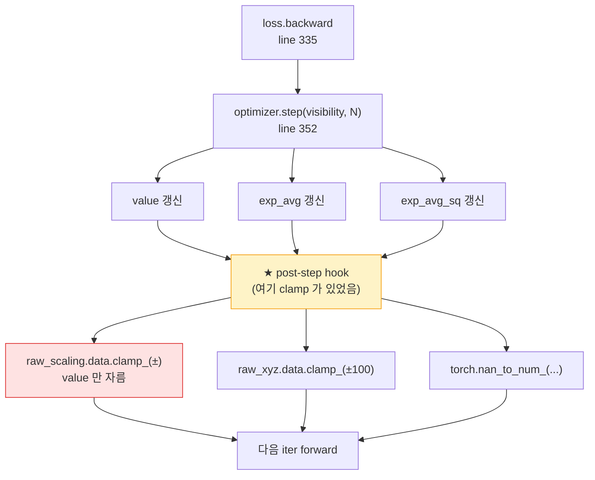
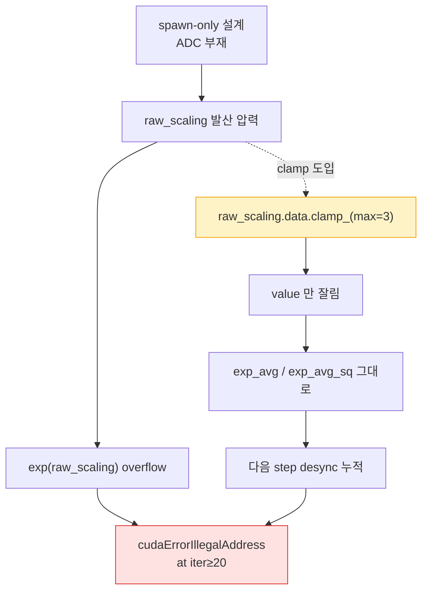

# `raw_scaling.clamp` 이슈 정리

## 1. 문제 상황

- rig pipeline 개선 과정에서 iter≥20 부근 CUDA illegal memory access 가 발생함.

---

## 2. 임시 안정화 조치

- raw_scaling 을 log-space 에서 [-10, 3] 으로 clamp함.
- 의도는 `exp(raw_scaling)` 의 상한 (`exp(3) = 20`) 을 두어 Gaussian size 폭발을 막는 것.

### 2.1 학습 step 위치



- `param.data.clamp_()` 형태 → autograd graph 와 무관하게 raw tensor 만 변경함.
- value 만 자르는 동안 `exp_avg` / `exp_avg_sq` 는 그대로 둔 것이 §4 의 desync 의 시발점.

---

## 3. 추가 관찰

- raw_scaling.clamp 가 포함된 설정에서 동일한 CUDA error 가 *재현* 됨.
- raw_scaling.clamp 제거 후 crash 해소됨.

| 항목 | 상태 | 위치 |
|---|---|---|
| `raw_scaling.clamp` | **제거됨** | commit `24ac933` (2026-04-25) |
| `raw_xyz.clamp(±100)` | 유지 | `scene/scene_model.py:365`. envelope 매우 넓어 학습 중 발동 빈도 낮음 |
| NaN guard (`nan_to_num_`) | 유지 | `scene/scene_model.py:367-371`, 5 key 에 적용 |
| cuda crash | 사라짐 | raw_scaling.clamp가 crash의 직접 trigger였을 가능성이 높음 |

---

## 4. 원인 해석

`raw_scaling.data.clamp_()` 는 parameter value 만 변경하고 Adam state 는 변경하지 않음. 따라서 실제 parameter 와 optimizer momentum 사이에 state mismatch 가 생김 (§3 표의 *cuda crash* row 참고).

### 4.1 같은 crash 로 이어지는 두 경로



- `param.data.clamp_()` 는 value 만 잘라내고 Adam 의 1·2 차 momentum (`exp_avg`, `exp_avg_sq`) 은 그대로 둠.
- 다음 iter 의 Adam step 이 cap 위쪽으로 갈 것을 가정한 통계로 갱신을 시도 → value 와 state 의 desync 누적.
- 누적된 desync 가 어느 시점 단일 update 를 비정상적으로 큰 값으로 만들고, 결과적으로 rasterizer 가 깨짐.
- 즉 *증상을 막으려던 cap 이 동일한 증상을 만들어내는* 역설 — 그림에서 두 경로가 같은 Crash 노드로 모임.

### 4.2 Adam state 정합성 — 본 base 의 표준 패턴

`scene/optimizers.py:121-144` 의 `SparseGaussianAdam.add_and_prune()` 가 올바른 패턴:

```python
param["val"]        = cat(param["val"][mask],        new)
param["exp_avg"]    = cat(param["exp_avg"][mask],    zeros)
param["exp_avg_sq"] = cat(param["exp_avg_sq"][mask], zeros)
```

| 항목 | 잘못된 패턴 (도입된 clamp) | 올바른 패턴 (`add_and_prune`) |
|---|:---:|:---:|
| `param["val"]` | 변경 ✓ | 변경 ✓ |
| `param["exp_avg"]` | 그대로 (변경 X) | 변경 ✓ |
| `param["exp_avg_sq"]` | 그대로 (변경 X) | 변경 ✓ |
| Adam 의 다음 step 일관성 | 깨짐 → desync 누적 | 유지 |

- value + exp_avg + exp_avg_sq 를 같은 mask 로 동시 처리하는 표준 패턴.
- 본 base 안 5 군데 (`add_new_gaussians` 등) 에서 사용됨.
- 도입된 clamp 는 이 패턴을 따르지 않고 value 만 잘라낸 것이 핵심 결함.

---

## 5. 구조적 원인

더 근본적으로는 현재 구현에 원본 3DGS 의 split / clone / prune 기반 ADC 가 없음. 따라서 일부 Gaussian 이 커지는 압력 자체는 여전히 존재함. clamp 는 *증상 cap* 이었고, 압력의 *원천* 은 ADC 부재 그 자체.

### 5.1 동작 비교 — 원본 3DGS vs on-the-fly NVS

| 동작 | 원본 3DGS (Kerbl 2023) | on-the-fly NVS (본 base) |
|---|---|---|
| 새 Gaussian 추가 | `densify_and_prune()` (every N iter, 보통 100) | `add_new_gaussians()` (keyframe 추가 시점만) |
| 큰 Gaussian → 작은 여러 개 분해 | **split** (gradient 큰 Gaussian 의 큰 축으로 둘로 나눔) | **없음** |
| 작은 Gaussian 복제 | **clone** (gradient 크고 size 작은 Gaussian 복제 후 약간 이동) | **없음** |
| Pruning | 매 N iter (opacity < threshold 또는 size > screen 비율) | spawn 시점만 (`opacity > 0.05` AND `screen_size < 0.5W`) |
| raw_scaling 발산 시 동작 | split 이 자동 분해 → scaling 자연 감소 | 분해 없음 → scaling 발산 누적 |

### 5.2 Iteration 흐름 비교

| 시점 | 원본 3DGS | on-the-fly NVS |
|---|---|---|
| spawn / 초기화 | COLMAP point cloud + densify init | keyframe 추가 시 `add_new_gaussians()` |
| iter 1 ~ (N−1) | photometric optimization | photometric optimization |
| iter N (densify trigger) | split / clone / prune 으로 Gaussian 집합 갱신 | 분해 메커니즘 부재 — 집합 그대로 |
| iter (N+1) ~ | 갱신된 집합으로 학습 (큰 Gaussian 분해된 상태) | 발산 압력이 누적된 채 학습 |
| 누적 결과 | scaling 분포 자연 유지 | raw_scaling 일부 unbounded |

- 원본 3DGS 는 *큰 Gaussian* 이 발생하면 split 으로 자동 분해 → `exp(raw_scaling)` 가 일정 한도 이하로 자연 유지됨.
- on-the-fly NVS 는 분해 메커니즘이 없어 큰 Gaussian 영역의 raw_scaling 이 photometric loss 압력에 따라 unbounded 로 누적. 

- 이 차이는 현재 구현에서 raw_scaling 이 제어되지 않고 증가할 수 있는 구조적 배경 원인으로 볼 수 있음.