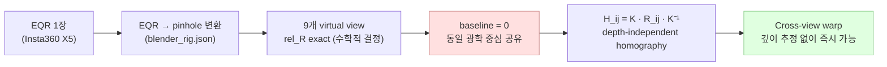
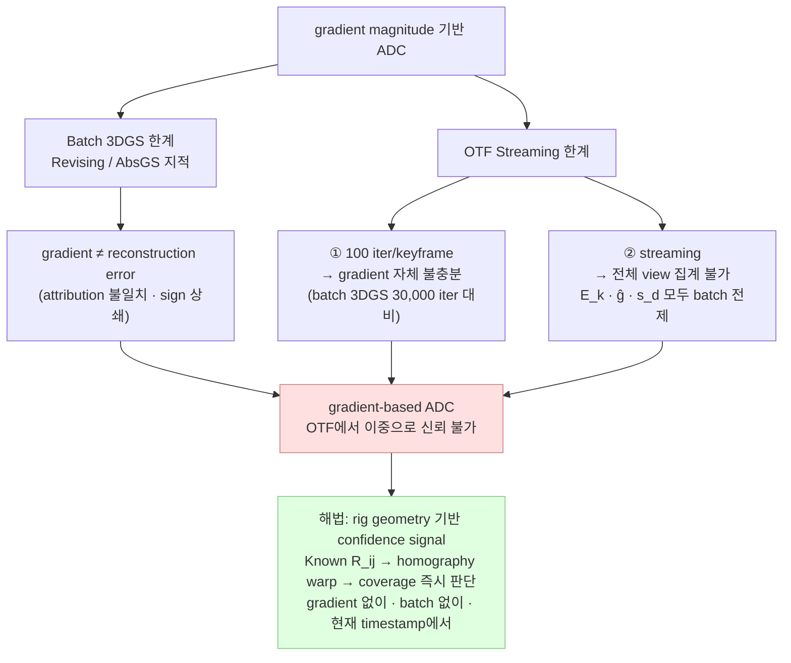
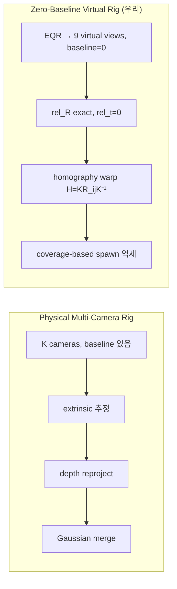
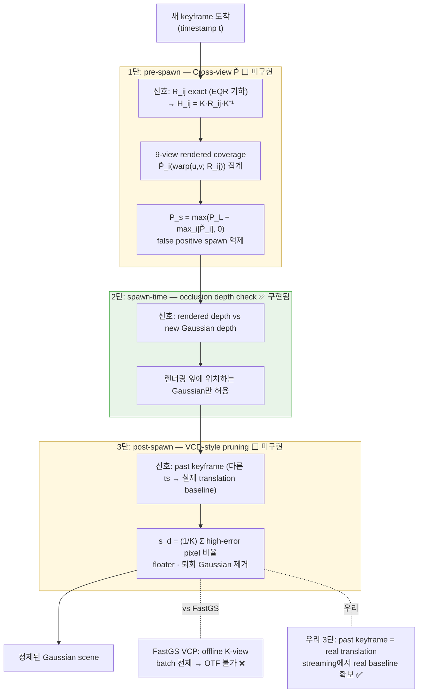

## 0. Executive Summary

| Track       | 내용                                           | 분석 결론                                                                                                 |
| ----------- | -------------------------------------------- | ----------------------------------------------------------------------------------------------------- |
| **Track 1** | 기존 GS 품질 이상 + 수십 배 빠른 결과                     | 단순 fast 3DGS는 이미 강하게 선점됨. 독립 novelty로 삼기 어려움                                                          |
| **Track 2** | Interactiveness + Rig, confidence-driven ADC | **핵심 novelty 가능.** ADC 이론 근거 3편 분석 완료. OTF streaming에서 rig prior가 gradient-free confidence signal로 기능 |

- **결론**
	- Track 1의 속도 향상은 "목적"이 아니라 "결과/lever"로 둠.
	- Track 2인 **zero-baseline rotation-only virtual rig를 이용한 streaming-compatible confidence-driven primitive lifecycle management**를 논문 핵심으로 세우는 것이 안전함.

---

## 1. 보고 목적

### 1.1 분석 내용

```
Track 1: Rig + GS 속도 향상
  → 기존 GS 품질 이상 + 수십 배 빠른 결과
  → 우선 속도 향상 reference 조사

Track 2: Interactiveness 유지 + Rig
  → Coarse-to-fine 정책
  → Confidence-driven adaptive density control (이론적 contribution)
  → On-the-fly 한계 ↔ batch 3DGS 장점을 confidence map으로 bridge
```

### 1.2 본 보고서의 목적

| 목적                         | 내용                                |
| -------------------------- | --------------------------------- |
| Track 1 reference 수치 검증    | 9편 논문 PDF 직접 파싱 + 웹 검증 — 수치 출처 명기 |
| Track 1 novelty 평가         | 단순 fast 3DGS로 논문을 낼 수 있는지 판단      |
| Track 2 이론 근거 정리           | ADC 실패 원인 → 우리 해법의 이론적 위치         |
| 직접 경쟁 reference 방어         | OTF rig 관련 논문과의 차별점 명확화           |
| PG 2026 contribution 구조 제안 | 4개 contribution + ablation 설계     |

---

## 2. 현재 연구 세팅

### 2.1 Insta360 X5 EQR 기반 9-view virtual rig

```
입력: Insta360 X5 → EQR 1장/timestamp
처리: EQR → 9개 perspective pinhole view (수학적 추출)
출력: 9-view × N timestamps → on-the-fly NVS
```

| 항목       | 값                                        | 비고                  |
| -------- | ---------------------------------------- | ------------------- |
| 카메라 기종   | Insta360 X5                              | 단일 렌즈               |
| 입력 형태    | EQR 1장/timestamp                         | —                   |
| view 수   | 9 (High_Cam01~08, Low_Cam01~02, 07~08 등) | blender_rig.json 정의 |
| Ref view | High_Cam07                               | —                   |
| 해상도      | 960×960 (pinhole crop)                   | —                   |

### 2.2 Rotation-only / zero-baseline 특성

현재 시스템의 가장 중요한 물리적 특성은 9개 view가 동일한 광학 중심을 공유한다는 것임.

| 특성                         | 값                                      | 영향                                      |
| -------------------------- | -------------------------------------- | --------------------------------------- |
| 카메라 간 translation baseline | **0** (rotation-only)                  | 동시각 triangulation 불가                    |
| 카메라 간 relative rotation    | EQR 기하에서 exact                         | 추정 오차 없음                                |
| depth 결정 방식                | 이전 keyframe temporal parallax          | mono depth prior (Depth Anything V2) 보조 |
| 동시각 homography             | H = K · R_ij · K⁻¹ (depth-independent) | translation=0이므로 성립                     |

- `rig/rig_loader.py` :

```python
Rt = torch.eye(4, dtype=torch.float32, device=device)
Rt[:3, :3] = rel_R
# Translation intentionally zero — rotation-only rig.
relative[name] = Rt
```

- 최적화 자유도 (`scene/scene_model.py` + `scene/keyframe.py`) :

| 방식 | DoF / timestamp | 근거 |
|---|---:|---|
| naive 9-view (독립 최적화) | 9 × 9 = 81 | view별 (R 6D + t 3) |
| **현재 rig 방식** | **9 (rig_R6D 6 + rig_t 3)** | timestamp당 rig pose 1개, view pose는 `rel_R @ rig_pose`로 유도 |



### 2.3 기존 OTF-NVS 대비 변경 지점

- 기반이 되는 upstream: On-the-fly NVS (Meuleman et al., SIGGRAPH 2025 / ACM TOG, arXiv:2506.05558).

| 항목 | Upstream OTF-NVS | 현재 rig-aware 시스템 |
|---|---|---|
| 입력 | 단일 카메라 순차 이미지 | EQR → 9-view virtual rig |
| Pose 추정 | 단일 카메라 PnP + MiniBA | per-view PnP → SE(3) Fréchet mean → MiniBA Rig |
| Gaussian spawn | ref view 1개 | ref view 기반 (non-ref depth 미결정) |
| Photometric supervision | 1 view/ts | 9 view/ts |
| Rig constraint | 없음 | rel_R exact, rel_t = 0 (hardcoded) |
| Bootstrap scale | — | translation 평균을 0.1로 normalize |

---

## 3. Track 1 — 3DGS 속도 향상 선행연구

### 3.1 Taming-3DGS

- **정식 인용**: Mallick et al., *Taming 3DGS: High-Quality Radiance Fields with Limited Resources*, SIGGRAPH Asia 2024 Conference Papers (Article 2)
- **arXiv**: 2406.15643

| 지표 | 값 | 바닐라 3DGS 대비 |
|---|---:|---:|
| 학습 시간 (Mip-NeRF 360) | 5.51 min | **3.3×** 단축 |
| PSNR | 27.61 dB | −0.11 dB |
| Gaussian 수 | 2.28M | −0.84M |

**핵심 기법**: per-splat 병렬 backward + budget-controlled score-based densification.

**우리 시스템 연관**: OTF-NVS 코드에서 `SparseGaussianAdam`이 Taming-3DGS backbone과 유사한 구조. 현재 코드 기반의 직접 선조.

### 3.2 DashGaussian

- **정식 인용**: Chen et al., *DashGaussian: Optimizing 3D Gaussian Splatting in 200 Seconds*, CVPR 2025
- **arXiv**: 2503.18402

| 데이터셋 | 학습 시간 | PSNR | 바닐라 대비 |
|---|---:|---:|---:|
| Mip-NeRF 360 | 3.23 min | 27.92 dB | **5.7×** |
| Deep Blending | 2.20 min | 30.02 dB | **7.9×** |
| Tanks & Temples | 2.62 min | 23.97 dB | **4.0×** |

**핵심 기법**: DFT energy ratio 기반 adaptive resolution scheduling (`r = X(I_r)/X(I)`) + P_fin momentum.

```
r = X(I_r) / X(I)    # LR DFT energy / HR DFT energy
r < τ_f → pyr_lvl 감소 (충분히 low-freq 표현이 됐을 때만 전환)
```

**우리 시스템 gap**: 현재 코드의 `pyr_lvl` 인프라는 존재하나 스케줄러가 고정 방식임.

```python
# 현재 코드 (keyframe.py)
if self.num_steps % 5 == 0:    # 고정 5-step마다
    if self.pyr_lvl > 0:
        self.pyr_lvl -= 1      # 무조건 감소
```

### 3.3 FastGS

- **정식 인용**: Ren et al., *FastGS: Training 3D Gaussian Splatting in 100 Seconds*, 저자 project page/GitHub 기준 CVPR 2026 Highlight (공식 CVF proceedings 2026-05-08 미발행)
- **arXiv**: 2511.04283

| 방법             | Mip-NeRF 360 시간 |      PSNR | Gaussian 수 |        DB 시간 |      PSNR |
| -------------- | --------------: | --------: | ---------: | -----------: | --------: |
| 바닐라 3DGS       |       20.93 min |     27.53 |      2.63M |    19.77 min |     29.71 |
| Taming-3DGS    |        5.36 min |     27.48 |      0.68M |     3.06 min |     29.50 |
| DashGaussian   |       6.35 min* |     27.73 |      2.40M |    4.16 min* |     29.65 |
| **FastGS**     |    **1.93 min** |     27.56 |  **0.40M** | **1.28 min** | **30.03** |
| **FastGS-Big** |    **3.58 min** | **27.93** |      1.15M |     2.00 min |     30.12 |

> *FastGS가 자체 GPU 환경에서 DashGaussian을 재측정한 값. DashGaussian 자체 보고 수치(3.23 min/27.92 dB)와 다름. GPU 환경 차이에 의한 것으로 각 논문 자체 보고가 primary reference.

**핵심 기법**: View-Consistent Densification (VCD) + View-Consistent Pruning (VCP). per-Gaussian의 K개 training view 평균 error로 densification/pruning 판단. Gaussian 수를 0.40M까지 대폭 감소.

**우리 시스템 연관**: FastGS의 "multi-view consistency 기반 spawn/prune"과 방향이 유사하나 핵심적으로 다름.

```
FastGS: 이미 존재하는 Gaussian의 K-view error 집계 → densification/pruning 결정
우리:   Gaussian 생성 전 9-view cross-view rendered coverage → false-positive spawn 억제
→ post-spawn management vs pre-spawn filtering
```

**Track 2에서 가장 직접적인 경쟁 reference.**

### 3.4 LiteGS / Speedy-Splat

**LiteGS** (Liao et al.)

- **venue**: arXiv 2025 preprint
- **arXiv**: 2503.01199

| 방법 | 학습 시간 (Mip-NeRF 360) | PSNR | 바닐라 대비 |
|---|---:|---:|---:|
| LiteGS-turbo | 145 s (2.4 min) | 27.70 dB | **11.2×** |
| LiteGS-balance | 301 s (5.0 min) | 28.13 dB | **5.4×** |
| LiteGS-quality | 515 s (8.6 min) | 28.25 dB | **3.2×** |

**핵심 기법**: warp-based CUDA rasterizer + Morton sorting dynamic spatial sorting. system/kernel-level co-design.

**Speedy-Splat** (Hanson et al., CVPR 2025, arXiv:2412.00578)

- 렌더링 속도 6.71×, Gaussian 수 10.6× 감소 — 학습 가속은 1.47× (제한적)
- 학습 속도 직접 reference보다는 pruning/rendering efficiency reference로 적합.

### 3.5 소결: 단순 fast 3DGS novelty의 한계

| 속도 달성 수준 | 달성 논문 | 학회 수준 |
|---|---|---|
| 3~6× | Taming-3DGS, DashGaussian | SIGGRAPH Asia 2024, CVPR 2025 |
| 10~11× | FastGS, LiteGS-turbo | CVPR 2026†, arXiv 2025 |

**결론**: "빠른 3DGS" 자체는 CVPR/SIGGRAPH 수준에서 이미 강하게 선점됨. 이들 방법은 전부 COLMAP pose + offline batch training을 전제로 함. 단순히 "더 빠른 학습"을 contribution으로 내세우면 novelty 약함.

**우리의 위치**: "OTF streaming 환경에서 rig prior를 이용해 이들 방법과 유사한 효율화 효과를 달성하는 것"이 안전한 framing.

---

## 4. Track 2 — Confidence-driven ADC 이론 근거

### 4.1 3DGS original ADC

- **정식 인용**: Kerbl et al., *3D Gaussian Splatting for Real-Time Radiance Field Rendering*, SIGGRAPH 2023 (ACM TOG Vol. 42 No. 4)
- **arXiv**: 2308.04079

- 기존 Adaptive Density Control (ADC):

```
clone: gradient magnitude > τ이고 scale 작은 Gaussian → 복사
split: gradient magnitude > τ이고 scale 큰 Gaussian → 2개로 분리
prune: opacity < ε인 Gaussian 제거
```

- 문제: **gradient magnitude가 충분히 누적되어야 ADC가 제대로 작동**함.

### 4.2 Revising Densification

- **정식 인용**: Bulò et al., *Revising Densification in Gaussian Splatting*, ECCV 2024 (Meta Reality Labs Zurich)

**핵심 진단**: gradient magnitude 기반 densification은 왜 실패하는가?

```
예시 (풀밭 씬):
  큰 Gaussian이 풀밭 전체를 커버하고 있음
  position 이동 → rendering에 거의 영향 없음 → gradient 작음
  → ADC가 "이 Gaussian은 괜찮다"고 판단 → split하지 않음
  → 실제로는 detail이 전혀 재현되지 않는 상태

문제: gradient(position) 작음 ≠ Gaussian이 잘 배치됨
```

**해법**: per-pixel error를 각 Gaussian의 rendering contribution에 비례하여 재분배.

```
E_k^π = Σ_u E^π(u) · w_k^π(u)    # view π에서 pixel u의 error를 Gaussian k의 weight로 분배
E_k = max_π E_k^π                  # 모든 view에서의 최대값 → Gaussian별 error attribution
```

- `E_k` 기반으로 densification 결정 → gradient없이 reconstruction error 직접 반영.

**우리와의 관계**: `E_k^π`는 모든 view 접근을 전제로 함 (batch). 우리의 Cross-view P̃는 현재 timestamp 9-view만으로 이 효과를 streaming에서 근사함.

### 4.3 AbsGS

- **정식 인용**: Ye et al., *AbsGS: Recovering Fine Details for 3D Gaussian Splatting*, ACM MM 2024 (Melbourne, pp. 1053–1061)
- **arXiv**: 2404.10484

**핵심 진단**: gradient collision.

```
같은 장면을 바라보는 여러 픽셀에서 Gaussian k의 ∂L/∂μ_k 방향이 서로 다름
→ 합산 시 상쇄 → magnitude 작아짐
→ "gradient 작다" = "위치가 정확하다"가 아닐 수 있음

예시:
  Gaussian이 boundary에 걸쳐있는 경우
  왼쪽 픽셀: "오른쪽으로 이동해야 한다"
  오른쪽 픽셀: "왼쪽으로 이동해야 한다"
  → gradient 합산 = 0에 가까워짐 → ADC가 densify하지 않음
```

**해법**: homodirectional gradient (각 픽셀의 gradient 절댓값을 먼저 합산).

```python
ĝ_i,x = Σ_j |∂L_j/∂μ_i,x|    # 부호 상쇄 없이 크기만 합산
```

- 코드 변경: AbsGS 자체 기준 CUDA 커널 한 줄 수정. 우리 rig 코드 적용 시 별도 검토 필요.

**우리와의 관계**: gradient 자체를 쓰지 않는 approach (Cross-view P̃의 LoG-based spawn)가 이 문제를 우회함. FastGS도 AbsGS의 absolute gradient를 채택.

### 4.4 3DGS-MCMC

- **정식 인용**: Kheradmand et al., *3D Gaussian Splatting as Markov Chain Monte Carlo*, NeurIPS 2024 Spotlight
- **arXiv**: 2404.09591

**핵심 통찰**: 기존 3DGS 최적화는 noise 없는 SGLD (Stochastic Gradient Langevin Dynamics).

```
기존 3DGS:  g ← g - λ_lr · ∇_g L
SGLD:       g ← g + a · ∇_g log P(g) + b · ε
→ loss = negative log likelihood로 보면 동일 (b=0일 때)
```

- noise term `b · ε`만 추가하면 완전한 MCMC sampling.

**Clone의 문제**: opacity α 그대로 복사 시 rendering: `(1-α)²`로 weight 줄어듦 → MCMC chain 붕괴.

**해법 (Relocation)**: dead Gaussian을 live Gaussian 근처로 이동, 단 이동 전후 rendering 동일하도록 attributes 세팅 → chain 확률 보존.

**우리와의 관계**:

```
3DGS-MCMC: spawn 이후 SGLD noise로 poorly-placed Gaussian이 better position 탐색
            → 잘못 태어난 Gaussian을 사후에 구제
우리:        spawn 전에 rig geometry로 false positive spawn 원천 차단
            → 처음부터 잘못 태어나지 않도록 예방

공통점: 둘 다 gradient 기반 ADC heuristic의 대안
```

### 4.5 소결: gradient-based ADC의 한계와 confidence signal의 필요성

**OTF streaming에서 ADC가 이중으로 실패하는 이유**:

```
일반 batch 3DGS에서의 한계 (Revising, AbsGS):
  gradient magnitude ≠ reconstruction error signal

OTF streaming에서 추가 악화:
  ① 100 iter/keyframe → gradient 자체가 불충분 (batch 3DGS 30,000 iter 대비)
  ② streaming → 과거 view 전체 집계 불가 (E_k, ĝ, s_d 모두 batch 전제)

→ gradient-based ADC는 OTF에서 이중으로 신뢰할 수 없음
```

| batch 방법 | 요구 조건 | OTF에서 충족 여부 |
|---|---|---|
| Revising E_k^π | 모든 view 접근, 많은 iter | ❌ (streaming, 100 iter) |
| AbsGS ĝ | 많은 iter, 안정된 gradient | ❌ (100 iter) |
| FastGS VCD s_d | K개 training view 전체 | ❌ (streaming) |



**우리의 bridge**: Known R_ij (rig geometry) → 현재 timestamp만으로 즉각적인 coverage signal 확보. §6.2 C2에서 구체화.

---

## 5. On-the-fly / Pose-free / Rig 관련 직접 선행연구

### 5.1 On-the-fly NVS (upstream)

- **정식 인용**: Meuleman et al., *On-the-fly Reconstruction for Large-Scale Novel View Synthesis from Unposed Images*, SIGGRAPH 2025 / ACM Transactions on Graphics
- **arXiv**: 2506.05558 · ACM DOI: 10.1145/3730913

현재 시스템의 직접 upstream. monocular sequential → pose + 3DGS joint optimization. 우리는 이 위에 rotation-only 9-view virtual rig를 구조적으로 삽입함.

### 5.2 CF-3DGS

- **정식 인용**: Fu et al., *COLMAP-Free 3D Gaussian Splatting*, CVPR 2024 (pp. 20796–20805)
- **arXiv**: 2312.07504

**핵심**: video temporal continuity를 이용해 sequential하게 Gaussian grow. local 3DGS로 relative pose 추정 → global 3DGS로 누적.

**우리와의 차이**:

| 항목 | CF-3DGS | 현재 시스템 |
|---|---|---|
| pose 추정 기반 | local Gaussian (이전 프레임 1개) | feature matching + mini BA (다수 keyframe, 9-view) |
| scale normalization | 없음 → sequential drift 가능 | bootstrap 후 0.1로 normalize (코드 확인) |
| 동시각 rig | 없음 (mono) | 9-view exact R_ij |

```python
# image_dataset.py — scale normalization 코드 확인
rel_ts = centres[:-1] - centres[1:]
scale = 0.1 / rel_ts.norm(dim=-1).mean()   # 평균 이동거리 → 0.1로 normalize
```

- CF-3DGS에는 이 normalize 없음 → 장면마다 scale 달라짐.

### 5.3 OTF Multi-Camera Rigs

- **정식 인용**: Guo et al., *On-the-fly Large-scale 3D Reconstruction from Multi-Camera Rigs*, arXiv:2512.08498 (2025-12)
- venue: arXiv 2025

**핵심**: physical multi-camera rig (헬멧/드론 장착, 실제 translation baseline 있음)에서 들어오는 K개 RGB 스트림을 on-the-fly로 3DGS 재건. "first on-the-fly 3D reconstruction framework for multi-camera rigs" 주장.

**우리와의 차이 (방어 핵심)**:

| 항목 | OTF Multi-Camera Rigs | 현재 시스템 |
|---|---|---|
| 하드웨어 | 물리 카메라 K대 (overlapping FOV) | 단일 EQR 카메라 1대 |
| translation baseline | **수십 cm (실제 존재)** | **0 (rotation-only)** |
| extrinsic 출처 | feature matching + mini BA (추정) | EQR 기하에서 exact |
| redundancy 처리 | depth 비교 기반 Gaussian merge | homography-based coverage spawn 억제 |
| 대상 규모 | km 스케일 야외 | 일반 OTF NVS |

**핵심 역설**: translation baseline이 없어 depth 기반 merging은 불가능하지만, 그 대신 translation term이 0이므로 view 간 image warp가 perfect homography로 단순화됨.

```
H_ij = K · rel_R · K⁻¹    (rel_t = 0이므로 depth 항 없음)

→ depth를 모르는 채로 view i와 view j 사이 exact coverage projection 가능
→ Cross-view P̃의 이론적 기반
```

### 5.4 소결: physical rig와 zero-baseline virtual rig의 차이



- "OTF + multi-camera + 3DGS가 이미 있다"는 reviewer 질문에 대해, **하드웨어 가정 자체가 다른 문제를 풀고 있음**을 명확히 해야 함.

---

## 6. 제안 연구 방향

| Contribution                                        | Track 연결             | 핵심 이론 근거                                 | 구현 상태  |
| --------------------------------------------------- | -------------------- | ---------------------------------------- | :----: |
| C1 Structural Zero-Baseline Rig Parameterization    | Track 2 (Rig)        | EQR 기하 exact → DoF 9/timestamp           |   ✅    |
| C2 Cross-View Rendered-Coverage Aggregation         | Track 2 (Confidence) | Revising E_k^π · AbsGS ĝ → coverage로 대체  |   ⬜    |
| C3 Streaming-Compatible Confidence-Driven Lifecycle | Track 2 (Confidence) | FastGS VCD/VCP → streaming 버전            | ⬜ 1·3단 |
| C4 OTF-Compatible Coarse-to-Fine Scheduling         | Track 1+2            | DashGaussian DFT adaptive → bootstrap 대체 |   ⬜    |

### 6.1 C1: Structural Zero-Baseline Rig Parameterization

**내용**: EQR → rotation-only virtual rig 물리적 제약을 structural prior로 전환. rel_t = 0 hardcode → pose optimization이 rotation manifold에만 집중.

```python
# keyframe.py — rig mode에서 per-view pose 조립
R_view = rel_R @ sixD2mtx(rig_R6D[ts])   # rel_R: EQR 기하에서 exact, 고정
t_view = rel_R @ rig_t + 0               # rel_t = 0 hardcoded
```

**실험 가능 비교**: naive 9-view independent 최적화 vs structural rig parameterization.

### 6.2 C2: Cross-View Rendered-Coverage Aggregation (Cross-view P̃)

**내용**: 동일 timestamp 9-view exact homography warp → streaming 내에서 gradient 없이 spawn coverage 즉시 판단.

```
P_s(u,v) = max(P_L(u,v) - max_i[P̃_i(warp(u,v; R_ij))], 0)

P_L:  LoG-based spawn probability at view ref
P̃_i: rendered coverage probability at view i
warp: H_ij = K · rel_R · K⁻¹ (depth-independent homography)
```

- Axis C 방법들과의 비교:

| 방법 | 작동 원리 | OTF 호환성 |
|---|---|---|
| Revising Densification E_k^π | 모든 view error attribution | ❌ batch 전제 |
| AbsGS ĝ | gradient 절댓값 합산 | ❌ batch + 충분한 iter 필요 |
| FastGS VCD s_d | K-view 평균 error | ❌ 전체 training view 전제 |
| **Cross-view P̃** | rendering coverage homography warp | ✅ 현재 ts만으로 즉시 |

**구현 caveat**: FOV mask (EQR 극지방 영역), 해상도 mismatch 시 bilinear interpolation 오차, boundary 픽셀 처리. "exact homography"가 아닌 "near-exact coverage estimation"으로 표현.

### 6.3 C3: Streaming-Compatible Confidence-Driven Primitive Lifecycle (3단 방어선 설계)

**내용**: spawn → existence → removal을 confidence signal로 관리.

```
1단 (pre-spawn): Cross-view P̃ → false positive spawn 억제
   신호: Known R_ij exact → homography warp → coverage 비교
   효과: P_add↓ → P_fin↓ (DashGaussian P_fin momentum) → Gaussian budget↓

2단 (spawn-time): occlusion depth check (기존 코드)
   신호: rendered depth vs new Gaussian depth
   효과: 렌더링 앞에 위치하는 새 Gaussian만 허용

3단 (post-spawn): VCD-style past-keyframe pruning
   신호: 과거 keyframe (다른 ts = 다른 translation → real baseline)
   효과: floater + 퇴화 Gaussian 사후 제거

   s_d^i = (1/K) Σ_j Σ_{p∈Ω_i} I(L1 error at p > τ)
   K = get_prev_keyframes() ← 다른 ts → 실제 translation 확보됨
```



**이론 배경 논문 매핑**:

| 방어선 | 선행 이론 | 관계 |
|---|---|---|
| 1단 Cross-view P̃ | Revising Densification (ECCV 2024) | error attribution → coverage attribution으로 대응 |
| 1단 Cross-view P̃ | AbsGS (ACM MM 2024) | gradient collision → gradient 자체를 쓰지 않음으로 우회 |
| 1단 Cross-view P̃ | FastGS VCD (CVPR 2026†) | K-view error → same-ts 9-view coverage로 streaming 버전 |
| 3단 VCD-style prune | FastGS VCP (CVPR 2026†) | offline K-view → past keyframe = real translation |
| probabilistic spawn | 3DGS-MCMC (NeurIPS 2024) | SGLD noise → P_s 확률적 spawn이 유사 탐색 역할 |

**구현 현황**: 1단 ⬜ 미구현 / 2단 ✅ 기존 코드 / 3단 ⬜ opacity-only prune 현재 사용

### 6.4 C4: OTF-Compatible Coarse-to-Fine Scheduling

**내용**: DashGaussian의 DFT adaptive schedule을 OTF bootstrap과 결합.

**현재 gap**:

| 항목 | 현재 코드 | DashGaussian 방식 |
|---|---|---|
| 전환 기준 | 고정 (5 step마다) | adaptive (DFT ratio r < τ_f 시) |
| 어려운 장면 | 이미 step 5에서 HR로 전환 | LR stage 더 유지 |
| 쉬운 장면 | 불필요하게 LR 유지 가능 | 빠르게 HR 전환 |

**OTF 제약 해법 (제안)**:

```
DashGaussian: 전체 scene DFT energy X(I)를 사전에 앎 (offline)

제안: bootstrap (9-view × N_init frames) → X(F) 추정
→ streaming 중 X(I_r)/X(F) 비율로 각 keyframe pyr_lvl 전환 결정
→ DashGaussian의 offline 전제를 rig bootstrap으로 대체한다는 아이디어
```

> ⚠️ bootstrap X(F)가 전체 scene X(I)의 유효한 대리 추정이 되는지는 수학적·실험적으로 검증되지 않음. 아이디어 제안 단계.

**구현 현황**: ⬜ pyr_lvl 인프라 존재 (`pyr_levels=2`, `pyr_lvl` per keyframe, `keyframe.py` L61/L298–307). adaptive 스케줄러 미구현.

---

## 7. 실험 및 Ablation 계획

### 7.1 Baseline 구성

| Baseline | 설명 |
|---|---|
| [A] OTF-NVS original (upstream, mono) | Meuleman et al. SIGGRAPH 2025 |
| [B] OTF + naive 9-view | view 추가 효과만 측정 (independent optimization) |
| [C] OTF + structural rig pose (C1) | pose DoF 축소 + rig constraint |
| [D] +Cross-view P̃ (C2) | false-positive spawn 감소 |
| [E] +DFT adaptive coarse-to-fine (C4) | resolution scheduling 개선 |
| [F] +VCD-style past-keyframe pruning (C3 3단) | floater 제거 |

### 7.2 단계별 ablation

- 각 단계를 순서대로 추가하면 각 contribution을 isolate할 수 있음. A → B → C → D → E → F 순서로 실험.

### 7.3 측정 지표

| 지표                     | 설명                          | 비고                           |
| ---------------------- | --------------------------- | ---------------------------- |
| PSNR / SSIM / LPIPS    | 렌더링 품질                      | Mip-NeRF 360 또는 자체 EQR scene |
| Gaussian count (P_fin) | spawn 효율                    | Cross-view P̃ 효과 확인          |
| spawn count (P_add)    | false positive spawn 수      | 1단 방어선 효과                    |
| keyframe latency (s)   | streaming 실시간성              | OTF 적합성                      |
| total sequence time    | 전체 처리 시간                    | Track 1 근거                   |
| ATE / RPE              | pose 정확도                    | rig constraint 효과            |
| n_floaters             | depth residual 기반 floater 수 | 3단 pruning 효과                |

### 7.4 성공 기준

| 기준          | 내용                                                                                                     |
| ----------- | ------------------------------------------------------------------------------------------------------ |
| 품질 유지       | 베이스라인 대비 PSNR −0.5 dB 이내                                                                               |
| 속도 개선       | keyframe당 latency 기준 실험 측정 (10× 목표는 offline batch 논문 수치로, 직접 비교 불가 — 우리는 sequence당 총 처리 시간을 지표로 사용 예정) |
| Gaussian 감소 | Cross-view P̃ on vs off에서 P_fin 유의미한 감소                                                                |
| ATE 개선      | structural rig parameterization으로 COLMAP 대비 drift 감소                                                   |

---

## Appendix A. 속도 향상 정량 비교표

- Mip-NeRF 360 기준. 절대값이 아닌 경향으로 해석 (GPU 환경 상이).

| 논문           |        학습 시간 |         PSNR |    바닐라 대비 | 수치 출처                  |
| ------------ | -----------: | -----------: | --------: | ---------------------- |
| 바닐라 3DGS     |    18.31 min |     27.72 dB |   기준 (1×) | DashGaussian Table 1 ✅ |
| Taming-3DGS  |     5.51 min |     27.61 dB |      3.3× | DashGaussian Table 1 ✅ |
| DashGaussian |     3.23 min |     27.92 dB |      5.7× | DashGaussian Table 1 ✅ |
| LiteGS-turbo |     2.42 min |     27.70 dB | **11.2×** | LiteGS Table 1 ✅       |
| FastGS       | **1.93 min** |     27.56 dB |  **~10×** | FastGS Table 1 ✅       |
| FastGS-Big   |     3.58 min | **27.93 dB** |      5.9× | FastGS Table 1 ✅       |

- Deep Blending (FastGS Table 1 기준):

| 논문 | 학습 시간 | PSNR | 바닐라 3DGS 대비 |
|---|---:|---:|---:|
| 바닐라 3DGS | 19.77 min | 29.71 dB | 기준 |
| FastGS | **1.28 min** | **30.03 dB** | **15.4×** |

---

## Appendix B. 용어 및 수식 정리

| 용어            | 정의                                                                   |
| ------------- | -------------------------------------------------------------------- |
| P_L           | LoG-based spawn probability (원본 OTF-NVS의 Laplacian of Gaussian)      |
| P̃_i          | view i에서 rendered coverage probability (기존 Gaussian의 rendering)      |
| Cross-view P̃ | 9-view homography warp를 통한 P̃ aggregation                            |
| P_s           | spawn probability: `P_s = max(P_L - max_i[P̃_i(warp)], 0)`           |
| P_add         | 특정 timestamp에서 실제로 추가되는 Gaussian 수                                   |
| P_fin         | 학습 수렴 후 최종 Gaussian 수 (DashGaussian momentum budgeting 대상)           |
| H_ij          | view i→j homography: `K · R_ij · K⁻¹` (rel_t=0이므로 depth-independent) |
| E_k^π         | Revising Densification: view π에서 Gaussian k의 error attribution       |
| ĝ_i           | AbsGS: homodirectional gradient `Σ_j \| ∂L_j/∂μ_i \| `                 |
| s_d^i         | FastGS VCD: Gaussian i의 K-view 평균 high-error pixel 비율                |
| ADC           | Adaptive Density Control — 3DGS의 clone/split/prune 메커니즘              |
| VCD           | View-Consistent Densification (FastGS)                               |
| VCP           | View-Consistent Pruning (FastGS)                                     |
| SGLD          | Stochastic Gradient Langevin Dynamics (3DGS-MCMC 기반)                 |
| pyr_lvl       | pyramid level: 0=풀해상도, 1=1/2 해상도                                     |
| rig_R6D       | 6D rotation 표현 (두 열벡터 + Gram-Schmidt)                                |
