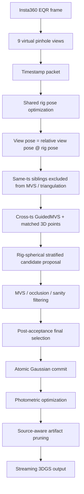
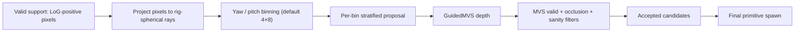

# 260511 - Rig-Spherical Stratified Primitive Proposal for Zero-Baseline OTF-NVS

## Executive Summary

- Insta360 X5 EQR 기반 9-view virtual rig는 same optical center 를 공유하는 zero-baseline 구조이므로, same-timestamp views 는 depth/MVS/triangulation source 로 쓰지 않음.
- 위 제약을 반영하여 OTF 의 image-plane density control 을 **rig-spherical angular support 기반 candidate proposal** 로 재정의함 (`spherical_stratified`).
- 현재 260411 sequence 기준, `sph_strat 24k` 는 같은 rig-aware safety stack 위의 `legacy` density baseline 대비 **4.9× 적은 Gaussian, 2.1× 짧은 학습 시간, holdout PSNR +0.15 dB, Sim(3)-aligned ATE 0.0101 vs 0.0674** 를 기록함.
- 동일 budget 에서 confidence-only `full 12k` 는 MVS acceptance ratio 가 높음에도 angular bin 점유가 좁아 holdout 품질·trajectory 정확도가 낮음.
- 단일 sequence 결과이므로, 추가 scene 검증과 high-frequency detail refinement 가 다음 단계임.

> 본 보고서의 `legacy` baseline 은 upstream OTF 를 그대로 실행한 결과가 아니라, 동일한 rig-aware pose/safety stack 위에서 `density_mode` 만 `legacy` 로 둔 비교군임.
> 이 보고서에서 main proposal 은 score-free `spherical_stratified` 이며, `RASP` 는 confidence mixture 의 필요성을 확인하기 위한 ablation 으로 둠.

---

## 1. 문제 정의

| 항목                       | 값                                          |
| ------------------------ | ------------------------------------------ |
| 카메라 / 입력                 | Insta360 X5 단일 EQR, 1장 / timestamp         |
| view 수 / sequence 길이    | 9 view × 23 ts = 207 keyframes             |
| ref / holdout            | `High_Cam07` / `High_Cam01`                |
| 동시각 inter-view 관계        | rig config 기준 fixed (known) `R_ij`         |
| 동시각 inter-view baseline  | 0 (rotation-only)                          |
| 동시각 inter-view warp     | `H_ij = K · R_ij · K⁻¹` (depth-independent) |

핵심 제약은 동시각 view 끼리 translation 이 0 이므로 triangulation 으로 depth 를 얻을 수 없다는 점임. depth source 는 cross-timestamp keyframe 으로 제한해야 하며, same-ts sibling 은 angular coverage / support signal 로만 사용함.

---

## 2. 원본 OTF-NVS 대비 변경 요약

| 구분           | 원본 OTF-NVS (mono)               | 현재 rig-aware version                                       |
| ------------ | -------------------------------- | ---------------------------------------------------------- |
| 입력           | sequential pinhole frames        | EQR → 9 virtual pinhole views                              |
| pose         | per-keyframe independent         | per-timestamp shared rig pose, view pose = `rel_R @ rig`    |
| same-ts 관계   | 일반 multi-view 처럼 쓰일 위험         | depth-independent homography 로 angular support 로만 사용     |
| MVS neighbor | generic closest keyframes         | same-ts exclude + min-baseline + exact n_cams              |
| spawn 단위    | per-view (spawn order dependence) | atomic per-timestamp spawn                                |
| spawn 정책   | LoG / Bernoulli density           | per-timestamp budget proposal                              |
| proposal     | image-plane LoG sampling          | **rig-spherical stratified proposal (이번 보고서 main)**     |
| lifecycle    | opacity prune / coarse remove     | sanity drop + source-aware artifact prune                  |
| stats        | limited                           | per-stage bin cascade · entropy · acceptance ratio        |

- 마지막 두 행 (`proposal`, `stats`) 이 이번 일자의 핵심 변경임.
- 특히 `proposal` 은 method 측면의 변화이고, `stats` 는 그 효과를 정량적으로 설명하기 위한 분석 장치임.

---

## 3. Pipeline

### 3.1 전체 흐름



### 3.2 Proposal 내부 구조



- support: `init_proba > 0` (LoG-positive) 픽셀만 후보로 사용함. downstream `1/√init_proba` 의 division-by-zero 를 차단하기 위함.
- bin: `r_cam = normalize(K⁻¹[u,v,1])`, `r_rig = rel_Rᵀ · r_cam`, `yaw = atan2(x,z)`, `pitch = atan2(−y, hypot(x,z))` 로 정의함. 수식은 Appendix A.
- 기본 모드 `spherical_stratified`: 각 bin 내 uniform random pick. `rasp` 모드: `α·uniform + (1−α)·tempered/clipped confidence` 의 혼합이며 ablation 으로 둠.

---

## 4. 실험 설정

| 항목                  | 값                                                                                             |
| ------------------- | --------------------------------------------------------------------------------------------- |
| dataset             | `/opt/ftp/files/260411`                                                                       |
| rig config          | `/opt/ftp/files/260411/blender_rig.json`                                                      |
| iterations / kf     | 270                                                                                           |
| seeds               | 0, 1, 2 (표는 mean ± std)                                                                       |
| reference geometry  | `/opt/ftp/files/260411/colmap_result/sparse/0` (Sim(3) alignment 후 ATE / RPE)                  |
| safety stack (공통) | atomic spawn · same-ts exclude (MVS·triang) · spawn-time geometry 캡 · artifact prune · oversample 4× · no coarse remove |

전체 명령 라인 옵션은 Appendix C.

---

## 5. 결과

3-seed mean ± std, iter=270 기준임. `group` 은 표를 어떻게 읽는지 표시함.

| config                | group | n_gauss |  holdout PSNR |          ATE rmse |        RPE rot° | rt (s) |
| --------------------- | :---: | ------: | ------------: | ----------------: | --------------: | -----: |
| legacy                |  ref  |  1,127k |   19.11±0.09  |  0.0674±0.0097    |   0.084±0.005   |    176 |
| full 12k              | score |    122k |   17.75±0.39  |  0.0211±0.0066    |   0.079±0.009   |     77 |
| random 12k            | score |    159k |   18.53±0.76  |  0.0145±0.0042    |   0.053±0.031   |     79 |
| tile 12k              | score |    159k |   18.82±0.23  |  0.0161±0.0037    |   0.063±0.037   |     79 |
| **sph_strat 6k**      |   B   |    112k |   18.51±0.07  |  0.0140±0.0026    |   0.044±0.013   |     76 |
| **sph_strat 12k**     |   B   |    158k |   18.82±0.27  |  0.0120±0.0023    |   0.036±0.011   |     79 |
| **sph_strat 24k**     |   B   |    232k | **19.26±0.08**|  **0.0101±0.0046**|   0.046±0.010   |     85 |
| rasp α=.50 6k         |  rasp |    114k |   18.51±0.05  |  0.0112±0.0024    |   0.052±0.015   |     77 |
| rasp α=.50 12k        |  rasp |    162k |   18.64±0.10  |  0.0167±0.0074    |   0.064±0.024   |     80 |
| rasp α=.50 24k        |  rasp |    237k |   18.98±0.08  |  0.0123±0.0019    |   0.051±0.001   |     85 |
| rasp α=.70 12k        |   A   |    163k |   18.84±0.06  |  0.0114±0.0041    |   0.056±0.026   |     80 |
| rasp α=.85 12k        |   A   |    166k |   18.81±0.20  |  0.0147±0.0087    |   0.053±0.024   |     80 |
| rasp α=.95 12k        |   A   |    170k |   18.93±0.17  |  0.0145±0.0052    |   0.045±0.013   |     79 |
| sph_strat 2×4 12k     |   C   |    154k |   18.43±0.33  |  0.0213±0.0077    |   0.073±0.055   |     80 |
| **sph_strat 8×16 12k**|   C   |    159k | **18.97±0.04**|  0.0118±0.0022    |   0.046±0.008   |     81 |

group legend: `ref` = rig-aware legacy density baseline, `score` = score-map / image-space 비교군, `B` = `sph_strat` budget sweep, `rasp` = α=.50 budget sweep, `A` = RASP α sweep, `C` = spherical bin-count sweep 임. 각 group 의 best 는 굵게 표시함.

### 5.1 Pareto — PSNR / ATE vs n_gauss


- `sph_strat 24k` 는 legacy 보다 왼쪽 위 (적은 n_gauss + 높은 holdout PSNR) 에 위치함.
- `sph_strat 6k / 12k`, `rasp 6k / 12k` 등 lower-budget 구성은 legacy 보다 holdout PSNR 은 낮지만 4 ~ 10× 적은 Gaussian 으로 근접한 Pareto point 를 형성함.


- 세로축은 Sim(3) 정렬 후 OTF trajectory 와 COLMAP trajectory 의 ATE rmse 이며, reconstruction quality 자체가 아니라 pose agreement metric 으로 해석함.
- legacy 의 ATE 가 0.067 부근에 따로 있고, budgeted spherical / random / tile 군은 ATE 0.01 ~ 0.02 영역에 모여 있음.
- `full 12k` 는 PSNR 뿐 아니라 ATE 도 다른 12k 군 대비 30 ~ 70 % 큼.

### 5.2 Bin-occupancy cascade


- 가로축: `selected_pre → after_mvs → after_occlusion → after_sanity → final` 5 단계.
- 세로축: 4×8 rig-spherical partition (총 32 bins) 중 점유 bin 수의 plan 평균.
- `full 12k` 는 preselection 부터 평균 7.6 / 32 bins 만 점유하고 final 에서 6.3 / 32 로 감소함. 다른 모드는 8.9 → 8.2 영역에서 거의 평행하게 유지됨.
- 즉 `full` 의 약점은 후속 filter 에서의 손실보다, **preselection 자체의 angular 범위가 좁다는 것**으로 해석됨.

### 5.3 Coverage → Quality


- 4×8 bin 기준 raw entropy 와 holdout PSNR 사이에 양의 상관이 보임.
- bin 수가 다른 config (예: `sph_strat 8×16`) 를 같은 plot 에 올리면 entropy 상한이 달라 직접 비교가 어려움. 후속 보고에서는 `H / ln(B)` 형태의 normalized entropy 가 필요함.

---

## 6. 해석

- `sph_strat 24k` 가 현재 260411 sequence 에서 legacy density baseline 대비 PSNR · ATE · RPE · n_gauss · runtime 5 가지 metric 에서 동시에 개선됨.
- `full 12k` 의 acceptance ratio 는 0.482 로 spherical / random 군 (≈ 0.42) 보다 오히려 높지만 holdout PSNR 은 더 낮음. acceptance probability 만으로는 holdout quality 를 설명하기 어려운 것으로 bin cascade 와 함께 정량 확인됨.
- RASP α sweep 결과 α 가 1 에 가까워질수록 (즉 score 비중 ↓) holdout PSNR · ATE 가 단조 개선됨. 현재 sequence / config 에서는 confidence-free support proposal 이 가장 좋은 Pareto 를 보임.
- bin granularity 도 lever 로 작동함. 2×4 (coarse) → 4×8 → 8×16 으로 갈수록 holdout PSNR 이 향상되고 seed 분산이 감소함 (8×16 에서 PSNR 분산 0.04).

---

## 7. 정성 결과

직접 렌더 crop 을 비교했을 때 관찰된 경향이며, 정량적 quantification 은 추후 보고에서 다룸.

- 큰 구조 (건물, 나무 줄기, 하늘 색, 잔디 baseline) 는 legacy 와 거의 같은 수준으로 재현됨.
- 잔가지, 나뭇잎, 솔잎, 벤치 슬랫, 바닥 돌 경계 같은 high-frequency thin detail 에서는 sph_strat 24k 가 legacy 보다 다소 부드럽게 blur 됨.
- 단일 원인이 아니라 strict per-timestamp spawn budget + 균등 spherical support proposal 이 결합된 효과로 해석됨. 균등 support proposal 은 angular coverage 를 보존하지만 high-frequency residual 이 몰린 지점에 추가 budget 을 주지 않음.
- 다음 단계 방향은 base spherical support budget 위에 bounded high-frequency detail budget 을 얹는 구조임 (§8 표의 5번 항목).

---

## 8. 다음 단계

| 우선순위 | 작업 | 목적 |
| :---: | --- | --- |
| 1 | `sph_strat 24k + 8×16` 3-seed | 현재 best budget 과 best bin granularity 결합 |
| 2 | 추가 scene 1 개 이상 동일 grid | 단일 sequence claim 한계 보완 |
| 3 | normalized entropy plot (`H / ln B`) | bin count 가 다른 config 간 공정 비교 |
| 4 | qualitative crop grid (260507 형식) | fine-detail blur 한계 시각화 |
| 5 | `sph_strat_detail` 모드 | base spherical support + bounded high-frequency residual detail budget |

---

## 9. 결론

현재 260411 sequence 기준으로, primitive proposal 을 image-plane density control 에서 rig-spherical angular support coverage 문제로 재정의했을 때 photometric quality · trajectory geometry · memory · runtime 의 Pareto 가 동시에 개선되는 것을 확인함. 결과는 단일 sequence 기준이므로 추가 scene 과 fine-detail refinement (§8) 가 이어져야 함.

---

## Appendix A. Spherical bin 정의

```
r_cam = normalize( K⁻¹ [u, v, 1]ᵀ )              # pinhole camera-frame ray
r_rig = rel_Rᵀ · r_cam                           # view → rig (= ref view) frame
yaw   = atan2(r_rig.x, r_rig.z)                  ∈ [−π, π]
pitch = atan2(−r_rig.y, hypot(r_rig.x, r_rig.z)) ∈ [−π/2, π/2]
yaw_bin   = clamp( floor((yaw + π)  / (2π) · n_bins_x), 0, n_bins_x − 1 )
pitch_bin = clamp( floor((pitch + π/2) / π · n_bins_y), 0, n_bins_y − 1 )
bin_id    = pitch_bin · n_bins_x + yaw_bin
```

`rel_R` 정의: `rig/rig_loader.py:76`. 좌표계는 COLMAP + `_AXIS_FLIP = diag(1, −1, −1)` 컨벤션이라 camera-y 가 down 이며, pitch 계산에서 `−y` 를 사용함.

검증 예: 260411 의 `High_Cam02`, `uv = (0, 0)` →
`r_rig = [0.118, −0.864, −0.489]`, `yaw = +2.903`, `pitch = +1.042`
→ `(pitch_bin, yaw_bin) = (3, 7)` → `bin_id = 31`.

## Appendix B. 코드 / 산출물

| 파일 | 내용 |
| --- | --- |
| `args.py` | `spherical_stratified` / `rasp`, bin / α / temperature 파라미터 |
| `scene/scene_model.py` | `_compute_spherical_bins`, `_preselect_candidates`, `_postselect_accepted_candidates`, 5단계 bin snapshot |
| `run_rasp_smoke.sh`, `run_rasp_main.sh`, `run_rasp_phase_BCD.sh`, `run_rasp_resume.sh` | iter=30 smoke + iter=270 main grid + 후속 sweep |
| `plot_rasp.py` | figure 4종 자동 생성 |
| `figs/{psnr_vs_ngauss, ate_vs_ngauss, entropy_vs_holdout, bin_cascade}.png` | 본 보고서 figure |
| `compare/rasp_<tag>_s<seed>/metrics.json` | Sim(3) 정렬 후 ATE / RPE per run |
| `results/rasp_<tag>_s<seed>/density_stats.jsonl` | per-plan bin cascade · acceptance ratio · K_pre |

git: branch `main`, head `ac489e5` (이번 일자 작업 모두 merge).

## Appendix C. 공통 옵션

```
--rig_atomic_spawn
--guided_mvs_exclude_same_ts --guided_mvs_min_baseline 1e-4
--matched_exclude_same_ts --matched_min_baseline 1e-4
--matched_max_triang_depth 100.0
--max_spawn_depth 100.0 --max_spawn_world_abs 100.0 --max_spawn_phys_scale 5
--scaling_explosion_phys_threshold 100
--c2_mode off
--enable_artifact_prune --artifact_prune_opacity_raw_threshold 5
--disable_atomic_coarse_remove
--spawn_oversample_factor 4
--density_mode confidence_topk            # 비교군 legacy 의 경우 --density_mode legacy
--spawn_selection_mode <mode>             # full / random_valid / tile_random / spherical_stratified / rasp
--spawn_budget_per_ts <K>                 # 6000 / 12000 / 24000
--spawn_spherical_bins_y 4 --spawn_spherical_bins_x 8
--rig_holdout_view High_Cam01
--num_iterations 270 --enable_reboot --lr_poses 1e-4
--depth_loss_floor_ratio 0.1
--viewer_mode none --log_density_stats
```
