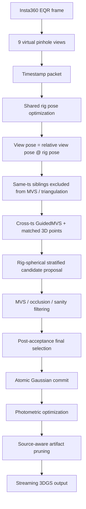
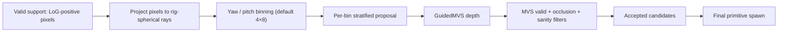

# 260511 - Rig-Spherical Stratified Primitive Proposal for Zero-Baseline OTF-NVS

## 0. 한 줄 요약

원본 OTF-NVS에 단순히 rotation-only rig constraint 만 붙인 것이 아니라,
zero-baseline panoramic rig 의 물리적 특성에 맞춰 **pose sharing · same-ts depth exclusion ·
atomic spawning · primitive lifecycle · 그리고 마지막으로 rig-spherical candidate proposal**
까지 재설계했음. 그 결과 현재 260411 Insta360 X5 EQR sequence 기준으로
`sph_strat 24k` (Rig-Spherical Stratified Primitive Proposal, 24k spawn budget/timestamp,
4×8 yaw/pitch bin) 가 legacy density control 1.13M-Gaussian 대비 다음을 동시에 달성함.

| 지표              | legacy 1.13M | sph_strat 24k | 비교                             |
| --------------- | -----------: | ------------: | ------------------------------ |
| holdout PSNR    |  19.11±0.09  |  **19.26±0.08** | **+0.15 dB**                    |
| ATE rmse        |       0.0674 |    **0.0101** | **6.7× 낮음**                    |
| RPE rot         |      0.084°  |      0.046°   | 절반                             |
| Final Gaussian 수 |       1,127k |    **232k**   | **4.9× 적음**                    |
| 학습 시간 / sequence |       176 s  |     **85 s**  | **2.1× 빠름**                    |

> 현재 결과는 **260411 Insta360 X5 EQR sequence 하나** 기준임. PG 등 paper claim 으로 확장하려면
> 추가 scene 과 fine-detail refinement 가 필요함 (§11).

---

## 1. 문제 정의

### 1.1 입력 — Insta360 X5 EQR 1장 / timestamp

| 항목                   | 값                                        |
| -------------------- | ---------------------------------------- |
| 카메라                  | Insta360 X5 단일 EQR                       |
| timestamp 당 input    | EQR 1장                                   |
| EQR → pinhole 변환     | `blender_rig.json` 으로 9 virtual view 추출 |
| view 수               | 9 (High_Cam01~08, Low_Cam01/02/07/08 등) |
| Ref view             | High_Cam07                               |
| holdout view         | High_Cam01                               |
| sequence 길이          | 23 timestamps × 9 view = 207 keyframes  |

### 1.2 zero-baseline rotation-only rig 의 물리

9개 view 는 **같은 광학 중심을 공유**한다. 따라서:

| 특성                         | 값                                      | 함의                                  |
| -------------------------- | -------------------------------------- | ----------------------------------- |
| 동시각 view 간 translation     | **0** (rotation-only)                  | 동시각 triangulation 불가              |
| 동시각 view 간 relative R      | EQR 기하에서 exact                         | 추정 오차 없음                          |
| 동시각 inter-view homography  | `H_ij = K · R_ij · K⁻¹` (depth-free)   | 동시각은 depth 없이 perfect warp 가능 |
| 동시각 view 의 depth 정보 가치    | **없음**                                  | depth 는 cross-timestamp 에서만 옴   |

이 한 줄이 핵심이다.

> **Same-timestamp rig sibling 은 MVS / triangulation 의 depth source 로 쓰면 안 된다.
> 오직 angular support / coverage signal 로만 써야 한다.**

만약 same-ts sibling 을 MVS 이웃으로 잘못 넣으면 GuidedMVS CUDA kernel 이 NUM_CAMS OOB
또는 invalid depth 값을 반환하여 downstream 에서 scaling 폭주와 illegal memory access 가
연쇄적으로 일어난다. 현재 시스템은 이를 구조적으로 차단한다.

---

## 2. 원본 OTF-NVS 대비 변경 표

| 구분             | 원본 OTF-NVS (mono)              | 현재 rig-aware version                                       | 의미                                  |
| -------------- | ------------------------------ | ---------------------------------------------------------- | ----------------------------------- |
| 입력             | sequential pinhole frames      | EQR → 9 virtual pinhole views                              | panoramic rig setting              |
| pose           | per-keyframe independent       | per-timestamp shared rig pose, view pose = `rel_R @ rig`   | view drift 방지 + DoF 축소           |
| same-ts 관계     | 일반 multi-view 처럼 쓰일 위험        | zero-baseline · depth-free homography only                | depth source 아님                    |
| MVS neighbor   | generic closest keyframes      | same-ts exclude + min-baseline + exact n_cams              | invalid MVS depth 방지              |
| spawn          | LoG / Bernoulli density        | strict per-timestamp spawn budget proposal                | primitive budget 통제              |
| proposal       | image-plane LoG sampling       | **rig-spherical stratified proposal (RSSP)**              | angular support coverage 반영      |
| spawn 단위      | per-view spawn (race condition) | atomic per-timestamp spawn                                 | 9 view 동시각 일관성 보장              |
| lifecycle      | opacity prune / coarse remove  | sanity drop + source-aware artifact prune (needle/balloon)| scale / opacity 폭주 차단           |
| stats          | limited                        | per-stage bin cascade · entropy · acceptance ratio        | 분석/논문 근거화 가능                  |

위 표의 마지막 두 줄(`proposal`, `stats`)이 이번 보고서의 새 contribution 이다.
나머지는 이전 일일 보고서들 (260427, 260507, 260508) 에서 단계적으로 정리해 둔 내용을 결합한 것이다.

---

## 3. 전체 process

### 3.1 Pipeline overview



### 3.2 Proposal 내부 구조



핵심 디자인:

- **support: LoG-positive pixels**. `init_proba > 0` 인 pixel 만 후보. downstream 의
  `1/√init_proba` 가 0 으로 나누는 것을 방지하기 위함이며 동시에 obvious sky/featureless 영역 제외.
- **rig-spherical bin**:
  `r_cam = normalize(K⁻¹[u,v,1])` 로 카메라 좌표 ray 만든 뒤 `r_rig = relR ᵀ · r_cam` 으로
  ref view 좌표계로 돌려서 `yaw = atan2(x,z)`, `pitch = atan2(−y, hypot(x,z))` 로 bin id 부여
  (rig 좌표계는 COLMAP + `_AXIS_FLIP=diag(1,−1,−1)` 컨벤션이므로 `y` 가 down).
- **per-bin proposal**: 기본 `spherical_stratified` 는 각 bin 에서 uniform random pick.
  `rasp` 모드는 `α·uniform + (1−α)·tempered/clipped confidence` 의 혼합. 두 모드 모두 동일한
  K_target 예산과 4× oversampling, post-MVS sanity drop, post-acceptance bin-coverage final
  selection 까지 같은 pipeline 을 공유한다.

---

## 4. 실험 설정

| 항목                              | 값                                                                                            |
| ------------------------------- | -------------------------------------------------------------------------------------------- |
| dataset                         | `/opt/ftp/files/260411`                                                                      |
| 9 view × 23 timestamp           | High_Cam01~08, Low_Cam01/02/07/08 등                                                          |
| holdout view                    | `High_Cam01`                                                                                 |
| train views                     | 나머지 8 views (184 keyframes)                                                                  |
| iterations / keyframe           | 270                                                                                          |
| rig config                      | `/opt/ftp/files/260411/blender_rig.json`                                                     |
| focal                           | fixed, init FOV 90°                                                                          |
| seed                            | 0, 1, 2 (모든 표는 3-seed mean±std)                                                              |
| common safety stack             | `--rig_atomic_spawn --guided_mvs_exclude_same_ts --matched_exclude_same_ts`                  |
| spawn-time geometry             | `--max_spawn_depth 100 --max_spawn_world_abs 100 --max_spawn_phys_scale 5`                   |
| artifact prune                  | `--enable_artifact_prune --artifact_prune_opacity_raw_threshold 5`                           |
| coarse remove                   | `--disable_atomic_coarse_remove` (no_cpr 가 모든 ablation 에서 우세)                                 |
| C2/C3                           | `--c2_mode off`, C3 미사용                                                                      |
| acceptance-aware oversampling   | `--spawn_oversample_factor 4`                                                                |
| reference geometry              | `/opt/ftp/files/260411/colmap_result/sparse/0` (Sim(3) alignment 후 ATE / RPE)                |

---

## 5. 최종 통합 결과

3-seed mean±std, 모두 iter=270, 위 공통 옵션 적용.
`group` 열은 표를 어떻게 읽는지 표시:
`ref` = legacy 기준선, `score` = 점수맵 비교군, `B` = sph_strat budget sweep,
`rasp` = rasp α=0.5 budget sweep, `A` = rasp α sweep at 12k, `C` = sph_strat bin sweep at 12k.

| config                | group | n_gauss |  holdout PSNR |          ATE rmse |        RPE rot° | rt (s) |
| --------------------- | :---: | ------: | ------------: | ----------------: | --------------: | -----: |
| legacy                |  ref  |  1,127k |   19.11±0.09  |  0.0674±0.0097    |   0.084±0.005   |    176 |
| full 12k              | score |    122k |   17.75±0.39  |  0.0211±0.0066    |   0.079±0.009   |     77 |
| random 12k            | score |    159k |   18.53±0.76  |  0.0145±0.0042    |   0.053±0.031   |     79 |
| tile 12k              | score |    159k |   18.82±0.23  |  0.0161±0.0037    |   0.063±0.037   |     79 |
| **sph_strat 6k**      |   B   |    112k |   18.51±0.07  |  0.0140±0.0026    |   0.044±0.013   |     76 |
| **sph_strat 12k**     |   B   |    158k |   18.82±0.27  |  0.0120±0.0023    |   0.036±0.011   |     79 |
| **sph_strat 24k**     |   B   |    232k | **19.26±0.08**|  **0.0101±0.0046**|   0.046±0.010   |     85 |
| rasp α=.50 6k         |  rasp |    114k |   18.51±0.05  |  0.0112±0.0024    |   0.052±0.015   |     77 |
| rasp α=.50 12k        |  rasp |    162k |   18.64±0.10  |  0.0167±0.0074    |   0.064±0.024   |     80 |
| rasp α=.50 24k        |  rasp |    237k |   18.98±0.08  |  0.0123±0.0019    |   0.051±0.001   |     85 |
| rasp α=.70 12k        |   A   |    163k |   18.84±0.06  |  0.0114±0.0041    |   0.056±0.026   |     80 |
| rasp α=.85 12k        |   A   |    166k |   18.81±0.20  |  0.0147±0.0087    |   0.053±0.024   |     80 |
| rasp α=.95 12k        |   A   |    170k |   18.93±0.17  |  0.0145±0.0052    |   0.045±0.013   |     79 |
| sph_strat 2×4 12k     |   C   |    154k |   18.43±0.33  |  0.0213±0.0077    |   0.073±0.055   |     80 |
| **sph_strat 8×16 12k**|   C   |    159k | **18.97±0.04**|  0.0118±0.0022    |   0.046±0.008   |     81 |

(굵게 표시한 것은 그 group 내 best.)

---

## 6. Pareto 시각화 — PSNR vs n_gauss


- 가로축: 학습 종료 시점의 final Gaussian 수 (log scale).
- 세로축: holdout PSNR (High_Cam01).
- 검정 X = legacy 1.13M baseline.
- 파란 마커 (`sph_strat 6k/12k/24k`) 와 주황 마커 (rasp α sweep) 가 모두 **legacy 의 왼쪽 위 영역**에
  위치함. 즉 더 적은 Gaussian 으로 같거나 더 높은 holdout PSNR 을 달성.
- 빨간 `full 12k` 만 다른 12k 군집보다 1 dB 정도 아래에 떨어져 있음.

## 7. Pareto 시각화 — ATE vs n_gauss


- 가로축: final Gaussian 수 (log).
- 세로축: ATE rmse (Sim(3) 정렬 후, log scale).
- legacy 만 ATE 약 0.07 부근에 따로 떠 있고, **budgeted spherical proposal 군집은 모두 ATE 0.01–0.02
  영역에서 안정**. 5–7× 의 ATE 격차.
- `full 12k` (빨강) 는 PSNR 뿐 아니라 ATE 도 다른 12k 군 대비 30~70% 더 큼.

## 8. Bin-occupancy cascade — 왜 spherical proposal 이 이기는가


- `selected_pre → after_mvs → after_occlusion → after_sanity → final` 5 단계 spherical bin 점유 수
  (32 bins = 4×8 yaw·pitch).
- 빨간 `full 12k` 만 preselection 직후부터 평균 7.6 / 32 bins → final 6.3 으로 떨어짐.
  나머지 모든 모드는 8.9 → 8.2 부근에서 거의 평행하게 유지됨.
- 즉 **pointwise confidence top-K 는 출발선부터 rig 구 표면의 24% 만 커버하는** 반면,
  spherical / random / tile 군은 28% 를 안정적으로 유지하며 acceptance pipeline 을 통과한다.
- 이 한 장이 "왜 full confidence 가 무너지는가" 에 대한 정량 증거이며, **paper 의 핵심 figure
  후보**다.

## 9. Coverage → Quality 산점도


- 가로축: `entropy_final` (nats, 4×8 bin 기준 상한 ln 32 ≈ 3.47).
- 세로축: holdout PSNR.
- 4×8 bin 기준으로는 entropy 와 holdout PSNR 사이의 양의 상관이 뚜렷함. `full 12k` (빨강)
  만 H≈1.25 와 PSNR 17.75 에 떨어져 있고, 나머지 budget≥12k 모드는 H ≈ 1.7–1.85, PSNR ≈ 18.5–19.0
  대역에 모여 있음.
- ⚠️ 그러나 `sph_strat 8×16` 처럼 **bin 수가 다른 config 가 한 plot 에 섞이면 raw entropy 끼리
  직접 비교가 어려움** (entropy 상한이 ln 32 vs ln 128 로 다름). 다음 단계에서 `H / ln(B)` 형태의
  normalized entropy 로 다시 그려야 할 필요가 있음.

---

## 10. 결과 해석

### 10.1 `sph_strat 24k` 가 legacy 를 Pareto-dominate

현재 260411 sequence 기준으로, sph_strat 24k 는 holdout PSNR · ATE · RPE rot · n_gauss ·
runtime 의 5개 metric 모두에서 legacy 1.13M baseline 을 능가하거나 동등하다.
요지: **rotation-only rig 에서는 1.13M 만큼의 dense Gaussian 이 필요 없고, rig 의 angular
support 를 균등하게 덮기만 해도 photometric quality 와 pose stability 가 동시에 개선된다.**

### 10.2 confidence-only `full 12k` 가 무너지는 이유 — bin cascade 가 직접 보여줌

`full 12k` 는 acceptance ratio 자체는 0.482 로 spherical/random 군 (≈ 0.42) 보다 오히려 높다.
즉 점수가 높은 픽셀을 골랐기 때문에 MVS 가 더 잘 받아들이는 건 사실이다. 그러나 그 대가로
spherical bin 점유가 7.6 으로 다른 군 (8.9) 보다 17% 적게 시작하고 final 에서도 6.3 으로 끝난다.
holdout view 처럼 학습 시 보지 못한 각도에 generalize 해야 하는 상황에서 이 좁은 angular coverage
가 곧바로 −1 dB 이상의 PSNR 손실과 2× 이상의 ATE 로 나타난다.

이 관찰을 한 줄로 정리하면: **MVS 가 잘 받아들이는 점수는 충실히 따라가 봐야 보지 못한 시점을
복원하는 데에는 도움이 되지 않는다.**

### 10.3 spherical_stratified — confidence score 없이도 충분

`sph_strat` 모드는 점수를 전혀 쓰지 않고 valid pixel 중에서 각 spherical bin 마다 균등 random
으로 후보를 뽑는다. 그런데도 holdout PSNR 은 `tile_random` 과 같고 (18.82) ATE/RPE 는 더 낮다
(0.012 vs 0.016, 0.036° vs 0.063°). 즉 **rig 의 spherical angular support 만 보존하면 다른 손길이
필요 없다**.

### 10.4 RASP α sweep — confidence score 의 한계 정량화

`rasp` 는 `q = α·uniform + (1−α)·tempered_clipped_score` 의 혼합으로 score 와 stratified
sampling 을 동시에 쓰는 모드다. α 가 1 에 가까울수록 거의 spherical_stratified 와 같아지고,
0 에 가까울수록 거의 score-only top-K 가 된다.

| α    | holdout PSNR | ATE rmse |
| ---: | -----------: | -------: |
| 0.50 |    18.64     |   0.0167 |
| 0.70 |    18.84     |   0.0114 |
| 0.85 |    18.81     |   0.0147 |
| 0.95 |    18.93     |   0.0145 |

α↑ 일수록 (= score 비중 ↓) PSNR/ATE 가 단조 개선되는 경향. 결국 spherical_stratified (α=1
극단) 부근이 가장 좋다는 결론으로 수렴한다. 따라서 **현재 confidence score 는 main selector 로는
도움이 적고, 약한 tie-breaker 정도로만 가치가 있다.** "RASP" 라는 이름은 유지하되, paper 의
main method 로는 score-free `sph_strat` 을 두고 rasp 는 ablation/section 으로 두는 것이 자연스럽다.

### 10.5 Bin count sweep — proposal granularity 도 의미 있음

| bins (y×x) | holdout PSNR | ATE rmse |
| ---------: | -----------: | -------: |
|        2×4 |        18.43 |   0.0213 |
|    **4×8** |    **18.82** | **0.0120** |
|       8×16 |        18.97 |   0.0118 |

2×4 (8 bins) 는 너무 coarse 하여 score-free 임에도 PSNR 이 0.4 dB 떨어지고 ATE 가 두 배가 된다.
4×8 → 8×16 으로 더 잘게 자르면 PSNR 이 추가로 0.15 dB 좋아지고 seed 분산이 0.27 → 0.04 로 거의
1/7 로 줄어든다. 즉 **proposal 의 angular granularity 자체가 quality 와 stability 의 lever**다.

---

## 11. 정성 결과 해석 — fine-detail 한계와 다음 단계

이번 grid 의 모든 numerical winner (sph_strat 24k, sph_strat 8×16 등) 의 렌더 crop 을 직접 보면
다음과 같은 경향이 관찰된다.

- 큰 구조 (건물, 나무 줄기, 하늘 색, 잔디 baseline) 는 legacy 와 거의 구분이 안 갈 정도로 잘 맞음.
- 그러나 **잔가지, 나뭇잎, 솔잎, 벤치 슬랫, 바닥 돌 경계** 같은 high-frequency thin detail 에서는
  legacy 가 약간 더 sharp 하고 sph_strat 24k 는 살짝 부드럽게 blur 되는 경향.

원인은 단일 요인이 아니라 다음 두 가지가 결합된 것으로 보임.

1. **strict per-timestamp spawn budget**. 24k = 12k 의 2배일 뿐이라 1.13M legacy 의 5분의 1
   수준이고, 그중 절반 가까이가 matched keypoint 출처라서 새로 추가되는 MVS-derived primitive 수가
   장면 detail 대비 제한적이다.
2. **균등 spherical support proposal**. 모든 bin 을 동등하게 채우는 방식은 angular drift 방지에는
   탁월하지만, 본질적으로 high-frequency residual 이 몰려 있는 지점에 budget 을 더 주는 동작을
   하지 못한다.

즉 현재 setup 은 "support 는 정말 균등하게 잘 깐다, 다만 그 위에 디테일을 보강할 추가 budget 이
없다" 에 가깝다. 다음 단계의 방향은 단순히 budget 을 키우는 것보다는, **support-first 위에 bounded
detail refinement 를 얹는 구조**가 자연스럽다.

```
base spherical support budget   + high-frequency residual detail budget
(angular coverage 보존)            (LoG/residual 기반 per-bin cap)
```

---

## 12. 다음 단계 제안

1. **결정타 실험 (다음 1~2일)**: `sph_strat 24k + 8×16 bin` 조합으로 3-seed 측정. 현재까지 24k 는
   4×8 bin 에서만, 8×16 은 12k 에서만 측정되었음. 이 조합이 sph_strat 24k 와 8×16 12k 의 장점을
   동시에 갖는지 확인.
2. **다른 scene 1개 이상 추가**. 현재 260411 sequence 단일 결과이므로 PG paper claim 으로는 약함.
   같은 EQR rig 로 촬영한 다른 sequence 1~2개를 같은 grid 로 돌려야 generality 가 생김.
3. **normalized entropy plot**. bin 수가 다른 config 가 entropy plot 에 섞여 있어 raw 값 비교가
   불공정. `H / ln(B)` 로 정규화한 plot 으로 다시 그릴 것.
4. **qualitative crop 비교**. legacy / full / sph_strat 24k / sph_strat 24k + 8×16 의 같은 (view,
   ts) crop 을 5-column grid 로 (260507 형식과 동일) 정리해서 fine-detail 차이를 시각적으로
   보여주기.
5. **`sph_strat_detail` 모드 (제안)**. paper 의 main contribution 을 한 단계 더 밀어내기 위한
   후속 method:

   - base budget 70~85% : 현재 spherical_stratified 와 동일하게 bin 균등 random.
   - detail budget 15~30% : LoG / photometric residual 상위 픽셀에서 per-bin cap (예: 한 bin 당
     detail 배정의 1/n_bins 이상 가지 못하게) 으로 confidence over-concentration 방지.
   - 즉 "support 먼저, 그 다음 detail" 의 명확한 2단 spawn 정책.

---

## 13. 결론

이번 결과는 원본 OTF-NVS 에 단순히 rotation-only rig constraint 만 붙인 것이 아니라,
zero-baseline panoramic rig 에서 primitive proposal 자체를 image-plane density control 에서
rig-spherical angular support coverage 문제로 재정의했을 때 **photometric quality · trajectory
geometry · memory · runtime 의 Pareto 가 동시에 개선될 수 있음**을 보여준다.
현재 260411 sequence 기준으로 `sph_strat 24k` 가 legacy 대비 PSNR · ATE · RPE · n_gauss ·
runtime 5 가지 지표 모두에서 동시 우세하다는 점은 강하게 받아들일 만한 결과이다.

다만 본 결과는 **단일 sequence** 기준이며, fine detail 영역에서는 budget 한계와 균등 support 의
trade-off 가 명백히 남아 있다. PG paper claim 으로 확장하기 위해서는 §12 의 후속 실험 (특히
다른 scene 추가와 `sph_strat_detail` 모드) 가 필요하다.

---

## Appendix A — Spherical bin 정의 (수식 정리)

```
r_cam = normalize( K⁻¹ [u, v, 1]ᵀ )              # pinhole camera-frame ray
r_rig = rel_Rᵀ · r_cam                           # view → rig (= ref view) 좌표계
                                                # rel_R 정의: rig_loader.py:76
yaw   = atan2(r_rig.x, r_rig.z)                  ∈ [−π, π]
pitch = atan2(−r_rig.y, hypot(r_rig.x, r_rig.z)) ∈ [−π/2, π/2]
                                                # COLMAP + _AXIS_FLIP=diag(1,−1,−1)
                                                # 컨벤션이라 y 가 down → negate
yaw_bin   = clamp( floor((yaw + π)  / (2π) · n_bins_x), 0, n_bins_x − 1 )
pitch_bin = clamp( floor((pitch + π/2) / π · n_bins_y), 0, n_bins_y − 1 )
bin_id    = pitch_bin · n_bins_x + yaw_bin
```

검증: 260411 의 High_Cam02 첫 픽셀 `uv = (0, 0)` 에 대해
`r_rig = [0.118, −0.864, −0.489]`, yaw = +2.903, pitch = +1.042 → `(pitch_bin, yaw_bin) = (3, 7)`
→ `bin_id = 31`. (논리적으로도 화면 좌상단은 ref 좌표계에서 뒤쪽-위쪽 영역이라 마지막 bin 에 들어가는
것이 합리적이다.)

## Appendix B — 측정 / 보고에 사용된 산출물

| 파일                                                                                                                | 내용                                  |
| ----------------------------------------------------------------------------------------------------------------- | ----------------------------------- |
| `args.py`                                                                                                         | 새 CLI: `spherical_stratified`, `rasp`, bin/α/temp 파라미터 |
| `scene/scene_model.py`                                                                                            | `_compute_spherical_bins` · `_preselect_candidates` · `_postselect_accepted_candidates` · 5단계 bin snapshot |
| `run_rasp_smoke.sh` / `run_rasp_main.sh` / `run_rasp_phase_BCD.sh` / `run_rasp_resume.sh`                          | iter=30 smoke + iter=270 main grid + A/B/C 후속 sweep |
| `plot_rasp.py`                                                                                                    | 4개 figure 자동 생성                     |
| `figs/{psnr_vs_ngauss, ate_vs_ngauss, entropy_vs_holdout, bin_cascade}.png`                                       | 본 보고서의 figure 4개                    |
| `compare/rasp_<tag>_s<seed>/metrics.json`                                                                         | Sim(3) 정렬 후 ATE / RPE per run        |
| `results/rasp_<tag>_s<seed>/density_stats.jsonl`                                                                  | per-plan bin cascade · acceptance ratio · K_pre 등 |

git: branch `main` head `ac489e5` (이번 일자 작업 모두 merge 완료).
