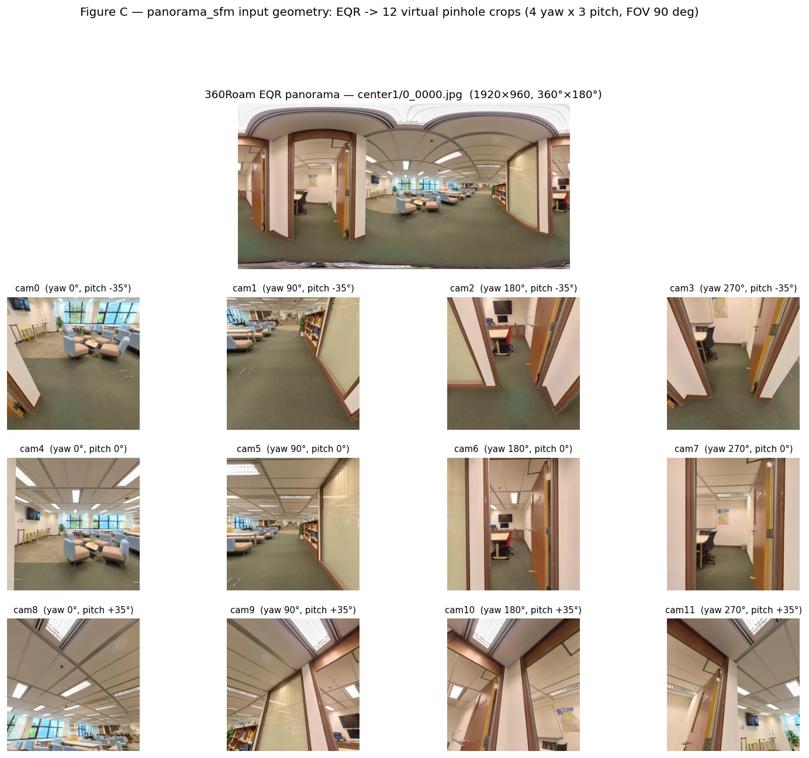
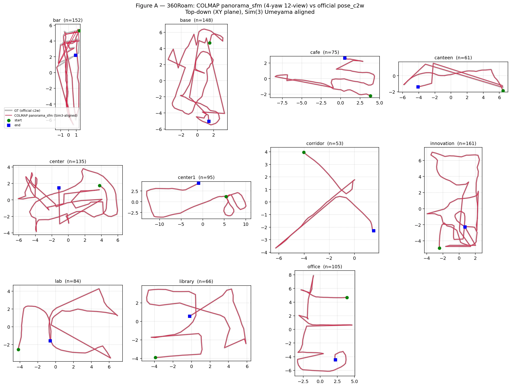
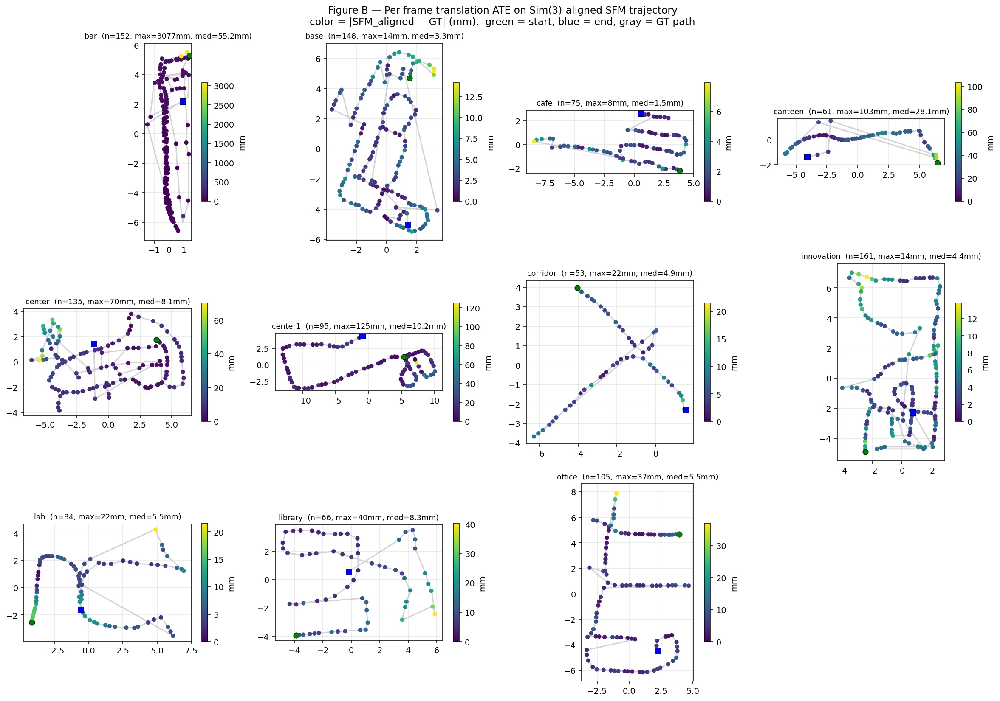
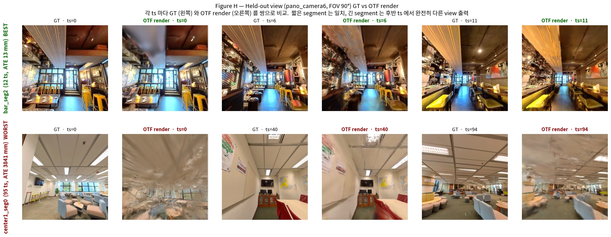
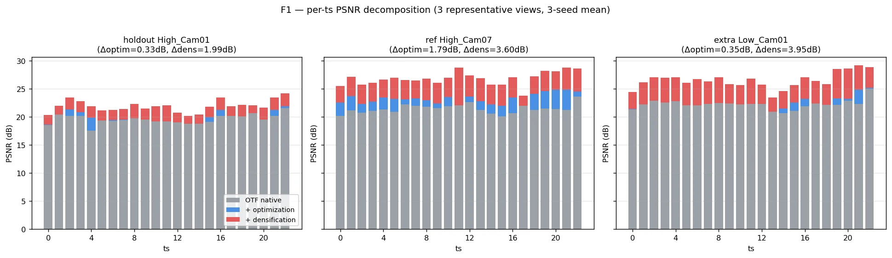
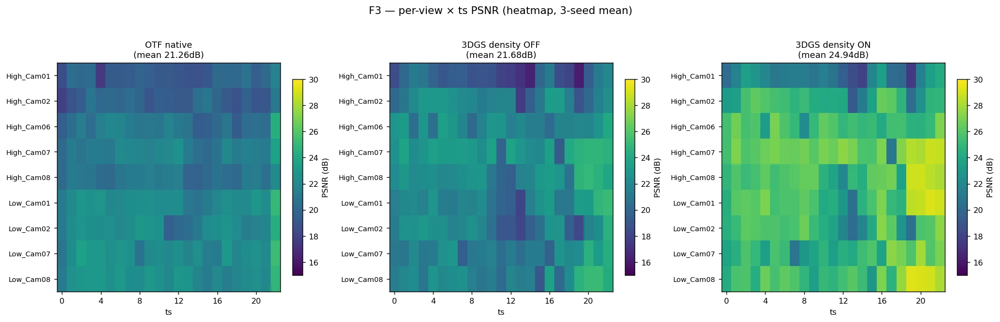
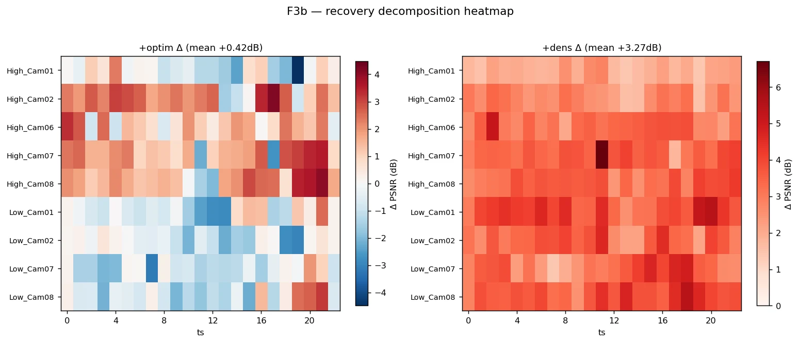
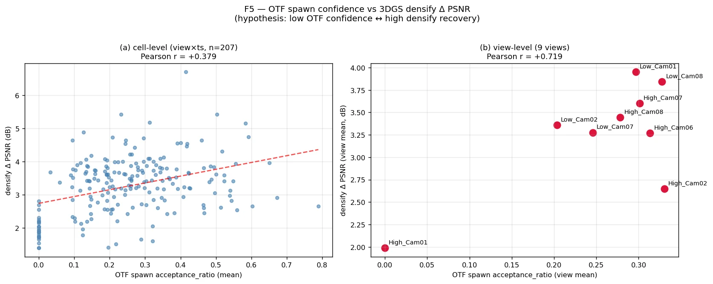

# 1. COLMAP panorama_sfm (공식 문서 기반 수행)

- 360Roam Dataset에 대해 11 Scene 전부 ==4 yaw x 3 pitch = 12 view, FOV 90°==로 수행함.
- 공식 문서에서 제공한 script를 기반으로 진행하려 했으나, pycolmap 기준 CPU로만 전체 연산이 진행되는 이슈 발생 → COLMAP 3.13 CUDA CLI로 GPU로 작동할 수 있게 변경함. (공식 문서와의 과정 차이는 없음)



---

# 2. panorama_sfm vs 공식 trajectory 비교

- 각 11 scene에 대해 COLMAP 수행한 결과 (1번 내용 결과) VS 360Roam에서 공식적으로 제공한 trajectory json (`pose_c2w.json`) 을 ==Sim(3)==으로 비교함.

- ll**Translation 잔차** : ATE rmse / median / p95 / max (mm).
- **Rotation 잔차** : **frame-to-frame 회전 magnitude** (`|angle(R[i+1] @ R[i].T)|`) 의 SFM vs GT 차이. virtual-cam rel_R, Sim(3) world rotation, 카메라 축 convention 모두 무관한 invariant metric.

### 2.1 수행 결과

| scene      | n_matched | sim3 scale | **t_rmse (mm)** | **R_rmse (°)** |
| ---------- | --------: | ---------: | --------------: | -------------: |
| bar        | 152 / 152 |      1.000 |         360.7 ⚠ |          1.062 |
| base       | 148 / 148 |      1.105 |             4.4 |          0.020 |
| cafe       |   75 / 75 |      1.009 |         **2.2** |      **0.010** |
| canteen    |   61 / 63 |      1.097 |            35.8 |          0.039 |
| center     | 135 / 135 |      1.038 |            16.6 |          0.130 |
| center1    |   95 / 95 |      2.220 |            20.2 |          0.182 |
| corridor   |   53 / 53 |      0.829 |             6.9 |          0.038 |
| innovation | 161 / 161 |      1.151 |             5.3 |          0.025 |
| lab        |   84 / 84 |      1.034 |             8.4 |          0.017 |
| library    |   66 / 66 |      1.136 |            12.2 |          0.033 |
| office     | 105 / 105 |      1.246 |             8.0 |          0.025 |

- `n_matched`: COLMAP 등록 / 공식 train frame 수.
- `t_rmse`: Sim(3) Umeyama 정합 후 frame 별 translation 잔차 RMSE.
- `R_rmse`: frame-to-frame 회전 magnitude `|angle(R[i+1]@R[i].T)|` 의 SFM vs GT 차이 RMSE. virtual-cam rel_R / Sim(3) world rotation / 카메라 축 convention 모두 무관한 invariant metric. (==이전 frame 대비 상대 회전 차이==)
- `n_tr`, `n_te` : 360Roam에서 제공한 Train view / Test view
- **bar scene 이슈** : t_rmse 360.7 mm 이지만 median 55.2 mm임. 특정 timestamp가 크게 차이가 남.






---

# 3. Trajectory 특정 Keyframe 전처리 + OTF rig 학습 결과

### 3.1 부적절한 Keyframe 정의 (원본 OTF에서 권장하지 않은 신호 기반)

| 신호         | 임계             | 의미                                                       |
| ---------- | -------------- | -------------------------------------------------------- |
| stationary | step < 50 mm   | translation 너무 작음 → triangulation baseline 부족 → drift 유발 |
| sharp turn | rotation > 90° | "분할된 이동" — view overlap 0% 가능                            |
| teleport   | step > 2 m     | 큰 jump                                                   |

### 3.2 분류 결과 (11 scene 전부, Train Pose 기준)
| scene       | n_train | drop ts | n_segments (≥10 ts) |    sum |
| ----------- | ------: | ------: | ------------------- | -----: |
| bar         |     152 |      27 | 3                   |    101 |
| base        |     148 |      18 | 3                   |    118 |
| cafe        |      75 |       8 | 2                   |     61 |
| canteen     |      63 |      10 | 2                   |     46 |
| center      |     135 |      26 | 4                   |     94 |
| ==center1== |  **95** |   **0** | 1                   | **95** |
| corridor    |      53 |       4 | 2                   |     48 |
| innovation  |     161 |      21 | 5                   |    125 |
| lab         |      84 |       6 | 2                   |     71 |
| library     |      66 |       6 | 2                   |     52 |
| office      |     105 |       8 | 4                   |     93 |
- 학습이 가능한 10 timestamp 이상의 segment가 총 30개 발생함.

### 3.3 OTF 입력 view 변경 (1번에서 수행한 12 view와 다름)

- 원본 panorama_sfm 의 4-yaw 12-view 는 인접 view overlap ≈ 0% (90° gap + FOV 90°)임.
- OTF bootstrap 의 `force-z=1` safety zone (angle ≤ 90° from ref) 안에 들지만, **MVS guided spawn 단계에서 prev_KF 의 baseline 이 거의 0** 이라 학습이 Bootstrap에서 진행되지 않음.

→ OTF 학습 입력은 **saebit-equivalent 12-view (6 yaw × 2 tilt ±15°)** 로 따로 렌더링 후 Train 진행함.


### 3.4 학습 결과 (30 segment × seed 0)

세그먼트 길이별 분포 (정합 = 전체 segment Sim(3) Umeyama):

| 길이 | n_seg | mean full ATE (mm) | median full ATE (mm) | mean PSNR (holdout) |
|---|---:|---:|---:|---:|
| ≤20 ts | 12 | 2,025 | 2,085 | ~20 |
| 21–40 ts | 12 | 3,207 | 3,228 | ~21 |
| 41+ ts | 6 | 3,544 | 4,287 | ~20 |

**개별 best/worst** (`task5_segment_otf/results.csv`):
- best ATE: `bar_seg2` (12 ts) — full ATE **13 mm**, holdout PSNR 17.76
- best PSNR: `office_seg2` (17 ts) — PSNR **27.30 dB**, ATE ~85 mm
- worst: `center1_seg0` (95 ts, drop 0) — full ATE **4,287 mm**, scale 15.77

---

# 4. OTF rig limitation 측정

- KF translation 변화량 기반 전처리 (stationary/sharp turn/teleport drop) 후 30 segment OTF 학습.
- ==각 segment 의 OTF trajectory 가 공식 GT trajectory 와 정확히 얼마나 차이 나는지== (translation + rotation) 측정함.

### 4.1 측정 방법

- ==Translation 잔차== : 각 segment 의 OTF trajectory 와 그 segment 의 GT pose 를 Sim(3) Umeyama 정합 후 frame 별 잔차 → ATE rmse / median / max (mm).
- ==Rotation 잔차== : frame-to-frame 회전 magnitude `|angle(R[i+1]@R[i].T)|` 의 OTF vs GT 차이

### 4.2 수행 결과 — 30 segment (translation 오차 오름차순 (t_rmse))

| scene      |   seg |   n_ts | sim3 scale | **t_rmse (mm)** | t_med (mm) | t_max (mm) | **R_rmse (°)** | R_med (°) |   R_max (°) |
| ---------- | ----: | -----: | ---------: | --------------: | ---------: | ---------: | -------------: | --------: | ----------: |
| ==bar==    | **2** | **12** |   **3.58** |      **13.4** ✓ |   **11.9** |   **23.9** |    **0.041** ✓ | **0.024** |   **0.098** |
| center     |     0 |     21 |       4.14 |           367.5 |      353.9 |      514.1 |          1.184 |     0.344 |       4.206 |
| bar        |     0 |     54 |       2.42 |           976.0 |      893.3 |     1670.5 |          5.638 |     0.065 |      41.014 |
| center     |     3 |     12 |       6.32 |          1176.2 |      989.0 |     2093.4 |         21.870 |     2.937 |      71.424 |
| innovation |     4 |     16 |       5.24 |          1213.7 |     1048.5 |     2372.7 |          0.228 |     0.074 |       0.810 |
| innovation |     0 |     11 |       7.44 |          1744.9 |     1504.1 |     2813.7 |          0.745 |     0.631 |       1.361 |
| base       |     1 |     64 |       4.27 |          1872.0 |     1630.1 |     2762.4 |          0.078 |     0.036 |       0.260 |
| innovation |     2 |     14 |       4.61 |          1973.1 |     1561.4 |     3251.2 |          2.068 |     1.456 |       4.872 |
| innovation |     1 |     40 |       8.19 |          2052.8 |     1908.4 |     3701.4 |          1.660 |     0.144 |       7.131 |
| base       |     2 |     34 |       2.86 |          2067.7 |     1856.3 |     4200.8 |          0.031 |     0.024 |       0.072 |
| canteen    |     1 |     19 |       1.27 |          2078.4 |     2163.9 |     2910.4 |    **39.401**  |     0.469 | **167.153** |
| office     |     2 |     17 |       3.68 |          2085.3 |     1429.4 |     4464.7 |          0.035 |     0.010 |       0.086 |
| base       |     0 |     20 |       3.17 |          2192.8 |     1660.6 |     3973.7 |          8.592 |     0.034 |      29.609 |
| office     |     1 |     25 |       5.90 |          2245.4 |     1565.6 |     5603.0 |          0.029 |     0.016 |       0.089 |
| cafe       |     1 |     29 |       3.19 |          2301.6 |     2169.3 |     4110.7 |          0.049 |     0.030 |       0.117 |
| corridor   |     1 |     13 |       3.03 |          2320.7 |     1898.3 |     3840.3 |          0.088 |     0.048 |       0.175 |
| lab        |     0 |     54 |       1.91 |          2531.2 |     2152.5 |     5628.0 |          0.032 |     0.020 |       0.076 |
| center     |     1 |     18 |       1.91 |          2696.2 |     2677.1 |     4077.6 |          3.023 |     1.215 |       9.464 |
| library    |     0 |     14 |       3.34 |          2788.4 |     3021.8 |     3951.7 |          0.058 |     0.044 |       0.125 |
| office     |     0 |     22 |       1.88 |          2982.3 |     2663.6 |     5611.0 |          0.018 |     0.011 |       0.053 |
| library    |     1 |     38 |      11.58 |          3227.7 |     2771.4 |     7831.1 |         22.395 |     0.516 | **134.633** |
| canteen    |     0 |     27 |       5.76 |          3410.0 |     2705.7 |     7313.5 |          0.294 |     0.083 |       1.014 |
| corridor   |     0 |     35 |       3.72 |          3727.4 |     2793.6 |     7336.8 |          0.102 |     0.047 |       0.348 |
| lab        |     1 |     17 |       7.17 |          4012.4 |     3235.6 |     5892.7 |          1.962 |     0.048 |       7.835 |
| office     |     3 |     29 |       3.31 |          4073.1 |     4135.5 |     6424.2 |          1.734 |     0.043 |       6.241 |
| center1    |     0 |     95 |      15.77 |          4286.8 |     2669.1 |     9807.8 |          1.633 |     0.182 |      14.730 |
| center     |     2 |     43 |       3.43 |          5140.2 |     4626.2 |     8917.6 |          2.637 |     0.101 |      17.072 |
| bar        |     1 |     35 |       3.99 |          5867.6 |     5266.4 |     9797.0 |          0.255 |     0.055 |       1.417 |
| cafe       |     0 |     32 |       4.06 |          6160.3 |     5342.1 |    10199.9 |          0.221 |     0.032 |       0.942 |
| innovation |     3 |     44 |       4.15 |          6457.3 |     6100.0 |    12445.1 |          0.075 |     0.031 |       0.301 |

- **30 segment 중 `bar_seg2` (12 ts) 만 t_rmse < 100 mm 의 mm-급 성공**함.
- 나머지 29 segment 는 translation 차이가 367 mm ~ 6,457 mm 정도로 어긋남.

- Rotation 차이 :
	1. 대다수 segment 가 frame-to-frame 회전 magnitude 는 거의 정확히 추정 (R_rmse < 1°) 하면서도 translation 만 어긋남 → ==**OTF 가 회전은 따라가는데 위치는 못 따라감**==. 
	2. 일부 segment (canteen_seg1, library_seg1, center_seg3 등) 는 회전 자체도 폭증 (R_rmse 8 ~ 39°, R_max 41 ~ 167°) → ==**완전 발산**==.

### 4.3 정성 자료

- best (`bar_seg2`) vs worst (`center1_seg0`) 의 held-out view 에 대해 GT/OTF render 쌍을 render함.
- 짧은 segment 는 GT 와 거의 동일, 긴 segment 는 후반 ts 에서 카메라가 엉뚱한 위치 render.



### 4.4 OTF rig 의 어디서 무너지는가 (코드 트레이스 기반 분석)

#### A. Bootstrap (ts 0 ~ 7)

- 처음 8 timestep 의 rig pose + keypoint 3D 위치 를 한꺼번에 BA 로 joint optimize.

```python
# initialize_bootstrap_rig: B timesteps × N views 동시 최적화
rig_R, rig_t, f, xyz, residual, init_residual, inlier_mask = bootstrap_ba(
    rig_R_init, rig_t_init, f_init, xyz_init,
    rel_R_all, rel_t_all, centre, uv.reshape(-1).contiguous(),
)
```

- per-prefix ATE 측정에서 ts ≤ 7 구간은 segment 길이 무관하게 모든 segment 가 < 30 mm.  ==이 stage 자체는 drift 발생시키지 않음==.

#### B. Pose 등록 (ts ≥ 8) 

- 새 timestep 마다 그 timestep 의 image correspondence 만 보고 per-view PnP → Fréchet mean 으로 rig pose 추정 → 1-step MiniBARig LM 으로 잠깐 다듬는다. 
- 과거 timestep pose 는 frozen.

```python
# initialize_incremental_rig: 현재 ts 의 correspondence 만 봄
rig_pose, stats = rig_pnp_per_view(correspondences, rig_config, K, ...)

# _refine_rig_pose_miniba: 1-timestep LM only — 과거 pose 는 건드리지 않음
rig_pose = self._refine_rig_pose_miniba(rig_pose, correspondences, rig_config)
```

- ==Bootstrap 직후 ts ≥ 8 부터 실패 segment 들의 ATE 잔차 누적 시작==. 
- 1-step LM 의 단일 ts 최적화 + 과거 frozen 구조 자체가 누적 drift 보정 불가 → ts 가 길어질수록 polynomial 하게 자람.

#### C. Gaussian spawn

- 새 ts 마다 keypoint / MVS depth 로 새 Gaussian 을 추가. 
- 단 same-ts rig view 들은 baseline 0 으로 간주해서 spawn 후보에서 제외, 일정 거리 미만 view 도 거부함.

```python
# _select_mvs_neighbors: rig 의 같은 ts 12 view 전부 제외
if self.guided_mvs_exclude_same_ts:
    candidates = [kf for kf in candidates if kf.ts_idx != cur_ts]
if d < self.guided_mvs_min_baseline:
    continue                                  # baseline 작은 view 거부

if len(candidates) < n_cams:
    return []                                 # 후보 부족 시 atomic spawn 통째 fail
```

- 후반 ts 의 spawn 수 감소 → photometric loss 의 새 gradient signal 약화 → B 의 pose refinement 신호 부족.
- 자체적으로는 크게 drift를 일으키지 않음.

#### D. Active window 

- **active window = `max_active_keyframes` (default 200)**:
	- GPU 에 active 로 유지하며 photometric 최적화하는 keyframe 상한. ts 환산 시 **9-view ≈ 200/9 ≈ 22 ts, 12-view ≈ 200/12 ≈ 16.7 ts** 가 동시 active.
- **`n_kept_frames` = 20 (코드 하드코딩, arg 아님)**:
	1. offload 시 **최근 20개는 후보에서 제외(보호)**
	2. **anchor 분리 후 남기는** keyframe 수. → anchor 직후 잔존은 9-view 20/9 ≈ 2.2 ts, 12-view 1.67 ts.

```python
# args.py:366  ─ active window 는 max_active_keyframes (default 200)
parser.add_argument('--max_active_keyframes', type=int, default=200)

# scene_model.py:116-117
self.max_active_keyframes = args.max_active_keyframes
self.n_kept_frames = 20            # anchor 분리 후 잔량 + 보호 최근 set

# scene_model.py:2550  ─ active 가 200 초과 시 offload (window slide)
if len(self.active_frames_gpu) > self.max_active_keyframes:
    self.move_rand_keyframe_to_cpu()

# scene_model.py:2447  ─ offload 후보에서 최근 n_kept_frames(20) 는 보호
frame_id = np.random.choice(self.active_frames_gpu[:-self.n_kept_frames])

# scene_model.py:2613,2627  ─ anchor 는 small_prop>0.4 AND count>2·20(=40) 일 때 발동
if self.first_active_frame < len(self.keyframes) - 2 * self.n_kept_frames:
    self.update_anchor(self.n_kept_frames)   # 최근 20개만 남기고 나머지 anchor 분리

# scene_model.py:2690-2693  ─ anchor 직후 active pool 을 최근 20개로 reset
self.active_frames_gpu = [kf.index for kf in self.active_anchor.keyframes]
# → 분리된 과거 ts pose 는 frozen (이후 photometric gradient 안 받음)
```

**drift 가 잠기는 트리거 :**
1. ==**window slide**==: active 가 200(≈16~22 ts) 초과 → 오래된 ts offload → 그 ts 의 rig pose 가 더 이상 photometric gradient 를 못 받아 *그 시점 오차로 frozen*.
2. ==**anchor collapse**==: `small_prop>0.4` & `count>40` 충족 시 최근 20개(≈1.7~2.2 ts)로 collapse, 나머지는 anchor 로 hard-freeze.
3. ==**joint 보정 부재**==: window 안에 있을 때조차 과거 ts 를 *공동으로* 보정하는 windowed BA 가 없음 — incremental 은 단일-ts PnP + 1-ts refine 뿐. → §4.4-B 의 누적 drift 를 되돌릴 경로가 구조적으로 없음.

#### E. Reboot (자체 복구)

- 최근 20 KF 의 평균 rel_dist 가 `> 0.5 m` 이거나 `< 0.033 m` 벗어나면 bootstrap 재시도함.

```python
_rel_dist = torch.norm(last_rig_centers[1:] - last_rig_centers[:-1], dim=-1).mean()
if args.enable_reboot and (
        _rel_dist > 0.5 or _rel_dist < 0.033
    ) and n_keyframes - last_reboot > 10 * n_views:
    _, last_reboot = _rig_reboot(...)
```

- 360Roam indoor walking 의 ts 별 step 분포 는 대체로 0.1 ~ 0.4 m 사이 → reboot threshold 사이에 들어가서 발동 안 됨.

---
# 5. density OFF/ON batch PSNR 분해 (학교 scene)

- 대상 데이터셋 : 학교 실측 9-view rig, 23 ts × 9 view = 207 frame
- 목적 : OTF online 의 PSNR 한계가 (a) optimization 부족 vs (b) Gaussian densification 부족 중 어느 lever 때문인지 정량 분해.

>  `High_Cam01` 를 3DGS 의 train · init 양쪽에서 완전히 제외하고 hold-out 평가용으로만 사용함.

### 5.1 측정 design

- OTF native 의 결과물 (`anchor_0.ply` + COLMAP pose) 을 3DGS batch 의 init 으로 그대로 입력함.
- 3DGS 의 train view = `High_Cam01` 제외한 ==8 view × 23 ts = 184 frame==.
- 3DGS 의 hold-out test view = `High_Cam01` 23 frame.
- 두 변형 :
	- ==density OFF== : `--densify_until_iter 0` — densification 완전 비활성, optimization 만.
	- ==density ON== : default densification — 학습 중 split / clone / prune 모두 활성.
- 3 seed (0, 1, 2) × 3 kind (native / OFF / ON) × 3 scope (test=23, train=184, all=207) = 27 measurement.

### 5.2 수행 결과

| kind                            |         PSNR | Δ vs 직전 단계                                |
| ------------------------------- | -----------: | ---------------------------------------- |
| OTF native (post-hoc render)    | 21.27 ± 0.07 | (baseline)                               |
| 3DGS density OFF                | 21.68 ± 0.11 | **+0.41 dB** — ==optimization-only 회복분==  |
| 3DGS density ON                 | 24.94 ± 0.08 | **+3.26 dB** — ==densification 회복분==      |
| total (native → ON)             |              | +3.67 dB                                 |

- **회복분의 89 % 가 densification, 11 % 가 optimization**임.

> (OTF native ≈ 20.5 dB, density ON ≈ 26.5 dB) 는 High_Cam01 을 **학습에 포함**한 조건에서 측정함.
> 본 실험은 ==High_Cam01 을 holdout 으로 **제외**==하고 train 한 결과이므로 ~1~2 dB 차이는 실험 설계 차이(holdout 포함 여부)에서 기인함.

#### hold-out view 결과 (`High_Cam01`, 23 imgs)

| kind             |         PSNR |  SSIM | LPIPS |
| ---------------- | -----------: | ----: | ----: |
| OTF native       | 19.68 ± 0.13 | 0.653 | 0.373 |
| 3DGS density OFF | 19.18 ± 0.07 | 0.700 | 0.296 |
| 3DGS density ON  | 21.17 ± 0.08 | 0.812 | 0.197 |

#### train view 결과 (8 view × 23 ts = 184 imgs)

| kind             |         PSNR |
| ---------------- | -----------: |
| OTF native       | 21.47 ± 0.07 |
| 3DGS density OFF | 21.99 ± 0.12 |
| 3DGS density ON  | 25.42 ± 0.08 |

### 5.3 view 별 분해 (3-seed 평균, PSNR dB)

`Δoptim` = density OFF − OTF native, `Δdens` = density ON − density OFF.

| view | OTF native | density OFF | density ON | **Δoptim** | **Δdens** |
| --- | ---: | ---: | ---: | ---: | ---: |
| High_Cam02 | 19.65 | 21.51 | 24.16 | **+1.86** | +2.65 |
| High_Cam06 | 20.83 | 21.99 | 25.26 | **+1.16** | +3.27 |
| High_Cam07 *(ref)* | 21.45 | 23.02 | 26.62 | **+1.58** | +3.60 |
| High_Cam08 | 20.79 | 22.43 | 25.88 | **+1.64** | +3.45 |
| Low_Cam01 | 22.23 | 21.83 | 25.79 | **−0.40** | +3.95 |
| Low_Cam02 | 22.01 | 21.35 | 24.71 | **−0.66** | +3.36 |
| Low_Cam07 | 22.37 | 21.66 | 24.94 | **−0.70** | +3.28 |
| Low_Cam08 | 22.43 | 22.12 | 25.96 | **−0.31** | +3.84 |
| | | | | | |
| High_Cam01 *(holdout)* | 19.60 | 19.18 | 21.17 | **−0.42** | +1.99 |

- **High ring (Cam02/06/07/08)** : Δoptim +1.2 ~ +1.9 dB. OTF 단계에서 덜 정밀하게 학습된 영역이라 batch optimization 효과가 남아 있음.
- **Low ring (Cam01/02/07/08)** : Δoptim −0.3 ~ −0.7 dB. OTF native 가 이미 이 방향을 잘 잡은 상태라, batch 가 High ring 기준으로 맞춰지면서 소폭 밀려남.
- **High_Cam01 (holdout)** : Δoptim −0.42 dB. 학습에서 제외된 view 라 optimization 효과 없음. densification ON 이후도 train PSNR(25.42) 대비 4 dB 낮은 holdout gap 이 유지됨.

Δdens 는 High/Low/holdout 구분 없이 전 view +2.0 ~ +4.0 dB — view 종류와 무관하게 일관된 회복.

### 5.4 시각화


- 3 view (holdout view / ref view / 추가 view) × 23 ts stacked bar. 회색(OTF native) 위에 파랑(Δoptim) + 빨강(Δdens)이 쌓임
- **파랑은 view마다 부호가 다르고 ts별로도 흔들리지만, 빨강은 ts·view 무관하게 일관되게 올라감.**
	-> Densify ON은 일관되게 품질 영향을 줌. Optimize는 view에 따라 영향을 주기도 하고, 주지 않기도 함.



- 9 view × 23 ts heatmap 3종 병렬. OTF native → density OFF 사이 변화는 작고 view마다 방향이 갈림. **density ON에서 전 view·전 ts가 균일하게 밝아짐.**


- Δoptim / Δdens heatmap. **Δoptim(좌)은 High ring 양수·Low ring 음수로 view 종류별로 패턴이 갈림. Δdens(우)는 view·ts 위치 무관하게 거의 전 cell 양수** — §5.3 패턴의 공간 분포 확인.


- OTF spawn acceptance_ratio vs densify Δ PSNR scatter.
- **왼쪽 하단 점이 High_Cam01(holdout, acceptance_ratio ≈ 0).**
- view-level r=0.719 → acceptance_ratio가 낮은 view일수록 densification 회복분이 큼 (cell-level r=0.379, view-level r=0.719).

### 5.5 결론

- OTF online 의 PSNR gap 은 ==거의 전부 (89 %) Gaussian 양·품질 부족== 때문이며, photometric optimization · pose 정교화 로 잡을 수 있는 부분은 ==11 %== 에 불과.
- OTF native 의 한계 lever 는 spawn 부족 → batch 의 densification 이 절대 회복 source.
