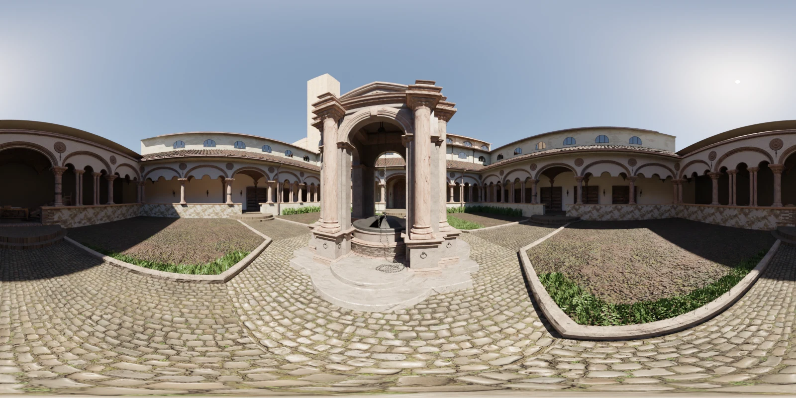
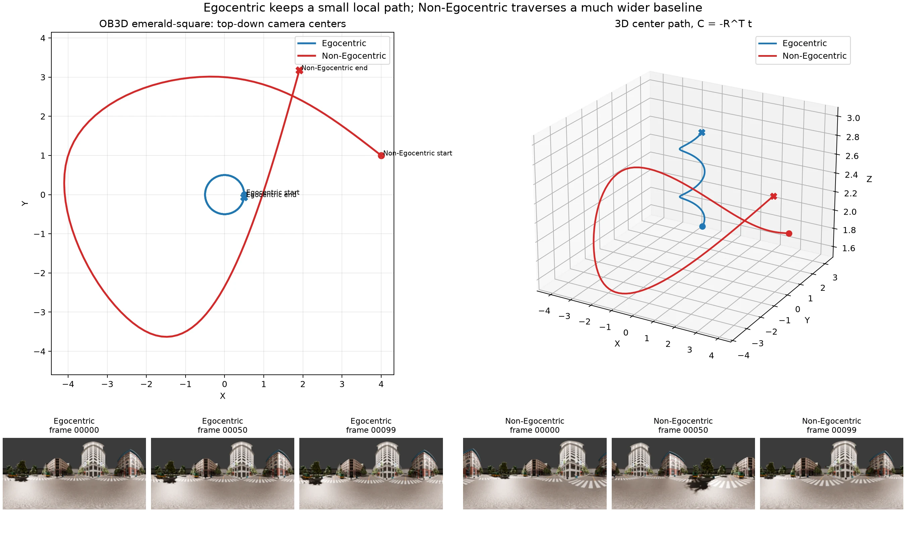

  
# 0. 요약 결론  
- OB3D는 ==Blender 3D scene==에서 생성된 synthetic omnidirectional / equirectangular dataset임.
- Multi-view EQR image 기반 3D reconstruction을 주 목적으로 하며, NVS와 camera pose estimation 평가에도 사용할 수 있음.
- 각 scene은 ==RGB, depth, normal, camera parameter, sparse point cloud==를 제공하므로, OTF-Rig의 EQR-to-pinhole virtual rig, incremental pose estimation, Gaussian spawn/densify 검증에 적합함.
- 다만 synthetic dataset이므로 real-world robustness의 최종 근거로 쓰기에는 부족함.

# 1. 어떤 데이터셋인가  
- 360도 equirectangular image 기반 3D reconstruction benchmark를 위해 제안된 synthetic dataset임.
- 기존 360° reconstruction 연구에서는 EQR projection의 왜곡, 특히 pole region distortion과 latitude-dependent sampling 문제가 존재하는데, OB3D는 이 문제를 체계적으로 평가하기 위해 Blender scene에서 RGB, depth, normal, camera GT를 함께 생성함.

# 2. 데이터 구조와 제공 항목  
```
OB3D/
  scene_name/
    Egocentric/
      cameras/
      depths/
      images/
      normals/
      sparse/
      train.txt
      test.txt
    Non-Egocentric/
      ...
```

| 항목             | 내용                         | OTF-Rig에서의 용도                 |
| -------------- | -------------------------- | ----------------------------- |
| RGB EQR image  | 360° equirectangular 입력    | EQR-to-pinhole virtual rig 입력 |
| Camera JSON    | GT camera pose / parameter | pose error, trajectory 분석     |
| Depth EXR      | GT depth                   | geometry/reconstruction 검증    |
| Normal EXR     | GT normal                  | surface 품질 확인                 |
| Sparse PLY     | sparse 3D point cloud      | SfM-style reference           |
| train/test txt | split 제공                   | NVS 평가                        |


- 12 scene dataset 중 일부인 lone-monk의 RGB 이미지 예시. 800x400 해상도.
# 3. Egocentric / Non-Egocentric trajectory 차이  
- ==Egocentric== : 촬영자 또는 중심점을 기준으로 원형/나선형으로 움직이는 trajectory임. image 간 disparity가 작아 low-parallax / rotation-heavy 상황에 가까움.
- ==Non-Egocentric== : scene 내부를 더 자유롭게 이동하는 trajectory이며, translation baseline과 parallax가 더 크기 때문에 실제 3D reconstruction 평가에 더 직접적임.


# 4. 어떤 평가에 사용할 수 있는가  
1. NVS 품질 평가: PSNR, SSIM, LPIPS  
2. Camera pose estimation 평가: GT pose와 estimated pose 비교  
3. 3D reconstruction 평가: rendered depth와 GT depth 비교

# 5. 어떤 논문에서 사용되었는가  
1. OB3D의 원 논문 "OB3D: A New Dataset for Benchmarking Omnidirectional 3D Reconstruction Using Blender"
2. PFGS360 : OB3D가 synthetic 360° benchmark로 사용됨.
	Nerfstudio 기반의 pose-free omnidirectional 3D Gaussian Splatting 방법이며, OB3D와 Ricoh360에서 학습/평가 예시를 제공함.

