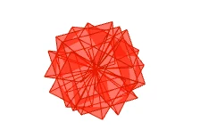
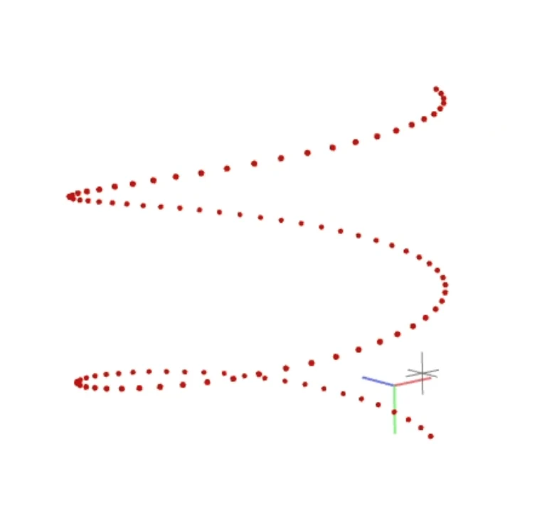
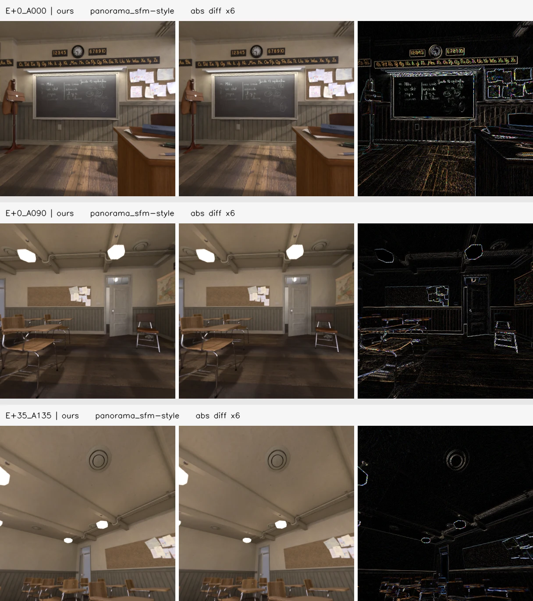

## 0. 보고 기준

| 이름                        | 의미                                                                                            |
| ------------------------- | --------------------------------------------------------------------------------------------- |
| OTF-Rig                   | 12-view virtual pinhole rig를 OTF로 처리한 ours                                                    |
| COLMAP panorama_sfm-style | 공식 `panorama_sfm.py`의 EQR -> virtual pinhole rig -> COLMAP rig SfM workflow를 CLI로 옮긴 baseline |
| OpenSfM native-EQR        | raw EQR을 직접 쓰는 equirectangular SfM pose baseline.                                             |

| Metric              | 의미                                                                                            |
| ------------------- | --------------------------------------------------------------------------------------------- |
| ATE RMSE m mean     | GT trajectory에 Sim(3) 정렬한 뒤, ==전체 camera center 위치 오차==의 RMSE 평균. 단위는 meter.                  |
| ATE %span mean      | ATE RMSE를 해당 scene의 GT trajectory bounding-box diagonal로 나눈 비율. scene scale 차이를 줄여 비교하기 위한 값. |
| RPE_t RMSE m mean   | 인접 timestep 사이의 relative translation 변화가 GT와 얼마나 다른지 보는 RMSE 평균. 단위는 ==meter==.               |
| RPE_r RMSE deg mean | 인접 timestep 사이의 relative rotation 변화가 GT와 얼마나 다른지 보는 RMSE 평균. 단위는 ==degree==.                 |

## 1. 데이터와 프로토콜

| 항목            | 값                                                                                                                                                                |
| ------------- | ---------------------------------------------------------------------------------------------------------------------------------------------------------------- |
| Dataset       | OB3D, Egocentric trajectory                                                                                                                                      |
| Scenes        | `archiviz-flat`, `barbershop`, `bistro`, `classroom`, `emerald-square`, `fisher-hut`, `lone-monk`, `pavillion`, `restroom`, `san-miguel`, `sponza`, `sun-temple` |
| Raw RGB       | EQR, 1600x800                                                                                                                                                    |
| OTF-Rig input | 12 views, 400x400, FOV 90                                                                                                                                        |
| Split         | train 25 / test 25 / tracking-only 50 timesteps (OB3D에서 공식적으로 명시함.)                                                                                              |
| OB3D paper    | <https://arxiv.org/abs/2505.20126>                                                                                                                               |

- colmap gui로 촬영한 12 view 상단 캡처본.

| Yaw  | Pitch                 |
| ---- | --------------------- |
| +35° | 45°, 135°, 225°, 315° |
| 0°   | 0°, 90°, 180°, 270°   |
| -35° | 0°, 90°, 180°, 270°   |
- 3개의 pitch ring X 4개 yaw direction = 12 view임. (colmap의 `panorama_sfm.py`에서 진행하는 12 view split과 동일함.)

- 현재 12 scene 전부 원형으로 돌아가며 위로 이동하는 trajectory임.

## 2. panorama_sfm-style CLI 변환

- 공식 `panorama_sfm.py`는 Python/pycolmap에서 EQR을 직접 perspective image로 렌더링함.
- EQR-to-pinhole 이미지를 이미 만들어 둔 상태이므로, rendering 단계는 생략하고 같은 구조의 prepared virtual rig images를 COLMAP CLI에 넣음.

### 2.1 panorama_sfm 방식과 ours의 EQR 이미지 추출 방식이 동일한가?

- 왼쪽 : ours EQR to pinhole image 추출 결과
- 중간 : colmap `panorama_sfm.py`에서 EQR to pinhole image 추출 결과
- 오른쪽 : 두 추출물의 차이 시각화

- pixel의 세부적인 샘플링 차이는 존재해도, 정확한 각도로 추출한 것을 알 수 있음.

### 2.2 CLI 단계

| 단계       | COLMAP command       | 주요 설정                                                                                                             |
| -------- | -------------------- | ----------------------------------------------------------------------------------------------------------------- |
| feature  | `feature_extractor`  | `PINHOLE`, `200,200,200,200`, `single_camera_per_folder=1`, mask 사용, GPU SIFT                                     |
| rig      | `rig_configurator`   | `colmap_rig_panosfm.json`, 모든 `cam_from_rig_translation=0`                                                        |
| matching | `sequential_matcher` | `rig_verification=1`, `skip_image_pairs_in_same_frame=1`, `overlap=10`, `loop_detection=1`, `expand_rig_images=1` |
| mapping  | `mapper`             | `ba_refine_sensor_from_rig/focal/principal/extra=0`                                                               |

## 3. OTF-Rig Run (seed 0)

| 항목                 | 값                                                                                           |
| ------------------ | ------------------------------------------------------------------------------------------- |
| Input              | OB3D prepared 12-view pinhole rig                                                           |
| Iteration          | `--num_iterations 270` (최종적으로 pose/gaussian 보정할 때의 iteration을 의미)                           |
| Previous keyframes | `--num_prev_keyframes_miniba_incr 6` (Incremental 부분에서 active window image 중 6장을 가지고 BA 수행) |
| Active memory cap  | `--max_active_timesteps 30` (30 timestep * 12 view만큼 window를 기억하고 있음)                       |
| Split              | train/test timestep files 사용, claim metric은 `rig_eval_split == "test"`만 사용                  |

| Scene          | Registered frames | test split | ATE RMSE m | ATE %span | RPE_t RMSE m | RPE_r RMSE deg | Test PSNR | Test SSIM | Test LPIPS | Time s |
| -------------- | ----------------: | ---------: | ---------: | --------: | -----------: | -------------: | --------: | --------: | ---------: | -----: |
| archiviz-flat  |           100/100 |      25/25 |   0.002879 |    0.1669 |     0.002630 |         0.0585 |     32.46 |     0.950 |      0.146 |    737 |
| barbershop     |           100/100 |      25/25 |   0.001475 |    0.0855 |     0.001755 |         0.0416 |     31.27 |     0.921 |      0.215 |    770 |
| bistro         |           100/100 |      25/25 |   0.016004 |    0.6580 |     0.014982 |         0.0529 | **26.92** |     0.876 |      0.155 |    923 |
| classroom      |           100/100 |      25/25 |   0.002787 |    0.1615 |     0.002744 |         0.0539 |     31.20 |     0.925 |      0.179 |    757 |
| emerald-square |                 - |          - |          - |         - |            - |              - |         - |         - |          - |      - |
| fisher-hut     |                 - |          - |          - |         - |            - |              - |         - |         - |          - |      - |
| lone-monk      |           100/100 |      25/25 |   0.003922 |    0.1612 |     0.003923 |         0.0409 |     31.43 |     0.930 |      0.129 |    759 |
| pavillion      |           100/100 |      25/25 |   0.004505 |    0.1852 |     0.004053 |         0.0592 |     35.79 |     0.940 |      0.215 |    747 |
| restroom       |           100/100 |      25/25 |   0.003465 |    0.2009 |     0.003313 |         0.0291 |     32.68 |     0.871 |      0.341 |    779 |
| san-miguel     |           100/100 |      25/25 |   0.003183 |    0.1308 |     0.003062 |         0.0479 | **27.72** |     0.844 |      0.232 |    773 |
| sponza         |           100/100 |      25/25 |   0.005661 |    0.3281 |     0.005359 |         0.0599 |     33.90 |     0.929 |      0.127 |    768 |
| sun-temple     |                 - |          - |          - |         - |            - |              - |         - |         - |          - |      - |

- 결과가 비어있는 dataset : bootstrap 이후 OOM 발생으로 수행 불가

요약:

| Metric         |     Mean |      Std | Scene count |
| -------------- | -------: | -------: | ----------: |
| ATE RMSE m     | 0.004916 | 0.004314 |           9 |
| ATE %span      |   0.2309 |   0.1731 |           9 |
| RPE_t RMSE m   | 0.004646 | 0.004009 |           9 |
| RPE_r RMSE deg |   0.0493 |   0.0104 |           9 |
| Test PSNR      |    31.49 |     2.78 |           9 |
| Test SSIM      |    0.910 |    0.036 |           9 |
| Test LPIPS     |    0.193 |    0.068 |           9 |
| Time s         |      779 |       56 |           9 |

## 4. COLMAP panorama_sfm-style 12 scene 결과

| 항목                 | 값                                                     |
| ------------------ | ----------------------------------------------------- |
| COLMAP             | `4.1.0`, CUDA build                                   |
| Input              | OB3D Egocentric 12 scenes, scene당 100 timesteps       |
| Virtual rig        | 12 views, 400x400, FOV 90                             |
| Camera model       | `PINHOLE`, `200,200,200,200`                          |
| Matcher            | `sequential_matcher`                                  |
| Sequential overlap | 10                                                    |
| Same-frame pairs   | `skip_image_pairs_in_same_frame=1` (같은 ts view는 skip) |
| Rig verification   | on                                                    |
| Mapper             | fixed rig, fixed intrinsics                           |

| Scene          | Registered frames | Registered images | Points | Mean reproj px | ATE RMSE m | ATE %span | RPE_t RMSE m | RPE_r RMSE deg | Time s |
| -------------- | ----------------: | ----------------: | -----: | -------------: | ---------: | --------: | -----------: | -------------: | -----: |
| archiviz-flat  |           100/100 |         1200/1200 |  9,248 |          0.712 |   0.001312 |    0.0761 |     0.000927 |         0.0188 |    139 |
| barbershop     |           100/100 |         1200/1200 | 25,980 |          0.632 |   0.000663 |    0.0384 |     0.000336 |         0.0129 |    218 |
| bistro         |           100/100 |         1200/1200 | 26,961 |          0.496 |   0.002717 |    0.1117 |     0.001206 |         0.0126 |    365 |
| classroom      |           100/100 |         1200/1200 | 15,620 |          0.666 |   0.000979 |    0.0567 |     0.000620 |         0.0146 |    201 |
| emerald-square |           100/100 |         1200/1200 | 19,888 |          0.576 |   0.002543 |    0.1474 |     0.002903 |         0.0129 |    292 |
| fisher-hut     |           100/100 |         1200/1200 | 21,705 |          0.525 |   0.002289 |    0.0663 |     0.000960 |         0.0150 |    173 |
| lone-monk      |           100/100 |         1200/1200 | 30,661 |          0.439 |   0.002602 |    0.1070 |     0.000594 |         0.0136 |    232 |
| pavillion      |           100/100 |         1200/1200 | 11,492 |          0.534 |   0.003626 |    0.1491 |     0.000833 |         0.0152 |    184 |
| restroom       |           100/100 |         1200/1200 | 19,169 |          0.543 |   0.001320 |    0.0765 |     0.000635 |         0.0136 |    179 |
| san-miguel     |           100/100 |         1200/1200 | 42,961 |          0.507 |   0.002038 |    0.0838 |     0.000478 |         0.0128 |    271 |
| sponza         |           100/100 |         1200/1200 | 21,504 |          0.569 |   0.000708 |    0.0411 |     0.000574 |         0.0128 |    260 |
| sun-temple     |           100/100 |         1200/1200 | 30,517 |          0.568 |   0.001485 |    0.0861 |     0.001443 |         0.0127 |    267 |

요약:

| Metric         |     Mean |      Std |
| -------------- | -------: | -------: |
| ATE RMSE m     | 0.001857 | 0.000883 |
| ATE %span      |   0.0867 |   0.0348 |
| RPE_t RMSE m   | 0.000959 | 0.000659 |
| RPE_r RMSE deg |   0.0140 |   0.0017 |

## 5. OpenSfM native-EQR 진행분

- OpenSfM은 raw EQR을 직접 쓰는 pose-only baseline임. (CPU only)

| Scene          | Registered | ATE RMSE m | ATE %span | RPE_t RMSE m | RPE_r RMSE deg | Runtime s |
| -------------- | ---------: | ---------: | --------: | -----------: | -------------: | --------: |
| archiviz-flat  |    100/100 |   0.000470 |    0.0272 |     0.000526 |         0.0140 |       874 |
| barbershop     |    100/100 |   0.000204 |    0.0118 |     0.000180 |         0.0128 |      1805 |
| bistro         |    100/100 |   0.001078 |    0.0443 |     0.000464 |         0.0124 |      2799 |
| classroom      |    100/100 |   0.000477 |    0.0276 |     0.000216 |         0.0125 |      1772 |
| emerald-square |    100/100 |   0.000419 |    0.0243 |     0.000287 |         0.0124 |      2127 |
| fisher-hut     |    100/100 |   0.000585 |    0.0169 |     0.000541 |         0.0136 |      1284 |
| lone-monk      |    100/100 |   0.000281 |    0.0115 |     0.000217 |         0.0125 |      2064 |
| pavillion      |    100/100 |   0.000505 |    0.0208 |     0.000284 |         0.0127 |      1696 |
| restroom       |    100/100 |   0.000329 |    0.0191 |     0.000317 |         0.0127 |      1700 |
| san-miguel     |    100/100 |   0.000322 |    0.0132 |     0.000208 |         0.0124 |      2494 |
| sponza         |    100/100 |   0.000134 |    0.0077 |     0.000155 |         0.0124 |      2249 |
| sun-temple     |    100/100 |   0.000525 |    0.0304 |     0.000484 |         0.0124 |      2798 |

요약:

| Metric         |     Mean |      Std |
| -------------- | -------: | -------: |
| ATE RMSE m     | 0.000444 | 0.000232 |
| ATE %span      |   0.0213 |   0.0098 |
| RPE_t RMSE m   | 0.000323 | 0.000136 |
| RPE_r RMSE deg |   0.0127 |   0.0005 |

- 모든 scene에서 100/100 등록됨.
- 이 결과만 보면 OpenSfM native-EQR pose는 COLMAP panorama_sfm-style rig보다 더 정확함.

---

## 6. 최종 3-way 요약 (공통 9 scene 기준)

OTF-Rig가 완료된 9 scene만 사용한 비교임.

공통 scene:
`archiviz-flat`, `barbershop`, `bistro`, `classroom`, `lone-monk`, `pavillion`, `restroom`, `san-miguel`, `sponza`

| Method                    | Scene count |          ATE RMSE m |       ATE %span |        RPE_t RMSE m |  RPE_r RMSE deg |  Runtime s |
| ------------------------- | ----------: | ------------------: | --------------: | ------------------: | --------------: | ---------: |
| OTF-Rig active30          |           9 | 0.004916 ± 0.004314 | 0.2309 ± 0.1731 | 0.004646 ± 0.004009 | 0.0493 ± 0.0104 |   779 ± 56 |
| COLMAP panorama_sfm-style |           9 | 0.001774 ± 0.001031 | 0.0823 ± 0.0359 | 0.000689 ± 0.000261 | 0.0141 ± 0.0020 |   228 ± 66 |
| OpenSfM native-EQR        |           9 | 0.000422 ± 0.000276 | 0.0204 ± 0.0114 | 0.000285 ± 0.000130 | 0.0127 ± 0.0005 | 1939 ± 554 |

OTF-Rig NVS 품질:

| Metric     | Mean ± Std |
| ---------- | ---------- |
| Test PSNR  | 31.49 ± 2.78 |
| Test SSIM  | 0.910 ± 0.036 |
| Test LPIPS | 0.193 ± 0.068 |
