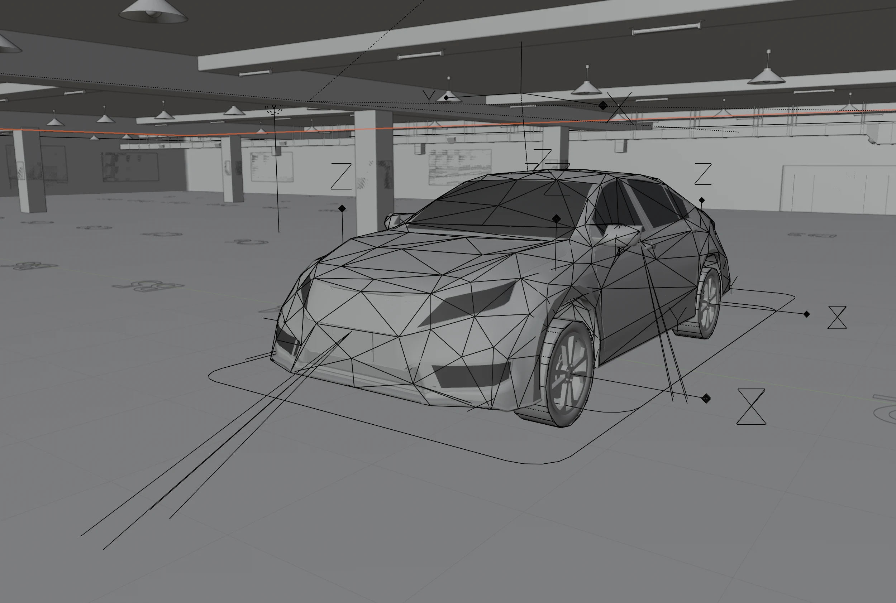
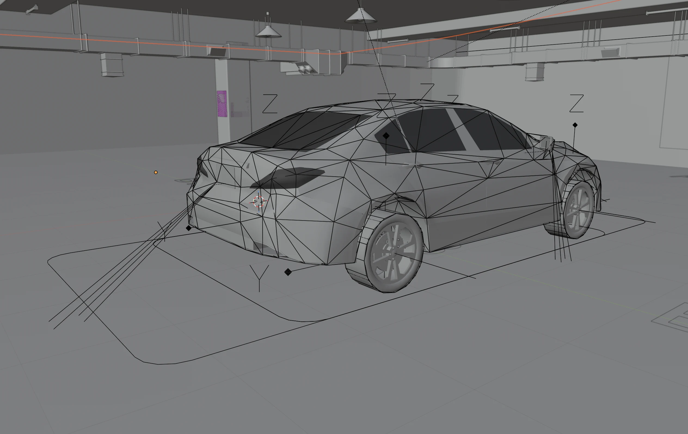
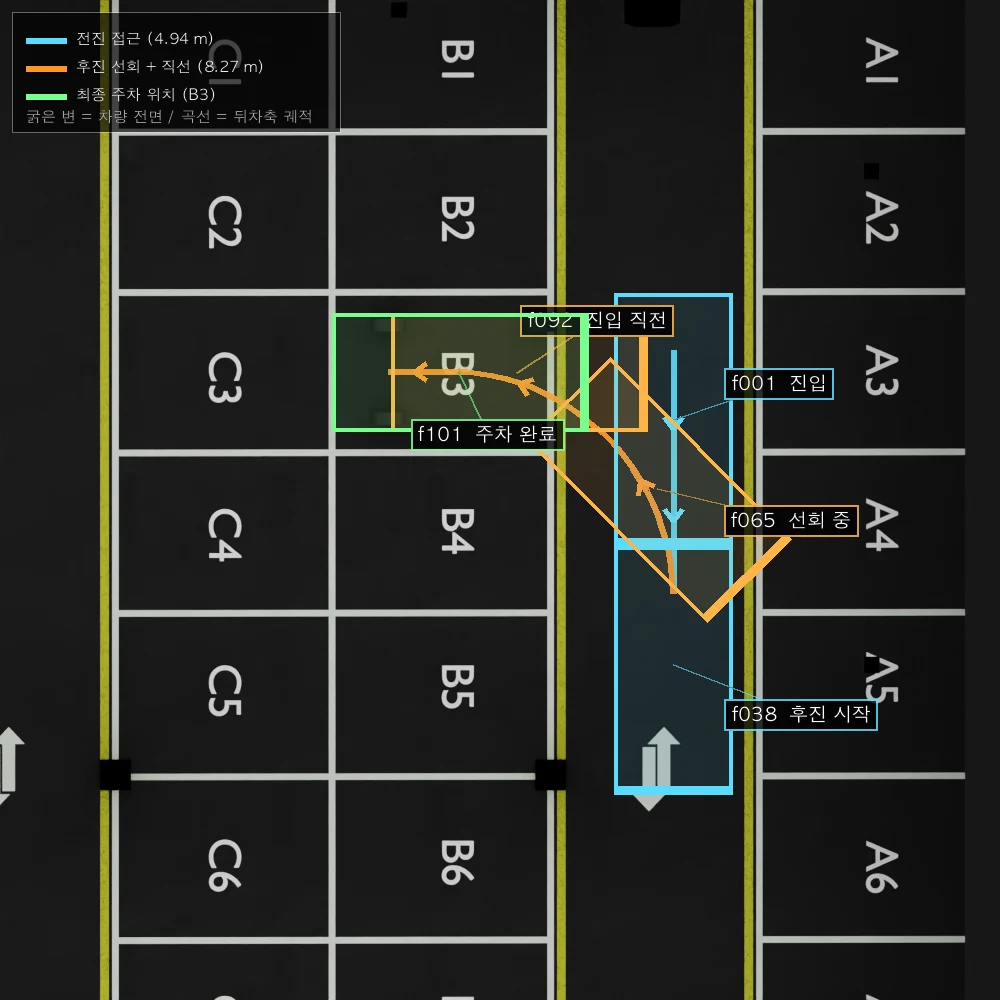
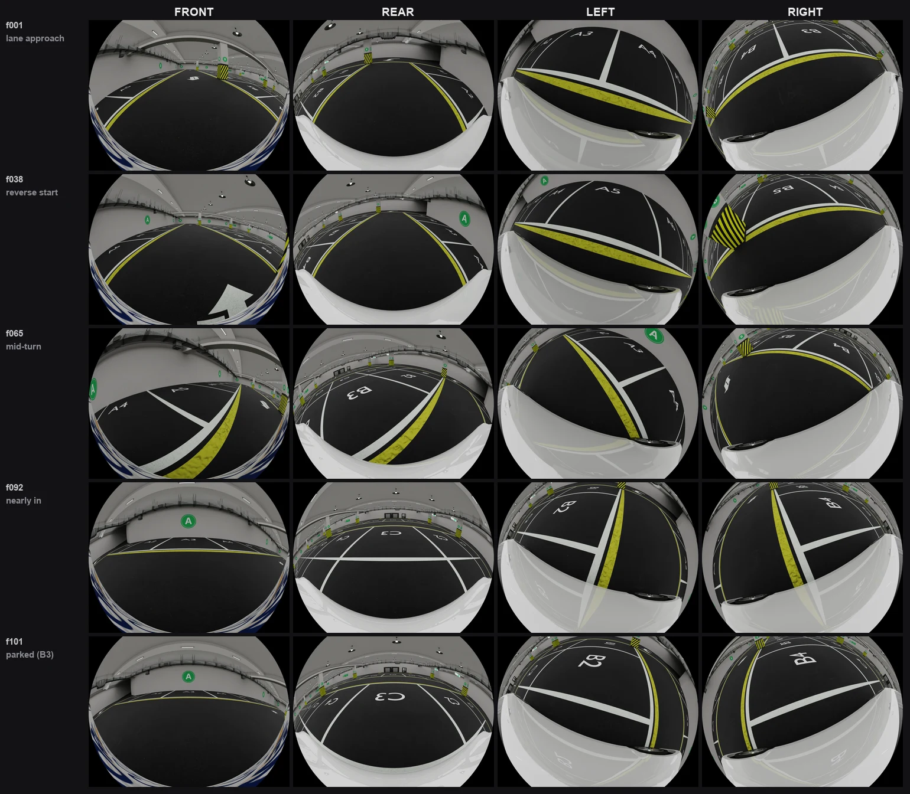

## 1. 환경 세팅

### 1-1. 실행 환경

| 항목         | 내용           |
| ---------- | ------------ |
| 기기         | Apple M4 Pro |
| OS         | 26.5.2       |
| Blender 버전 | 5.2.0 LTS    |
### 1-2. 씬과 차량 모델

| 항목    | 내용                                                                |
| ----- | ----------------------------------------------------------------- |
| 씬     | `Parking.blend` (지하주차장, 54 × 56.5 m, 층고 3.46 m, 기둥 3×3 격자)        |
| 단위    | METRIC, 1 Blender unit = 1 m (실측 스케일)                             |
| 구획    | A1~A15 / B1~B13 / C1~C13 / D1~D13, 구획 폭 3.2 m, 깊이 4.38 m          |
| 차량    | RBC Sedan Rig (RBC Addon Pro 1.4.4 (AKA Studios)의 RenderCrate 에셋) |
| 로컬 축  | 전방 = −Y, 좌측 = +X                                                  |

### 1-3. 사용한 도구
| 도구               | 용도                                                      |
| ---------------- | ------------------------------------------------------- |
| Blender MCP      | 씬 조작 전반 (`execute_blender_code`, `get_objects_summary`) |
| **Cycles** (GPU) | 어안 렌더                                                   |

### 1-4. 카메라 장착 위치
| 카메라       | 장착 부위       | 세로       | 가로       | 높이          | 하향각   | 요(정면 0°) |
| --------- | ----------- | -------- | -------- | ----------- | ----- | -------- |
| **Front** | 프론트 그릴 중앙   | +2.521 m | 0        | **0.660 m** | 23.2° | 0°       |
| **Rear**  | 트렁크 리드 중앙   | −2.521 m | 0        | **0.930 m** | 36.7° | 180°     |
| **Left**  | 좌측 사이드미러 하단 | +0.757 m | +1.179 m | **1.119 m** | 73.8° | +107.6°  |
| **Right** | 우측 사이드미러 하단 | +0.757 m | −1.179 m | **1.119 m** | 75.0° | −111.3°  |

|  |  |
| -------------------------------------- | ------------------------------------- |
| 차량 전면 및 측면                             | 차량 후면 및 측면                            |

### 1-5. 이동 경로

- 한 이미지당 25초 소요 (한 KF당 25\*4 = 100초 소요)