**지난 미팅 (2026-08-09)**
- Offline으로 Scene 구성 후 해당 Dataset으로 GS 구성 진행하기.
- 시작은 Offline GS로 수행하기. 이후 Online으로 전환하기.

**합의 사항 → 상태**
- [완료] Offline으로 Scene Dataset 구성 및 Offline GS 수행 완료.
- [미착수] 현재 Online으로 전환하지는 않음.

**이번 결과 / 막힌 것 / 다음**
- 결과: 5개 생성한 Scene에서 Offline GS 정상 수행되는 것을 확인 완료함.
- 다음: Online 전환 방식 구상

---

## 1. 개요
Blender 지하주차장 환경에서 생성한 동기화 4-camera fisheye parking dataset을 [DirectFisheye-GS](https://yzxqh.github.io/DirectFisheye-GS/) 기반 Offline Gaussian Splatting으로 재구성하고, held-out test view와 top-view surround-view로 품질을 평가함.

### 1-1. Scene 정의

| Scene   | 설명                                                                         |
| ------- | -------------------------------------------------------------------------- |
| Scene01 | B/A 통로에서 남쪽으로 전진한 뒤 한 번의 90° 선회로 후진하여 B3 주차면에 직각 주차하는 scene                |
| Scene02 | Scene01의 좌우 대칭 조건으로 C/D 통로에서 남쪽으로 전진한 뒤 반대 방향으로 후진하여 C8 주차면에 직각 주차하는 scene |
| Scene03 | B11을 지난 뒤 입구 모서리의 기둥을 근접 회피하면서 후진하여 B11 주차면에 진입하는 scene                    |
| Scene04 | 남쪽 통로에서 목표 구간을 지나친 뒤 역방향 S-curve와 짧은 전진 보정을 거쳐 평행 주차하는 scene               |
| Scene05 | B6을 지나친 상태에서 후진–전진 보정–최종 후진을 수행하여 B6에 진입하는 3-point switchback scene        |

### 1-2. Scene top view gif

| 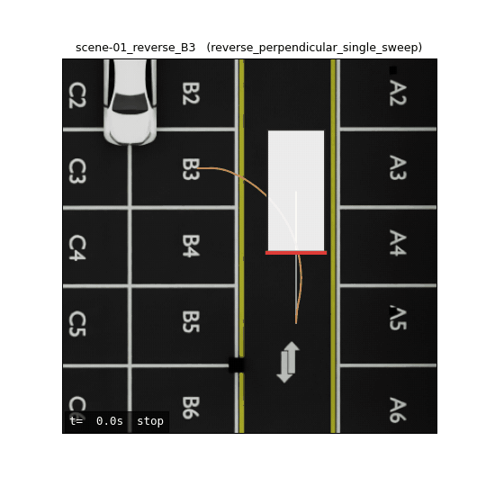 | 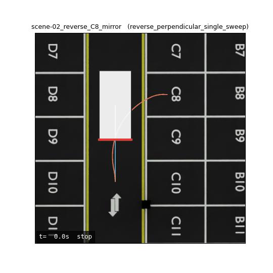 | 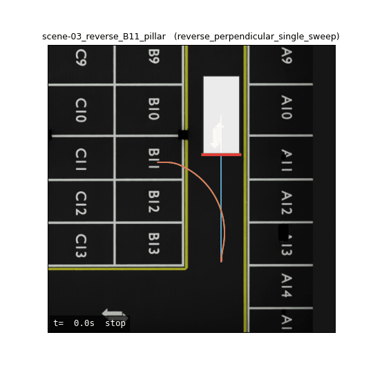 | 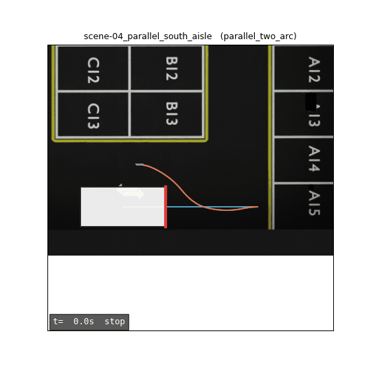 | 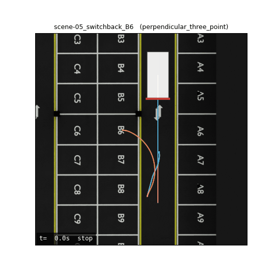 |
| ----------------------------------------------------- | ----------------------------------------------------- | ----------------------------------------------------- | ----------------------------------------------------- | ----------------------------------------------------- |
| Scene01                                               | Scene02                                               | Scene03                                               | Scene04                                               | Scene05                                               |

---
## 2. 입력 및 전처리

| 카메라       | 장착 부위       | 세로       | 가로       | 높이          | 하향각   | 요(정면 0°) |
| --------- | ----------- | -------- | -------- | ----------- | ----- | -------- |
| **Front** | 프론트 그릴 중앙   | +2.521 m | 0        | **0.660 m** | 23.2° | 0°       |
| **Rear**  | 트렁크 리드 중앙   | −2.521 m | 0        | **0.930 m** | 36.7° | 180°     |
| **Left**  | 좌측 사이드미러 하단 | +0.757 m | +1.179 m | **1.119 m** | 73.8° | +107.6°  |
| **Right** | 우측 사이드미러 하단 | +0.757 m | −1.179 m | **1.119 m** | 75.0° | −111.3°  |
- 한 Timestamp에 4개 Camera를 1280×960로 동시 생성함.
- Dataset에 대해 차체에 대한 부분만 masking해 train에서 제외함.

### 2-1. Dataset masking

|   |   |   |   |
| ------------------------------------------- | ------------------------------------------ | ------------------------------------------ | ------------------------------------------- |
|  |  |  |  |
| Front                                       | Rear                                       | Left                                       | Right                                       |

- Scene01–Scene04는 train stride 1을 사용하고, Scene05는 메모리 한계로 timestamp stride 2를 사용함.

---
## 3. Offline GS 적용

 - [DirectFisheye-GS](https://github.com/Metaverse-AI-Lab-THU/DirectFisheye-GS) 를 기반으로 수행함.
- Gaussian Splatting을 기반으로 fisheye image를 pinhole image로 사전 변환하지 않고 직접 처리하는 방식임.

- Blender camera와 동일한 equisolid projection인 r = 2f·sin(θ/2)를 사용하도록 renderer를 수정함.
- 최대 입사각 96°를 처리하며, optical axis 뒤쪽에 해당하는 90–96° 외곽 영역도 radial depth와 projection Jacobian을 이용하여 rasterization에 포함함.

- Seed 0, 30,000 iteration, 1280×960 조건으로 모든 scene을 학습함.
- Test frame에는 Gaussian을 추가하지 않으며, 학습된 Gaussian scene을 held-out GT camera pose에서만 렌더링함.

---
## 4. 수행 결과

### 4-1. 수행 시간 및 품질

| Scene   | COLMAP  | Train 30k | Scene 합계   | PSNR     | SSIM   | 85–96° PSNR |
| ------- | ------- | --------- | ---------- | -------- | ------ | ----------- |
| Scene01 | 18m 12s | 49m 20s   | 1h 7m 32s  | 32.17 dB | 0.9573 | 27.32 dB    |
| Scene02 | 23m 23s | 49m 21s   | 1h 12m 44s | 32.62 dB | 0.9590 | 27.28 dB    |
| Scene03 | 15m 19s | 50m 27s   | 1h 5m 46s  | 33.46 dB | 0.9620 | 28.22 dB    |
| Scene04 | 5m 31s  | 53m 25s   | 58m 56s    | 28.88 dB | 0.8915 | 23.50 dB    |
| Scene05 | 27m 23s | 50m 11s   | 1h 17m 34s | 35.62 dB | 0.9687 | 28.53 dB    |
- Scene04는 일부 test timestamp에서 right camera가 근거리 벽을 대부분 촬영하므로 pixel metric이 상대적으로 낮게 측정됨. 다만 top-view에서는 주차선, 벽 및 차량 주변 구조가 연속적으로 유지됨.

### 4-1. 수행 결과 held-out top view Render gif

| 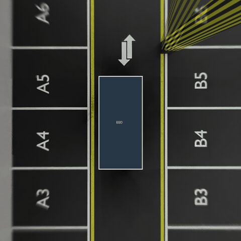 | 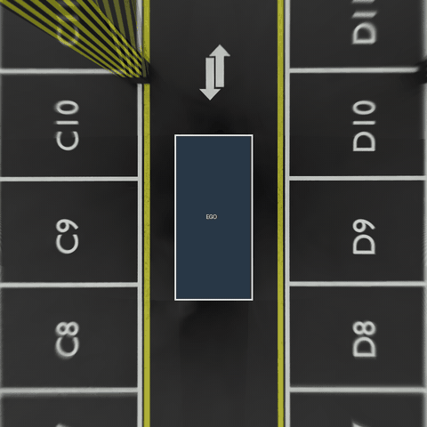 | 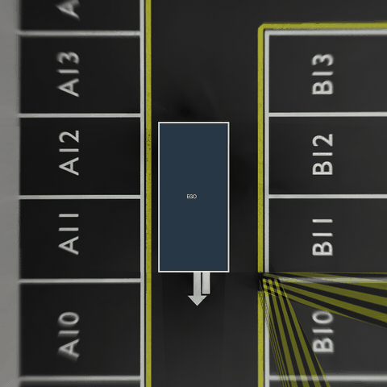 | 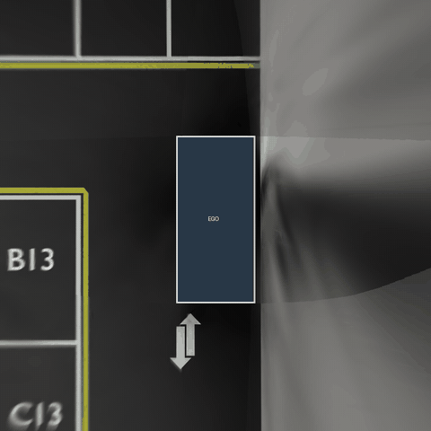 | 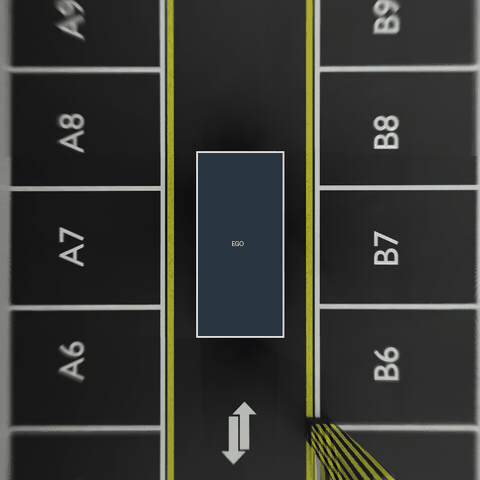 |
| --------------------------------------------------- | --------------------------------------------------- | --------------------------------------------------- | --------------------------------------------------- | --------------------------------------------------- |
| Scene01                                             | Scene02                                             | Scene03                                             | Scene04                                             | Scene05                                             |

### 4-2. held-out frame 일부 Render
- 맨 위부터 GT, Render, Absolute Error 순서로 표기함.

#### Scene01
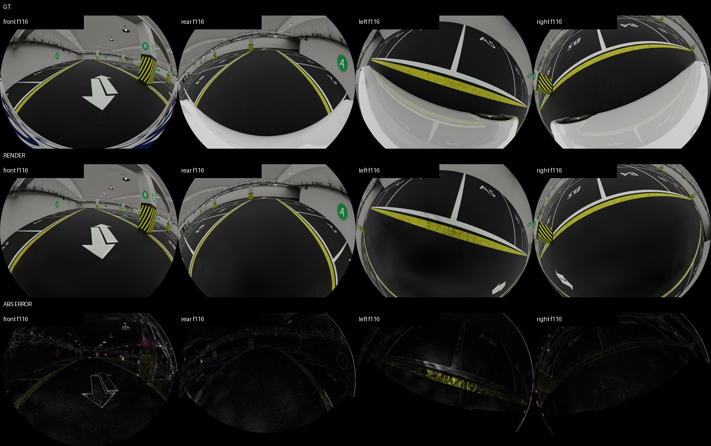

#### Scene02
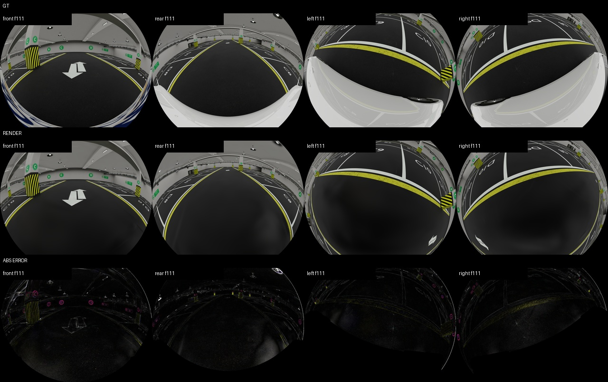

#### Scene03
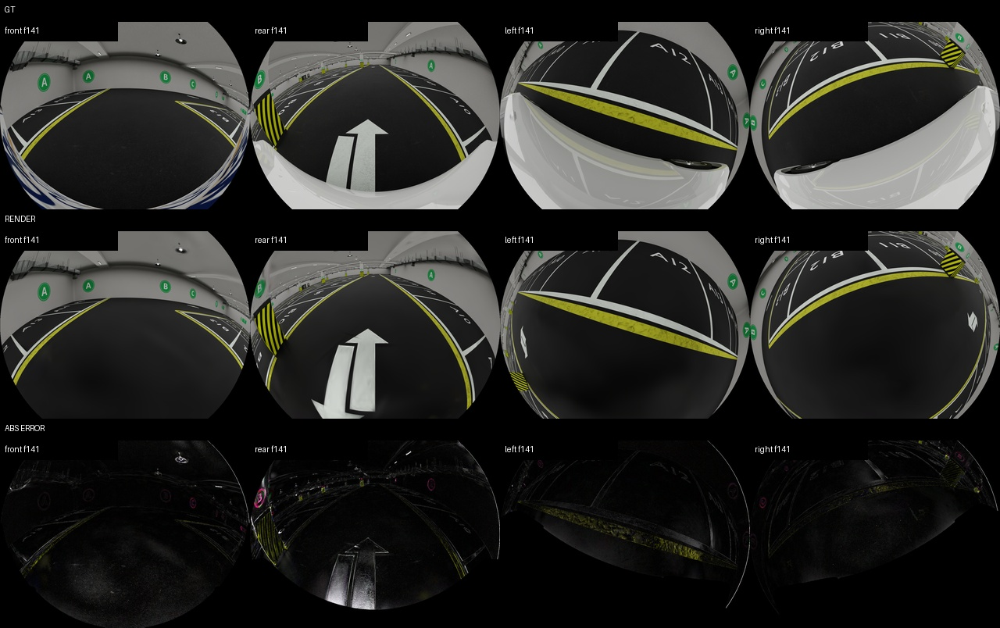

#### Scene04
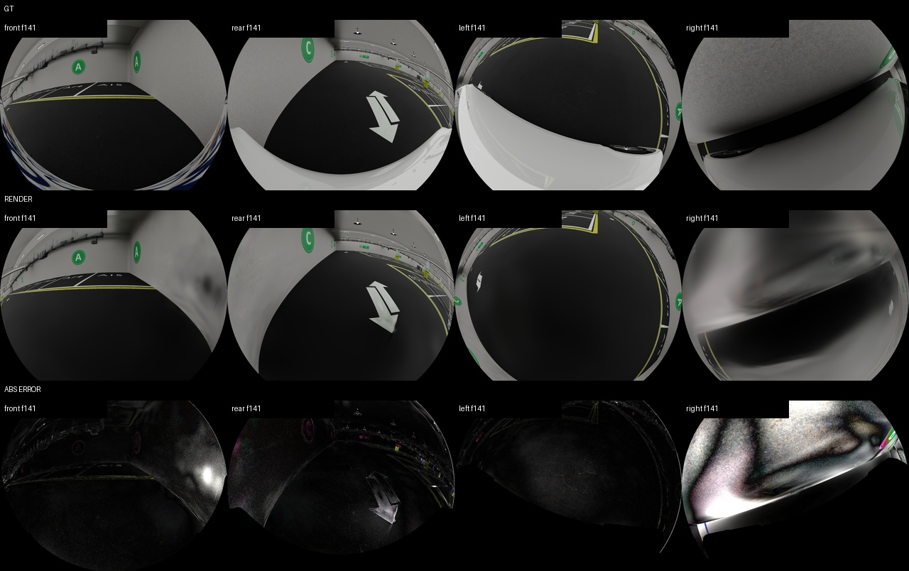

#### Scene05
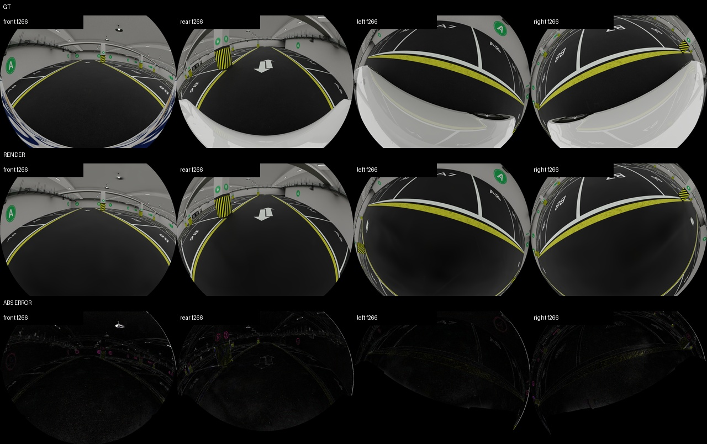