## 요약 (10줄 이내)

**지난 미팅 (2026-08-16)** : 4-camera OTF 1단계 구현 및 처리 예산 고정
- GT body pose, 동기화 RigFrame, equisolid rasterizer 조건에서 1단계 구현을 대조군으로 보존하기로 함.
- 원본 1280×960, Gaussian 총량 상한 없음, seed 0, RigFrame당 30 iteration으로 조건을 고정함.
- Offline 상한, 전체 시퀀스 overlap, 처리 시간, RAM/VRAM을 같은 Scene별로 보고하기로 함.

**합의 사항 → 상태**
- [완료] 5개 Scene에서 학습 408 RigFrame(1632장)과 map 고정 test·guard 253 RigFrame을 처리함.
- [완료] Offline과 동일한 미관측 test 15 timestamp/Scene으로 카메라 영상 PSNR 평균 차이 15.14 dB를 측정함.
- [부분] timestamp 처리 p50 평균 3493.9 ms로 166.7 ms 목표의 21.0배임.
- [미착수] pose-free tracking과 seam/confidence 보강은 대조군에 적용하지 않음.

**이번 결과 / 막힌 것 / 다음**
- 결과: source camera에서 표면까지의 거리 기준으로 인접 camera overlap은 0–2 m 3.78%, 2–15 m 23.41%임.
- 막힌 것: 학습 RigFrame당 30 steps × 4 views로 120회 render/backward가 발생함.
- 다음: 1단계 대조군을 보존하고 순차 4-view 계산 병목과 원거리 merge 개선을 분리해 검토함.

---

# 1. 1단계 구현 입력과 흐름

| Scene | 전체 RigFrame | 학습 RigFrame / images | test RigFrame / images | guard RigFrame / images |
|---|---:|---:|---:|---:|
| Scene1 | 100 | 73 / 292 | 15 / 60 | 12 / 48 |
| Scene2 | 99 | 72 / 288 | 15 / 60 | 12 / 48 |
| Scene3 | 119 | 86 / 344 | 15 / 60 | 18 / 72 |
| Scene4 | 123 | 86 / 344 | 15 / 60 | 22 / 88 |
| Scene5 | 220 | 91 / 364 | 15 / 60 | 114 / 456 |
| 합계 | 661 | 408 / 1632 | 75 / 300 | 178 / 712 |

test와 guard에서는 Gaussian map을 갱신하지 않으며, 품질 평가는 Scene별 test 15 RigFrame만 사용함.

| 공통 조건 | 고정값 |
|---|---|
| 입력 | 동일 timestamp의 Left·Front·Right·Rear 4-camera RigFrame |
| 투영 | Blender FISHEYE_EQUISOLID, 1280×960, downsampling 없음 |
| pose | Blender GT body pose + 고정 rig extrinsic |
| Gaussian 생성 | camera당 LoG 후보 2,048개, 지면 ray 교차 + rig triangulation |
| 중복 제거 | Left → Front → Right → Rear 순서로 후보를 처리하며, 3차원 공간의 같은 4 cm 격자에는 처음 들어온 Gaussian 후보 1개만 유지함 |
| 최적화 | 학습 RigFrame당 30 steps, step당 4-view joint loss |
| Gaussian 총량 상한 | 없음 |
| seed | 0 |

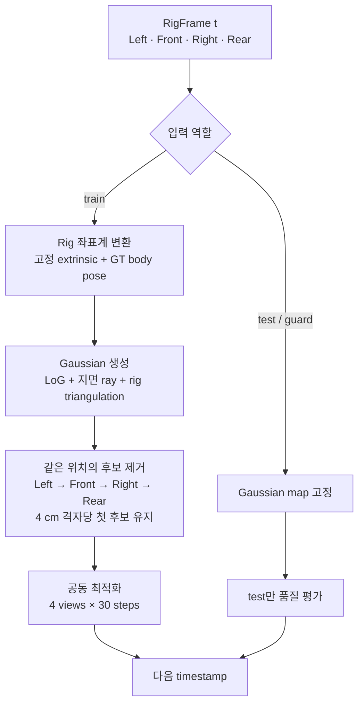

## 입력 순서에 따른 map 누적 결과

각 RigFrame을 순서대로 입력해 world top-view의 Gaussian map을 기록함. 학습 RigFrame에서는 Gaussian을 추가하고 30회 최적화하며, test·guard에서는 map을 변경하지 않고 render만 수행함.

### Scene1

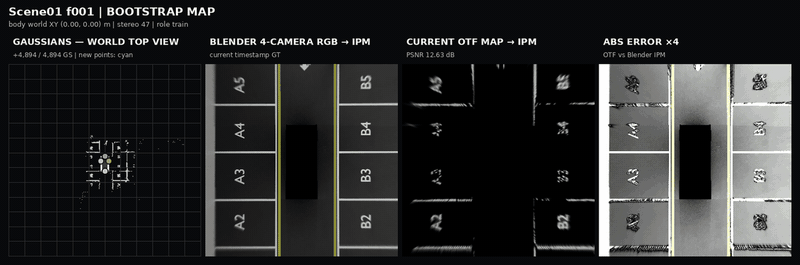

### Scene2

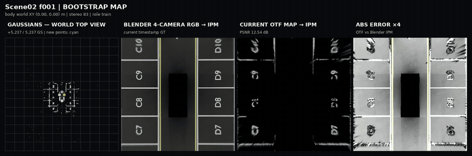

### Scene3

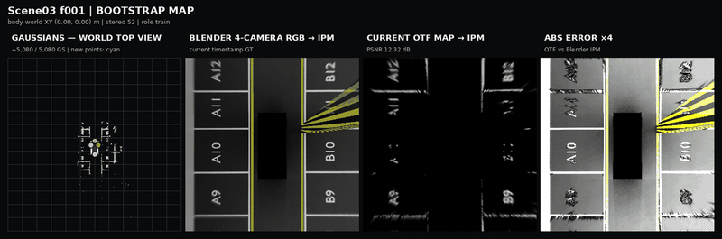

### Scene4

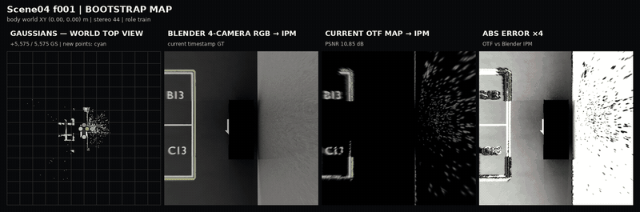

### Scene5

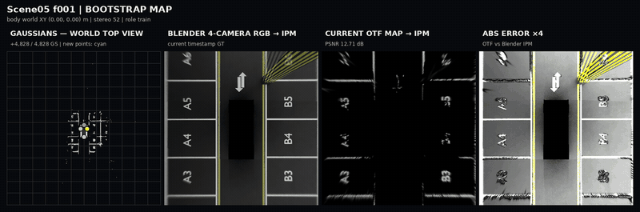

# 2. Offline 상한 대비 품질 및 시간 차이

Offline과 1단계 구현은 Scene별 학습 영상 수가 같고, 동일한 test 15 timestamp(60 camera images)를 사용함.

| 비교 항목 | Offline GS | 1단계 구현 | 판정 |
|---|---:|---:|---|
| 학습 영상 | Scene별 292/288/344/344/364장 | 동일 | 일치 |
| 평가 영상 | Scene별 60장 | 동일 | 일치 |
| 평가 pose·투영 | GT pose·equisolid | 동일 | 일치 |
| test의 map 갱신 | 없음 | 없음 | 일치 |

| Scene | Offline 카메라 영상 PSNR (dB) | 1단계 카메라 영상 PSNR (dB) | 카메라 영상 화질 차이 (dB) | 서라운드 top-view 화질 차이 (dB) | 차량 모서리 화질 차이 (dB) |
|---|---:|---:|---:|---:|---:|
| Scene1 | 32.60 | 16.65 | 15.95 | 21.15 | 19.02 |
| Scene2 | 33.05 | 16.89 | 16.16 | 20.48 | 19.58 |
| Scene3 | 33.79 | 18.30 | 15.49 | 18.73 | 18.22 |
| Scene4 | 30.62 | 18.97 | 11.66 | 3.78 | 2.71 |
| Scene5 | 35.65 | 19.21 | 16.44 | 20.89 | 21.08 |

- 카메라 영상 화질 차이 : 동일한 학습 미사용 test 영상에서 Offline과 1단계 구현의 PSNR 차이임.
- 서라운드 top-view 화질 차이 : Blender 4-camera GT를 z=0 지면에 합성한 기준 영상에 대해 Offline과 1단계 구현의 PSNR을 각각 구한 뒤 계산한 차이임.
- 차량 모서리 화질 차이 : 위 서라운드 top-view 중 카메라 경계가 만나는 차량 네 모서리 영역만 분리해 계산한 PSNR 차이임.

## 실행 시간 차이

| Scene | Offline 30k train (min) | 1단계 전체 loop (min) | 차이 (min) | Offline / 1단계 |
|---|---:|---:|---:|---:|
| Scene1 | 49.3 | 5.3 | 44.0 | 9.3× |
| Scene2 | 49.4 | 5.2 | 44.1 | 9.4× |
| Scene3 | 50.5 | 6.6 | 43.8 | 7.6× |
| Scene4 | 53.4 | 6.7 | 46.7 | 8.0× |
| Scene5 | 50.2 | 10.0 | 40.1 | 5.0× |
| 합계 | 252.7 | 33.9 | 218.9 | 7.5× |

Offline 시간은 COLMAP을 제외한 30,000-iteration 학습 log의 wall time임.

# 3. Timestamp 처리 시간과 자원 사용량

| Scene | p50 (ms) | p95 (ms) | 166.7 ms 대비 | RAM (GiB) | VRAM (GiB) | Gaussian |
|---|---:|---:|---:|---:|---:|---:|
| Scene1 | 3378 | 4467 | 20.3× | 8.43 | 1.26 | 90,980 |
| Scene2 | 3422 | 4481 | 20.5× | 8.37 | 1.25 | 96,372 |
| Scene3 | 3397 | 5035 | 20.4× | 9.55 | 1.26 | 110,549 |
| Scene4 | 3627 | 4910 | 21.8× | 9.78 | 1.25 | 133,783 |
| Scene5 | 3646 | 5224 | 21.9× | 2.90 | 1.26 | 132,277 |

- Optimization이 처리 시간의 대부분을 차지함.
- 학습 RigFrame마다 30 optimizer steps를 수행하고, camera별 render와 backward를 순차 실행해 timestamp당 총 120회 view render/backward가 발생함.

# 4. 카메라 간 공통 관측 영역과 Gaussian 후보 중복 제거 결과

카메라 배치상 같은 표면을 함께 관측할 수 있는 비율과 현재 4 cm 격자 규칙이 Gaussian 후보를 제거한 비율을 분리해 측정함. 같은 표면 관측률은 카메라와 Scene의 특성이고, 중복 제거 결과는 현재 알고리즘의 동작이므로 두 수치는 같은 값이 아님.

## 같은 표면 관측률 측정 방법

Source camera의 유효 픽셀을 Blender GT depth와 camera pose로 3차원 복원한 뒤 인접 target camera에 재투영함. Target 영상 안에 들어오고 차량 mask가 아니며, target depth와의 차이가 `max(5 cm, 예상 거리의 2%)` 이하일 때 같은 표면으로 판정함.

Left–Front, Front–Right, Right–Rear, Rear–Left 네 인접 camera 쌍을 양방향으로 계산해 평균함. 전체 평균은 661개 timestamp에서 계산한 비율의 평균임. GT depth는 이 통계 측정에만 사용하며 Gaussian 학습 입력에는 사용하지 않음.

거리 대역은 차량 외곽이 아니라 source camera에서 표면까지의 방사 거리(radial depth)를 기준으로 구분함.

- 0–2 m: source camera에서 2 m 미만인 근거리 표면임.
- 2–15 m: source camera에서 2 m 이상 15 m 미만인 표면임.

2 m는 공식 AVM 규격값이 아니라 주차 시 근거리와 원거리를 구분하기 위해 설정한 실험 기준임. 공개된 규정에는 4-camera 간 overlap 비율이나 2 m 거리 분할 기준이 없음.

| 규정 | 공개된 거리·시험 기준 | 본 실험과의 관계 |
|---|---|---|
| [UN R158](https://unece.org/media/press/357550) | 후방 camera에서 범퍼 뒤 0.3–3.5 m 영역의 가시성을 요구함 | 4-camera 간 overlap 비율은 규정하지 않음 |
| [FMVSS 111](https://www.nhtsa.gov/sites/nhtsa.gov/files/documents/tp-111-v01-final_tag.pdf) | 후방 0.3 m, 3.05 m, 6.1 m와 좌우 ±1.52 m 위치에 시험체를 배치함 | Surround camera 간 overlap 비율은 규정하지 않음 |
| [ISO 17386:2023](https://www.iso.org/standard/82952.html) | 거리 측정 기반 저속 장애물 경고 시스템을 대상으로 함 | 거리 측정과 경고가 없는 영상 camera aid는 적용 대상이 아님 |

| Scene  | 전체 frames | 같은 표면 관측 0–2 m | 같은 표면 관측 2–15 m | 4 cm 격자 제거 0–2 m | 4 cm 격자 제거 2–15 m |
| ------ | --------: | -------------: | --------------: | ---------------: | ----------------: |
| Scene1 |       100 |          3.62% |          23.62% |           0.258% |            0.407% |
| Scene2 |        99 |          3.64% |          20.97% |           0.001% |            0.321% |
| Scene3 |       119 |          3.69% |          24.88% |           0.151% |            0.404% |
| Scene4 |       123 |          4.28% |          23.87% |           0.019% |            0.225% |
| Scene5 |       220 |          3.69% |          23.36% |           0.001% |            0.464% |

- 같은 표면 관측률 : 동일한 3차원 표면이 인접한 두 camera 영상에 함께 보이는 비율임. Source camera에서 표면까지의 거리 기준 전체 평균은 0–2 m 구간 3.78%, 2–15 m 구간 23.41%임.

- 4 cm 격자 제거율 : 새 Gaussian 후보가 이미 사용 중인 격자에 들어와 삭제된 비율임. 두 수치는 측정 대상이 다르므로 서로 같은 값이 아님. 원거리에서는 같은 표면의 20.97–24.88%를 인접 카메라가 함께 관측하지만, 단순 4 cm 격자 규칙으로 제거된 후보는 0.225–0.464%임.

- 해석 : 0–2 m에서는 인접 camera의 같은 표면 관측률이 3.78%이므로 동일 timestamp의 교차 관측을 이용한 검증이 제한적임. 2–15 m에서는 23.41%의 공통 관측이 존재하지만 현재 4 cm 격자 규칙의 제거율은 0.225–0.464%이므로, 원거리 공통 관측을 현재 대조군이 거의 이용하지 못하고 있음.

# 5. Scene별 held-out top-view 결과

각 GIF는 `Blender 4-camera GT의 지면 합성 영상 | Offline GS 30k | OTF 30 iteration | OTF 절대 오차 ×4` 순서임.

## Scene1

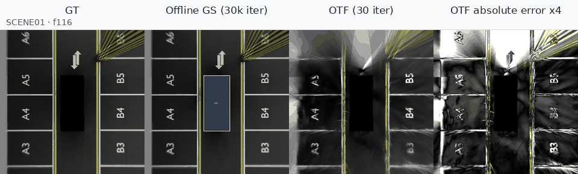

## Scene2

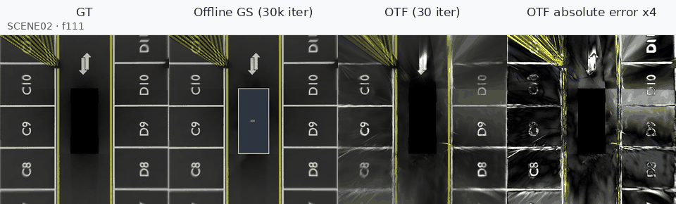

## Scene3

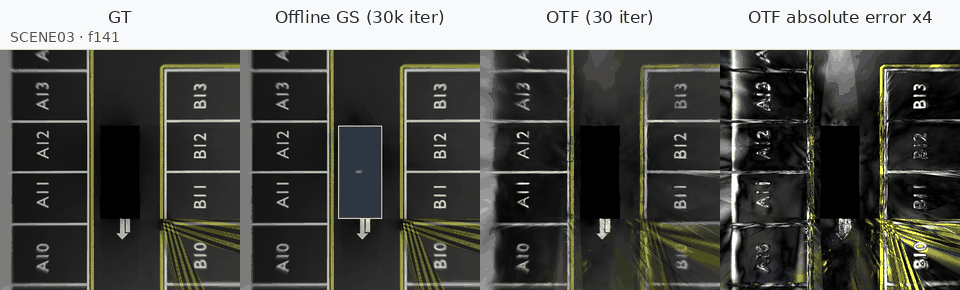

## Scene4

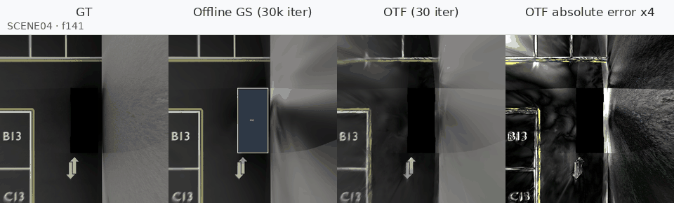

## Scene5

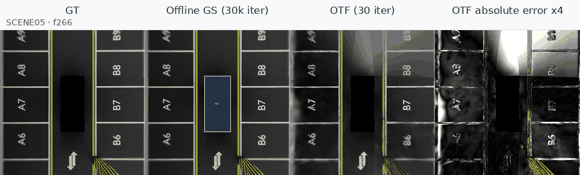
