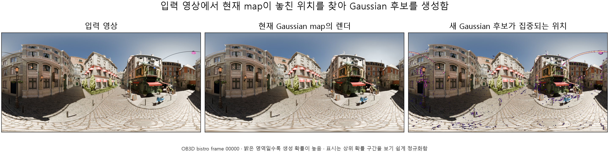
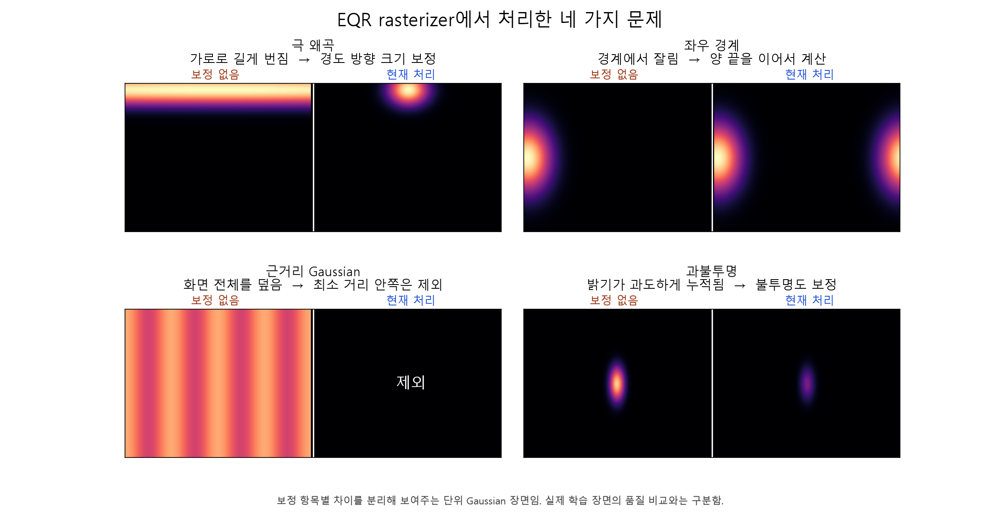
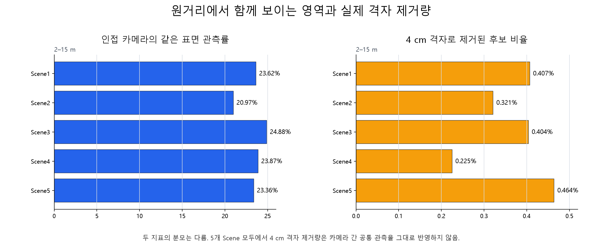

## 요약 (10줄 이내)
**지난 미팅 (2026-08-19)** - Gaussian 후보 생성, EQR 전환 문제, 카메라 간 중복 처리
- Original OTF의 Gaussian 후보 생성·검사·제거 순서를 확인함.
- EQR native에서 위도·좌우 경계·극·근거리 투영을 처리한 방법을 확인함.
- Multi-camera OTF의 카메라 간 Gaussian 병합 방법을 현재 4-camera 구현과 비교함.

**합의 사항 -> 상태**
- [완료] Original OTF, Multi-camera OTF, EQR native, 현재 4-camera 구현의 Gaussian 처리 순서를 비교함.
- [부분] EQR native renderer의 보정 항목별 단위 장면은 정리했으나, 실제 학습 장면의 수정 전·후 렌더 비교는 미측정임.

**이번 결과 / 확인하지 못한 것**
- 결과: 4-camera fisheye renderer가 픽셀별 Gaussian ID와 깊이를 출력하지 않아 기존 Gaussian 확인과 가림 검사를 적용하지 못함. 불투명도·화면 크기 기준 제거도 현재 mapper에 적용하지 않고 4 cm 격자로 중복 후보를 제거함.
- 확인하지 못한 것: EQR native 수정 전·후 실제 학습 렌더가 없어 증상별 품질 차이는 미측정임.

## 1. Original OTF의 Gaussian 생성 예산

Original OTF는 입력 영상과 현재 렌더의 LoG 차이를 새 Gaussian의 생성 확률로 사용함. 현재 map이 표현하지 못한 경계와 무늬가 많은 위치에서 후보가 더 자주 생성됨.

| 순서 | 처리 내용 |
|---:|---|
| 1 | 입력 영상에서 경계와 세부 무늬가 많은 위치를 찾음 |
| 2 | 현재 Gaussian map이 이미 표현한 위치를 찾음 |
| 3 | 입력 영상에서 찾은 값에서 현재 map의 값을 뺌 |
| 4 | 남은 값이 큰 위치에 새 Gaussian 후보를 더 자주 생성함 |

- EQR native는 같은 계산에 `cos(phi)` 위도 가중을 추가함. EQR 영상은 극으로 갈수록 한 픽셀이 나타내는 구면 면적이 작아지므로, 극 영역에 생성 후보가 몰리는 것을 줄이기 위한 처리임.

OB3D Bistro 영상에서 확인한 예시임. 오른쪽 영상의 보라색 점이 선택된 새 Gaussian 후보 위치이며, EQR의 극 영역에는 `cos(phi)` 가중을 적용함.

- LoG 차이는 현재 map이 놓친 영상 정보를 나타내며, Original OTF와 EQR native는 LoG로 후보 위치를 뽑은 뒤 유도 다중 시점 스테레오(guided multi-view stereo, guided MVS)와 깊이 신뢰도로 사용할 후보를 다시 거름.
- 영상 정보 차이를 기준으로 한 생성 예산은 Original OTF와 EQR native에 있음. 현재 4-camera 구현에 없는 것은 여러 카메라가 해당 깊이를 안정적으로 관측하는지에 따라 생성 예산을 조정하는 처리임.

## 2. EQR native 전환 시 처리한 문제

| 증상 | 원인 | 처리 내용 |
|---|---|---|
| 극에서 Gaussian이 가로로 길어짐 | 위도 `±90°` 부근에서 경도 방향 투영 크기가 커짐 | 극에 가까워도 계산값이 발산하지 않도록 막고 경도 방향 크기를 보정함 |
| 영상 왼쪽과 오른쪽 경계가 끊김 | EQR의 왼쪽 끝과 오른쪽 끝은 같은 방향이지만 화면 좌표는 떨어져 있음 | 양 끝의 tile과 픽셀 거리를 이어서 계산함 |
| 카메라 가까이의 Gaussian이 화면을 덮음 | 카메라와의 거리가 0에 가까울수록 투영 크기가 급격히 커짐 | 최소 거리보다 가까운 Gaussian을 제외함 |
| 가까운 Gaussian이 지나치게 불투명해짐 | 저역 통과 필터 적용 후 불투명도를 그대로 사용함 | Mip-Splatting 보정 계수를 불투명도에 반영함 |

보정 항목을 하나씩 분리한 단위 Gaussian 장면임. 극·좌우 경계·근거리·불투명도 보정이 화면에서 어떤 차이를 만드는지 보여줌.

## 3. Gaussian 생성과 중복 처리 비교

| 순서 | Original OTF | Multi-camera OTF | EQR native | 현재 4-camera 기준 구현 |
|---:|---|---|---|---|
| 1. 후보 위치 | 입력과 현재 렌더의 LoG 차이로 선택함 | 카메라별 LoG로 선택함 | EQR LoG 차이에 `cos(phi)`를 곱함 | 각 fisheye 영상의 LoG 차이로 선택함 |
| 2. 깊이 | guided MVS의 깊이와 신뢰도를 사용함 | 현재 카메라의 예측 깊이를 사용함 | 구면 방향의 거리와 신뢰도를 사용함 | 지면과 광선(ray)의 교차점, 일부 후보는 rig 삼각측량을 사용함 |
| 3. 기존 Gaussian 확인 | 현재 렌더에 크게 기여한 Gaussian ID를 찾음 | 앞 카메라에서 만든 Gaussian을 다음 카메라 영상에 재투영함 | 구면 렌더에서 같은 검사를 수행함 | fisheye renderer가 픽셀별 Gaussian ID를 제공하지 않아 적용하지 못함 |
| 4. 가림·깊이 차이 | 현재 렌더 깊이보다 뒤에 있는 후보를 제거함 | 두 후보의 깊이 차이가 기준값보다 크면 서로 다른 표면으로 봄 | 구면 방향의 거리로 가림을 검사함 | fisheye renderer가 픽셀별 깊이를 제공하지 않아 적용하지 못함 |
| 5. 유지·제거 | 불투명도와 화면 크기로 제거함 | 같은 위치의 후보 중 화면상 크기가 작은 Gaussian을 유지하고 색을 합침 | 불투명도와 화면에서 차지하는 각도로 제거함 | 불투명도·화면 크기 기준 제거는 현재 mapper에 적용하지 않으며, 같은 4 cm 격자에는 먼저 들어온 후보 1개만 유지함 |

- Original OTF: 한 카메라의 현재 렌더를 기준으로 기존 Gaussian의 기여도와 가림 관계를 확인함. 현재 map이 이미 설명한 표면인지 판단한 뒤 새 후보를 추가함.

- [Multi-camera OTF](https://arxiv.org/abs/2512.08498): 같은 시각의 카메라를 순서대로 처리함. 앞 카메라의 Gaussian을 다음 카메라 영상에 재투영하고 화면상 크기와 깊이를 비교함. 깊이 차이가 작으면 화면상 크기가 작은 Gaussian을 남기고 색을 합치며, 크면 서로 다른 표면으로 보고 둘 다 유지함.

- EQR native: Original OTF의 생성·검사·제거 순서를 구면 좌표에 맞춰 옮김. 좌우 경계를 연결한 LoG, `cos(phi)` 생성 가중, 구면 방향의 거리로 계산한 가림 검사, 화면에서 차지하는 각도 상한을 사용함.

## 4. 현재 4-camera 기준 구현

- 동일 시각의 Left·Front·Right·Rear 영상을 하나의 `RigFrame`으로 묶어 입력함.
- Gaussian 후보는 카메라별로 생성한 뒤 rig 좌표계를 거쳐 하나의 world map에 추가함.

- 2026-08-19에 보고한 4-camera OTF 1단계는 2026-08-12 offline 4-camera에서 검증한 fisheye camera model을 OTF용 renderer로 구현한 것임. 코드에서는 이를 `DirectFisheye rasterizer`로 부름.

- 이 fisheye renderer는 픽셀별 Gaussian ID, 깊이, 누적 불투명도를 mapper에 전달하지 않음. 이 때문에 Original OTF의 기존 Gaussian 확인과 가림 검사를 적용하지 못함.
- 불투명도·화면 크기 기준 제거도 현재 mapper에 적용하지 않음. 대신 3차원 공간을 4 cm 격자로 나누고, 같은 격자에 먼저 들어온 후보 하나만 유지함.

| 항목 | 2026-08-19 실험값 |
|---|---:|
| 학습 입력 (5개 Scene 총합) | 408 RigFrame, 1,632장 |
| 해상도 | 1280×960, 축소 없음 |
| 최적화 | RigFrame당 30회, 매회 4-camera 공동 손실 계산 |
| Gaussian 총량 상한 | 없음 |
| 최종 Gaussian 수 (Scene01–05) | 90,980 / 96,372 / 110,549 / 133,783 / 132,277 |
| seed | 0 |
| 2–15 m 인접 카메라 같은 표면 관측률 | 23.41% |
| 2–15 m 동일 시각·카메라 간 4 cm 격자 제거율 | 약 0.4% |

- 5개 Scene의 원거리 같은 표면 관측률은 20.97–24.88%, 4 cm 격자 제거율은 0.225–0.464%임.
- 같은 표면 관측률은 GT 깊이로 확인한 표면 영역 중 인접 카메라 두 대에 함께 보이는 비율임. 4 cm 격자 제거율은 생성 후보 중 동일 시각의 다른 카메라 후보가 먼저 차지한 격자에 들어와 제거된 비율임.
- 두 지표는 측정 대상과 분모가 다르므로, 같은 표면 관측률 23.41%를 격자 중복 제거 기대치로 해석하지 않음.
