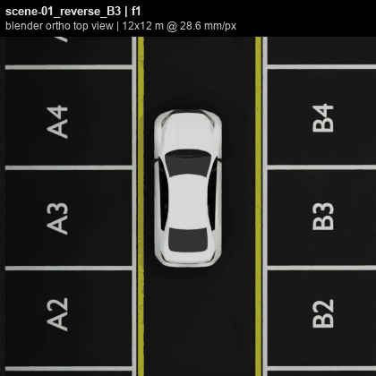
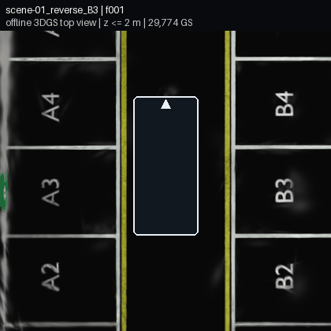
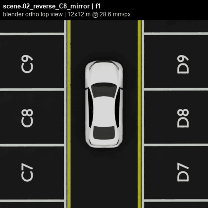
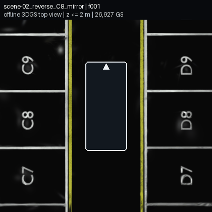
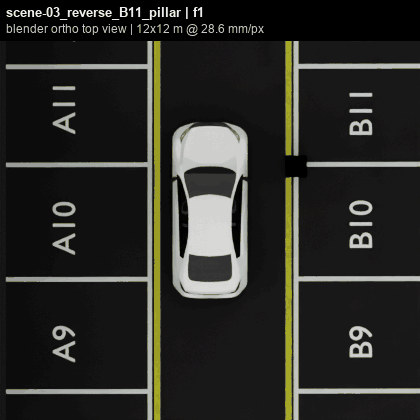
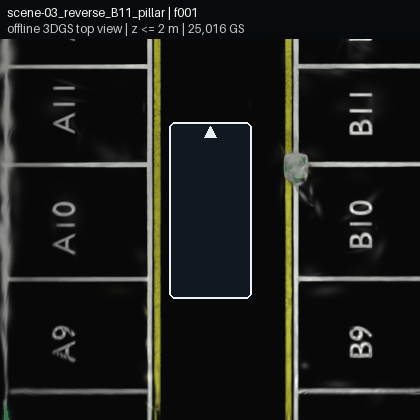
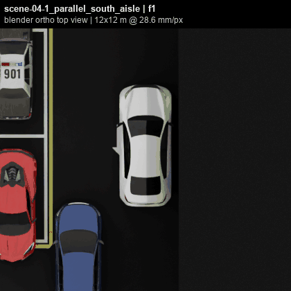
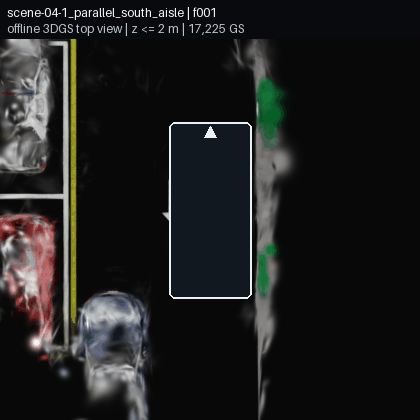
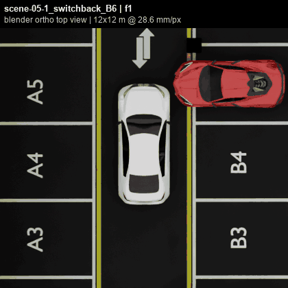
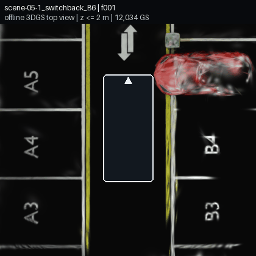

## 요약 (10줄 이내)
**지난 미팅 (2026-08-22)** - 원본 탑뷰 대조, 차체 크로핑 검증, 추가 차량 Scene
- 지도교수 피드백: 원본 영상 탑뷰(top-view) 및 차체 크로핑(cropping) 후 Offline GS 재구성 가능 여부 확인 요청
**합의 사항 -> 상태**
- [완료] 5개 Scene(총 661 frames) Blender 원본 탑뷰 및 차체 마스킹 Offline GS 탑뷰 1:1 비교 구성
- [미착수] 4-camera OTF 추가 차량 Scene 탑뷰 대조 (사유: Offline GS 기준선 검증 우선)
**이번 결과 / 막힌 것 / 다음**
- 결과: 5개 Scene 전 구간에서 차체 마스킹 후 Offline GS가 원본 탑뷰의 주행 궤적 및 주차선·추가 주차 차량 형상을 정상 재구성함 (420×420 해상도)

---

## 1. Original vs Offline GS Top View 1:1 비교

Blender 시뮬레이션 환경의 원본 탑뷰 영상과 차체 마스킹 후 학습한 Offline GS의 탑뷰 렌더 결과를 1:1로 비교함.
### Scene별 원본 탑뷰 vs Offline GS 재구성 탑뷰 1:1 비교

| Scene 및 조건  |                      Blender 원본 탑뷰 (Original)                       |                      Offline GS 재구성 탑뷰 (Cropped)                       |
| :---------- | :-----------------------------------------------------------------: | :--------------------------------------------------------------------: |
| **Scene01** |             |             |
| **Scene02** |             |             |
| **Scene03** |             |             |
| **Scene04** |  |  |
| **Scene05** |  |  |

---

## 3. 관측 결과

 **차체 크로핑(cropping) 후 재구성 가능 여부**
   - 어안 카메라 하단 차체 영역을 사전 마스킹(cropping)하여 학습에서 제외했음에도, 4대 카메라의 중첩 시야각을 통해 주행로 바닥면 및 주변 정적 구조물(주차선, 기둥, 벽면)이 결측 없이 재구성됨을 확인함.
   - 차체 크로핑 조건의 Offline GS는 5개 Scene 전 구간에서 원본 탑뷰와 일치하는 공간 복원이 가능함을 검증함.
