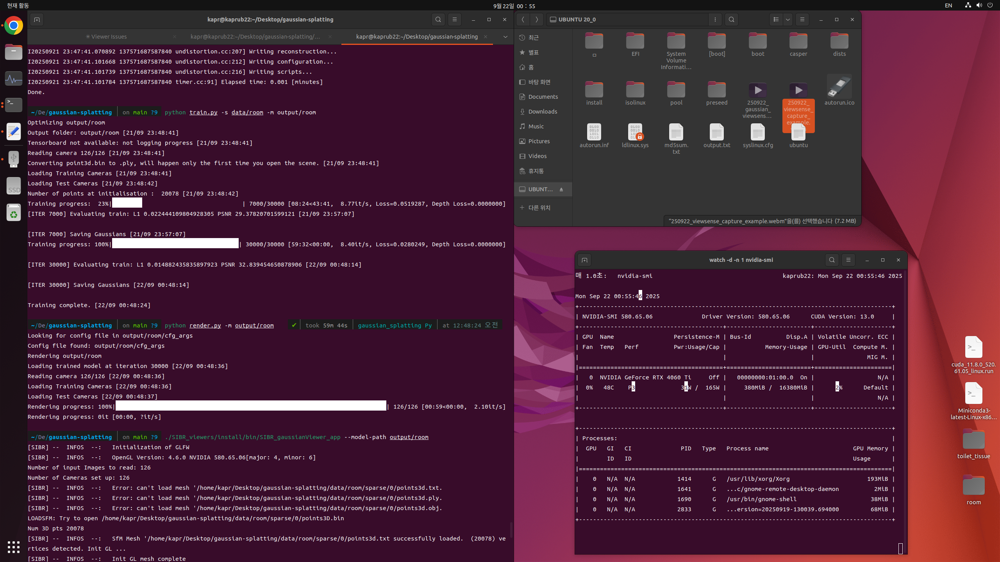

## 1. 방 찍은거 gaussain splatting으로 최적화 해보기

### 수행 과정
- 학습 시간은 1시간 걸림.
- on the fly nvs보다는 조금 더 품질이 좋아 보임. (시각적으로 확인했을 때)

### 수행하며

#### gaussian-splatting과 on-the-fly-nvs의 차이점에 대해
1. Gaussian Splatting (전통적 방식)
   - 학습 시간: 1시간 (30k 이터레이션)
   - 렌더링 속도: 60-390 FPS (실시간)
   - 전체 파이프라인: 촬영 → COLMAP → 학습(1시간) → 렌더링

2. On-the-Fly NVS
   - 학습 시간: 11초 - 2분 (실시간 처리)
   - 렌더링 속도: 30+ FPS (실시간 유지)
   - 전체 파이프라인: 촬영과 동시에 실시간 학습 및 렌더링

3. 속도 차이 원인
   - 증분적 최적화: On-the-fly는 새 이미지가 들어올 때마다 점진적으로 학습하여 50배 빠른 처리가 가능하다
   - 효율적 포즈 추정: 전통적인 COLMAP 대신 GPU 친화적인 mini bundle adjustment를 사용한다
   - 직접 가우시안 샘플링: 필요한 곳에만 가우시안을 생성하여 계산량을 대폭 줄인다

4. 품질 차이 원인 (on-the-fly-nvs가 조금 낮은 이유)
   - 최적화 시간 부족
     - 전통적 방식 : 30,000 이터레이션으로 충분한 수렴
     - On-the-fly : 6,000 이터레이션 내외로 제한적 최적화
   - 점진적 학습의 한계
     - 새 이미지가 추가될 때마다 기존 가우시안들의 재최적화 시간이 부족
     - 전체 장면에 대한 글로벌 최적화 기회가 제한적
   - 메모리 및 계산 제약
     - 실시간 처리를 위해 가우시안 수를 제한해야 함
     - 복잡한 장면에서 디테일 손실 발생

---

## 2. intel viewsense d435 사용해 가우시안 스플래팅 적용

### 요구사항 detail
- 웹캠으로 내부 파라미터를 얻어 (opencv 패키지 등 설치해서) 가우시안 스플래팅 적용
- 가우시안 스플래팅에 내부 파라미터 건드리지 않게 하는 옵션 적용해서 colmap 적용해서 최적화 적용

### 수행 과정
- 내부 파라미터가 고정되어 있으므로, train.py나 convert.py에 인자를 주어 변경할 수 있다고 판단.
- webcam으로는 총 150장의 1280x720 방 내부 이미지를 촬영함.
- 사용한 명령어
  ```bash
  # take_picture (150 pictures)
  python realsense_capture.py captured_images --mode manual --num-images 150

  # train
  python train.py -s data/room -m output/room

  # render
  python convert.py -s data/room --camera PINHOLE

  # view
  ./SIBR_viewers/install/bin/SIBR_gaussianViewer_app --model-path output/room
  ```

### 학습 결과

- Dataset : 126 views, 1270x720@30 fps, 노출 고정, 실내 조명 일정
- Training : 30k it, 59m 02s, 최종 PSNR 32.8 dB, Eval 주기 1000 it
- Viewing : render.py 126/126 완료, 평균 2.1 it/s

- 캡쳐할 당시의 영상은 기록에 남기지 못해서, `../video_picture/250922_viewsense_capture_example.mp4` 에 어떻게 촬영했는지를 예시로 남김.
- `../video_picture/250922_gaussian_viewsense_room.mp4` 에는 최종 viewer로 촬영된 방을 3D scene으로 짧게 본 내용이 들어있음.

### 수행하며 

#### intel viewsense D435에 대해
- D435와 같은 구조광 깊이 카메라는 공장 보정된 고정밀 내부 파라미터를 제공함. 일반적인 웹캠과 달리 Intel이 공장에서 정밀 보정한 `fx, fy, cx, cy` 값을 가지므로, COLMAP의 자동 내부 파라미터 추정보다 고정 파라미터 사용이 더 안정적임.
- `--camera PINHOLE` 옵션 : COLMAP이 내부 파라미터를 재추정하지 않고 D435의 공장 보정값을 유지하도록 강제함.
- 왜곡 계수 특성 : D435의 RGB 스트림은 왜곡 계수가 거의 0에 가까워 PINHOLE 모델이 적합함.

#### train.py 등 명령어를 수행한 결과 분석에 대해
- 126 views
  - 다중 시점 3D 재구성에서 **카메라 위치(혹은 프레임 수)**를 의미함.
  - 카메라가 방 주변을 이동하면서 126장의 사진을 찍어서, 3D scene 재구성에 활용한 것임.
  - 하나의 view = 한 장의 RGB 이미지이자, 대응하는 카메라 pose(내·외부 파라미터)가 모두 포함됨.

- 30k it
  - **"it"**는 **iteration(이테레이션, 반복 학습 스텝)**의 약자
  - 학습은 보통 이미지/카메라 1개씩(또는 배치 단위) 샘플링해 손실 함수를 줄이도록 평균 30,000번 최적화 스텝이 - 수행되었다는 의미임.


